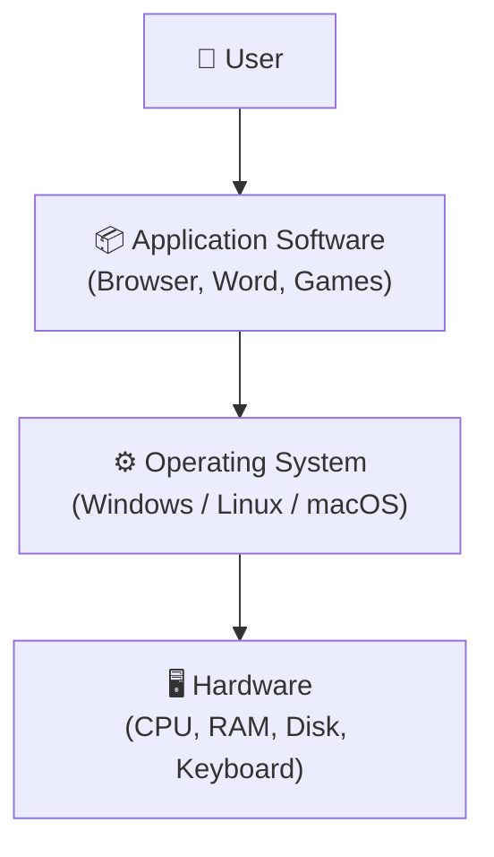
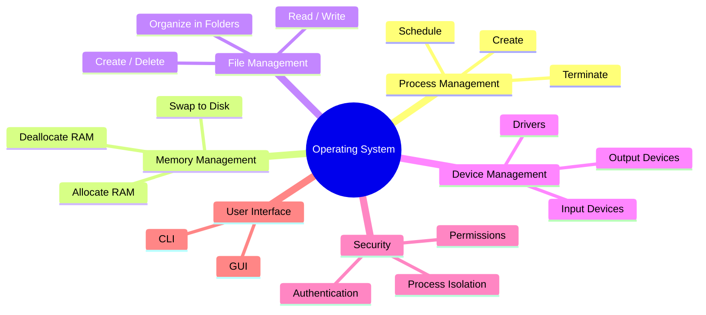

# Operating Systems Explained: Purpose and Objectives

> **One-line summary:**
> An **Operating System** is a software layer that sits between the hardware and your applications — it manages resources, hides complexity, and makes the computer usable.

---

## Table of Contents

1. [What is an Operating System?](#1-what-is-an-operating-system)
2. [Layers of a Computer System](#2-layers-of-a-computer-system)
3. [Why Do We Need an Operating System?](#3-why-do-we-need-an-operating-system)
4. [Key Objectives of an Operating System](#4-key-objectives-of-an-operating-system)
5. [Functions of an Operating System](#5-functions-of-an-operating-system)
6. [Types of User Interfaces](#6-types-of-user-interfaces)
7. [Real-Life Analogy: OS as a City's Infrastructure](#7-real-life-analogy-os-as-a-citys-infrastructure)
8. [Key Takeaways](#8-key-takeaways)

---

## 1. What is an Operating System?

An **operating system (OS)** is a software program that acts as an **intermediary between computer hardware and the user**.

It manages all the resources of a computer system and provides an environment where users can execute their programs conveniently and efficiently.

> Think of the OS like a **restaurant manager**.
> The manager coordinates chefs (CPU), waiters (I/O devices), and customers (applications) so everything runs smoothly — without each person having to directly talk to each other.

**Common examples:**

| Device         | Operating System       |
| -------------- | ---------------------- |
| Laptop/Desktop | Windows, macOS, Linux  |
| Smartphone     | Android, iOS           |
| Server         | Linux (Ubuntu, CentOS) |
| Embedded       | FreeRTOS, VxWorks      |

---

## 2. Layers of a Computer System

A computer system is best understood as **stacked layers**, each one serving the layer above it:

```
┌─────────────────────────────────────────┐
│               USER                      │  ← You, typing a document
├─────────────────────────────────────────┤
│         APPLICATION SOFTWARE            │  ← Browser, Word, Games
├─────────────────────────────────────────┤
│         OPERATING SYSTEM                │  ← Windows, Linux, macOS
├─────────────────────────────────────────┤
│             HARDWARE                    │  ← CPU, RAM, Disk, Keyboard
└─────────────────────────────────────────┘
```

The OS sits **between application software and hardware** — it translates user commands into hardware actions.



---

## 3. Why Do We Need an Operating System?

Without an OS, using a computer would be extremely difficult:

| Problem Without OS           | What That Means in Practice                                             |
| ---------------------------- | ----------------------------------------------------------------------- |
| Complex hardware interaction | You'd write low-level code just to display one character on the screen  |
| No resource management       | Multiple programs would fight over the same memory and crash each other |
| Inefficient hardware use     | The CPU would sit idle while waiting for slow devices like hard disks   |

> **The OS solves all of this** — it hides hardware complexity, manages resources fairly, and gives users a simple interface.

---

## 4. Key Objectives of an Operating System

Every OS is built with these core goals:

### 1. Convenience

> Make the computer **easy to use** — users shouldn't need to know hardware details.

- You click "Save" → the OS finds free disk space, formats the data correctly, updates the file system — all invisible to you.
- Like driving a car: you press the gas — you don't manage the combustion engine yourself.

---

### 2. Efficiency

> Use hardware resources **as fully as possible** — keep the CPU and other components busy.

- While one program waits for data from disk (slow), the OS switches the CPU to run another program.
- Like a chef: while one pot boils, you chop vegetables. Nothing sits idle.

---

### 3. Ability to Evolve

> The OS must allow **new features and hardware to be added** without breaking existing functionality.

- A new printer comes out → you install a driver → the rest of the OS stays untouched.
- Like a smartphone receiving software updates: core system stable, new capabilities added gradually.

---

### 4. Resource Management

> Fairly **allocate limited resources** (CPU time, RAM, disk, network) across programs and users.

- Three apps open at once → the OS decides how much RAM each gets, ensures they don't overwrite each other.
- Like a library: tracks who borrowed which book, when it's due, prevents two people from taking the same copy.

---

### 5. Security and Protection

> Prevent **unauthorized access** and stop programs from interfering with each other.

- User authentication (passwords), file permissions, process isolation.
- Like an apartment building: each tenant has their own key, can't enter other apartments. The building has locked main doors and surveillance.

---

### 6. Error Detection and Handling

> Continuously **monitor for errors** and take corrective action before things crash.

- A program accesses memory it doesn't own → OS detects it, terminates the program, protects the system.
- Like dashboard warning lights in a car: low tire pressure alert → you fix it before a blowout happens.

---

### Summary Table

| Objective             | What It Means                                     | Real-Life Analogy                          |
| --------------------- | ------------------------------------------------- | ------------------------------------------ |
| Convenience           | Hide hardware complexity from the user            | Driving a car (no engine knowledge needed) |
| Efficiency            | Keep CPU and hardware busy at all times           | Chef multitasking while pot boils          |
| Ability to Evolve     | Add new hardware/features without breaking things | Smartphone software updates                |
| Resource Management   | Allocate CPU, RAM, disk fairly across programs    | Library managing book loans                |
| Security & Protection | Prevent unauthorized access between users/apps    | Apartment building with key access         |
| Error Handling        | Detect and recover from failures gracefully       | Car dashboard warning lights               |

---

## 5. Functions of an Operating System

To achieve its objectives, the OS performs these core functions:

| Function            | Description                                         | Example                              |
| ------------------- | --------------------------------------------------- | ------------------------------------ |
| Process Management  | Create, schedule, and terminate processes           | Running multiple apps at once        |
| Memory Management   | Allocate and deallocate RAM to programs             | Managing RAM for open applications   |
| File Management     | Create, delete, read, and write files               | Organizing documents in folders      |
| Device Management   | Manage input/output devices                         | Connecting printers, keyboards, mice |
| Security Management | Protect system resources and data                   | User login, file permissions         |
| User Interface      | Provide a way for users to interact with the system | Graphical desktop, command line      |



---

## 6. Types of User Interfaces

The OS provides two main ways to interact with a computer:

### Command-Line Interface (CLI)

Users type text commands. Powerful for experienced users, steeper learning curve.

```bash
# Linux/macOS — list all files in a directory
ls -l

# Windows — list all files in a directory
dir
```

### Graphical User Interface (GUI)

Uses windows, icons, menus, and buttons. Intuitive and beginner-friendly.

- Right-click a file → click "Delete" → done.
- No commands to memorize.

| Feature      | CLI                       | GUI                         |
| ------------ | ------------------------- | --------------------------- |
| Ease of use  | Harder for beginners      | Easy and visual             |
| Speed        | Faster for expert users   | Slower (mouse-based)        |
| Flexibility  | Very high (scriptable)    | Limited to what menus offer |
| Common users | Developers, system admins | General users               |

> Most modern OSes (Windows, macOS, Linux distros) offer **both** CLI and GUI.

---

## 7. Real-Life Analogy: OS as a City's Infrastructure

Think of your computer as a **city**, and the OS as its **government and infrastructure**:

| City Component         | OS Equivalent       | What It Does                                              |
| ---------------------- | ------------------- | --------------------------------------------------------- |
| Roads & Traffic Lights | Process Management  | Manages flow of processes to prevent conflicts/congestion |
| Power Grid             | Resource Management | Distributes CPU/memory to programs based on demand        |
| Postal Service         | File Management     | Organizes and delivers data using directories and paths   |
| Police & Security      | Security Management | Protects data and resources from unauthorized access      |
| City Hall              | User Interface      | Provides a way for residents (users) to interact          |

A well-managed city runs smoothly — a well-designed OS does the same for your computer.

---

## 8. Key Takeaways

- An OS is a **software intermediary** between hardware and the user.
- It sits as a **layer** between applications and physical hardware.
- Without an OS, every user would have to program hardware directly — impractical for general use.
- The **six core objectives** are: Convenience, Efficiency, Ability to Evolve, Resource Management, Security, and Error Handling.
- The OS performs six key **functions**: Process, Memory, File, Device, Security management, and User Interface.
- Two main interface types: **CLI** (text commands) and **GUI** (visual, click-based).
- Real-life analogy: **OS = city infrastructure** managing roads, power, mail, police, and services.
