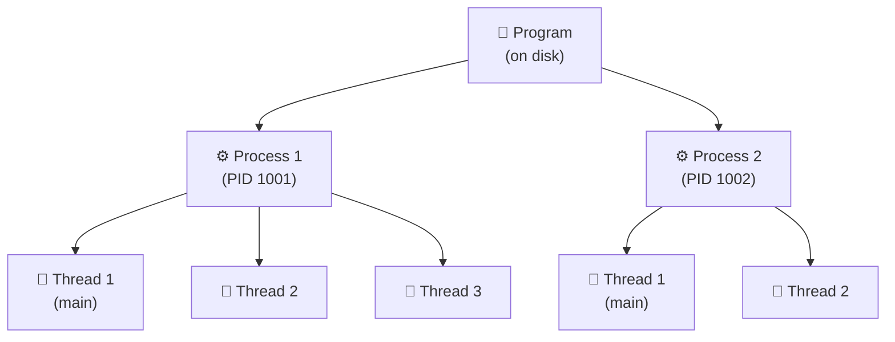

# Process vs Program vs Thread: Differences Made Simple

> **One-line summary:**
> A **Program** is code sitting on disk. A **Process** is that code actively running in memory. A **Thread** is the smallest unit of execution living inside a process.

---

## Table of Contents

1. [What is a Program?](#1-what-is-a-program)
2. [What is a Process?](#2-what-is-a-process)
3. [Process Components](#3-process-components)
4. [What is a Thread?](#4-what-is-a-thread)
5. [Key Differences: Program vs Process vs Thread](#5-key-differences-program-vs-process-vs-thread)
6. [Real-World Analogies](#6-real-world-analogies)
7. [Practical Examples](#7-practical-examples)
8. [Relationship Between Program, Process, and Thread](#8-relationship-between-program-process-and-thread)
9. [Why These Distinctions Matter](#9-why-these-distinctions-matter)
10. [Common Misconceptions](#10-common-misconceptions)
11. [Key Takeaways](#11-key-takeaways)

---

## 1. What is a Program?

A **program** is a set of instructions written in a programming language and **stored on disk**. It is a **passive entity** — it exists but does nothing on its own.

> Like a **recipe in a cookbook sitting on a shelf**. The recipe is there, all instructions written down, but nothing is being cooked yet.

**Examples:** `chrome.exe`, `notepad.exe`, `game.exe` — all sitting in your file system, waiting to be run.

**Characteristics of a Program:**

| Property     | Description                                  |
| ------------ | -------------------------------------------- |
| Location     | Stored on secondary storage (hard disk, SSD) |
| Nature       | Passive — does nothing until executed        |
| Content      | Executable instructions + static data        |
| Resource use | Only disk space — no CPU or RAM needed       |
| Reusability  | One program can spawn multiple processes     |

---

## 2. What is a Process?

A **process** is a **program in execution**. When you double-click an application, the OS loads the program into memory and starts running it — at that moment it becomes a process.

> Like **actively cooking the recipe in your kitchen**. You've taken the cookbook instructions and started following them, using real ingredients and kitchen tools.

A process is an **active entity** that requires system resources (CPU, RAM, I/O). If you open the same app twice, you create two separate processes, each with their own memory and resources.

**Characteristics of a Process:**

| Property  | Description                                          |
| --------- | ---------------------------------------------------- |
| Nature    | Active — currently being executed                    |
| Location  | Loaded in memory (RAM)                               |
| Identity  | Has a unique **Process ID (PID)**                    |
| Memory    | Has its own isolated memory space                    |
| Contains  | One or more threads                                  |
| Isolation | Separate from other processes — crash doesn't spread |

---

## 3. Process Components

Every process is made of several components the OS tracks and manages:

| Component             | Description                                      | Example                                 |
| --------------------- | ------------------------------------------------ | --------------------------------------- |
| Code Section          | The actual program instructions                  | Compiled machine code of the app        |
| Data Section          | Global and static variables                      | Configuration settings, constants       |
| Stack                 | Temporary data — function calls, local variables | Function call history, return addresses |
| Heap                  | Dynamically allocated memory at runtime          | Objects created with `new` or `malloc`  |
| Process Control Block | OS-maintained info about the process             | Process state, CPU registers, PID       |

```
┌──────────────────────────┐
│     Process Memory       │
├──────────────────────────┤
│  Code Section            │  ← Program instructions
├──────────────────────────┤
│  Data Section            │  ← Global/static variables
├──────────────────────────┤
│  Heap  ↑ (grows up)      │  ← Dynamic memory allocations
│                          │
│  Stack ↓ (grows down)    │  ← Function calls, local vars
├──────────────────────────┤
│  Process Control Block   │  ← OS bookkeeping (PID, state, registers)
└──────────────────────────┘
```

---

## 4. What is a Thread?

A **thread** is the **smallest unit of execution within a process**. All threads inside a process share the same memory and resources, but each has its own stack and registers.

> Like **multiple cooks in one kitchen**, each working on a different part of the same dish simultaneously. They share the same kitchen and ingredients (memory/resources), but each person has their own tasks.

Threads are sometimes called **lightweight processes** because they're much cheaper to create than full processes.

**Characteristics of a Thread:**

| Property      | Description                                  |
| ------------- | -------------------------------------------- |
| Nature        | Active — smallest unit of CPU execution      |
| Memory        | Shares process memory with other threads     |
| Own data      | Has its own stack and registers              |
| Identity      | Has its own **Thread ID** within the process |
| Creation cost | Fast and lightweight compared to processes   |
| Communication | Easy — threads share memory directly         |

**Why use threads?**  
Imagine a web browser — it needs to download images, run JavaScript, render the page, and still respond to your clicks all at once. Threads let one process do all of this concurrently without creating heavy separate processes.

---

## 5. Key Differences: Program vs Process vs Thread

| Aspect             | Program                 | Process                    | Thread                             |
| ------------------ | ----------------------- | -------------------------- | ---------------------------------- |
| Nature             | Passive (static)        | Active (dynamic)           | Active (dynamic)                   |
| Location           | Stored on disk          | Loaded in memory           | Exists within process memory       |
| Lifespan           | Permanent until deleted | Temporary during execution | Temporary during execution         |
| Resource needs     | Only disk space         | CPU, memory, I/O           | Minimal (shares process resources) |
| Memory space       | None                    | Separate, isolated         | Shared with other threads          |
| Creation cost      | N/A                     | Slow (expensive)           | Fast (lightweight)                 |
| Communication      | N/A                     | Requires IPC mechanisms    | Direct (shared memory)             |
| Termination impact | N/A                     | Kills all threads inside   | Doesn't affect other threads       |

---

## 6. Real-World Analogies

### The Recipe Analogy

| Concept | Analogy                                                                                           |
| ------- | ------------------------------------------------------------------------------------------------- |
| Program | A recipe written in a cookbook on the shelf — instructions exist, nothing is happening            |
| Process | You actively cooking that recipe in your kitchen — ingredients gathered, counter space allocated  |
| Thread  | Multiple helpers in the kitchen — one chops, one boils water — all on the same dish, same kitchen |

### The Factory Analogy

| Concept | Analogy                                                                                   |
| ------- | ----------------------------------------------------------------------------------------- |
| Program | Blueprint/design document stored in a filing cabinet                                      |
| Process | Active production line manufacturing the product — has space, workers, machines           |
| Thread  | Individual workers on that production line, each handling one task, sharing the workspace |

---

## 7. Practical Examples

### Example 1: Text Editor (Notepad)

```
notepad.exe (on disk)
     ↓ double-click
Process: PID 1234 — loaded in RAM
     └── Thread 1 (main thread) — handles UI, input, display
```

Simple apps like Notepad typically run with just **one thread**.

---

### Example 2: Web Browser (Chrome)

```
chrome.exe (on disk)
     ↓ launch
Process: PID 2001 (main browser process)
     ├── Thread: UI thread (handles your clicks)
     ├── Thread: Network thread (downloads resources)
     └── Thread: Renderer thread (draws the page)

Process: PID 2002 (Tab 1 — separate process for isolation)
Process: PID 2003 (Tab 2 — if this crashes, Tab 1 is safe)
```

Modern browsers create **separate processes per tab** for security, and **multiple threads per process** for concurrency.

---

### Example 3: Video Game

```
game.exe (on disk)
     ↓ launch
Process: PID 3001
     ├── Thread: Graphics rendering
     ├── Thread: Physics calculations
     ├── Thread: Audio processing
     └── Thread: Player input handling
```

All threads work together in one process to produce a smooth gaming experience.

---

## 8. Relationship Between Program, Process, and Thread

They form a **hierarchy** — each level builds on the one above it:

```
Program (stored on disk)
     ↓ execution starts
  Process 1 (in memory)         ← One program can spawn multiple processes
      ├── Thread 1 (main)
      ├── Thread 2
      └── Thread 3

  Process 2 (another instance)  ← Same program, separate memory space
      ├── Thread 1 (main)
      └── Thread 2
```



**Rules:**

- One program → can create **many processes**
- One process → must have **at least one thread** (the main thread)
- All threads in a process → **share the same memory**

---

## 9. Why These Distinctions Matter

| Level   | What It Provides              | Why It Matters                                            |
| ------- | ----------------------------- | --------------------------------------------------------- |
| Program | Portability and reusability   | Copy to any machine and it works the same                 |
| Process | Isolation and security        | One process crashing doesn't bring down others            |
| Thread  | Efficiency and responsiveness | Much faster to create than processes; enables concurrency |

---

## 10. Common Misconceptions

| Misconception                       | Reality                                                                        |
| ----------------------------------- | ------------------------------------------------------------------------------ |
| Programs and processes are the same | Program = static code on disk. Process = actively running in memory            |
| One program = one process           | One program can create many processes (e.g., Chrome creates a process per tab) |
| Threads are just small processes    | Threads share memory within a process; processes have isolated memory spaces   |

---

## 10. Code Examples

> Working code that demonstrates Program, Process, and Thread concepts in practice.

### C++ — Simple Version

Show three structs — Program (passive code), Process (active instance with state), Thread (execution unit inside a process).

```cpp
// Program vs Process vs Thread: Simple demonstration
// Shows: The difference between static code (Program), running instance (Process),
//        and lightweight execution unit (Thread)
// Compile: g++ -std=c++17 02_program_process_thread.cpp -o out

#include <iostream>
#include <vector>
#include <string>
using namespace std;

// ==========================================
// PROGRAM: Just code on disk — passive, does nothing
// ==========================================
struct Program {
    string name;          // Executable file name
    string filePath;      // Where it lives on disk
    long   sizeBytes;     // Disk space used

    void showInfo() const {
        cout << "[PROGRAM] " << name << " | Path: " << filePath
             << " | Size: " << sizeBytes / 1024 << " KB (just sitting on disk)\n";
    }
};

// ==========================================
// PROCESS: A program that is actively running in memory
// ==========================================
struct Process {
    int    pid;           // Unique ID assigned by the OS
    string name;          // Which program is running
    string state;         // Ready / Running / Waiting
    int    memoryMB;      // RAM allocated to this process

    Process(int id, string n, int mem)
        : pid(id), name(n), state("Ready"), memoryMB(mem) {}

    void run() {
        state = "Running";
        cout << "[PROCESS] PID=" << pid << " | " << name
             << " | State: " << state << " | Memory: " << memoryMB << " MB\n";
    }

    void waitForIO() {
        state = "Waiting";
        cout << "[PROCESS] PID=" << pid << " | " << name
             << " | State: " << state << " (blocked — waiting for I/O)\n";
    }
};

// ==========================================
// THREAD: Lightweight unit living inside a process
// ==========================================
struct Thread {
    int    threadId;      // Unique thread ID
    int    ownerPID;      // Which process owns this thread
    string task;          // What work this thread is doing

    void execute() const {
        cout << "[THREAD] TID=" << threadId
             << " (in PID=" << ownerPID << ") | Task: " << task << "\n";
    }
};

int main() {
    cout << "=== Program vs Process vs Thread Demo ===\n\n";

    // 1. A program is just a static file on disk
    cout << "-- Programs on disk --\n";
    Program chrome{"chrome.exe", "C:/Program Files/Chrome/", 150L * 1024 * 1024};
    chrome.showInfo();

    cout << "\n-- Launching chrome.exe creates separate processes (one per tab) --\n";

    // 2. One program → multiple processes
    Process tab1(1001, "Chrome Tab: Gmail",   256);
    Process tab2(1002, "Chrome Tab: YouTube", 512);
    tab1.run();
    tab2.run();
    tab1.waitForIO();   // Gmail is waiting for email data from the server

    cout << "\n-- Each process runs multiple threads (all share the process's memory) --\n";

    // 3. Threads inside the Gmail process
    Thread renderThread {1, 1001, "Render HTML page"};
    Thread networkThread{2, 1001, "Fetch email from server"};
    Thread jsThread     {3, 1001, "Run JavaScript animations"};

    renderThread.execute();
    networkThread.execute();
    jsThread.execute();

    cout << "\nSummary: Program(disk) → Process(memory+state) → Thread(CPU work)\n";
    return 0;
}
```

### C++ — Medium / LeetCode Style

Given a list of programs, simulate launching each as a process with multiple threads; track states and print the process table.

```cpp
// Program vs Process vs Thread: Optimized / LeetCode-style
// Problem: Simulate an OS process table — launch programs as processes, each with
//          multiple threads. Track states and report total thread count.
// Complexity: O(N*T) time, O(N*T) space  (N=processes, T=threads per process)

#include <iostream>
#include <vector>
#include <string>
using namespace std;

enum class State { Ready, Running, Waiting, Terminated };

string stateStr(State s) {
    switch (s) {
        case State::Ready:      return "Ready";
        case State::Running:    return "Running";
        case State::Waiting:    return "Waiting";
        case State::Terminated: return "Terminated";
    }
    return "?";
}

struct Thread {
    int    tid;
    string task;
};

struct Process {
    int            pid;
    string         programName;
    State          state = State::Ready;
    int            memMB;
    vector<Thread> threads;

    void addThread(string task) {
        threads.push_back({(int)threads.size() + 1, move(task)});
    }

    void print() const {
        cout << "  PID=" << pid << " [" << stateStr(state) << "] "
             << programName << " (" << memMB << " MB)"
             << " | Threads: " << threads.size() << "\n";
        for (const auto& t : threads)
            cout << "    TID=" << t.tid << " -> " << t.task << "\n";
    }
};

int main() {
    vector<Process> table;

    // Launch Chrome with 3 threads
    Process chrome{1001, "chrome.exe", State::Running, 256, {}};
    chrome.addThread("Render UI");
    chrome.addThread("Network I/O");
    chrome.addThread("Run JavaScript");
    table.push_back(chrome);

    // Launch VS Code with 2 threads
    Process vscode{1002, "code.exe", State::Running, 384, {}};
    vscode.addThread("File watcher");
    vscode.addThread("Language server");
    table.push_back(vscode);

    // Launch a backup job that is currently waiting on I/O
    Process backup{1003, "backup.exe", State::Waiting, 64, {}};
    backup.addThread("File copy (I/O blocked)");
    table.push_back(backup);

    cout << "=== OS Process Table ===\n\n";
    for (const auto& p : table) p.print();

    int totalThreads = 0;
    for (const auto& p : table) totalThreads += p.threads.size();
    cout << "\nTotal processes: " << table.size()
         << " | Total threads: " << totalThreads << "\n";

    return 0;
}
```

### Python — Simple Version

Three classes — Program (static file), Process (running instance), Thread (execution unit) — with a realistic demo.

```python
# Program vs Process vs Thread: Simple demonstration
# Shows: Program = passive code on disk, Process = active instance, Thread = CPU worker
# Run: python3 02_program_process_thread.py


# ===================================================
# PROGRAM: Static code sitting on disk — does nothing by itself
# ===================================================
class Program:
    def __init__(self, name, file_path, size_kb):
        self.name      = name          # Executable name
        self.file_path = file_path     # Location on disk
        self.size_kb   = size_kb       # Disk space used

    def show_info(self):
        print(f"[PROGRAM] {self.name} | Path: {self.file_path} | Size: {self.size_kb} KB")
        print(f"          → Passive — just sitting on disk, doing nothing.")


# ===================================================
# PROCESS: A program that has been loaded into memory and is running
# ===================================================
class Process:
    _next_pid = 1000   # OS assigns incrementing PIDs

    def __init__(self, program_name, memory_mb):
        self.pid          = Process._next_pid   # Unique process ID
        Process._next_pid += 1
        self.program_name = program_name
        self.state        = "Ready"             # Starts in Ready state
        self.memory_mb    = memory_mb

    def run(self):
        self.state = "Running"
        print(f"[PROCESS] PID={self.pid} | {self.program_name} | "
              f"State: {self.state} | Memory: {self.memory_mb} MB")

    def wait_for_io(self):
        self.state = "Waiting"
        print(f"[PROCESS] PID={self.pid} | {self.program_name} | "
              f"State: {self.state} (blocked — waiting for I/O data)")


# ===================================================
# THREAD: Lightweight worker inside a process — shares its memory
# ===================================================
class Thread:
    def __init__(self, thread_id, owner_pid, task):
        self.thread_id = thread_id   # Thread's unique ID
        self.owner_pid = owner_pid   # The process this thread belongs to
        self.task      = task        # What work this thread performs

    def execute(self):
        print(f"[THREAD] TID={self.thread_id} "
              f"(in PID={self.owner_pid}) | Task: {self.task}")


def main():
    print("=== Program vs Process vs Thread Demo ===\n")

    # 1. A program is just a file on disk
    print("-- Programs on disk --")
    chrome_program = Program("chrome.exe", "C:/Program Files/Chrome/", 150_000)
    chrome_program.show_info()

    print("\n-- Launching chrome.exe creates multiple processes (one per tab) --")

    # 2. One program can become multiple processes
    tab_gmail   = Process("Chrome Tab: Gmail",   256)
    tab_youtube = Process("Chrome Tab: YouTube", 512)
    tab_gmail.run()
    tab_youtube.run()
    tab_gmail.wait_for_io()   # Gmail waits for server response

    print("\n-- Each process contains multiple threads sharing the same memory --")

    # 3. Three threads inside the Gmail process
    render_thread  = Thread(1, tab_gmail.pid, "Render HTML page")
    network_thread = Thread(2, tab_gmail.pid, "Fetch email from server")
    js_thread      = Thread(3, tab_gmail.pid, "Run JavaScript animations")

    render_thread.execute()
    network_thread.execute()
    js_thread.execute()

    print("\nSummary: Program(disk) → Process(memory+state) → Thread(CPU execution)")


if __name__ == "__main__":
    main()
```

### Python — Medium Level

Simulate an OS process table — launch programs as processes with threads, track states, and report system-wide stats.

```python
# Program vs Process vs Thread: Optimized / Pythonic
# Problem: Simulate an OS process table. Launch programs as processes with multiple
#          threads. Track process state and report total thread count.
# Complexity: O(N) time, O(N) space

from dataclasses import dataclass, field
from enum import Enum, auto
from itertools import count
from typing import List


class State(Enum):
    READY      = auto()
    RUNNING    = auto()
    WAITING    = auto()
    TERMINATED = auto()


@dataclass
class Thread:
    tid:  int
    task: str


@dataclass
class Process:
    pid:     int
    name:    str
    state:   State        = State.READY
    mem_mb:  int          = 0
    threads: List[Thread] = field(default_factory=list)

    def add_thread(self, task: str):
        self.threads.append(Thread(len(self.threads) + 1, task))

    def __str__(self):
        thread_lines = "\n".join(f"    TID={t.tid} -> {t.task}" for t in self.threads)
        return (f"  PID={self.pid} [{self.state.name}] {self.name} "
                f"({self.mem_mb} MB) | {len(self.threads)} thread(s)\n{thread_lines}")


class ProcessTable:
    _pid_gen = count(1000)

    def launch(self, name: str, mem_mb: int, thread_tasks: List[str]) -> Process:
        p = Process(pid=next(self._pid_gen), name=name,
                    state=State.RUNNING, mem_mb=mem_mb)
        for task in thread_tasks:
            p.add_thread(task)
        return p


if __name__ == "__main__":
    pt = ProcessTable()

    processes = [
        pt.launch("chrome.exe", 256, ["Render UI", "Network I/O", "Run JavaScript"]),
        pt.launch("code.exe",   384, ["File watcher", "Language server"]),
        pt.launch("backup.exe",  64, ["File copy"]),
    ]
    processes[-1].state = State.WAITING   # backup is blocked on I/O

    print("=== OS Process Table ===\n")
    for p in processes:
        print(p)

    total_threads = sum(len(p.threads) for p in processes)
    print(f"\nProcesses: {len(processes)} | Total Threads: {total_threads}")
```

---

## 11. Key Takeaways

- A **program** is passive code stored on disk — it does nothing until executed.
- A **process** is a program actively running in memory with its own isolated memory space, PID, and resources.
- A **thread** is the smallest unit of execution — it lives inside a process and shares its memory with other threads.
- One **program** → many **processes**; one **process** → many **threads**.
- A process **cannot exist without at least one thread** (the main thread).
- Processes provide **isolation** (crashes stay contained); threads provide **efficiency** (lightweight concurrency).
- Real apps always use threads: browsers, games, editors — all rely on multi-threading to be fast and responsive.
