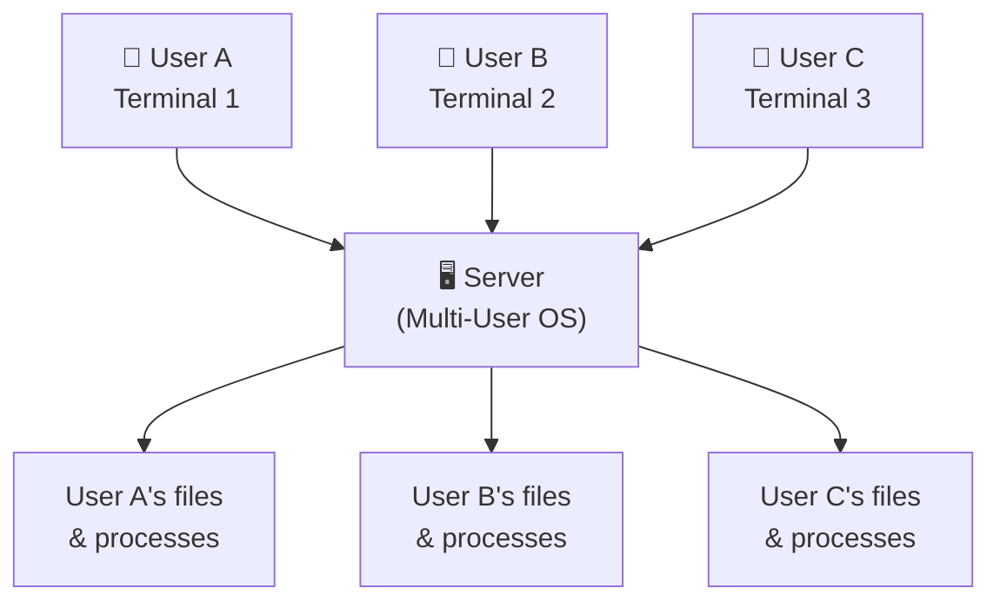
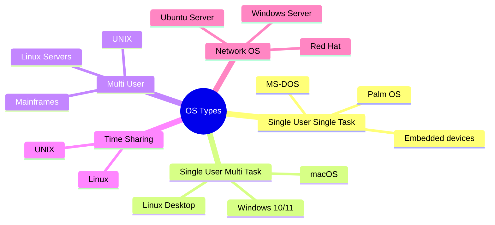

# Types of Operating Systems: Beginner's Guide

> **One-line summary:**
> Operating systems come in different types based on how many users they support, how many tasks they handle at once, and what kind of work they're designed to do.

---

## Table of Contents

1. [What Determines the Type of OS?](#1-what-determines-the-type-of-os)
2. [Single User Single Task OS](#2-single-user-single-task-os)
3. [Single User Multi Task OS](#3-single-user-multi-task-os)
4. [Multi User OS](#4-multi-user-os)
5. [Time Sharing OS](#5-time-sharing-os)
6. [Network OS](#6-network-os)
7. [Comparison Table](#7-comparison-table)
8. [How to Choose the Right OS Type](#8-how-to-choose-the-right-os-type)
9. [Key Takeaways](#9-key-takeaways)

---

## 1. What Determines the Type of OS?

Operating systems are classified based on three main factors:

| Factor                  | Question it answers                                       |
| ----------------------- | --------------------------------------------------------- |
| **Task handling**       | Can it run one program or many at the same time?          |
| **User support**        | Can one person or many people use it simultaneously?      |
| **Response time needs** | Does it need to react instantly, or can it take its time? |

> Like choosing a vehicle: a bicycle, car, truck, and bus all move you from A to B — but they're built for very different purposes. OS types work the same way.

---

## 2. Single User Single Task OS

The simplest type. **One user, one program at a time.**

> Like a basic calculator — you press buttons, get a result, then move to the next calculation. No parallel work.

**Characteristics:**

| Property           | Detail                                       |
| ------------------ | -------------------------------------------- |
| Users              | One at a time                                |
| Tasks              | One at a time                                |
| Complexity         | Very simple — no scheduling needed           |
| Resource use       | 100% dedicated to the single running program |
| To switch programs | Must close current program first             |

**Real-world examples:**

- **MS-DOS** (1980s–early 1990s personal computers)
- **Palm OS** (early PDAs)
- Simple embedded devices: digital thermostats, basic microwave controllers

**Still used where:** simplicity and reliability matter more than multitasking (basic microcontrollers, appliances).

---

## 3. Single User Multi Task OS

**One user, many programs running at the same time.** This is what most personal computers use today.

> Like using your laptop normally: browser open, music playing, document editor running — all at once.

**How multitasking works:**

```
┌──────────────────────────────────────────────┐
│         CPU Time (one second)                │
├──────────┬──────────┬──────────┬─────────────┤
│ Browser  │  Music   │  Editor  │  Browser    │  ...
│ (slice)  │ (slice)  │ (slice)  │ (slice)     │
└──────────┴──────────┴──────────┴─────────────┘
```

The OS switches between programs **hundreds of times per second** — so fast that everything feels simultaneous.

**Characteristics:**

| Property  | Detail                                                  |
| --------- | ------------------------------------------------------- |
| Users     | One                                                     |
| Tasks     | Multiple simultaneously                                 |
| Mechanism | Rapid CPU switching between programs                    |
| Isolation | Programs are protected from interfering with each other |

**Examples:** Windows 10/11, macOS, most Linux desktop distributions

---

## 4. Multi User OS

Allows **multiple people to use the same computer simultaneously**, each with their own space and resources.

> Like a library computer system where many students log in from different terminals — each sees their own files, runs their own programs, and can't see others' work.

**How resource sharing and isolation works:**



- Each user gets their own **private space** — User A cannot read User B's files without permission
- CPU time, memory, and storage are **divided fairly** among all active users
- Crucial for **security and privacy** in shared environments

**Typical use cases:**

- University computer labs
- Corporate servers
- Mainframe systems (banks, airlines handling millions of requests)

**Examples:** UNIX, Linux servers, mainframe operating systems

---

## 5. Time Sharing OS

A special type of multi-user OS that gives each user a **fixed time slice** (called a **quantum**) in rotation.

> Like a dinner table conversation where everyone gets a turn to speak for a few seconds before passing to the next person — but so fast you feel like everyone is talking freely.

**How time slicing works:**

```
Round-robin time slices:

User A → [slice] → User B → [slice] → User C → [slice] → User A → ...

Each slice = fraction of a second (e.g., 10ms–100ms)
State saved at end of each slice, restored at next turn
```

**Characteristics:**

| Property        | Detail                                                         |
| --------------- | -------------------------------------------------------------- |
| Users           | Multiple                                                       |
| Execution       | Time-sliced, round-robin                                       |
| CPU idle time   | Near zero — processor always working on someone's task         |
| User experience | Feels like dedicated access despite sharing                    |
| Fairness        | Equal time distribution prevents any one user from hogging CPU |

**Advantages:**

- Maximizes CPU utilization
- Provides fair access to all users
- Reduces response time vs. batch systems

**Examples:** UNIX, Linux — ideal for educational institutions and development environments

---

## 6. Network OS

Designed to **manage and coordinate computers connected over a network** — handles file sharing, printer sharing, security, and authentication across machines.

> Like an office where multiple computers share printers, files, and databases. The network OS makes all of this coordination invisible and seamless.

**Key features:**

| Feature              | What it does                                              |
| -------------------- | --------------------------------------------------------- |
| File sharing         | Access files on other machines as if they're local        |
| Printer management   | Share printers across all connected computers             |
| User authentication  | Controls who can log in and access what resources         |
| Network security     | Enforces permissions across all machines on the network   |
| Distributed services | Coordinates activities across multiple physical computers |

**Examples:** Windows Server, Ubuntu Server, Red Hat Enterprise Linux, Novell NetWare

**Where you encounter it:** saving to a company shared drive, printing to a network printer, accessing corporate email — all powered by a network OS on the server side.

---

## 7. Comparison Table

| OS Type                 | Users Supported       | Tasks Supported         | Common Use Cases        | Examples              |
| ----------------------- | --------------------- | ----------------------- | ----------------------- | --------------------- |
| Single User Single Task | One                   | One at a time           | Simple embedded systems | MS-DOS, Palm OS       |
| Single User Multi Task  | One                   | Multiple simultaneously | Personal computers      | Windows, macOS        |
| Multi User              | Multiple              | Multiple per user       | Servers, mainframes     | UNIX, Linux servers   |
| Time Sharing            | Multiple              | Time-sliced execution   | University systems      | UNIX, Linux           |
| Network OS              | Multiple over network | Distributed tasks       | Corporate networks      | Windows Server, Linux |



---

## 8. How to Choose the Right OS Type

| Need                                        | Best OS Type            |
| ------------------------------------------- | ----------------------- |
| Personal use (browsing, gaming, documents)  | Single User Multi Task  |
| Many people accessing one machine           | Multi User              |
| Fair CPU sharing among many users           | Time Sharing            |
| Sharing files and printers across an office | Network OS              |
| Simple appliance or embedded device         | Single User Single Task |

**Key factors to consider:**

- How many people will use the system?
- Will they use it at the same time?
- What tasks will they perform?
- How much hardware is available?
- What are the security requirements?

> Modern OSes blur these lines — Windows and Linux can act as both single-user and multi-user systems depending on configuration. Cloud computing hides the OS type entirely behind web interfaces.

---

## 8. Code Examples

> Working code that demonstrates different OS scheduler types in practice.

### C++ — Simple Version

Simulate switching between Batch, Time-sharing, and Real-Time OS schedulers using a mock job queue.

```cpp
// OS Types: Simple demonstration
// Shows: How Batch, Time-sharing, and Real-Time OS schedulers dispatch jobs differently
// Compile: g++ -std=c++17 03_os_types.cpp -o out

#include <iostream>
#include <vector>
#include <queue>
#include <algorithm>
#include <string>
using namespace std;

// A job with a name, CPU duration, and optional deadline
struct Job {
    string name;
    int duration;   // CPU time needed
    int deadline;   // 0 = no deadline (Batch / Time-sharing)
};

// ===================================
// BATCH OS: runs jobs one after another — no user interaction
// ===================================
void simulateBatchOS(const vector<Job>& jobs) {
    cout << "\n--- Batch OS ---\n";
    cout << "Jobs submitted to operator. Processing one by one:\n";
    int time = 0;
    for (const auto& job : jobs) {
        cout << "  [t=" << time << "] Running: " << job.name
             << " (duration=" << job.duration << ")\n";
        time += job.duration;
    }
    cout << "  [t=" << time << "] All batch jobs done. Makespan=" << time << "\n";
}

// ===================================
// TIME-SHARING OS: each job gets a quantum, then yields CPU
// ===================================
void simulateTimeSharingOS(vector<Job> jobs, int quantum) {
    cout << "\n--- Time-Sharing OS (quantum=" << quantum << ") ---\n";

    // Queue of (name, remaining_time)
    queue<pair<string, int>> rq;
    for (const auto& j : jobs) rq.push({j.name, j.duration});

    int time = 0;
    while (!rq.empty()) {
        auto [name, remaining] = rq.front();
        rq.pop();

        int ran = min(remaining, quantum);
        time += ran;
        remaining -= ran;

        if (remaining > 0) {
            cout << "  [t=" << time << "] " << name << " ran " << ran
                 << " → " << remaining << " left (preempted)\n";
            rq.push({name, remaining});   // Back to queue
        } else {
            cout << "  [t=" << time << "] " << name << " ran " << ran << " → DONE\n";
        }
    }
    cout << "  Users interact with all jobs — each gets CPU turns!\n";
}

// ===================================
// REAL-TIME OS: Earliest Deadline First — must meet deadlines
// ===================================
void simulateRTOS(vector<Job> jobs) {
    cout << "\n--- Real-Time OS (Earliest Deadline First) ---\n";

    // Sort by deadline — most urgent first
    sort(jobs.begin(), jobs.end(), [](const Job& a, const Job& b) {
        return a.deadline < b.deadline;
    });

    int time = 0;
    for (const auto& job : jobs) {
        int finishTime = time + job.duration;
        bool metDeadline = (finishTime <= job.deadline);
        cout << "  [t=" << time << "→" << finishTime << "] " << job.name
             << " | deadline=" << job.deadline
             << " | " << (metDeadline ? "DEADLINE MET" : "DEADLINE MISSED!") << "\n";
        time = finishTime;
    }
}

int main() {
    vector<Job> batchJobs = {
        {"Payroll", 5, 0},
        {"Report",  3, 0},
        {"Backup",  8, 0},
    };

    vector<Job> tsJobs = {
        {"User A", 6, 0},
        {"User B", 4, 0},
        {"User C", 5, 0},
    };

    vector<Job> rtJobs = {
        {"GPS update",    2, 3 },
        {"Engine control",3, 8 },
        {"Airbag sensor", 1, 5 },
    };

    simulateBatchOS(batchJobs);
    simulateTimeSharingOS(tsJobs, 2);
    simulateRTOS(rtJobs);

    return 0;
}
```

### C++ — Medium / LeetCode Style

Given N jobs and a scheduler type, compute completion order and makespan for each OS type.

```cpp
// OS Types: Optimized / LeetCode-style
// Problem: Given N jobs, simulate Batch, Round-Robin (Time-sharing), and EDF (RTOS)
//          scheduling. Report makespan and whether all RTOS deadlines are met.
// Complexity: O(N log N) EDF sort, O(N*B/Q) Round-Robin

#include <iostream>
#include <vector>
#include <queue>
#include <algorithm>
#include <string>
using namespace std;

struct Job { string name; int burst, deadline; };

int batchSchedule(const vector<Job>& jobs) {
    int time = 0;
    cout << "[Batch]  ";
    for (const auto& j : jobs) {
        cout << j.name << "(t=" << time << ") ";
        time += j.burst;
    }
    cout << "| makespan=" << time << "\n";
    return time;
}

int roundRobin(vector<Job> jobs, int q) {
    queue<pair<string,int>> rq;
    for (auto& j : jobs) rq.push({j.name, j.burst});
    int time = 0;
    cout << "[RR q=" << q << "] ";
    while (!rq.empty()) {
        auto [name, rem] = rq.front(); rq.pop();
        int run = min(rem, q);
        cout << name << "(" << run << ") ";
        time += run; rem -= run;
        if (rem > 0) rq.push({name, rem});
    }
    cout << "| makespan=" << time << "\n";
    return time;
}

bool rtosEDF(vector<Job> jobs) {
    sort(jobs.begin(), jobs.end(), [](auto& a, auto& b){
        return a.deadline < b.deadline;
    });
    int time = 0; bool allMet = true;
    cout << "[EDF]    ";
    for (auto& j : jobs) {
        time += j.burst;
        bool met = (time <= j.deadline);
        if (!met) allMet = false;
        cout << j.name << (met ? "✓" : "✗") << " ";
    }
    cout << "\n";
    return allMet;
}

int main() {
    vector<Job> jobs   = {{"A",5,0},{"B",3,0},{"C",4,0}};
    vector<Job> rtJobs = {{"GPS",2,3},{"Engine",3,8},{"Airbag",1,5}};

    cout << "=== OS Scheduling Comparison ===\n";
    batchSchedule(jobs);
    roundRobin(jobs, 2);
    bool ok = rtosEDF(rtJobs);
    cout << (ok ? "All RTOS deadlines met!\n" : "WARNING: Deadlines missed!\n");

    return 0;
}
```

### Python — Simple Version

Simulate Batch, Time-sharing, and Real-Time OS schedulers each processing a job queue.

```python
# OS Types: Simple demonstration
# Shows: How Batch, Time-sharing (Round Robin), and RTOS (EDF) schedule jobs differently
# Run: python3 03_os_types.py

from collections import deque


class Job:
    def __init__(self, name, duration, deadline=0):
        self.name     = name
        self.duration = duration    # CPU time units this job needs
        self.deadline = deadline    # 0 = no deadline (Batch / Time-sharing only)


def simulate_batch_os(jobs):
    """Batch OS: runs each job completely before starting the next."""
    print("\n--- Batch OS ---")
    print("Jobs submitted to operator. Processing one by one:")
    time = 0
    for job in jobs:
        print(f"  [t={time}] Running: {job.name} (duration={job.duration})")
        time += job.duration
    print(f"  [t={time}] All batch jobs done. Makespan={time}")


def simulate_time_sharing_os(jobs, quantum):
    """Time-sharing OS: each job gets a time slice (quantum), then yields CPU."""
    print(f"\n--- Time-Sharing OS (quantum={quantum}) ---")
    # Queue holds (name, remaining_time)
    queue = deque((job.name, job.duration) for job in jobs)
    time = 0

    while queue:
        name, remaining = queue.popleft()
        ran = min(remaining, quantum)
        remaining -= ran
        time += ran

        if remaining > 0:
            print(f"  [t={time}] {name} ran {ran} → {remaining} left (preempted, re-queued)")
            queue.append((name, remaining))  # Goes to the back of the queue
        else:
            print(f"  [t={time}] {name} ran {ran} → DONE")

    print("  Every user gets CPU turns — no one waits forever!")


def simulate_rtos(jobs):
    """Real-Time OS: Earliest Deadline First — most urgent job runs first."""
    print("\n--- Real-Time OS (Earliest Deadline First) ---")
    # Sort by deadline so the most urgent job runs first
    sorted_jobs = sorted(jobs, key=lambda j: j.deadline)
    time = 0

    for job in sorted_jobs:
        time += job.duration
        met = time <= job.deadline
        status = "DEADLINE MET" if met else "DEADLINE MISSED!"
        print(f"  [t={time}] {job.name} | deadline={job.deadline} | {status}")


def main():
    batch_jobs = [
        Job("Payroll", 5),
        Job("Report",  3),
        Job("Backup",  8),
    ]

    ts_jobs = [
        Job("User A", 6),
        Job("User B", 4),
        Job("User C", 5),
    ]

    rt_jobs = [
        Job("GPS update",     2, deadline=3),
        Job("Engine control", 3, deadline=8),
        Job("Airbag sensor",  1, deadline=5),
    ]

    simulate_batch_os(batch_jobs)
    simulate_time_sharing_os(ts_jobs, quantum=2)
    simulate_rtos(rt_jobs)


if __name__ == "__main__":
    main()
```

### Python — Medium Level

Cleanly implement all three schedulers and compare their output for the same job set.

```python
# OS Types: Optimized / Pythonic
# Problem: Given N jobs, simulate Batch, Round-Robin, and EDF scheduling.
#          Report makespan and RTOS deadline compliance.
# Complexity: O(N log N) for EDF sort, O(N*B/Q) for Round-Robin

from collections import deque
from dataclasses import dataclass
from typing import List


@dataclass
class Job:
    name:     str
    burst:    int
    deadline: int = 0


def batch(jobs: List[Job]) -> int:
    time, order = 0, []
    for j in jobs:
        time += j.burst
        order.append(f"{j.name}(done@{time})")
    print("[Batch]  ", " → ".join(order), f"| makespan={time}")
    return time


def round_robin(jobs: List[Job], q: int) -> int:
    rq = deque((j.name, j.burst) for j in jobs)
    time, log = 0, []
    while rq:
        name, rem = rq.popleft()
        run = min(rem, q)
        time += run
        rem -= run
        log.append(f"{name}({run})")
        if rem > 0:
            rq.append((name, rem))
    print(f"[RR q={q}]", " ".join(log), f"| makespan={time}")
    return time


def edf(jobs: List[Job]) -> bool:
    sorted_jobs = sorted(jobs, key=lambda j: j.deadline)
    time, results = 0, []
    for j in sorted_jobs:
        time += j.burst
        met = time <= j.deadline
        results.append(f"{j.name}({'✓' if met else '✗'})")
    print("[EDF]    ", " ".join(results))
    return all(
        sum(j.burst for j in sorted_jobs[:i+1]) <= sorted_jobs[i].deadline
        for i in range(len(sorted_jobs))
    )


if __name__ == "__main__":
    jobs    = [Job("A", 5), Job("B", 3), Job("C", 4)]
    rt_jobs = [Job("GPS", 2, 3), Job("Engine", 3, 8), Job("Airbag", 1, 5)]

    print("=== OS Scheduling Comparison ===")
    batch(jobs)
    round_robin(jobs, q=2)
    ok = edf(rt_jobs)
    print("All RTOS deadlines met!" if ok else "WARNING: Deadlines missed!")
```

---

## 9. Key Takeaways

- OS types differ in **how many users** they support and **how many tasks** they handle simultaneously.
- **Single User Single Task**: simplest, one thing at a time — MS-DOS, embedded devices.
- **Single User Multi Task**: what your laptop runs — Windows, macOS — many apps at once for one person.
- **Multi User**: many people sharing one machine, each with isolated private space — servers, UNIX.
- **Time Sharing**: special multi-user model where CPU time is divided into tiny slices and rotated — maximizes utilization.
- **Network OS**: manages resources and security across many connected computers — corporate servers.
- Choosing the right type depends on **user count, task type, resource availability, and security needs**.
