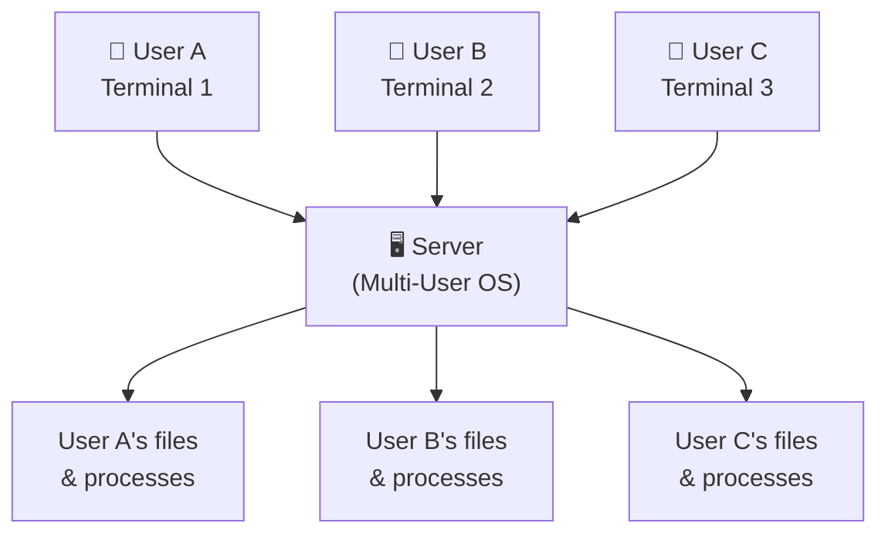
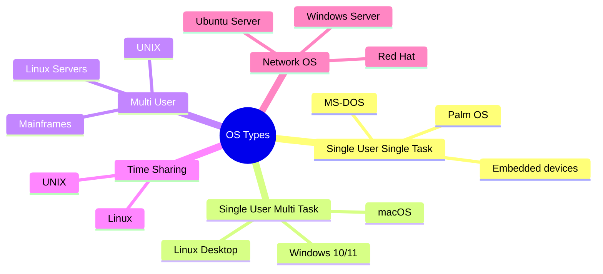

# Types of Operating Systems: Beginner's Guide

> **One-line summary:**
> Operating systems come in different types based on how many users they support, how many tasks they handle at once, and what kind of work they're designed to do.

---

## Table of Contents

1. [What Determines the Type of OS?](#1-what-determines-the-type-of-os)
2. [Single User Single Task OS](#2-single-user-single-task-os)
3. [Single User Multi Task OS](#3-single-user-multi-task-os)
4. [Multi User OS](#4-multi-user-os)
5. [Time Sharing OS](#5-time-sharing-os)
6. [Network OS](#6-network-os)
7. [Comparison Table](#7-comparison-table)
8. [How to Choose the Right OS Type](#8-how-to-choose-the-right-os-type)
9. [Key Takeaways](#9-key-takeaways)

---

## 1. What Determines the Type of OS?

Operating systems are classified based on three main factors:

| Factor                  | Question it answers                                       |
| ----------------------- | --------------------------------------------------------- |
| **Task handling**       | Can it run one program or many at the same time?          |
| **User support**        | Can one person or many people use it simultaneously?      |
| **Response time needs** | Does it need to react instantly, or can it take its time? |

> Like choosing a vehicle: a bicycle, car, truck, and bus all move you from A to B — but they're built for very different purposes. OS types work the same way.

---

## 2. Single User Single Task OS

The simplest type. **One user, one program at a time.**

> Like a basic calculator — you press buttons, get a result, then move to the next calculation. No parallel work.

**Characteristics:**

| Property           | Detail                                       |
| ------------------ | -------------------------------------------- |
| Users              | One at a time                                |
| Tasks              | One at a time                                |
| Complexity         | Very simple — no scheduling needed           |
| Resource use       | 100% dedicated to the single running program |
| To switch programs | Must close current program first             |

**Real-world examples:**

- **MS-DOS** (1980s–early 1990s personal computers)
- **Palm OS** (early PDAs)
- Simple embedded devices: digital thermostats, basic microwave controllers

**Still used where:** simplicity and reliability matter more than multitasking (basic microcontrollers, appliances).

---

## 3. Single User Multi Task OS

**One user, many programs running at the same time.** This is what most personal computers use today.

> Like using your laptop normally: browser open, music playing, document editor running — all at once.

**How multitasking works:**

```
┌──────────────────────────────────────────────┐
│         CPU Time (one second)                │
├──────────┬──────────┬──────────┬─────────────┤
│ Browser  │  Music   │  Editor  │  Browser    │  ...
│ (slice)  │ (slice)  │ (slice)  │ (slice)     │
└──────────┴──────────┴──────────┴─────────────┘
```

The OS switches between programs **hundreds of times per second** — so fast that everything feels simultaneous.

**Characteristics:**

| Property  | Detail                                                  |
| --------- | ------------------------------------------------------- |
| Users     | One                                                     |
| Tasks     | Multiple simultaneously                                 |
| Mechanism | Rapid CPU switching between programs                    |
| Isolation | Programs are protected from interfering with each other |

**Examples:** Windows 10/11, macOS, most Linux desktop distributions

---

## 4. Multi User OS

Allows **multiple people to use the same computer simultaneously**, each with their own space and resources.

> Like a library computer system where many students log in from different terminals — each sees their own files, runs their own programs, and can't see others' work.

**How resource sharing and isolation works:**



- Each user gets their own **private space** — User A cannot read User B's files without permission
- CPU time, memory, and storage are **divided fairly** among all active users
- Crucial for **security and privacy** in shared environments

**Typical use cases:**

- University computer labs
- Corporate servers
- Mainframe systems (banks, airlines handling millions of requests)

**Examples:** UNIX, Linux servers, mainframe operating systems

---

## 5. Time Sharing OS

A special type of multi-user OS that gives each user a **fixed time slice** (called a **quantum**) in rotation.

> Like a dinner table conversation where everyone gets a turn to speak for a few seconds before passing to the next person — but so fast you feel like everyone is talking freely.

**How time slicing works:**

```
Round-robin time slices:

User A → [slice] → User B → [slice] → User C → [slice] → User A → ...

Each slice = fraction of a second (e.g., 10ms–100ms)
State saved at end of each slice, restored at next turn
```

**Characteristics:**

| Property        | Detail                                                         |
| --------------- | -------------------------------------------------------------- |
| Users           | Multiple                                                       |
| Execution       | Time-sliced, round-robin                                       |
| CPU idle time   | Near zero — processor always working on someone's task         |
| User experience | Feels like dedicated access despite sharing                    |
| Fairness        | Equal time distribution prevents any one user from hogging CPU |

**Advantages:**

- Maximizes CPU utilization
- Provides fair access to all users
- Reduces response time vs. batch systems

**Examples:** UNIX, Linux — ideal for educational institutions and development environments

---

## 6. Network OS

Designed to **manage and coordinate computers connected over a network** — handles file sharing, printer sharing, security, and authentication across machines.

> Like an office where multiple computers share printers, files, and databases. The network OS makes all of this coordination invisible and seamless.

**Key features:**

| Feature              | What it does                                              |
| -------------------- | --------------------------------------------------------- |
| File sharing         | Access files on other machines as if they're local        |
| Printer management   | Share printers across all connected computers             |
| User authentication  | Controls who can log in and access what resources         |
| Network security     | Enforces permissions across all machines on the network   |
| Distributed services | Coordinates activities across multiple physical computers |

**Examples:** Windows Server, Ubuntu Server, Red Hat Enterprise Linux, Novell NetWare

**Where you encounter it:** saving to a company shared drive, printing to a network printer, accessing corporate email — all powered by a network OS on the server side.

---

## 7. Comparison Table

| OS Type                 | Users Supported       | Tasks Supported         | Common Use Cases        | Examples              |
| ----------------------- | --------------------- | ----------------------- | ----------------------- | --------------------- |
| Single User Single Task | One                   | One at a time           | Simple embedded systems | MS-DOS, Palm OS       |
| Single User Multi Task  | One                   | Multiple simultaneously | Personal computers      | Windows, macOS        |
| Multi User              | Multiple              | Multiple per user       | Servers, mainframes     | UNIX, Linux servers   |
| Time Sharing            | Multiple              | Time-sliced execution   | University systems      | UNIX, Linux           |
| Network OS              | Multiple over network | Distributed tasks       | Corporate networks      | Windows Server, Linux |



---

## 8. How to Choose the Right OS Type

| Need                                        | Best OS Type            |
| ------------------------------------------- | ----------------------- |
| Personal use (browsing, gaming, documents)  | Single User Multi Task  |
| Many people accessing one machine           | Multi User              |
| Fair CPU sharing among many users           | Time Sharing            |
| Sharing files and printers across an office | Network OS              |
| Simple appliance or embedded device         | Single User Single Task |

**Key factors to consider:**

- How many people will use the system?
- Will they use it at the same time?
- What tasks will they perform?
- How much hardware is available?
- What are the security requirements?

> Modern OSes blur these lines — Windows and Linux can act as both single-user and multi-user systems depending on configuration. Cloud computing hides the OS type entirely behind web interfaces.

---

## 9. Key Takeaways

- OS types differ in **how many users** they support and **how many tasks** they handle simultaneously.
- **Single User Single Task**: simplest, one thing at a time — MS-DOS, embedded devices.
- **Single User Multi Task**: what your laptop runs — Windows, macOS — many apps at once for one person.
- **Multi User**: many people sharing one machine, each with isolated private space — servers, UNIX.
- **Time Sharing**: special multi-user model where CPU time is divided into tiny slices and rotated — maximizes utilization.
- **Network OS**: manages resources and security across many connected computers — corporate servers.
- Choosing the right type depends on **user count, task type, resource availability, and security needs**.
