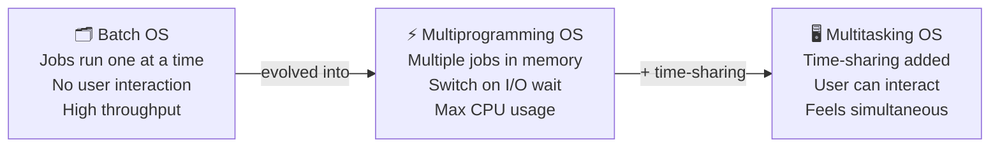

# Batch, Multiprogramming & Multitasking OS Guide

> **One-line summary:**
> **Batch OS** runs jobs one after another with no user interaction. **Multiprogramming** keeps multiple jobs in memory and switches between them to keep the CPU busy. **Multitasking** adds time-sharing on top so users can interact with multiple programs at once.

---

## Table of Contents

1. [Batch Operating Systems](#1-batch-operating-systems)
2. [Multiprogramming Operating Systems](#2-multiprogramming-operating-systems)
3. [Multitasking Operating Systems](#3-multitasking-operating-systems)
4. [Comparison: Batch vs Multiprogramming vs Multitasking](#4-comparison-batch-vs-multiprogramming-vs-multitasking)
5. [Evolution and Relationships](#5-evolution-and-relationships)
6. [Practical Applications Today](#6-practical-applications-today)
7. [Key Takeaways](#7-key-takeaways)

---

## 1. Batch Operating Systems

> Like a **laundry service** — you drop off clothes in the morning, they process everyone's laundry together in batches throughout the day, and you pick it up later. No waiting around while it's washed.

A batch OS collects similar jobs together and processes them **one after another without any user interaction**. Once a job starts, it runs to completion before the next one begins.

### How Batch Systems Work

```
User submits job
      ↓
Operator groups similar jobs together
      ↓
OS executes Job 1 → Job 2 → Job 3 → ...
      ↓
Results collected and returned to users
```

No direct interaction between the user and the running program — users submit and wait.

### Characteristics

| Property         | Detail                                               |
| ---------------- | ---------------------------------------------------- |
| User interaction | None — jobs run start to finish unattended           |
| Execution order  | Sequential — one job at a time                       |
| Grouping         | Similar jobs batched together for efficiency         |
| Output           | Available only after job completes                   |
| Management       | Human operator manages job submission and scheduling |

### Real-World Examples

- **Bank end-of-day processing** — all transactions collected during the day, then processed together overnight (balances updated, statements generated, interest calculated)
- **Payroll systems** — work hours collected over a pay period, then one batch job calculates salaries, deductions, and generates paychecks

### Advantages & Disadvantages

| Advantages                                        | Disadvantages                                     |
| ------------------------------------------------- | ------------------------------------------------- |
| High throughput for large volumes of similar jobs | Long turnaround time — users wait                 |
| Efficient resource use during off-peak hours      | No debugging or interaction during execution      |
| Reduced idle time for processors                  | One job failure can delay the entire batch        |
| Low operational cost (minimal human intervention) | Not suitable for tasks needing immediate response |

---

## 2. Multiprogramming Operating Systems

> Like a **chef cooking multiple dishes** — while one dish bakes in the oven (waiting), the chef chops vegetables for another dish (working). The chef never stands idle.

A multiprogramming OS keeps **multiple programs in memory simultaneously** and switches between them to maximize CPU utilization.

### How Multiprogramming Works

The key insight: when a program waits for **I/O** (reading from disk, writing to printer), the CPU would otherwise sit idle. Multiprogramming uses that idle time to run another program.

```
Program A runs → requests disk read → must wait
      ↓
OS switches to Program B → Program B uses CPU
      ↓
Program B requests printer → must wait
      ↓
OS switches to Program C → Program C uses CPU
      ↓
Disk read for Program A completes → A back in ready queue
```

The **goal**: keep the CPU busy 100% of the time.

### Memory Organization

Memory is divided into partitions, each holding one program:

```
┌─────────────────────────┐
│   Operating System      │  ← Always resident
├─────────────────────────┤
│   Program A             │  ← Executing or waiting for I/O
├─────────────────────────┤
│   Program B             │  ← Executing or waiting for I/O
├─────────────────────────┤
│   Program C             │  ← Executing or waiting for I/O
└─────────────────────────┘
```

### Characteristics

| Property           | Detail                                                       |
| ------------------ | ------------------------------------------------------------ |
| Programs in memory | Multiple programs loaded in RAM simultaneously               |
| CPU usage          | Always busy — switches to another job when one waits for I/O |
| User interaction   | None — still non-interactive like batch                      |
| Job pool           | Collection of jobs waiting on disk for memory allocation     |
| Scheduling         | OS automatically decides which job runs next                 |

### Advantages & Disadvantages

| Advantages                                     | Disadvantages                                        |
| ---------------------------------------------- | ---------------------------------------------------- |
| Maximum CPU utilization — CPU rarely sits idle | Complex memory management required                   |
| Higher throughput — more jobs in less time     | More sophisticated CPU scheduling needed             |
| Reduced response time vs. batch                | Requires more advanced hardware support              |
| Efficient memory use                           | Still non-interactive — users can't talk to programs |

---

## 3. Multitasking Operating Systems

> Like **working from home** — typing an email, music playing in the background, checking instant messenger occasionally. All happening "at once" from your perspective.

Multitasking extends multiprogramming by adding **time-sharing** — the CPU switches between programs so rapidly that users perceive everything running simultaneously.

### How Time-Sharing Works

Each program gets a small **time slice** (typically milliseconds). When the slice expires, the OS saves the program's state (**context switch**) and switches to the next program.

```
Time →  0ms    10ms   20ms   30ms   40ms   50ms
        ┌──────┬──────┬──────┬──────┬──────┐
CPU:    │Editor│Music │Browser│Editor│Music │ ...
        └──────┴──────┴──────┴──────┴──────┘

Switches happen ~1000x per second → feels simultaneous to the user
```

### Characteristics

| Property          | Detail                                                     |
| ----------------- | ---------------------------------------------------------- |
| User interaction  | Full — users interact with multiple running programs       |
| Mechanism         | Time-sharing — CPU divided into tiny slices among programs |
| Context switching | Frequent, time-based (not just on I/O wait)                |
| Concurrency       | Multiple programs appear to run simultaneously             |
| Responsiveness    | Very quick response to user input                          |

### Real-World Examples

- **Smartphone**: music playing + web browsing + notifications + email syncing — all at once
- **Desktop OS**: editing a document + downloading files + streaming video simultaneously
- **Modern OS**: Windows, macOS, Linux — all multitasking systems

### Advantages & Disadvantages

| Advantages                                           | Disadvantages                                       |
| ---------------------------------------------------- | --------------------------------------------------- |
| Users interact with multiple apps simultaneously     | More complex scheduling algorithms needed           |
| Excellent resource sharing                           | Higher overhead from frequent context switching     |
| Very short response time                             | More prone to security issues (multiple users/apps) |
| Better productivity — no waiting for one task to end | Requires more memory and processing power           |
| Smooth modern GUI experience                         |                                                     |

---

## 4. Comparison: Batch vs Multiprogramming vs Multitasking

| Feature           | Batch OS              | Multiprogramming OS   | Multitasking OS          |
| ----------------- | --------------------- | --------------------- | ------------------------ |
| User interaction  | None during execution | None during execution | Full interaction allowed |
| CPU utilization   | Low to moderate       | High                  | Very high                |
| Response time     | Very long             | Moderate              | Very short               |
| Jobs in memory    | One at a time         | Multiple              | Multiple                 |
| Context switching | None                  | When I/O occurs       | Frequent, time-based     |
| Primary goal      | Job throughput        | CPU utilization       | User responsiveness      |
| Example use       | Payroll processing    | Server applications   | Desktop computers        |



---

## 5. Evolution and Relationships

These three types represent an **evolutionary progression** in OS design:

```
1950s–60s          1960s–70s              1970s–present
Batch OS    →   Multiprogramming   →    Multitasking
                    OS                      OS

"Process jobs      "Keep CPU busy         "Let users interact
 sequentially"      while waiting"          with everything"
```

**Key relationships:**

- Multitasking **is** multiprogramming + time-sharing
- All multitasking systems are multiprogramming systems — not vice versa
- Batch systems can **use** multiprogramming internally to process batches faster
- Modern OSes **combine all three** depending on the task

---

## 6. Practical Applications Today

| OS Type          | Still used for…                                                                                       |
| ---------------- | ----------------------------------------------------------------------------------------------------- |
| Batch processing | Bank end-of-day reconciliation, credit card transaction processing, overnight scientific compute jobs |
| Multiprogramming | Web servers handling multiple client requests, database servers with multiple connections             |
| Multitasking     | Every modern desktop OS (Windows, macOS, Linux) and mobile OS (Android, iOS)                          |

> On a **single-core CPU**, multitasking is an illusion — only one program runs at any instant, but switches are too fast to perceive. On **multi-core CPUs**, true simultaneous execution is possible across cores — that's **multiprocessing** (covered in the next article).

---

## 7. Key Takeaways

- **Batch OS**: jobs submitted, grouped, and executed sequentially with no interaction — ideal for repetitive bulk work.
- **Multiprogramming OS**: multiple jobs loaded in memory; CPU switches between them on I/O waits — maximizes CPU utilization.
- **Multitasking OS**: multiprogramming + time-sharing — CPU switches rapidly on a timer so users can interact with all running programs at once.
- Multitasking **evolved from** multiprogramming — every multitasking system is a multiprogramming system.
- The progression: **throughput** (batch) → **CPU utilization** (multiprogramming) → **user responsiveness** (multitasking).
- All three approaches are still relevant today in different contexts.
