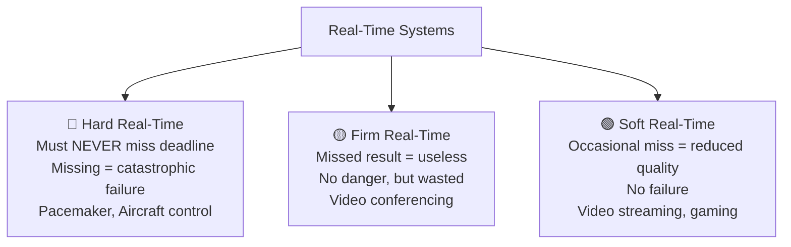

# Multiprocessing & Real-Time OS (RTOS) Explained

> **One-line summary:**
> **Multiprocessing** uses multiple CPUs to run tasks truly in parallel for speed. **RTOS** guarantees tasks finish within strict time deadlines — used wherever timing is critical.

---

## Table of Contents

1. [What is Multiprocessing?](#1-what-is-multiprocessing)
2. [Types of Multiprocessing](#2-types-of-multiprocessing)
3. [Advantages & Challenges of Multiprocessing](#3-advantages--challenges-of-multiprocessing)
4. [What is a Real-Time Operating System (RTOS)?](#4-what-is-a-real-time-operating-system-rtos)
5. [Types of Real-Time Systems](#5-types-of-real-time-systems)
6. [Characteristics of RTOS](#6-characteristics-of-rtos)
7. [Real-World Applications of RTOS](#7-real-world-applications-of-rtos)
8. [Multiprocessing vs Real-Time Systems](#8-multiprocessing-vs-real-time-systems)
9. [Combining Both](#9-combining-both)
10. [Key Takeaways](#10-key-takeaways)

---

## 1. What is Multiprocessing?

**Multiprocessing** is when a computer uses **two or more CPUs** to execute multiple processes **simultaneously** — true parallel execution, not just fast switching.

> Like having **multiple chefs in a kitchen** instead of one. Each chef works on a completely different dish at the exact same time — no taking turns.

| Concept         | Mechanism                                | Parallelism     |
| --------------- | ---------------------------------------- | --------------- |
| Multitasking    | 1 CPU switches rapidly between tasks     | Illusion (felt) |
| Multiprocessing | Multiple CPUs run tasks at the same time | Real (actual)   |

Each processor works independently on different tasks, dramatically increasing **throughput** and **efficiency**.

---

## 2. Types of Multiprocessing

### Symmetric Multiprocessing (SMP)

All processors are **equal peers** — they share the same memory and any processor can run any task.

```
        ┌─────────────────────────────────┐
        │         Shared Memory           │
        └────┬────────┬────────┬──────────┘
             │        │        │
          CPU 1     CPU 2    CPU 3     ← All equal, all can run any task
```

- Most common type in **modern desktops, laptops, and servers**
- Better resource utilization
- More complex to manage

### Asymmetric Multiprocessing (AMP)

One **master processor** controls the system and assigns tasks to **slave processors**.

```
        ┌─────────────────────────────────┐
        │         Shared Memory           │
        └────┬────────────────────────────┘
             │
          CPU 1 (Master) ──assigns tasks──→ CPU 2 (Slave)
                                        └─→ CPU 3 (Slave)
```

- Simpler structure, but can leave slave processors idle
- Common in **embedded systems and older hardware**

### Comparison

| Feature           | Symmetric (SMP)                | Asymmetric (AMP)                |
| ----------------- | ------------------------------ | ------------------------------- |
| Processor roles   | All equal                      | One master, others are slaves   |
| Task distribution | Any processor can run any task | Master assigns tasks to slaves  |
| Complexity        | More complex to manage         | Simpler structure               |
| Efficiency        | Better resource utilization    | Can have idle slave processors  |
| Common use        | Modern desktops and servers    | Embedded systems, older systems |

---

## 3. Advantages & Challenges of Multiprocessing

### Advantages

| Benefit                | Why it matters                                                      |
| ---------------------- | ------------------------------------------------------------------- |
| Increased throughput   | More work done in less time — multiple processors work in parallel  |
| Better reliability     | If one CPU fails, others continue — system doesn't crash completely |
| Improved performance   | Complex tasks split across processors finish faster                 |
| Cost-effective scaling | Adding processors cheaper than replacing entire system              |

### Challenges

| Challenge            | What it means                                                          |
| -------------------- | ---------------------------------------------------------------------- |
| Complex programming  | Code must be written to run safely across multiple processors          |
| Memory conflicts     | Multiple CPUs accessing same memory location can cause data corruption |
| Higher hardware cost | Multiple CPUs = higher upfront cost                                    |
| Synchronization      | Coordinating work between processors requires careful management       |

---

## 4. What is a Real-Time Operating System (RTOS)?

An **RTOS** is designed to process data and respond to events **within a strict time constraint**. Meeting deadlines is more important than raw throughput.

> Like an **airbag system** — it doesn't matter how fast the car is; the airbag must deploy within milliseconds of impact, **every single time**, no exceptions.

| OS Type         | Primary goal          | Timing guarantee |
| --------------- | --------------------- | ---------------- |
| General-purpose | Max performance, UX   | None             |
| RTOS            | Meet strict deadlines | Guaranteed       |

A general-purpose OS like Windows or macOS won't guarantee your task runs within 5ms. An RTOS will.

---

## 5. Types of Real-Time Systems

| Type        | If Deadline Missed…                        | Example                                      |
| ----------- | ------------------------------------------ | -------------------------------------------- |
| **Hard RT** | System failure or catastrophic consequence | Aircraft autopilot, pacemaker, ABS brakes    |
| **Soft RT** | Reduced quality, but no failure            | Video streaming, online gaming, ATM machines |
| **Firm RT** | Result becomes completely useless          | Video conferencing (skipped frames)          |



---

## 6. Characteristics of RTOS

| Characteristic            | What it means                                                      |
| ------------------------- | ------------------------------------------------------------------ |
| Deterministic behavior    | Responds in a predictable, consistent time frame — always          |
| Priority scheduling       | Time-critical tasks always run before less critical ones           |
| Minimal interrupt latency | Responds to events almost instantly                                |
| Fast context switching    | Switches between tasks quickly without wasting cycles              |
| Small footprint           | Uses minimal memory and resources — runs on tiny embedded hardware |

---

## 7. Real-World Applications of RTOS

| Domain                | Example                                     | Why timing matters                          |
| --------------------- | ------------------------------------------- | ------------------------------------------- |
| Medical devices       | Pacemakers, insulin pumps, patient monitors | Delayed response could be fatal             |
| Automotive            | ABS brakes, airbags, engine control units   | Split-second precision = safety             |
| Industrial automation | Robots, conveyor belts, quality control     | Missed timing damages products or equipment |
| Aerospace & defense   | Flight control, missile guidance, radar     | Absolute reliability required               |
| Consumer electronics  | Smart home devices, digital cameras         | Responsive user experience                  |

> You interact with RTOS-powered devices every single day — your car alone has dozens of them.

---

## 8. Multiprocessing vs Real-Time Systems

These solve **different problems** and are often confused:

| Aspect         | Multiprocessing                     | Real-Time OS                            |
| -------------- | ----------------------------------- | --------------------------------------- |
| Primary goal   | Increase throughput and speed       | Meet strict time deadlines              |
| Processors     | Uses multiple CPUs                  | Can use one or multiple CPUs            |
| Focus          | Parallel execution                  | Deterministic timing                    |
| Common use     | Servers, high-performance computing | Embedded systems, critical applications |
| Failure impact | Reduced performance                 | Can cause catastrophic failure          |

- **Multiprocessing** = do more things at once = **speed**
- **RTOS** = do the right thing at the right time = **reliability**

---

## 9. Combining Both

Modern systems often **combine multiprocessing with real-time capabilities**:

```
Self-Driving Car
├── CPU 1: Vision processing (camera frames)        ← Multiprocessing
├── CPU 2: Decision making (path planning)          ← Multiprocessing
├── CPU 3: Vehicle control                          ← Hard Real-Time
└── CPU 4: Safety monitoring (collision detection) ← Hard Real-Time
```

- **Industrial robots**: use multiprocessing to coordinate complex movements, RTOS to respond to safety sensors instantly
- **Aerospace**: multiple processors for different systems, all with hard real-time guarantees

This combination provides both **raw power** (multiprocessing) and **guaranteed timing** (RTOS).

---

## 10. Key Takeaways

- **Multiprocessing** = multiple physical CPUs running tasks **truly in parallel** — not just fast switching.
- **SMP**: all CPUs equal, share memory — used in modern desktops/servers.
- **AMP**: one master CPU assigns tasks to slave CPUs — used in embedded/older systems.
- **RTOS** = an OS where **meeting deadlines is more important than throughput** — used in safety-critical systems.
- Three RTOS types: **Hard** (missing deadline = disaster), **Soft** (missing deadline = degraded quality), **Firm** (missing deadline = result is useless).
- Key RTOS traits: deterministic, priority-driven, minimal latency, small footprint.
- Multiprocessing and RTOS are **not opposites** — modern systems combine both.
- Multitasking ≠ Multiprocessing: multitasking = 1 CPU switching fast; multiprocessing = multiple CPUs running truly in parallel.
