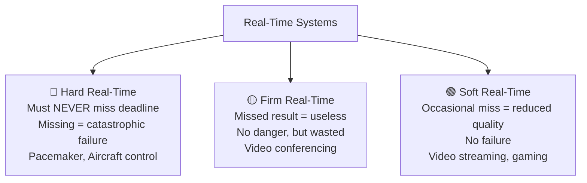

# Multiprocessing & Real-Time OS (RTOS) Explained

> **One-line summary:**
> **Multiprocessing** uses multiple CPUs to run tasks truly in parallel for speed. **RTOS** guarantees tasks finish within strict time deadlines — used wherever timing is critical.

---

## Table of Contents

1. [What is Multiprocessing?](#1-what-is-multiprocessing)
2. [Types of Multiprocessing](#2-types-of-multiprocessing)
3. [Advantages & Challenges of Multiprocessing](#3-advantages--challenges-of-multiprocessing)
4. [What is a Real-Time Operating System (RTOS)?](#4-what-is-a-real-time-operating-system-rtos)
5. [Types of Real-Time Systems](#5-types-of-real-time-systems)
6. [Characteristics of RTOS](#6-characteristics-of-rtos)
7. [Real-World Applications of RTOS](#7-real-world-applications-of-rtos)
8. [Multiprocessing vs Real-Time Systems](#8-multiprocessing-vs-real-time-systems)
9. [Combining Both](#9-combining-both)
10. [Key Takeaways](#10-key-takeaways)

---

## 1. What is Multiprocessing?

**Multiprocessing** is when a computer uses **two or more CPUs** to execute multiple processes **simultaneously** — true parallel execution, not just fast switching.

> Like having **multiple chefs in a kitchen** instead of one. Each chef works on a completely different dish at the exact same time — no taking turns.

| Concept         | Mechanism                                | Parallelism     |
| --------------- | ---------------------------------------- | --------------- |
| Multitasking    | 1 CPU switches rapidly between tasks     | Illusion (felt) |
| Multiprocessing | Multiple CPUs run tasks at the same time | Real (actual)   |

Each processor works independently on different tasks, dramatically increasing **throughput** and **efficiency**.

---

## 2. Types of Multiprocessing

### Symmetric Multiprocessing (SMP)

All processors are **equal peers** — they share the same memory and any processor can run any task.

```
        ┌─────────────────────────────────┐
        │         Shared Memory           │
        └────┬────────┬────────┬──────────┘
             │        │        │
          CPU 1     CPU 2    CPU 3     ← All equal, all can run any task
```

- Most common type in **modern desktops, laptops, and servers**
- Better resource utilization
- More complex to manage

### Asymmetric Multiprocessing (AMP)

One **master processor** controls the system and assigns tasks to **slave processors**.

```
        ┌─────────────────────────────────┐
        │         Shared Memory           │
        └────┬────────────────────────────┘
             │
          CPU 1 (Master) ──assigns tasks──→ CPU 2 (Slave)
                                        └─→ CPU 3 (Slave)
```

- Simpler structure, but can leave slave processors idle
- Common in **embedded systems and older hardware**

### Comparison

| Feature           | Symmetric (SMP)                | Asymmetric (AMP)                |
| ----------------- | ------------------------------ | ------------------------------- |
| Processor roles   | All equal                      | One master, others are slaves   |
| Task distribution | Any processor can run any task | Master assigns tasks to slaves  |
| Complexity        | More complex to manage         | Simpler structure               |
| Efficiency        | Better resource utilization    | Can have idle slave processors  |
| Common use        | Modern desktops and servers    | Embedded systems, older systems |

---

## 3. Advantages & Challenges of Multiprocessing

### Advantages

| Benefit                | Why it matters                                                      |
| ---------------------- | ------------------------------------------------------------------- |
| Increased throughput   | More work done in less time — multiple processors work in parallel  |
| Better reliability     | If one CPU fails, others continue — system doesn't crash completely |
| Improved performance   | Complex tasks split across processors finish faster                 |
| Cost-effective scaling | Adding processors cheaper than replacing entire system              |

### Challenges

| Challenge            | What it means                                                          |
| -------------------- | ---------------------------------------------------------------------- |
| Complex programming  | Code must be written to run safely across multiple processors          |
| Memory conflicts     | Multiple CPUs accessing same memory location can cause data corruption |
| Higher hardware cost | Multiple CPUs = higher upfront cost                                    |
| Synchronization      | Coordinating work between processors requires careful management       |

---

## 4. What is a Real-Time Operating System (RTOS)?

An **RTOS** is designed to process data and respond to events **within a strict time constraint**. Meeting deadlines is more important than raw throughput.

> Like an **airbag system** — it doesn't matter how fast the car is; the airbag must deploy within milliseconds of impact, **every single time**, no exceptions.

| OS Type         | Primary goal          | Timing guarantee |
| --------------- | --------------------- | ---------------- |
| General-purpose | Max performance, UX   | None             |
| RTOS            | Meet strict deadlines | Guaranteed       |

A general-purpose OS like Windows or macOS won't guarantee your task runs within 5ms. An RTOS will.

---

## 5. Types of Real-Time Systems

| Type        | If Deadline Missed…                        | Example                                      |
| ----------- | ------------------------------------------ | -------------------------------------------- |
| **Hard RT** | System failure or catastrophic consequence | Aircraft autopilot, pacemaker, ABS brakes    |
| **Soft RT** | Reduced quality, but no failure            | Video streaming, online gaming, ATM machines |
| **Firm RT** | Result becomes completely useless          | Video conferencing (skipped frames)          |



---

## 6. Characteristics of RTOS

| Characteristic            | What it means                                                      |
| ------------------------- | ------------------------------------------------------------------ |
| Deterministic behavior    | Responds in a predictable, consistent time frame — always          |
| Priority scheduling       | Time-critical tasks always run before less critical ones           |
| Minimal interrupt latency | Responds to events almost instantly                                |
| Fast context switching    | Switches between tasks quickly without wasting cycles              |
| Small footprint           | Uses minimal memory and resources — runs on tiny embedded hardware |

---

## 7. Real-World Applications of RTOS

| Domain                | Example                                     | Why timing matters                          |
| --------------------- | ------------------------------------------- | ------------------------------------------- |
| Medical devices       | Pacemakers, insulin pumps, patient monitors | Delayed response could be fatal             |
| Automotive            | ABS brakes, airbags, engine control units   | Split-second precision = safety             |
| Industrial automation | Robots, conveyor belts, quality control     | Missed timing damages products or equipment |
| Aerospace & defense   | Flight control, missile guidance, radar     | Absolute reliability required               |
| Consumer electronics  | Smart home devices, digital cameras         | Responsive user experience                  |

> You interact with RTOS-powered devices every single day — your car alone has dozens of them.

---

## 8. Multiprocessing vs Real-Time Systems

These solve **different problems** and are often confused:

| Aspect         | Multiprocessing                     | Real-Time OS                            |
| -------------- | ----------------------------------- | --------------------------------------- |
| Primary goal   | Increase throughput and speed       | Meet strict time deadlines              |
| Processors     | Uses multiple CPUs                  | Can use one or multiple CPUs            |
| Focus          | Parallel execution                  | Deterministic timing                    |
| Common use     | Servers, high-performance computing | Embedded systems, critical applications |
| Failure impact | Reduced performance                 | Can cause catastrophic failure          |

- **Multiprocessing** = do more things at once = **speed**
- **RTOS** = do the right thing at the right time = **reliability**

---

## 9. Combining Both

Modern systems often **combine multiprocessing with real-time capabilities**:

```
Self-Driving Car
├── CPU 1: Vision processing (camera frames)        ← Multiprocessing
├── CPU 2: Decision making (path planning)          ← Multiprocessing
├── CPU 3: Vehicle control                          ← Hard Real-Time
└── CPU 4: Safety monitoring (collision detection) ← Hard Real-Time
```

- **Industrial robots**: use multiprocessing to coordinate complex movements, RTOS to respond to safety sensors instantly
- **Aerospace**: multiple processors for different systems, all with hard real-time guarantees

This combination provides both **raw power** (multiprocessing) and **guaranteed timing** (RTOS).

---

## 9. Code Examples

> Working code that demonstrates multi-CPU job assignment and RTOS deadline scheduling in practice.

### C++ — Simple Version

Simulate multi-CPU job assignment using a greedy least-loaded strategy, then run Earliest Deadline First scheduling for RTOS tasks.

```cpp
// Multiprocessing & RTOS: Simple demonstration
// Shows: Assigning jobs to multiple CPUs (load balancing) and RTOS EDF scheduling
// Compile: g++ -std=c++17 05_multiprocessing_rtos.cpp -o out

#include <iostream>
#include <vector>
#include <algorithm>
#include <string>
using namespace std;

struct Job {
    string name;
    int    burstTime;   // How long this job runs
    int    deadline;    // Must finish by this time (RTOS only; 0 = no constraint)
};

// Represents a single CPU in a multiprocessor system
struct CPU {
    int            id;
    int            totalLoad = 0;   // Sum of burst times assigned so far
    vector<string> assignedJobs;    // Names of jobs assigned to this CPU

    void assign(const Job& job) {
        assignedJobs.push_back(job.name);
        totalLoad += job.burstTime;
        cout << "  [CPU " << id << "] Assigned: " << job.name
             << " (load now: " << totalLoad << ")\n";
    }
};

// ===================================
// MULTIPROCESSING: greedy least-loaded assignment
// ===================================
void simulateMultiprocessing(vector<Job> jobs, int numCPUs) {
    cout << "\n--- Multiprocessing (" << numCPUs << " CPUs, greedy assignment) ---\n";

    vector<CPU> cpus(numCPUs);
    for (int i = 0; i < numCPUs; i++) cpus[i].id = i + 1;

    for (const auto& job : jobs) {
        // Always assign to the CPU with the least current load
        CPU& leastLoaded = *min_element(cpus.begin(), cpus.end(),
            [](const CPU& a, const CPU& b){ return a.totalLoad < b.totalLoad; });
        leastLoaded.assign(job);
    }

    cout << "\n  Final CPU loads:\n";
    for (const auto& cpu : cpus) {
        cout << "  CPU " << cpu.id << ": load=" << cpu.totalLoad << " | jobs: ";
        for (const auto& j : cpu.assignedJobs) cout << j << " ";
        cout << "\n";
    }
}

// ===================================
// RTOS: Earliest Deadline First (EDF) — urgent jobs run first
// ===================================
void simulateRTOS(vector<Job> jobs) {
    cout << "\n--- RTOS: Earliest Deadline First ---\n";

    // Sort by deadline — most urgent task first
    sort(jobs.begin(), jobs.end(), [](const Job& a, const Job& b){
        return a.deadline < b.deadline;
    });

    int  time   = 0;
    bool allMet = true;

    for (const auto& job : jobs) {
        int  finishTime = time + job.burstTime;
        bool met        = (finishTime <= job.deadline);
        if (!met) allMet = false;

        cout << "  [t=" << time << "→" << finishTime << "] " << job.name
             << " | deadline=" << job.deadline
             << " | " << (met ? "DEADLINE MET" : "DEADLINE MISSED!") << "\n";
        time = finishTime;
    }

    cout << (allMet ? "\n  All deadlines met!\n" : "\n  WARNING: Some deadlines missed!\n");
}

int main() {
    vector<Job> multiJobs = {
        {"DataAnalysis",  8, 0},
        {"ImageRender",   5, 0},
        {"DBQuery",       3, 0},
        {"Compression",   6, 0},
        {"EmailService",  2, 0},
    };

    vector<Job> rtosJobs = {
        {"Brake sensor", 1, 3 },
        {"Engine ctrl",  2, 6 },
        {"GPS update",   3, 10},
        {"Display",      2, 8 },
    };

    simulateMultiprocessing(multiJobs, 2);
    simulateRTOS(rtosJobs);

    return 0;
}
```

### C++ — Medium / LeetCode Style

Given N jobs and K CPUs, balance the assignment to minimize max load. Then verify if RTOS jobs all meet their deadlines under EDF.

```cpp
// Multiprocessing & RTOS: Optimized / LeetCode-style
// Problem: Given N jobs and K CPUs, assign jobs to minimize max CPU load (load balancing).
//          Then verify a set of RTOS tasks all complete before their deadlines under EDF.
// Complexity: O(N log K) with min-heap for load balancing, O(N log N) for EDF

#include <iostream>
#include <vector>
#include <queue>
#include <algorithm>
#include <string>
using namespace std;

struct Job { string name; int burst, deadline; };

// Balanced job assignment using a min-heap (always pick least-loaded CPU)
void balancedAssignment(const vector<Job>& jobs, int k) {
    // Min-heap: {current_load, cpu_id}
    priority_queue<pair<int,int>, vector<pair<int,int>>, greater<>> pq;
    for (int i = 0; i < k; i++) pq.push({0, i + 1});

    vector<vector<string>> assignment(k + 1);

    for (const auto& j : jobs) {
        auto [load, cpuId] = pq.top(); pq.pop();
        assignment[cpuId].push_back(j.name);
        pq.push({load + j.burst, cpuId});
    }

    cout << "[Multiprocessing] Balanced Job Assignment:\n";
    while (!pq.empty()) {
        auto [load, cpuId] = pq.top(); pq.pop();
        cout << "  CPU " << cpuId << " (load=" << load << "): ";
        for (const auto& name : assignment[cpuId]) cout << name << " ";
        cout << "\n";
    }
}

// EDF scheduler — returns true if all jobs finish before their deadlines
bool edfScheduler(vector<Job> jobs) {
    sort(jobs.begin(), jobs.end(), [](auto& a, auto& b){
        return a.deadline < b.deadline;
    });
    int time = 0; bool allMet = true;
    cout << "\n[RTOS EDF] ";
    for (auto& j : jobs) {
        time += j.burst;
        bool met = (time <= j.deadline);
        if (!met) allMet = false;
        cout << j.name << (met ? "✓" : "✗") << " ";
    }
    cout << "\n";
    return allMet;
}

int main() {
    vector<Job> jobs   = {{"Data",8,0},{"Render",5,0},{"DB",3,0},{"Zip",6,0},{"Email",2,0}};
    vector<Job> rtJobs = {{"Brake",1,3},{"Engine",2,6},{"GPS",3,10},{"Display",2,8}};

    balancedAssignment(jobs, 2);
    bool ok = edfScheduler(rtJobs);
    cout << (ok ? "All RTOS deadlines met!\n" : "WARNING: Deadlines missed!\n");

    return 0;
}
```

### Python — Simple Version

Assign jobs to multiple CPUs using greedy load balancing, then run RTOS EDF scheduling and check deadline compliance.

```python
# Multiprocessing & RTOS: Simple demonstration
# Shows: Multi-CPU greedy job assignment + RTOS Earliest Deadline First scheduling
# Run: python3 05_multiprocessing_rtos.py


class Job:
    def __init__(self, name, burst_time, deadline=0):
        self.name       = name
        self.burst_time = burst_time   # How long this job runs
        self.deadline   = deadline     # Must finish by this time (RTOS only)


# ===================================
# Multiprocessing: assign jobs to the least-loaded CPU
# ===================================
def simulate_multiprocessing(jobs, num_cpus):
    print(f"\n--- Multiprocessing ({num_cpus} CPUs, greedy assignment) ---")

    cpu_loads = [0] * num_cpus            # Track total load per CPU
    cpu_jobs  = [[] for _ in range(num_cpus)]  # Track jobs per CPU

    for job in jobs:
        # Find the CPU with the least load right now
        least = cpu_loads.index(min(cpu_loads))
        cpu_loads[least] += job.burst_time
        cpu_jobs[least].append(job.name)
        print(f"  [CPU {least + 1}] Assigned: {job.name} "
              f"(total load now: {cpu_loads[least]})")

    print("\n  Final CPU loads:")
    for i in range(num_cpus):
        print(f"  CPU {i+1}: load={cpu_loads[i]} | jobs={cpu_jobs[i]}")


# ===================================
# RTOS: Earliest Deadline First scheduling
# ===================================
def simulate_rtos(jobs):
    print("\n--- RTOS: Earliest Deadline First (EDF) ---")

    # Sort by deadline — most urgent job runs first
    sorted_jobs = sorted(jobs, key=lambda j: j.deadline)

    time, all_met = 0, True

    for job in sorted_jobs:
        finish_time = time + job.burst_time
        met = finish_time <= job.deadline

        if not met:
            all_met = False

        status = "DEADLINE MET" if met else "DEADLINE MISSED!"
        print(f"  [t={time}→{finish_time}] {job.name} | "
              f"deadline={job.deadline} | {status}")
        time = finish_time

    print("\n  All deadlines met!" if all_met else "\n  WARNING: Some deadlines missed!")


def main():
    multi_jobs = [
        Job("DataAnalysis", 8),
        Job("ImageRender",  5),
        Job("DBQuery",      3),
        Job("Compression",  6),
        Job("EmailService", 2),
    ]

    rtos_jobs = [
        Job("Brake sensor", 1, deadline=3),
        Job("Engine ctrl",  2, deadline=6),
        Job("GPS update",   3, deadline=10),
        Job("Display",      2, deadline=8),
    ]

    simulate_multiprocessing(multi_jobs, num_cpus=2)
    simulate_rtos(rtos_jobs)


if __name__ == "__main__":
    main()
```

### Python — Medium Level

Balance N jobs across K CPUs using a min-heap, then verify RTOS deadlines with EDF.

```python
# Multiprocessing & RTOS: Optimized / Pythonic
# Problem: Assign N jobs to K CPUs minimizing max load (min-heap greedy).
#          Then verify all RTOS tasks meet deadlines under EDF scheduling.
# Complexity: O(N log K) for load balancing, O(N log N) for EDF

import heapq
from dataclasses import dataclass, field
from typing import List


@dataclass
class Job:
    name:     str
    burst:    int
    deadline: int = 0


@dataclass(order=True)
class CPU:
    load:     int           # Used for heap comparison
    cpu_id:   int = field(compare=False)
    tasks:    List[str] = field(default_factory=list, compare=False)


def balanced_assignment(jobs: List[Job], k: int):
    """Assign jobs to K CPUs using a min-heap to always pick the least-loaded CPU."""
    heap = [CPU(0, i + 1) for i in range(k)]
    heapq.heapify(heap)

    for job in jobs:
        cpu = heapq.heappop(heap)
        cpu.tasks.append(job.name)
        cpu.load += job.burst
        heapq.heappush(heap, cpu)

    print("[Multiprocessing] Balanced Assignment:")
    for cpu in sorted(heap, key=lambda c: c.cpu_id):
        print(f"  CPU {cpu.cpu_id} (load={cpu.load}): {cpu.tasks}")


def edf_check(jobs: List[Job]) -> bool:
    """Earliest Deadline First: verify all jobs finish before their deadlines."""
    sorted_jobs = sorted(jobs, key=lambda j: j.deadline)
    time, results = 0, []
    for j in sorted_jobs:
        time += j.burst
        met = time <= j.deadline
        results.append(f"{j.name}({'✓' if met else '✗'})")
    print(f"[RTOS EDF] {' '.join(results)}")
    return all(
        sum(j.burst for j in sorted_jobs[:i+1]) <= sorted_jobs[i].deadline
        for i in range(len(sorted_jobs))
    )


if __name__ == "__main__":
    jobs    = [Job("Data",8), Job("Render",5), Job("DB",3), Job("Zip",6), Job("Email",2)]
    rt_jobs = [Job("Brake",1,3), Job("Engine",2,6), Job("GPS",3,10), Job("Display",2,8)]

    balanced_assignment(jobs, k=2)
    all_met = edf_check(rt_jobs)
    print("All deadlines met!" if all_met else "WARNING: Deadlines missed!")
```

---

## 10. Key Takeaways

- **Multiprocessing** = multiple physical CPUs running tasks **truly in parallel** — not just fast switching.
- **SMP**: all CPUs equal, share memory — used in modern desktops/servers.
- **AMP**: one master CPU assigns tasks to slave CPUs — used in embedded/older systems.
- **RTOS** = an OS where **meeting deadlines is more important than throughput** — used in safety-critical systems.
- Three RTOS types: **Hard** (missing deadline = disaster), **Soft** (missing deadline = degraded quality), **Firm** (missing deadline = result is useless).
- Key RTOS traits: deterministic, priority-driven, minimal latency, small footprint.
- Multiprocessing and RTOS are **not opposites** — modern systems combine both.
- Multitasking ≠ Multiprocessing: multitasking = 1 CPU switching fast; multiprocessing = multiple CPUs running truly in parallel.
