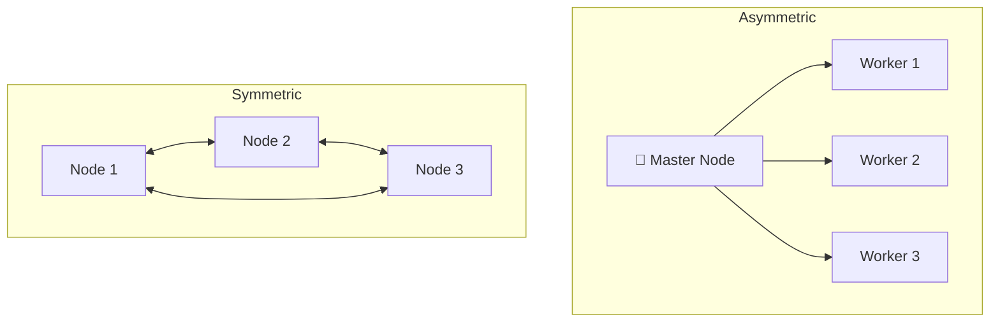
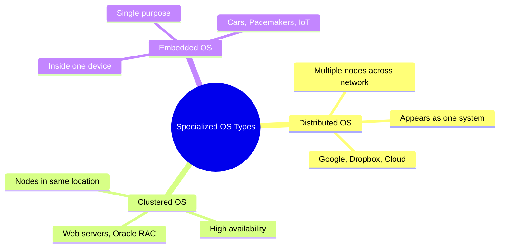

# Distributed, Clustered & Embedded Operating Systems

> **One-line summary:**
> **Distributed OS** connects many computers into one unified system across a network. **Clustered OS** groups nearby machines for high availability. **Embedded OS** is a tiny, purpose-built OS living inside a specific device.

---

## Table of Contents

1. [Distributed Operating Systems](#1-distributed-operating-systems)
2. [Clustered Operating Systems](#2-clustered-operating-systems)
3. [Embedded Operating Systems](#3-embedded-operating-systems)
4. [Comparison: Distributed vs Clustered vs Embedded](#4-comparison-distributed-vs-clustered-vs-embedded)
5. [When to Use Which](#5-when-to-use-which)
6. [Key Takeaways](#6-key-takeaways)

---

## 1. Distributed Operating Systems

> Like a **group project** where each team member works on their own computer, but all share files through cloud storage. Everyone contributes, but the whole thing looks like one project to anyone reading it.

A **distributed OS** manages multiple independent computers (**nodes**) connected over a network so that they **appear as a single unified system** to the user.

The key feature is **transparency** — you don't know (or care) which physical machine is handling your task.

### Key Characteristics

| Property          | Detail                                                   |
| ----------------- | -------------------------------------------------------- |
| Resource sharing  | CPU, memory, storage shared across all nodes             |
| Transparency      | Looks like one computer to the user                      |
| Fault tolerance   | If one node fails, others take over automatically        |
| Task distribution | OS decides which machine handles each task based on load |

### How It Works

```
User sends a task
        ↓
Distributed OS decides which node handles it
        ↓
  ┌─────────────┬────────────────┬─────────────┐
  │   Node A    │     Node B     │   Node C    │
  │ (Server 1)  │  (Server 2)   │ (Server 3)  │
  └─────────────┴────────────────┴─────────────┘
        ↓
Result returned to user as if from one machine
```

### Advantages & Disadvantages

| Advantages                                          | Disadvantages                                                |
| --------------------------------------------------- | ------------------------------------------------------------ |
| Scalable — add more nodes without disruption        | Very complex coordination logic                              |
| Reliable — single node failure doesn't crash system | Performance depends heavily on network speed                 |
| Balanced load across machines                       | More access points = more security vulnerabilities           |
| Faster processing via parallel nodes                | Apps must be specially designed for distributed environments |

### Real-World Examples

| Example                | How it uses a distributed OS                                            |
| ---------------------- | ----------------------------------------------------------------------- |
| Google Search          | Billions of queries handled by thousands of servers working as one      |
| Dropbox / Google Drive | Files stored across multiple servers worldwide for speed and redundancy |
| SETI@home              | Volunteers' computers worldwide analyze radio signals together          |

---

## 2. Clustered Operating Systems

> Like a **team of chefs in a restaurant kitchen** — each chef can work independently, but they coordinate to prepare meals faster. If one chef takes a break, others cover without any delay to the customers.

A **clustered OS** manages a **group of computers (a cluster)** in the same physical location, connected by high-speed networks. The primary goal is **high availability** and **performance** — if one node fails, others take over instantly.

### Types of Clusters

| Type           | How it works                                                 | Best for                    |
| -------------- | ------------------------------------------------------------ | --------------------------- |
| **Asymmetric** | One master controls worker nodes; assigns and monitors tasks | Simpler workloads           |
| **Symmetric**  | All nodes are equal; monitor each other; auto-failover       | Better resource utilization |
| **Parallel**   | Multiple nodes work on the same task simultaneously          | Computationally heavy tasks |



### Key Features

| Feature           | Detail                                                               |
| ----------------- | -------------------------------------------------------------------- |
| High availability | If one node fails, services continue with no interruption            |
| Load balancing    | Work distributed evenly so no single node is overloaded              |
| Shared storage    | All nodes access the same data — ensures consistency during failover |

### Advantages & Disadvantages

| Advantages                                           | Disadvantages                                            |
| ---------------------------------------------------- | -------------------------------------------------------- |
| Near-zero downtime even during hardware failure      | Complex monitoring and coordination management           |
| Faster processing via parallel nodes                 | Constant node communication creates network overhead     |
| Cheaper than one giant supercomputer                 | High-speed networking equipment adds upfront cost        |
| Repair/update individual nodes without full shutdown | Asymmetric clustering: master node failure = full outage |

### Real-World Examples

| Example                 | How it uses clustering                                                       |
| ----------------------- | ---------------------------------------------------------------------------- |
| Web hosting             | If one server fails, others handle traffic — site stays online 24/7          |
| Oracle RAC              | Handles thousands of simultaneous database queries across multiple nodes     |
| Stock trading platforms | Processes millions of transactions per second with no tolerance for downtime |

---

## 3. Embedded Operating Systems

> Like the **brain inside your microwave** — it only knows how to run a microwave. It doesn't browse the web or play music. It does one job perfectly, with minimal power and memory.

An **embedded OS** is a specialized, lightweight OS **built directly into a device** to perform one dedicated function. It's optimized for **limited resources** (tiny memory, low power, minimal CPU) and is hidden from the user.

### Characteristics

| Property              | Detail                                                             |
| --------------------- | ------------------------------------------------------------------ |
| Resource efficiency   | Runs on devices with very limited memory and processing power      |
| Real-time capability  | Many embedded systems must respond within strict time limits       |
| Single-purpose design | OS tailored for specific hardware — more efficient than general OS |
| Hidden from user      | User interacts with the device, not the OS                         |

### Types of Embedded OS

| Type                | Description                             | Examples                                   |
| ------------------- | --------------------------------------- | ------------------------------------------ |
| Real-Time Embedded  | Timing is critical                      | Airbag controllers, pacemakers, ABS brakes |
| Standalone Embedded | Works independently, no network needed  | Digital cameras, MP3 players, microwaves   |
| Network Embedded    | Connected to networks for communication | Routers, smart TVs, IoT devices            |

### Advantages & Disadvantages

| Advantages                            | Disadvantages                                               |
| ------------------------------------- | ----------------------------------------------------------- |
| Tiny size — runs on minimal hardware  | Cannot perform tasks beyond designed purpose                |
| Very low power consumption            | Hard to upgrade — software often hardwired into device      |
| Extremely reliable for specific tasks | Adding new features may need hardware changes               |
| Fast boot — starts almost instantly   | Requires specialized hardware + software development skills |
| Predictable, consistent behavior      |                                                             |

### Real-World Examples

| Device                   | What the embedded OS does                                                 |
| ------------------------ | ------------------------------------------------------------------------- |
| Smartphone               | Separate embedded systems for camera, battery charging, touchscreen       |
| Modern car               | Dozens of embedded systems: ABS, airbags, engine management, infotainment |
| Pacemaker / insulin pump | Monitors patient data and responds in real-time                           |
| Smart thermostat         | Reads temperature, controls HVAC, syncs over Wi-Fi                        |

---

## 4. Comparison: Distributed vs Clustered vs Embedded

| Feature            | Distributed OS                  | Clustered OS                    | Embedded OS                  |
| ------------------ | ------------------------------- | ------------------------------- | ---------------------------- |
| Primary goal       | Resource sharing across network | High availability & performance | Dedicated task execution     |
| Location           | Geographically dispersed        | Usually same physical location  | Inside a single device       |
| Transparency       | Appears as one system to users  | May be visible to admins        | Completely hidden from users |
| Resource size      | Large-scale (many servers)      | Medium to large                 | Minimal (KB to MB)           |
| Fault tolerance    | High                            | Very high                       | Moderate to high             |
| Complexity         | Very high                       | High                            | Low to moderate              |
| Network dependency | Critical                        | Important                       | Optional                     |
| Example use        | Google Search, Cloud storage    | Web servers, databases          | Smartwatches, IoT, cars      |



---

## 5. When to Use Which

| Scenario                                                   | Best choice             |
| ---------------------------------------------------------- | ----------------------- |
| Share resources across global locations, massive workloads | Distributed OS          |
| Eliminate downtime, critical 24/7 availability             | Clustered OS            |
| Build a dedicated device with limited resources            | Embedded OS             |
| Combine both — e.g., global service with regional clusters | Distributed + Clustered |

> A global web service might use **multiple clusters distributed across different geographic regions** — each cluster provides high local availability, while the distributed architecture serves users worldwide. Both can work together.

---

## 6. Key Takeaways

- **Distributed OS**: many computers across a network appearing as one system — goal is **resource sharing and scalability** (Google, cloud storage).
- **Clustered OS**: many computers in the same location working as a team — goal is **high availability and zero downtime** (web servers, databases).
- **Embedded OS**: a tiny, purpose-built OS inside a device — goal is **dedicated, efficient, reliable execution** (cars, pacemakers, IoT).
- Distributed and clustered can combine — clusters distributed globally is a common real-world pattern.
- Not all embedded systems are real-time — a camera doesn't have hard time constraints, but an airbag controller does.
- Distributed systems are overkill for simple tasks — complexity and network overhead outweigh benefits at small scale.
