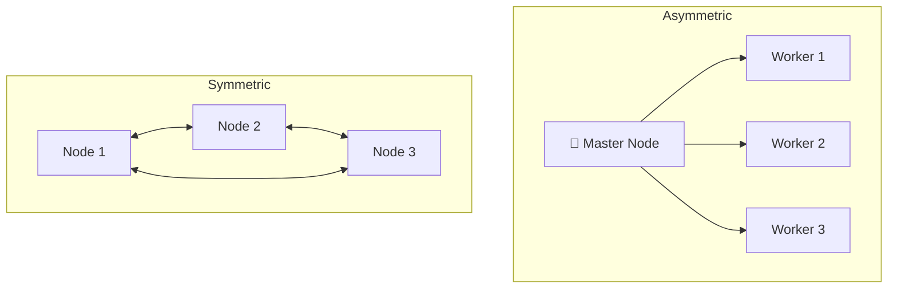
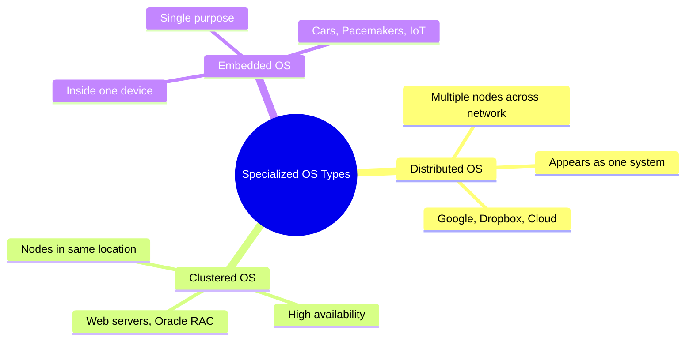

# Distributed, Clustered & Embedded Operating Systems

> **One-line summary:**
> **Distributed OS** connects many computers into one unified system across a network. **Clustered OS** groups nearby machines for high availability. **Embedded OS** is a tiny, purpose-built OS living inside a specific device.

---

## Table of Contents

1. [Distributed Operating Systems](#1-distributed-operating-systems)
2. [Clustered Operating Systems](#2-clustered-operating-systems)
3. [Embedded Operating Systems](#3-embedded-operating-systems)
4. [Comparison: Distributed vs Clustered vs Embedded](#4-comparison-distributed-vs-clustered-vs-embedded)
5. [When to Use Which](#5-when-to-use-which)
6. [Key Takeaways](#6-key-takeaways)

---

## 1. Distributed Operating Systems

> Like a **group project** where each team member works on their own computer, but all share files through cloud storage. Everyone contributes, but the whole thing looks like one project to anyone reading it.

A **distributed OS** manages multiple independent computers (**nodes**) connected over a network so that they **appear as a single unified system** to the user.

The key feature is **transparency** — you don't know (or care) which physical machine is handling your task.

### Key Characteristics

| Property          | Detail                                                   |
| ----------------- | -------------------------------------------------------- |
| Resource sharing  | CPU, memory, storage shared across all nodes             |
| Transparency      | Looks like one computer to the user                      |
| Fault tolerance   | If one node fails, others take over automatically        |
| Task distribution | OS decides which machine handles each task based on load |

### How It Works

```
User sends a task
        ↓
Distributed OS decides which node handles it
        ↓
  ┌─────────────┬────────────────┬─────────────┐
  │   Node A    │     Node B     │   Node C    │
  │ (Server 1)  │  (Server 2)   │ (Server 3)  │
  └─────────────┴────────────────┴─────────────┘
        ↓
Result returned to user as if from one machine
```

### Advantages & Disadvantages

| Advantages                                          | Disadvantages                                                |
| --------------------------------------------------- | ------------------------------------------------------------ |
| Scalable — add more nodes without disruption        | Very complex coordination logic                              |
| Reliable — single node failure doesn't crash system | Performance depends heavily on network speed                 |
| Balanced load across machines                       | More access points = more security vulnerabilities           |
| Faster processing via parallel nodes                | Apps must be specially designed for distributed environments |

### Real-World Examples

| Example                | How it uses a distributed OS                                            |
| ---------------------- | ----------------------------------------------------------------------- |
| Google Search          | Billions of queries handled by thousands of servers working as one      |
| Dropbox / Google Drive | Files stored across multiple servers worldwide for speed and redundancy |
| SETI@home              | Volunteers' computers worldwide analyze radio signals together          |

---

## 2. Clustered Operating Systems

> Like a **team of chefs in a restaurant kitchen** — each chef can work independently, but they coordinate to prepare meals faster. If one chef takes a break, others cover without any delay to the customers.

A **clustered OS** manages a **group of computers (a cluster)** in the same physical location, connected by high-speed networks. The primary goal is **high availability** and **performance** — if one node fails, others take over instantly.

### Types of Clusters

| Type           | How it works                                                 | Best for                    |
| -------------- | ------------------------------------------------------------ | --------------------------- |
| **Asymmetric** | One master controls worker nodes; assigns and monitors tasks | Simpler workloads           |
| **Symmetric**  | All nodes are equal; monitor each other; auto-failover       | Better resource utilization |
| **Parallel**   | Multiple nodes work on the same task simultaneously          | Computationally heavy tasks |



### Key Features

| Feature           | Detail                                                               |
| ----------------- | -------------------------------------------------------------------- |
| High availability | If one node fails, services continue with no interruption            |
| Load balancing    | Work distributed evenly so no single node is overloaded              |
| Shared storage    | All nodes access the same data — ensures consistency during failover |

### Advantages & Disadvantages

| Advantages                                           | Disadvantages                                            |
| ---------------------------------------------------- | -------------------------------------------------------- |
| Near-zero downtime even during hardware failure      | Complex monitoring and coordination management           |
| Faster processing via parallel nodes                 | Constant node communication creates network overhead     |
| Cheaper than one giant supercomputer                 | High-speed networking equipment adds upfront cost        |
| Repair/update individual nodes without full shutdown | Asymmetric clustering: master node failure = full outage |

### Real-World Examples

| Example                 | How it uses clustering                                                       |
| ----------------------- | ---------------------------------------------------------------------------- |
| Web hosting             | If one server fails, others handle traffic — site stays online 24/7          |
| Oracle RAC              | Handles thousands of simultaneous database queries across multiple nodes     |
| Stock trading platforms | Processes millions of transactions per second with no tolerance for downtime |

---

## 3. Embedded Operating Systems

> Like the **brain inside your microwave** — it only knows how to run a microwave. It doesn't browse the web or play music. It does one job perfectly, with minimal power and memory.

An **embedded OS** is a specialized, lightweight OS **built directly into a device** to perform one dedicated function. It's optimized for **limited resources** (tiny memory, low power, minimal CPU) and is hidden from the user.

### Characteristics

| Property              | Detail                                                             |
| --------------------- | ------------------------------------------------------------------ |
| Resource efficiency   | Runs on devices with very limited memory and processing power      |
| Real-time capability  | Many embedded systems must respond within strict time limits       |
| Single-purpose design | OS tailored for specific hardware — more efficient than general OS |
| Hidden from user      | User interacts with the device, not the OS                         |

### Types of Embedded OS

| Type                | Description                             | Examples                                   |
| ------------------- | --------------------------------------- | ------------------------------------------ |
| Real-Time Embedded  | Timing is critical                      | Airbag controllers, pacemakers, ABS brakes |
| Standalone Embedded | Works independently, no network needed  | Digital cameras, MP3 players, microwaves   |
| Network Embedded    | Connected to networks for communication | Routers, smart TVs, IoT devices            |

### Advantages & Disadvantages

| Advantages                            | Disadvantages                                               |
| ------------------------------------- | ----------------------------------------------------------- |
| Tiny size — runs on minimal hardware  | Cannot perform tasks beyond designed purpose                |
| Very low power consumption            | Hard to upgrade — software often hardwired into device      |
| Extremely reliable for specific tasks | Adding new features may need hardware changes               |
| Fast boot — starts almost instantly   | Requires specialized hardware + software development skills |
| Predictable, consistent behavior      |                                                             |

### Real-World Examples

| Device                   | What the embedded OS does                                                 |
| ------------------------ | ------------------------------------------------------------------------- |
| Smartphone               | Separate embedded systems for camera, battery charging, touchscreen       |
| Modern car               | Dozens of embedded systems: ABS, airbags, engine management, infotainment |
| Pacemaker / insulin pump | Monitors patient data and responds in real-time                           |
| Smart thermostat         | Reads temperature, controls HVAC, syncs over Wi-Fi                        |

---

## 4. Comparison: Distributed vs Clustered vs Embedded

| Feature            | Distributed OS                  | Clustered OS                    | Embedded OS                  |
| ------------------ | ------------------------------- | ------------------------------- | ---------------------------- |
| Primary goal       | Resource sharing across network | High availability & performance | Dedicated task execution     |
| Location           | Geographically dispersed        | Usually same physical location  | Inside a single device       |
| Transparency       | Appears as one system to users  | May be visible to admins        | Completely hidden from users |
| Resource size      | Large-scale (many servers)      | Medium to large                 | Minimal (KB to MB)           |
| Fault tolerance    | High                            | Very high                       | Moderate to high             |
| Complexity         | Very high                       | High                            | Low to moderate              |
| Network dependency | Critical                        | Important                       | Optional                     |
| Example use        | Google Search, Cloud storage    | Web servers, databases          | Smartwatches, IoT, cars      |



---

## 5. When to Use Which

| Scenario                                                   | Best choice             |
| ---------------------------------------------------------- | ----------------------- |
| Share resources across global locations, massive workloads | Distributed OS          |
| Eliminate downtime, critical 24/7 availability             | Clustered OS            |
| Build a dedicated device with limited resources            | Embedded OS             |
| Combine both — e.g., global service with regional clusters | Distributed + Clustered |

> A global web service might use **multiple clusters distributed across different geographic regions** — each cluster provides high local availability, while the distributed architecture serves users worldwide. Both can work together.

---

## 5. Code Examples

> Working code that demonstrates a distributed task scheduler across nodes in practice.

### C++ — Simple Version

Simulate a distributed OS task scheduler that assigns tasks to the least-loaded node that has enough capacity.

```cpp
// Distributed OS: Simple demonstration
// Shows: A distributed task scheduler assigning tasks across nodes by load and capacity
// Compile: g++ -std=c++17 06_distributed_os.cpp -o out

#include <iostream>
#include <vector>
#include <algorithm>
#include <string>
using namespace std;

// A task submitted to the distributed system
struct Task {
    string name;
    int    workload;   // How much load this task adds to a node
};

// A node (independent computer) in the distributed system
struct Node {
    int            id;
    string         location;      // Geographic location e.g. "US-East"
    int            capacity;      // Maximum workload this node can handle
    int            currentLoad;   // Current total workload assigned
    vector<string> tasks;         // Names of tasks assigned

    Node(int i, string loc, int cap)
        : id(i), location(loc), capacity(cap), currentLoad(0) {}

    bool canAccept(int workload) const {
        return currentLoad + workload <= capacity;
    }

    void assign(const Task& task) {
        tasks.push_back(task.name);
        currentLoad += task.workload;
        int pct = capacity > 0 ? 100 * currentLoad / capacity : 0;
        cout << "  [Node " << id << " | " << location << "] "
             << "Accepted: " << task.name
             << " | Load: " << currentLoad << "/" << capacity
             << " (" << pct << "%)\n";
    }
};

// Distributed OS scheduler: assign each task to the least-loaded node with capacity
void distributedSchedule(vector<Node>& nodes, const vector<Task>& tasks) {
    cout << "\n--- Distributed Task Scheduler ---\n";

    for (const auto& task : tasks) {
        // Find least-loaded node that can still take this task
        Node* best = nullptr;
        for (auto& node : nodes) {
            if (node.canAccept(task.workload)) {
                if (!best || node.currentLoad < best->currentLoad)
                    best = &node;
            }
        }

        if (best) {
            best->assign(task);
        } else {
            cout << "  [REJECTED] " << task.name
                 << " — no node has capacity for workload=" << task.workload << "!\n";
        }
    }
}

void printStatus(const vector<Node>& nodes) {
    cout << "\n--- Final Node Status ---\n";
    for (const auto& node : nodes) {
        int pct = node.capacity > 0 ? 100 * node.currentLoad / node.capacity : 0;
        cout << "  Node " << node.id << " [" << node.location << "] "
             << "Load: " << node.currentLoad << "/" << node.capacity
             << " (" << pct << "%) | Tasks: ";
        for (const auto& t : node.tasks) cout << t << " ";
        cout << "\n";
    }
}

int main() {
    // Three nodes in different geographic locations
    vector<Node> nodes = {
        Node(1, "US-East",  100),
        Node(2, "EU-West",  80),
        Node(3, "Asia-Pac", 90),
    };

    // Tasks submitted by users from anywhere in the world
    vector<Task> tasks = {
        {"WebRequest_A", 30},
        {"DBQuery_B",    50},
        {"FileUpload_C", 40},
        {"VideoRender_D",70},
        {"EmailBatch_E", 20},
        {"HeavyJob_F",   95},   // Likely rejected — no single node has that free capacity
    };

    distributedSchedule(nodes, tasks);
    printStatus(nodes);

    return 0;
}
```

### C++ — Medium / LeetCode Style

Given N tasks and K nodes with capacity constraints, assign tasks to minimize max utilization using a min-heap. Report rejected tasks.

```cpp
// Distributed OS: Optimized / LeetCode-style
// Problem: Given N tasks with workloads and K nodes with capacities, assign tasks to
//          minimize maximum node utilization. Report which tasks are rejected.
// Complexity: O(N log K) time with priority queue, O(N + K) space

#include <iostream>
#include <vector>
#include <queue>
#include <string>
using namespace std;

struct Task { string name; int workload; };
struct Node { int id, capacity, load = 0; };

void distributedLB(const vector<Task>& tasks, vector<Node>& nodes) {
    // Min-heap sorted by current load (least-loaded node on top)
    auto cmp = [](const Node* a, const Node* b){ return a->load > b->load; };
    priority_queue<Node*, vector<Node*>, decltype(cmp)> pq(cmp);
    for (auto& n : nodes) pq.push(&n);

    cout << "=== Distributed Task Assignment ===\n";
    for (const auto& t : tasks) {
        vector<Node*> tried;
        bool assigned = false;

        while (!pq.empty()) {
            Node* n = pq.top(); pq.pop();
            if (n->load + t.workload <= n->capacity) {
                n->load += t.workload;
                cout << t.name << " -> Node " << n->id
                     << " (load=" << n->load << "/" << n->capacity << ")\n";
                pq.push(n);
                assigned = true;
                break;
            }
            tried.push_back(n);
        }

        for (Node* n : tried) pq.push(n);

        if (!assigned)
            cout << t.name << " -> REJECTED (no capacity)\n";
    }
}

int main() {
    vector<Node> nodes = {{1,100},{2,80},{3,90}};
    vector<Task> tasks = {
        {"Web_A",30},{"DB_B",50},{"Upload_C",40},
        {"Video_D",70},{"Email_E",20},{"Heavy_F",95}
    };

    distributedLB(tasks, nodes);

    cout << "\n=== Final Node Utilization ===\n";
    for (const auto& n : nodes)
        cout << "  Node " << n.id << ": " << n.load << "/" << n.capacity
             << " (" << 100 * n.load / n.capacity << "%)\n";

    return 0;
}
```

### Python — Simple Version

Simulate a distributed OS that routes tasks to the best available node based on load and capacity.

```python
# Distributed OS: Simple demonstration
# Shows: Assigning tasks across distributed nodes by load balancing and capacity checks
# Run: python3 06_distributed_os.py


class Task:
    def __init__(self, name, workload):
        self.name     = name
        self.workload = workload   # Load units this task adds to a node


class Node:
    def __init__(self, node_id, location, capacity):
        self.node_id      = node_id
        self.location     = location    # Geographic location e.g. "US-East"
        self.capacity     = capacity    # Maximum load this node can handle
        self.current_load = 0
        self.tasks        = []          # Names of tasks assigned here

    def can_accept(self, workload):
        # Check if this node has room for the additional workload
        return self.current_load + workload <= self.capacity

    def assign(self, task):
        self.tasks.append(task.name)
        self.current_load += task.workload
        pct = 100 * self.current_load // self.capacity
        print(f"  [Node {self.node_id} | {self.location}] "
              f"Accepted: {task.name} | "
              f"Load: {self.current_load}/{self.capacity} ({pct}%)")


def distributed_schedule(nodes, tasks):
    """Route each task to the least-loaded node that still has capacity."""
    print("\n--- Distributed Task Scheduler ---")

    for task in tasks:
        # Only consider nodes that have enough free capacity
        candidates = [n for n in nodes if n.can_accept(task.workload)]

        if candidates:
            # Pick the one with the least current load
            best_node = min(candidates, key=lambda n: n.current_load)
            best_node.assign(task)
        else:
            print(f"  [REJECTED] {task.name} — "
                  f"no node has capacity for workload={task.workload}!")


def print_status(nodes):
    print("\n--- Final Node Status ---")
    for node in nodes:
        pct = 100 * node.current_load // node.capacity
        print(f"  Node {node.node_id} [{node.location}] "
              f"Load: {node.current_load}/{node.capacity} ({pct}%) | "
              f"Tasks: {node.tasks}")


def main():
    nodes = [
        Node(1, "US-East",  capacity=100),
        Node(2, "EU-West",  capacity=80),
        Node(3, "Asia-Pac", capacity=90),
    ]

    tasks = [
        Task("WebRequest_A", 30),
        Task("DBQuery_B",    50),
        Task("FileUpload_C", 40),
        Task("VideoRender_D",70),
        Task("EmailBatch_E", 20),
        Task("HeavyJob_F",   95),   # Will likely be rejected
    ]

    distributed_schedule(nodes, tasks)
    print_status(nodes)


if __name__ == "__main__":
    main()
```

### Python — Medium Level

Implement distributed load balancing with a min-heap for O(N log K) assignment, then produce a utilization report.

```python
# Distributed OS: Optimized / Pythonic
# Problem: Given N tasks and K nodes with capacity constraints, assign tasks to
#          minimize maximum node utilization. Report rejections and final utilization.
# Complexity: O(N log K) time with heapq, O(K) space

import heapq
from dataclasses import dataclass, field
from typing import List


@dataclass
class Task:
    name:     str
    workload: int


@dataclass(order=True)
class Node:
    load:     int           # Used for heap ordering (min-heap)
    node_id:  int = field(compare=False)
    capacity: int = field(compare=False)
    tasks:    List[str] = field(default_factory=list, compare=False)


def distributed_lb(tasks: List[Task], nodes: List[Node]) -> List[str]:
    """Assign tasks to nodes minimizing max load. Returns names of rejected tasks."""
    heap = list(nodes)
    heapq.heapify(heap)
    rejected = []

    for t in tasks:
        candidates = []
        assigned = False

        while heap:
            n = heapq.heappop(heap)
            if n.load + t.workload <= n.capacity:
                n.load += t.workload
                n.tasks.append(t.name)
                heapq.heappush(heap, n)
                print(f"  {t.name} -> Node {n.node_id} "
                      f"(load={n.load}/{n.capacity})")
                assigned = True
                break
            candidates.append(n)

        for n in candidates:
            heapq.heappush(heap, n)

        if not assigned:
            rejected.append(t.name)
            print(f"  {t.name} -> REJECTED")

    return rejected


if __name__ == "__main__":
    nodes = [Node(0, 1, 100), Node(0, 2, 80), Node(0, 3, 90)]
    tasks = [
        Task("Web_A", 30), Task("DB_B", 50), Task("Upload_C", 40),
        Task("Video_D", 70), Task("Email_E", 20), Task("Heavy_F", 95),
    ]

    print("=== Distributed Load Balancing ===")
    rejected = distributed_lb(tasks, nodes)

    print("\n=== Final Node Utilization ===")
    for n in sorted(nodes, key=lambda x: x.node_id):
        pct = 100 * n.load // n.capacity
        print(f"  Node {n.node_id}: {n.load}/{n.capacity} ({pct}%) -> {n.tasks}")

    if rejected:
        print(f"\nRejected tasks: {rejected}")
```

---

## 6. Key Takeaways

- **Distributed OS**: many computers across a network appearing as one system — goal is **resource sharing and scalability** (Google, cloud storage).
- **Clustered OS**: many computers in the same location working as a team — goal is **high availability and zero downtime** (web servers, databases).
- **Embedded OS**: a tiny, purpose-built OS inside a device — goal is **dedicated, efficient, reliable execution** (cars, pacemakers, IoT).
- Distributed and clustered can combine — clusters distributed globally is a common real-world pattern.
- Not all embedded systems are real-time — a camera doesn't have hard time constraints, but an airbag controller does.
- Distributed systems are overkill for simple tasks — complexity and network overhead outweigh benefits at small scale.
