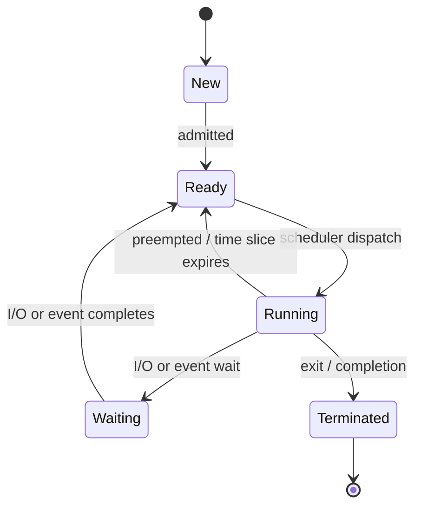

# Process States in OS: Process Concept Explained

> **One-line summary:**
> A process is a program actively running in memory. It moves through five states — **New → Ready → Running → Waiting → Terminated** — managed by the OS to maximize CPU efficiency and multitasking.

---

## Table of Contents

1. [What is a Process?](#1-what-is-a-process)
2. [Components of a Process](#2-components-of-a-process)
3. [Process vs Program: Quick Recap](#3-process-vs-program-quick-recap)
4. [The Five Process States](#4-the-five-process-states)
5. [State Transitions](#5-state-transitions)
6. [State Transition Diagram](#6-state-transition-diagram)
7. [Practical Example: Text Editor Process](#7-practical-example-text-editor-process)
8. [Why Process States Matter](#8-why-process-states-matter)
9. [Common Misconceptions](#9-common-misconceptions)
10. [Key Takeaways](#10-key-takeaways)

---

## 1. What is a Process?

A **process** is a program in execution — the active, living instance of a program loaded into memory with all its resources.

> Like a **recipe vs actually cooking**. The recipe book on your shelf is the program — just instructions, doing nothing. When you start following it with real ingredients and utensils, that's the process — the recipe has come to life.

When you launch an application, the OS:

1. Loads the program from disk into memory
2. Allocates CPU time, memory space, and other resources
3. Creates a **process** to manage execution

---

## 2. Components of a Process

| Component           | What it holds                                                       | Analogy                          |
| ------------------- | ------------------------------------------------------------------- | -------------------------------- |
| **Code (Text)**     | The actual instructions to be executed                              | The recipe steps                 |
| **Program Counter** | Tracks which instruction executes next                              | Your finger pointing at the step |
| **Stack**           | Temporary data — function params, local variables, return addresses | Your notepad of in-progress work |
| **Data Section**    | Global variables                                                    | Constants you reference often    |
| **Heap**            | Dynamically allocated memory during runtime                         | Extra bowls grabbed as needed    |

```
┌────────────────────────────┐  ← High address
│          Stack             │  ← Grows downward (function calls, local vars)
│            ↓               │
│                            │
│            ↑               │
│           Heap             │  ← Grows upward (dynamic allocations)
├────────────────────────────┤
│        Data Section        │  ← Global/static variables
├────────────────────────────┤
│     Code (Text Section)    │  ← Program instructions
└────────────────────────────┘  ← Low address
```

---

## 3. Process vs Program: Quick Recap

| Aspect             | Program                 | Process                     |
| ------------------ | ----------------------- | --------------------------- |
| Nature             | Passive entity          | Active entity               |
| Location           | Stored on disk          | Loaded in memory            |
| Lifespan           | Permanent until deleted | Temporary during execution  |
| Resources          | None allocated          | CPU, memory, I/O allocated  |
| Multiple instances | Single copy (file)      | Multiple processes possible |

> Opening three browser windows = **one program**, **three processes** — each with its own memory space and execution state.

---

## 4. The Five Process States

A process moves through five states during its lifetime. The OS manages every transition to ensure efficient CPU use and smooth multitasking.

---

### State 1: New

The process has just been **created**. The OS is setting up memory, allocating resources, and preparing the execution environment. The process is not yet eligible to run.

> Like a **flight scheduled but not yet cleared for takeoff** — it exists in the system, but isn't active on the runway yet.

---

### State 2: Ready

The process is **fully prepared to execute** and is waiting in the **ready queue** for the CPU to be assigned to it.

> Like **students with their hands raised** — all prepared to answer, but only one gets called at a time.

- Multiple processes can be in Ready simultaneously
- The **CPU scheduler** picks which one runs next based on the scheduling algorithm

---

### State 3: Running

The CPU scheduler has **assigned the CPU** to this process — it is now **actively executing instructions**.

> Like the student who was called on — they are now speaking.

- On a single-core CPU: only **one process** can be Running at any instant
- On multi-core: one process per core can run simultaneously
- A running process continues until: it completes, needs I/O, or is interrupted

---

### State 4: Waiting (Blocked)

The process is **waiting for an external event** — disk I/O, user input, network response — and cannot continue until it arrives.

> Like **waiting for food delivery** — you can't eat until it arrives, so you do nothing in the meantime.

- The process **voluntarily gives up the CPU**
- CPU is freed for other ready processes
- Once the event occurs, it moves back to **Ready** (not directly to Running)

---

### State 5: Terminated (Exit)

The process has **finished execution** (or was killed). The OS hasn't yet fully cleaned up its resources.

> Like **checking out from a hotel** — you've decided to leave, but the hotel still needs to process checkout, clean the room, and update records before it's truly done.

- After cleanup: memory freed, files closed, process removed from OS tables

---

## 5. State Transitions

Every transition has a specific trigger:

| Transition               | Trigger                                                            |
| ------------------------ | ------------------------------------------------------------------ |
| **New → Ready**          | OS finishes process creation and admits it to the ready queue      |
| **Ready → Running**      | CPU scheduler selects this process and assigns it the CPU          |
| **Running → Waiting**    | Process requests I/O or waits for an event (voluntary)             |
| **Waiting → Ready**      | The awaited I/O or event completes — process is eligible again     |
| **Running → Ready**      | Preemption — time slice expires or higher-priority process arrives |
| **Running → Terminated** | Process completes normally or is killed due to error               |

> Key rule: **Waiting → Ready**, never Waiting → Running directly. The process must re-enter the queue and wait for the scheduler again.

---

## 6. State Transition Diagram

```
        ┌─────────────────────────────────────────────────────────┐
        │                                                         │
        ▼                                                         │
     ┌─────┐   admitted    ┌───────┐  scheduler   ┌─────────┐   │ preempted
     │ NEW │ ────────────► │ READY │ ────────────► │ RUNNING │ ──┘
     └─────┘               └───────┘  dispatch     └─────────┘
                               ▲                       │   │
                               │  I/O or event         │   │ exit
                               │  completes            │   ▼
                               │                   ┌─────────┐    ┌────────────┐
                               └────────────────── │ WAITING │    │ TERMINATED │
                                                   └─────────┘    └────────────┘
                                                 (I/O or event wait)
```



---

## 7. Practical Example: Text Editor Process

Tracing a single session of opening and using a text editor:

| Step                          | State               | What's happening                                |
| ----------------------------- | ------------------- | ----------------------------------------------- |
| Double-click text editor icon | **New**             | OS creates process, allocates memory            |
| Setup complete                | **Ready**           | Waiting in queue for CPU                        |
| Scheduler picks it            | **Running**         | App window appears on screen                    |
| Click "Open File"             | **Waiting**         | Process requests disk I/O — waits for file data |
| File data arrives from disk   | **Ready**           | Back in queue, waiting for CPU                  |
| Scheduler picks it again      | **Running**         | File contents displayed in editor               |
| You type text                 | **Running**         | Process executes continuously as you edit       |
| Click "Save"                  | **Waiting**         | Writes to disk — waits for I/O to complete      |
| Save finishes                 | **Ready → Running** | Shows "Save successful" message                 |
| You close the editor          | **Terminated**      | Cleanup begins — memory freed, files closed     |

---

## 8. Why Process States Matter

### Efficient Resource Utilization

When a process enters Waiting (e.g., reading from disk), the CPU would otherwise sit idle. Instead, the OS runs another Ready process — just like a chef who starts another dish while one bakes in the oven.

### Multitasking Capability

Rapid transitions between Running and Ready create the **illusion of simultaneous execution** on single-core CPUs. This is how you listen to music, browse, and edit a document "at the same time."

### System Responsiveness

Preemption (Running → Ready) lets high-priority processes cut in line, preventing one misbehaving or CPU-heavy program from freezing the entire system.

---

## 9. Common Misconceptions

| Misconception                        | Reality                                                                                                       |
| ------------------------------------ | ------------------------------------------------------------------------------------------------------------- |
| Waiting = Ready                      | Ready means "can run right now if given CPU." Waiting means "cannot run even with CPU — blocked on an event." |
| Only the running process has a state | Every process in the system is always in exactly one state simultaneously                                     |
| States are physical memory locations | States are logical labels — the process's code/data stays in the same memory regardless of state              |

---

## 9. Code Examples

> Working code that demonstrates process state transitions in practice.

### C++ — Simple Version

Process class with five states and guarded transition methods.

```cpp
#include <iostream>
#include <string>
using namespace std;

// The five process states from OS theory
enum State { NEW, READY, RUNNING, WAITING, TERMINATED };

string stateName(State s) {
    switch (s) {
        case NEW:        return "NEW";
        case READY:      return "READY";
        case RUNNING:    return "RUNNING";
        case WAITING:    return "WAITING";
        case TERMINATED: return "TERMINATED";
    }
    return "UNKNOWN";
}

struct Process {
    int    pid;
    string name;
    State  state;

    Process(int id, string n) : pid(id), name(n), state(NEW) {}

    void log(const string& from, const string& to, const string& why) {
        cout << "[PID " << pid << "] " << name << ": "
             << from << " -> " << to << " (" << why << ")\n";
    }

    // NEW -> READY: OS loads process into memory
    void admit() {
        if (state == NEW) { state = READY; log("NEW", "READY", "admitted"); }
    }

    // READY -> RUNNING: CPU dispatcher picks this process
    void dispatch() {
        if (state == READY) { state = RUNNING; log("READY", "RUNNING", "CPU assigned"); }
    }

    // RUNNING -> WAITING: process issued an I/O request
    void waitIO() {
        if (state == RUNNING) { state = WAITING; log("RUNNING", "WAITING", "I/O request"); }
    }

    // WAITING -> READY: I/O completed — back in the queue
    void ioComplete() {
        if (state == WAITING) { state = READY; log("WAITING", "READY", "I/O done"); }
    }

    // RUNNING -> READY: time slice expired, forced off CPU
    void preempt() {
        if (state == RUNNING) { state = READY; log("RUNNING", "READY", "preempted"); }
    }

    // RUNNING -> TERMINATED: process finished execution
    void finish() {
        if (state == RUNNING) { state = TERMINATED; log("RUNNING", "TERMINATED", "finished"); }
    }
};

int main() {
    Process p(101, "TextEditor");
    cout << "Start: " << stateName(p.state) << "\n\n";

    p.admit();       // OS loads it into memory
    p.dispatch();    // Scheduler picks it up
    p.waitIO();      // Process reads a file from disk
    p.ioComplete();  // Disk read finished
    p.dispatch();    // Gets CPU again
    p.preempt();     // Time slice expired
    p.dispatch();    // Back on CPU
    p.finish();      // Execution complete

    cout << "\nFinal: " << stateName(p.state) << "\n";
    return 0;
}
// Compile: g++ -std=c++17 process_states.cpp -o process_states
```

### C++ — Medium / LeetCode Style

Round-robin scheduler loop driving all five state transitions for multiple processes simultaneously.

```cpp
#include <iostream>
#include <queue>
#include <vector>
#include <string>
#include <algorithm>
using namespace std;

// Round-robin process scheduler
// Time: O(total_burst / quantum), Space: O(n)

struct Process {
    int    pid;
    string name;
    int    burst;      // total CPU time needed
    int    remaining;  // CPU time left
    string state;

    Process(int id, string n, int b)
        : pid(id), name(n), burst(b), remaining(b), state("READY") {}
};

int main() {
    vector<Process> procs = {
        {1, "Chrome",   5},
        {2, "VSCode",   3},
        {3, "Terminal", 4},
    };

    const int QUANTUM = 2;  // time slice in ms
    queue<int> readyQ;      // stores indices into procs
    int clock = 0;

    // Admit all: NEW -> READY
    for (int i = 0; i < (int)procs.size(); i++) {
        readyQ.push(i);
        cout << "t=0  PID " << procs[i].pid << " admitted -> READY\n";
    }

    cout << "\n--- Gantt Chart ---\n";

    while (!readyQ.empty()) {
        int idx = readyQ.front();
        readyQ.pop();
        Process& p = procs[idx];

        // READY -> RUNNING
        p.state = "RUNNING";
        int runFor = min(QUANTUM, p.remaining);
        cout << "t=" << clock << "  PID " << p.pid
             << " RUNNING (" << runFor << " units)\n";

        clock     += runFor;
        p.remaining -= runFor;

        if (p.remaining == 0) {
            // RUNNING -> TERMINATED
            p.state = "TERMINATED";
            cout << "t=" << clock << "  PID " << p.pid
                 << " TERMINATED (TAT=" << clock << ")\n";
        } else {
            // RUNNING -> READY (preempted by quantum)
            p.state = "READY";
            readyQ.push(idx);
            cout << "t=" << clock << "  PID " << p.pid
                 << " READY (" << p.remaining << " left)\n";
        }
    }

    cout << "\nAll processes terminated at t=" << clock << "\n";
    return 0;
}
// Compile: g++ -std=c++17 rr_scheduler.cpp -o rr_scheduler
```

### Python — Simple Version

Process with state validation — only legal transitions are allowed.

```python
# Process state machine with transition validation

class Process:
    # Each state lists the states it can legally move to
    VALID_NEXT = {
        "NEW":        {"READY"},
        "READY":      {"RUNNING"},
        "RUNNING":    {"WAITING", "READY", "TERMINATED"},
        "WAITING":    {"READY"},
        "TERMINATED": set()
    }

    def __init__(self, pid, name):
        self.pid   = pid
        self.name  = name
        self.state = "NEW"

    def transition(self, new_state):
        """Move to new_state only if the transition is valid."""
        if new_state in self.VALID_NEXT[self.state]:
            old = self.state
            self.state = new_state
            print(f"[PID {self.pid}] {self.name}: {old} -> {new_state}")
        else:
            print(f"[PID {self.pid}] BLOCKED: {self.state} -> {new_state} is not valid")


p = Process(101, "TextEditor")
print(f"Start: {p.state}\n")

p.transition("READY")       # OS admits to memory
p.transition("RUNNING")     # CPU dispatched
p.transition("WAITING")     # Needs disk I/O
p.transition("RUNNING")     # BLOCKED — WAITING must go to READY first
p.transition("READY")       # I/O done, re-enters queue
p.transition("RUNNING")     # CPU again
p.transition("TERMINATED")  # Execution complete

print(f"\nFinal: {p.state}")
```

### Python — Medium Level

Round-robin scheduler showing all transitions across multiple processes with turnaround time stats.

```python
from collections import deque
from dataclasses import dataclass, field

@dataclass
class Process:
    pid:   int
    name:  str
    burst: int
    remaining: int = field(init=False)
    state: str = "NEW"
    finish_time: int = 0

    def __post_init__(self):
        self.remaining = self.burst


def round_robin(processes: list["Process"], quantum: int = 2) -> None:
    """Round-robin scheduler with state transition log.
    Time: O(total_burst), Space: O(n)
    """
    ready: deque[Process] = deque()

    # Admit all: NEW -> READY
    for p in processes:
        p.state = "READY"
        ready.append(p)
        print(f"Admitted PID {p.pid} ({p.name}) -> READY")

    clock = 0
    print("\n--- Gantt Chart ---")

    while ready:
        p = ready.popleft()
        p.state = "RUNNING"
        run_for = min(quantum, p.remaining)
        print(f"t={clock:>3}  PID {p.pid} RUNNING ({run_for} units)")

        clock       += run_for
        p.remaining -= run_for

        if p.remaining == 0:
            p.state = "TERMINATED"
            p.finish_time = clock
            tat = clock  # arrival=0 for all in this example
            print(f"t={clock:>3}  PID {p.pid} TERMINATED  TAT={tat}")
        else:
            p.state = "READY"
            ready.append(p)
            print(f"t={clock:>3}  PID {p.pid} READY (preempted, {p.remaining} left)")

    print(f"\nAll done at t={clock}")


if __name__ == "__main__":
    jobs = [
        Process(1, "Chrome",   burst=5),
        Process(2, "VSCode",   burst=3),
        Process(3, "Terminal", burst=4),
    ]
    round_robin(jobs, quantum=2)
```

---

## 10. Key Takeaways

- A **process** = program actively running in memory with CPU, memory, and I/O resources allocated.
- Every process has five components: code section, program counter, stack, data section, heap.
- **Five states**: New → Ready → Running → Waiting → Terminated.
- **New**: being created. **Ready**: waiting for CPU. **Running**: using CPU. **Waiting**: blocked on I/O/event. **Terminated**: done, being cleaned up.
- Waiting → Ready (never directly to Running) — must re-queue.
- Running → Ready happens via **preemption** (time slice expiry or higher-priority process).
- Process states enable: CPU efficiency, multitasking, and system responsiveness.
- A process skips Waiting only if it never needs I/O — but always passes through New and Terminated.
