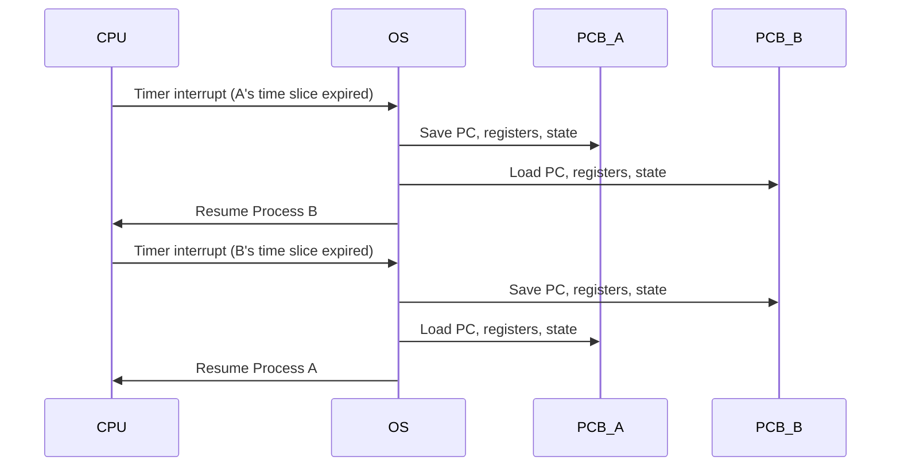

# Context Switching in Operating Systems: How It Works

> **One-line summary:**
> **Context switching** is when the OS saves the full state of the currently running process into its PCB, then loads the saved state of the next process — enabling multitasking on a single CPU.

---

## Table of Contents

1. [What is Context Switching?](#1-what-is-context-switching)
2. [Why is Context Switching Necessary?](#2-why-is-context-switching-necessary)
3. [When Does Context Switching Occur?](#3-when-does-context-switching-occur)
4. [What Happens During a Context Switch?](#4-what-happens-during-a-context-switch)
5. [Step-by-Step Example](#5-step-by-step-example)
6. [Context Switching Overhead](#6-context-switching-overhead)
7. [Context Switching vs Mode Switching](#7-context-switching-vs-mode-switching)
8. [Reducing Overhead](#8-reducing-overhead)
9. [Key Takeaways](#9-key-takeaways)

---

## 1. What is Context Switching?

**Context switching** is the mechanism where the CPU stops executing one process and starts executing another — while preserving the first process's exact state so it can resume later without any loss.

The **"context"** = all information the CPU needs to resume a process:

- Register values
- Program counter
- Process state
- Memory management info

All of this is stored in the process's **PCB** (Process Control Block).

> Like a **chef cooking multiple dishes** — they work on one dish, pause it at the right moment, switch to another, and return to the first one exactly where they left off. The PCB is their set of notes on each dish.

Without context switching, a CPU could only run **one program at a time**.

---

## 2. Why is Context Switching Necessary?

| Reason             | What it enables                                |
| ------------------ | ---------------------------------------------- |
| **Multitasking**   | Multiple apps run "simultaneously" on one CPU  |
| **Responsiveness** | No single process monopolizes the CPU          |
| **Resource use**   | CPU stays busy while one process waits for I/O |
| **Time-sharing**   | Every process gets fair access to CPU time     |

> Rapid context switching creates the **illusion of parallel execution** — the CPU actually runs only one process at any instant, but switches so fast users can't perceive the gaps.

---

## 3. When Does Context Switching Occur?

Context switching is triggered by specific events, not randomly:

| Trigger                             | What happens                                                           |
| ----------------------------------- | ---------------------------------------------------------------------- |
| **Time slice expires**              | Process used up its CPU quantum → scheduler switches to next process   |
| **Process waits for I/O**           | Process enters Waiting state → CPU switches to another Ready process   |
| **Higher-priority process arrives** | A higher-priority process becomes ready → current process is preempted |
| **Process voluntarily yields**      | Process calls `yield()` or blocks → OS switches to next ready process  |

---

## 4. What Happens During a Context Switch?

A context switch has two phases: **save** the current process, **load** the next process.

### Phase 1: Save the Current Process Context

The OS writes the following from CPU into **PCB of the current process**:

| What's saved           | Why it matters                                    |
| ---------------------- | ------------------------------------------------- |
| Program Counter (PC)   | Which instruction to execute next when it resumes |
| CPU registers          | All intermediate computation values in flight     |
| Process state          | Updated to "Ready" or "Waiting"                   |
| Memory management info | Page tables, memory limits                        |
| I/O status             | Open files, pending I/O requests                  |

### Phase 2: Load the Next Process Context

The OS reads from the **PCB of the next process** and loads it into the CPU:

- Program counter is restored → CPU jumps to where the process last stopped
- All registers are restored → computation resumes from the exact same values
- Process state updated to "Running"
- CPU begins executing the next process seamlessly

```
┌──────────────────────────────────────────────────────────┐
│                    CONTEXT SWITCH                        │
│                                                          │
│  CPU running Process A                                   │
│         ↓  [interrupt / time slice expired]              │
│  OS saves PC, registers, state → PCB_A                   │
│         ↓                                                │
│  OS loads PC, registers, state ← PCB_B                   │
│         ↓                                                │
│  CPU running Process B                                   │
└──────────────────────────────────────────────────────────┘
```

> During the switch itself, the CPU does **zero useful work** — this is pure overhead.

---

## 5. Step-by-Step Example

**Scenario**: Process A (text editor) and Process B (music player) sharing one CPU.

| Step | Action            | Detail                                                    |
| ---- | ----------------- | --------------------------------------------------------- |
| 1    | Process A running | Text editor executes on CPU                               |
| 2    | Timer interrupt   | Time slice for A expires                                  |
| 3    | Save context of A | PC, registers, state saved to PCB_A; state → Ready        |
| 4    | Load context of B | PC, registers, state restored from PCB_B; state → Running |
| 5    | Process B running | Music player now executes on CPU                          |
| 6    | Timer interrupt   | Time slice for B expires                                  |
| 7    | Save context of B | PC, registers, state saved to PCB_B; state → Ready        |
| 8    | Load context of A | PC, registers, state restored from PCB_A; state → Running |
| 9    | Process A running | Text editor resumes exactly where it stopped              |



---

## 6. Context Switching Overhead

Context switching is **pure overhead** — no user work gets done during the switch. This has three cost components:

| Overhead type      | What it means                                                                           |
| ------------------ | --------------------------------------------------------------------------------------- |
| **Time overhead**  | CPU cycles spent saving and restoring context                                           |
| **Cache overhead** | CPU cache gets "polluted" — new process accesses different memory, causing cache misses |
| **TLB overhead**   | Translation Lookaside Buffer (address translation cache) may need flushing              |

**Factors that make context switching more expensive:**

- More CPU registers to save/restore
- Complex memory management (large page tables)
- Processes with large memory footprints
- High switch frequency

**Implication**: Too many context switches = high CPU usage, low actual throughput, sluggish system.

---

## 7. Context Switching vs Mode Switching

These are often confused — they are **different things**:

| Aspect       | Context Switching                      | Mode Switching                         |
| ------------ | -------------------------------------- | -------------------------------------- |
| Definition   | Switching from one process to another  | Switching between user and kernel mode |
| What changes | Entire process context (full PCB swap) | Execution privilege level only         |
| Frequency    | Less frequent                          | More frequent (every system call)      |
| Overhead     | Higher                                 | Lower                                  |
| Example      | Browser → text editor                  | App makes a `read()` system call       |

> Mode switching happens **inside** a process (e.g., when it calls the OS). Context switching happens **between** processes.

---

## 8. Reducing Overhead

OS designers use several techniques to minimize context switch cost:

| Technique                | How it helps                                                                                                                    |
| ------------------------ | ------------------------------------------------------------------------------------------------------------------------------- |
| **Hardware support**     | Some CPUs have multi-register banks or special save/restore instructions                                                        |
| **Efficient scheduling** | Smart time slice length balances responsiveness vs. switch frequency                                                            |
| **Thread use**           | Switching between threads (same process) is much cheaper than between processes — they share memory, only registers need saving |
| **Longer time slices**   | Fewer switches, but reduced responsiveness — OS finds the right balance                                                         |

> Threads within the same process share memory — a **thread context switch** only needs to save/restore registers and stack pointer, not page tables. Much faster.

---

## 8. Code Examples

> Working code that demonstrates context switching — saving and restoring process state — in practice.

### C++ — Simple Version
Save running process's CPU state into its PCB, then restore next process's state from its PCB.

```cpp
#include <iostream>
#include <string>
using namespace std;

// CPU register snapshot (the "context")
struct CPUContext {
    int pc;   // program counter
    int ax;   // register A
    int bx;   // register B
    int sp;   // stack pointer
};

// Process Control Block
struct PCB {
    int        pid;
    string     name;
    string     state;
    CPUContext ctx;  // saved context lives here between runs
};

// Simulate saving the running process's context into its PCB
// This happens before the OS switches to a different process
void saveContext(PCB& p, int pc, int ax, int bx, int sp) {
    p.ctx   = {pc, ax, bx, sp};  // write registers into PCB
    p.state = "READY";            // no longer running
    cout << "[SAVE]    PID " << p.pid << " (" << p.name << ")"
         << " -> PC=" << pc << ", AX=" << ax << ", BX=" << bx << "\n";
}

// Simulate restoring a process's context from its PCB onto the CPU
// This is the final step of a context switch
CPUContext restoreContext(PCB& p) {
    p.state = "RUNNING";  // now running again
    cout << "[RESTORE] PID " << p.pid << " (" << p.name << ")"
         << " -> PC=" << p.ctx.pc << ", AX=" << p.ctx.ax
         << ", BX=" << p.ctx.bx << "\n";
    return p.ctx;
}

int main() {
    // Two processes with some initial state
    PCB p1 = {101, "TextEditor", "RUNNING", {10, 5, 3, 7000}};
    PCB p2 = {102, "Browser",    "READY",   {25, 0, 0, 9000}};

    cout << "--- p1 is running, p2 is waiting ---\n";
    cout << "p1 PC=" << p1.ctx.pc << "\n\n";

    // --- CONTEXT SWITCH: p1 -> p2 ---
    cout << "--- Context switch: p1 -> p2 ---\n";
    saveContext(p1, 42, 17, 8, 7200);  // save p1's current registers
    restoreContext(p2);                // load p2's saved registers onto CPU

    cout << "\n--- Context switch: p2 -> p1 ---\n";
    saveContext(p2, 30, 4, 1, 9100);   // p2 gets preempted
    restoreContext(p1);                // p1 resumes where it left off

    return 0;
}
// Compile: g++ -std=c++17 context_switch.cpp -o context_switch
```

### C++ — Medium / LeetCode Style
Simulate a scheduler performing N context switches and measure the cumulative overhead.

```cpp
#include <iostream>
#include <vector>
#include <chrono>
#include <string>
#include <queue>
#include <algorithm>
using namespace std;
using Clock = chrono::high_resolution_clock;
using Ms    = chrono::microseconds;

// Context switch overhead simulation
// A real context switch takes ~1-10 microseconds
// Time: O(n * switches), Space: O(n)

struct CPUContext { int pc, ax, bx, sp; };

struct PCB {
    int        pid;
    string     name;
    string     state;
    CPUContext ctx;
    int        burst;     // total CPU time needed (units)
    int        remaining; // units left
};

// Save + restore = one context switch
// Returns duration in microseconds (simulated overhead)
double contextSwitch(PCB& from, PCB& to) {
    auto start = Clock::now();

    // Step 1: Save 'from' process state into PCB
    from.state = "READY";
    // (In real OS: memcpy registers to PCB, flush TLB, save FPU state)

    // Step 2: Load 'to' process state from PCB onto CPU
    to.state = "RUNNING";
    // (In real OS: restore registers from PCB, update page-table register)

    auto end = Clock::now();
    return chrono::duration_cast<Ms>(end - start).count();
}

int main() {
    vector<PCB> procs = {
        {1, "Chrome",   "READY", {0,0,0,0}, 5, 5},
        {2, "VSCode",   "READY", {0,0,0,0}, 4, 4},
        {3, "Terminal", "READY", {0,0,0,0}, 3, 3},
    };

    const int QUANTUM      = 2;
    double    totalOverhead = 0.0;
    int       switchCount   = 0;
    queue<int> readyQ;

    for (int i = 0; i < (int)procs.size(); i++) readyQ.push(i);
    procs[readyQ.front()].state = "RUNNING";
    int current = readyQ.front();
    readyQ.pop();

    while (!readyQ.empty() || procs[current].remaining > 0) {
        int runFor = min(QUANTUM, procs[current].remaining);
        procs[current].remaining -= runFor;

        if (procs[current].remaining == 0) {
            procs[current].state = "TERMINATED";
            cout << "PID " << procs[current].pid << " TERMINATED\n";
            if (readyQ.empty()) break;
        } else if (!readyQ.empty()) {
            int next = readyQ.front(); readyQ.pop();
            double overhead = contextSwitch(procs[current], procs[next]);
            totalOverhead += overhead;
            switchCount++;
            readyQ.push(current);
            current = next;
        }
    }

    cout << "\nContext switches : " << switchCount << "\n";
    cout << "Total overhead   : " << totalOverhead << " microseconds\n";
    cout << "Avg per switch   : "
         << (switchCount ? totalOverhead / switchCount : 0)
         << " microseconds\n";
    return 0;
}
// Compile: g++ -std=c++17 ctx_overhead.cpp -o ctx_overhead
```

### Python — Simple Version
Save and restore CPU context between two processes — step by step.

```python
# Context switch simulation — save/restore CPU state between processes

class CPUContext:
    """Snapshot of CPU registers."""
    def __init__(self, pc=0, ax=0, bx=0, sp=0):
        self.pc = pc  # program counter
        self.ax = ax  # register A
        self.bx = bx  # register B
        self.sp = sp  # stack pointer

    def __repr__(self):
        return f"PC={self.pc}, AX={self.ax}, BX={self.bx}, SP={self.sp}"


class PCB:
    def __init__(self, pid, name):
        self.pid   = pid
        self.name  = name
        self.state = "NEW"
        self.ctx   = CPUContext()  # saved context


def save_context(pcb: PCB, pc, ax, bx, sp) -> None:
    """Save current CPU registers into the process's PCB."""
    pcb.ctx   = CPUContext(pc, ax, bx, sp)
    pcb.state = "READY"
    print(f"[SAVE]    PID {pcb.pid} ({pcb.name}) -> {pcb.ctx}")


def restore_context(pcb: PCB) -> CPUContext:
    """Load CPU registers from PCB — CPU resumes where process left off."""
    pcb.state = "RUNNING"
    print(f"[RESTORE] PID {pcb.pid} ({pcb.name}) -> {pcb.ctx}")
    return pcb.ctx


# Two processes
p1 = PCB(101, "TextEditor")
p2 = PCB(102, "Browser")
p1.state = "RUNNING"
p1.ctx   = CPUContext(pc=10, ax=5, bx=3, sp=7000)
p2.ctx   = CPUContext(pc=25, ax=0, bx=0, sp=9000)

print("--- p1 is running ---")
print(f"p1 context: {p1.ctx}\n")

print("--- Context switch: p1 -> p2 ---")
save_context(p1,    pc=42, ax=17, bx=8, sp=7200)  # save p1
restore_context(p2)                                # load p2

print("\n--- Context switch: p2 -> p1 ---")
save_context(p2,    pc=30, ax=4,  bx=1, sp=9100)  # save p2
restore_context(p1)                                # p1 resumes from PC=42
```

### Python — Medium Level
Scheduler simulation measuring total context switch overhead across N processes.

```python
import time
from collections import deque
from dataclasses import dataclass, field

@dataclass
class CPUContext:
    pc: int = 0
    ax: int = 0
    bx: int = 0
    sp: int = 0

@dataclass
class PCB:
    pid:       int
    name:      str
    burst:     int         # total CPU work needed
    remaining: int = field(init=False)
    state:     str = "READY"
    ctx:       CPUContext = field(default_factory=CPUContext)

    def __post_init__(self):
        self.remaining = self.burst


def context_switch(curr: PCB, nxt: PCB) -> float:
    """Simulate a context switch: save curr, restore nxt.
    Returns elapsed time in microseconds (pure overhead — no useful work done).
    """
    t0 = time.perf_counter()

    # Save current process into its PCB
    curr.state = "READY"
    # (real OS: flush registers, update PCB, invalidate TLB)

    # Load next process from its PCB onto CPU
    nxt.state = "RUNNING"
    # (real OS: load registers from PCB, set page-table register)

    return (time.perf_counter() - t0) * 1e6  # microseconds


def simulate(processes: list[PCB], quantum: int = 2) -> None:
    """Round-robin scheduler counting context switch overhead.
    Time: O(total_burst), Space: O(n)
    """
    ready      = deque(processes)
    switches   = 0
    total_us   = 0.0
    clock      = 0

    current = ready.popleft()
    current.state = "RUNNING"

    while True:
        run_for        = min(quantum, current.remaining)
        current.remaining -= run_for
        clock          += run_for

        if current.remaining == 0:
            current.state = "TERMINATED"
            print(f"t={clock:>3}  PID {current.pid} TERMINATED")
            if not ready:
                break
            nxt = ready.popleft()
        elif ready:
            nxt = ready.popleft()
            ready.append(current)   # preempted — goes to back
        else:
            continue  # only one process left, keep running

        overhead = context_switch(current, nxt)
        total_us += overhead
        switches += 1
        current   = nxt

    print(f"\nContext switches : {switches}")
    print(f"Total overhead   : {total_us:.3f} µs")
    print(f"Avg per switch   : {total_us / switches:.4f} µs" if switches else "")


if __name__ == "__main__":
    jobs = [
        PCB(1, "Chrome",   burst=5),
        PCB(2, "VSCode",   burst=4),
        PCB(3, "Terminal", burst=3),
    ]
    simulate(jobs, quantum=2)
```

---

## 9. Key Takeaways

- **Context switching** = OS saves current process state to PCB, loads next process state from PCB, CPU resumes new process.
- The **"context"** = program counter + CPU registers + process state + memory info + I/O status.
- Triggers: time slice expiry, I/O wait, higher-priority process arriving.
- During the switch itself, **no useful work is done** — it is pure overhead.
- Overhead has three parts: time, cache invalidation, TLB flush.
- **Context switch ≠ mode switch**: mode switch changes privilege level within the same process; context switch changes the active process entirely.
- Threads reduce overhead — thread switches are cheaper than process switches because they share memory.
- Too frequent switching → CPU busy but not productive → system feels slow.
