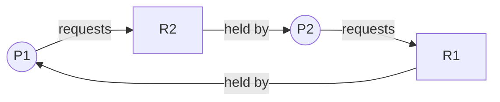

# Deadlock in OS

> Deadlock is a state where a set of processes are permanently blocked — each holds at least one resource and waits for another held by someone else in the same set — and it can only occur when all four Coffman conditions are present simultaneously.

---

## Table of Contents

1. [What Is Deadlock?](#1-what-is-deadlock)
2. [Simple Deadlock Example](#2-simple-deadlock-example)
3. [The Four Necessary Conditions (Coffman Conditions)](#3-the-four-necessary-conditions-coffman-conditions)
4. [Resource Allocation Graph (RAG)](#4-resource-allocation-graph-rag)
5. [Deadlock Prevention Techniques](#5-deadlock-prevention-techniques)
6. [Comparison of Prevention Techniques](#6-comparison-of-prevention-techniques)
7. [Dining Philosophers Problem](#7-dining-philosophers-problem)
8. [When to Use Prevention](#8-when-to-use-prevention)
9. [Key Takeaways](#9-key-takeaways)

---

## 1. What Is Deadlock?

**Deadlock** is a situation where a set of processes are **permanently blocked** because each process is holding a resource and waiting for another resource held by another process in the same set.

**Four-way intersection analogy:**

```
          Car A (going north)
               │
               ▼
  ─────────────┼─────────────
  Car D  ──►   X   ◄── Car B
  (going east) │ (going west)
               ▲
               │
          Car C (going south)

  Every car waits for the car blocking its path.
  Nobody moves. All are stuck forever. → DEADLOCK
```

Resources can be: CPU time, memory, files, printers, database locks, mutexes.

---

## 2. Simple Deadlock Example

```
  Process P1:  holds R1, needs R2 to finish
  Process P2:  holds R2, needs R1 to finish

  P1 ──holds──► R1        R2 ◄──holds── P2
  P1 ──wants──► R2        R1 ◄──wants── P2

  P1 waits for P2 to release R2
  P2 waits for P1 to release R1
  Neither releases anything → DEADLOCK
```



The cycle in the graph above is the deadlock.

---

## 3. The Four Necessary Conditions (Coffman Conditions)

Deadlock can ONLY happen when **all four** conditions hold at the same time.
Break even one → deadlock is impossible.

### Condition 1: Mutual Exclusion

At least one resource must be **non-shareable** — only one process can use it at a time. If another process requests it, it must wait.

```
  Printer:
  ┌───────────────────────────────────────────┐
  │  P1 is printing (has exclusive access)    │
  │  P2 must WAIT                             │
  └───────────────────────────────────────────┘

  You cannot share a printer mid-job.
  This condition is often unavoidable.
```

---

### Condition 2: Hold and Wait

A process is **holding at least one resource** and **waiting** to acquire more that are held by other processes.

```
  P1 holds: [Pen]
  P1 wants: [Notebook]  ← held by P2

  P1 does NOT release the pen while waiting for the notebook.
  "Hold the pen, wait for the notebook."
```

**The chain this creates:**

```
  P1 holds R1, waits for R2
  P2 holds R2, waits for R3
  P3 holds R3, waits for R1
  ↑─────────────────────────┘  Potential circular wait!
```

---

### Condition 3: No Preemption

Resources **cannot be forcibly taken** away from a process. A process releases resources only **voluntarily** when it finishes.

```
  P1 is using a file (write lock)
  OS cannot say "give me that file lock back"
  P1 must release it on its own when done.

  The system has no authority to break P1's hold.
```

This is why operating systems generally cannot forcibly reclaim mutexes or file locks from a running process.

---

### Condition 4: Circular Wait

There exists a **cycle** of processes where each is waiting for a resource held by the next:

$$P_0 \rightarrow P_1 \rightarrow P_2 \rightarrow \cdots \rightarrow P_n \rightarrow P_0$$

```
  P0 waits for resource held by P1
  P1 waits for resource held by P2
  P2 waits for resource held by P0
           ↑_________________________↑

  Circle of waiting — the actual deadlock loop.
```

### All Four Together

```
  ┌──────────────────────────────────────────────────────┐
  │         DEADLOCK requires ALL FOUR:                  │
  │                                                      │
  │  1. Mutual Exclusion   (resource can't be shared)    │
  │  2. Hold and Wait      (hold one, want another)      │
  │  3. No Preemption      (can't forcibly take)         │
  │  4. Circular Wait      (cycle of waiting)            │
  │                                                      │
  │  Remove ANY ONE → deadlock is IMPOSSIBLE             │
  └──────────────────────────────────────────────────────┘
```

---

## 4. Resource Allocation Graph (RAG)

A **RAG** visually represents which resources are held by which processes and what is being requested.

**Node types:**

- Circle `(P)` = Process
- Rectangle `[R]` = Resource (dots inside = number of instances)

**Edge types:**

- `P → R` = **Request edge** — process wants the resource
- `R → P` = **Assignment edge** — resource is allocated to process

### No Deadlock (no cycle)

```
  (P1) ──request──► [R1] ──assigned──► (P2)

  P1 is waiting for R1, which P2 holds.
  P2 is not waiting for anything → P2 will finish and release R1 → P1 can proceed.
  No cycle → No deadlock.
```

### Deadlock (cycle with single-instance resources)

```
  (P1) ──request──► [R2]
   ▲                  │
   │               assigned
   │                  ▼
  [R1] ◄──assigned── (P2) ──request──► [R1]
   │
  assigned
   │
   ▼
  (P1)

  Simplified:  P1 → R2 → P2 → R1 → P1  (cycle!)
  Both R1 and R2 have single instances → DEADLOCK confirmed.
```

**Rule:** If every resource type has exactly **one instance**, a cycle = deadlock. If resources have **multiple instances**, a cycle is a necessary but not sufficient condition.

---

## 5. Deadlock Prevention Techniques

Prevention = make at least one of the four conditions impossible.

---

### Technique 1: Prevent Mutual Exclusion

Make resources shareable where possible. Use **spooling** — instead of direct access to a printer, processes write to a spool file, and a single spooler process manages the printer.

```
  Without spooling:
  P1 uses printer directly → P2 must wait (mutual exclusion)

  With spooling:
  P1 writes to spool file ─┐
  P2 writes to spool file ─┤─► Spooler reads files ──► Printer
  P3 writes to spool file ─┘

  Multiple processes "share" the printer via the spool.
```

**Limitation:** Not possible for all resources (file write locks, mutex locks must remain exclusive).

---

### Technique 2: Prevent Hold and Wait

Require a process to **request ALL resources at once** before starting. If any resource is unavailable, the process waits without holding anything.

```c
// Approach 1: Request everything at start
request_resources([R1, R2, R3]);
if (all_granted) {
    use_resources();
    release_resources([R1, R2, R3]);
} else {
    wait();   // Hold NOTHING while waiting
}

// Approach 2: Release all before requesting more
use(R1);
release(R1);              // Release current resources
request_resources([R2]);  // Then request new ones
```

**Downsides:**

- Low resource utilization (holding R1 from start even if only needed at the end)
- Must know all needed resources in advance (not always possible)
- Can cause starvation if a process always fails to get all resources at once

---

### Technique 3: Prevent No Preemption

Allow the OS to **forcibly reclaim resources** from a process.

If Process P1 holds R1 and requests R2 (which is unavailable):

1. OS preempts R1 from P1 (takes it back)
2. P1 is added to a waiting list for both R1 and R2
3. P1 restarts only when BOTH R1 and R2 are available

```c
// OS logic when P1 requests R2 but R2 is unavailable
if (R2_not_available) {
    release(R1);                     // Preempt R1 from P1
    add_to_waiting(P1, [R1, R2]);    // P1 needs both to restart
}
// P1 restarts when scheduler finds both R1 and R2 available
```

**Works for:** CPU registers, memory pages (state can be saved/restored)
**Doesn't work for:** Printers, file write operations, mutex locks (state cannot be meaningfully restored mid-operation)

---

### Technique 4: Prevent Circular Wait (Most Practical)

Assign a **unique number** to every resource type. Require all processes to request resources in **strictly increasing order** of their numbers.

```
  Resource ordering:
  R1 = 1,  R2 = 2,  R3 = 3

  Rule: To request R_j, you must release all R_i where i > j first.
        You can only request resources with a higher number than what you hold.
```

```c
// Correct — requesting in increasing order
request(R1);   // holds: R1
request(R2);   // holds: R1, R2
request(R3);   // holds: R1, R2, R3

// Incorrect — would be REJECTED by OS
request(R2);   // holds: R2
request(R1);   // DENIED: R1 (number 1) < R2 (number 2) — violates ordering
```

**Why this prevents circular wait:**

```
  If all processes follow increasing order:

  P1 holds R2, waits for R3  (2 < 3 ✓ allowed)
  P2 holds R3, waits for R1  (3 > 1 ✗ BLOCKED — can't request lower number)

  P2's request for R1 is rejected.
  No cycle can form → circular wait is impossible.
```

---

## 6. Comparison of Prevention Techniques

| Condition Prevented | Technique                      | Advantages                        | Disadvantages                                                |
| ------------------- | ------------------------------ | --------------------------------- | ------------------------------------------------------------ |
| Mutual Exclusion    | Spooling / shareable resources | Reduces contention                | Not applicable to all resources                              |
| Hold and Wait       | Request all resources at start | Simple to understand              | Low utilization, requires advance knowledge, starvation      |
| No Preemption       | OS forcibly reclaims resources | Better resource utilization       | Only for resources whose state can be saved                  |
| Circular Wait       | Resource ordering (numbering)  | Practical, widely used, efficient | Requires careful ordering; may force unnatural request order |

---

## 7. Dining Philosophers Problem

**Setup:** 5 philosophers sit at a round table. Between each pair of adjacent philosophers is one fork (5 forks total). A philosopher needs **both** adjacent forks to eat.

```
        P0
       /  \
    Fork5  Fork1
    /          \
  P4            P1
   |            |
  Fork4       Fork2
    \          /
     P3──Fork3──P2
```

**Without any prevention:**

```
  P0 picks up Fork1 (left)
  P1 picks up Fork2 (left)
  P2 picks up Fork3 (left)
  P3 picks up Fork4 (left)
  P4 picks up Fork5 (left)

  Everyone now waits for their right fork → all held by neighbor.
  Cycle: P0 → P1 → P2 → P3 → P4 → P0  → DEADLOCK
```

**Prevention using resource ordering (number the forks 1–5):**

```
  Rule: Always pick up the lower-numbered fork first.
```

```c
int left_fork  = philosopher_id;
int right_fork = (philosopher_id + 1) % 5;

// Always acquire lower number first
int first  = min(left_fork, right_fork);
int second = max(left_fork, right_fork);

wait(fork[first]);    // Acquire lower-numbered fork
wait(fork[second]);   // Acquire higher-numbered fork

eat();

signal(fork[second]); // Release in reverse order
signal(fork[first]);
```

**Why this works:** The philosopher sitting between Fork 5 and Fork 1 will grab Fork 1 first (lower number). This breaks the cycle — at least one philosopher grabs forks in the opposite order from the others, preventing the full circular wait from forming.

---

## 8. When to Use Prevention

| System Type                 | Recommended Approach              | Reason                                                 |
| --------------------------- | --------------------------------- | ------------------------------------------------------ |
| Real-time / safety-critical | Prevention (resource ordering)    | Deadlock is unacceptable; predictability needed        |
| Embedded systems            | Prevention                        | Limited resources, must be deterministic               |
| General-purpose OS          | Avoidance (Banker's) or Detection | Prevention too restrictive; deadlocks are rare         |
| Database systems            | Detection + recovery              | Deadlocks can be detected and transactions rolled back |

**Prevention trade-off:**

```
  MORE RESTRICTIVE ◄────────────────────────────► LESS RESTRICTIVE
  Prevention    Avoidance    Detection    No handling
  (impossible)  (safe state) (kill/rollback) (ignore — if rare)
  └─ safest ─┘             └──────────── more efficient ──────────┘
```

---

## 9. Key Takeaways

- **Deadlock** = a set of processes permanently blocked, each waiting for a resource held by another in the set
- Deadlock requires **all 4 Coffman conditions** simultaneously: mutual exclusion + hold and wait + no preemption + circular wait
- **Break any one condition** → deadlock becomes impossible
- A **Resource Allocation Graph (RAG)** with a cycle indicates deadlock (for single-instance resources)
- **Prevention techniques** by condition:
  1. Mutual exclusion → spooling (limited applicability)
  2. Hold and wait → request all resources upfront (low utilization)
  3. No preemption → OS forcibly reclaims resources (only for save/restore-able resources)
  4. Circular wait → **resource ordering** (most practical and widely used)
- **Dining philosophers**: classic deadlock illustration; solved by resource ordering (lower-numbered fork first)
- Prevention is safe but restrictive; real systems often combine prevention with avoidance (Banker's Algorithm — next topic) or detection+recovery
