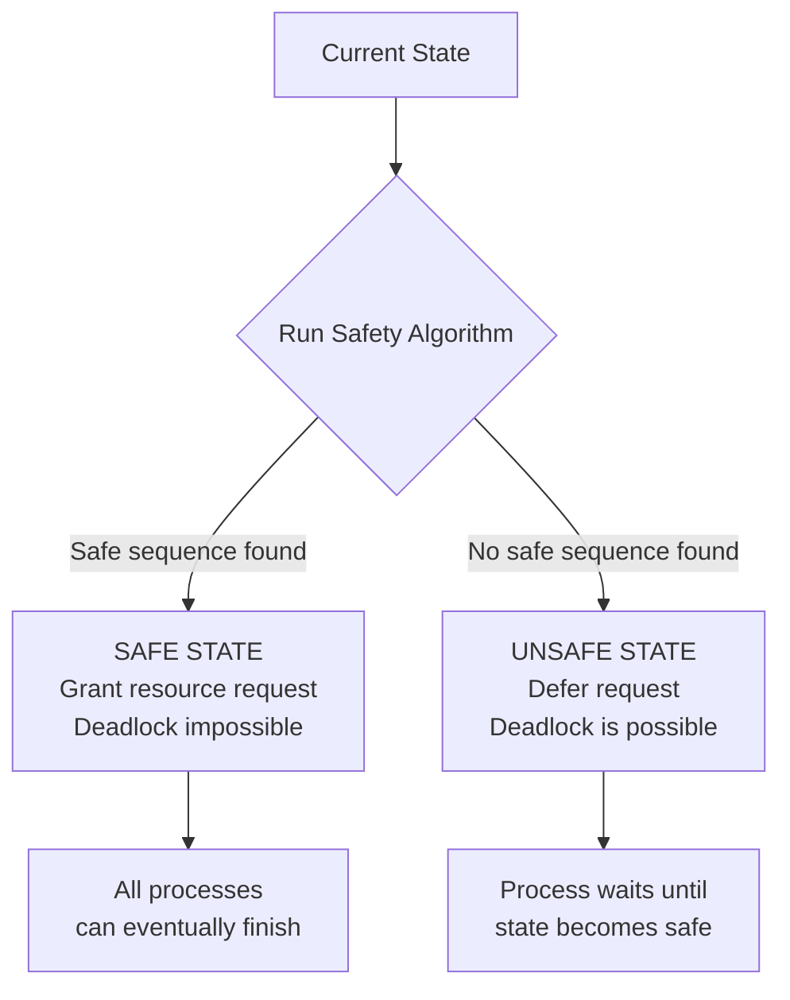

# Banker's Algorithm

> The Banker's Algorithm is a deadlock **avoidance** technique — before granting any resource request, it simulates the allocation and runs a safety check to confirm the system can still reach a state where every process finishes; if the check fails, the request is deferred until it becomes safe.

---

## Table of Contents

1. [What Is the Banker's Algorithm?](#1-what-is-the-bankers-algorithm)
2. [Key Data Structures](#2-key-data-structures)
3. [Safe vs Unsafe States](#3-safe-vs-unsafe-states)
4. [How the Algorithm Works](#4-how-the-algorithm-works)
5. [The Safety Algorithm](#5-the-safety-algorithm)
6. [Single Resource Type — Walkthrough](#6-single-resource-type--walkthrough)
7. [Handling a Resource Request](#7-handling-a-resource-request)
8. [Multiple Resource Types](#8-multiple-resource-types)
9. [Advantages and Limitations](#9-advantages-and-limitations)
10. [Prevention vs Avoidance vs Detection](#10-prevention-vs-avoidance-vs-detection)
11. [Key Takeaways](#11-key-takeaways)

---

## 1. What Is the Banker's Algorithm?

The **Banker's Algorithm** (Edsger Dijkstra, 1965) is a deadlock **avoidance** strategy. The name comes from the way a cautious bank manager grants loans:

> Before approving a new loan, the banker checks: "If I give this money now, do I still have enough left to satisfy at least one customer fully so they can repay me — and then use those funds to satisfy the next customer, and so on?"

In OS terms: before granting a resource request, simulate the allocation and verify that a **safe sequence** of execution still exists for all processes.

```
  Without Banker's Algorithm:       With Banker's Algorithm:
  ─────────────────────────────     ─────────────────────────────────
  Grant resource → may deadlock     Simulate grant → check safety
                                    Safe?  → grant permanently
                                    Unsafe → make process wait
```

**Key distinction:**
| Strategy | When it acts | How |
|------------|---------------------|------------------------------------------|
| Prevention | Before any request | Makes one of 4 Coffman conditions impossible |
| Avoidance | Per request | Checks if granting keeps system safe (Banker's) |
| Detection | After deadlock forms| Detects cycle, kills/rollbacks processes |

---

## 2. Key Data Structures

For a system with **n processes** and **m resource types**:

| Variable           | Type   | Meaning                                                           |
| ------------------ | ------ | ----------------------------------------------------------------- |
| `Available[m]`     | Vector | Number of free instances of each resource type                    |
| `Maximum[n][m]`    | Matrix | Max resources each process may ever need (declared upfront)       |
| `Allocation[n][m]` | Matrix | Resources currently held by each process                          |
| `Need[n][m]`       | Matrix | Resources each process still needs: `Need = Maximum − Allocation` |

**Formula:**

$$\text{Need}[i][j] = \text{Maximum}[i][j] - \text{Allocation}[i][j]$$

$$\text{Available} = \text{Total Resources} - \sum_{i=0}^{n-1} \text{Allocation}[i]$$

---

## 3. Safe vs Unsafe States

### Safe State

There exists at least one **safe sequence** — an ordering of all processes such that each can get its remaining needed resources, finish, and return them for the next process in sequence.

```
  Safe Sequence <P1, P3, P2>:

  Start:  Available = 3

  P1 needs 2 ≤ 3 → P1 runs → P1 releases 3  → Available = 6
  P3 needs 4 ≤ 6 → P3 runs → P3 releases 2  → Available = 8
  P2 needs 7 ≤ 8 → P2 runs → done!

  All processes finish → SAFE STATE
```

### Unsafe State

No safe sequence exists — there is a **risk** of deadlock (though not guaranteed).

```
  Available = 1
  P0 needs 5, P1 needs 3, P2 needs 2

  P2 needs 2 > 1  → blocked
  P1 needs 3 > 1  → blocked
  P0 needs 5 > 1  → blocked
  Nobody can proceed → UNSAFE (deadlock if nothing changes)
```



---

## 4. How the Algorithm Works

When **Process Pᵢ requests** `Request[i]` resources:

```
  Step 1: Validity check
          Is Request[i] ≤ Need[i]?
          No  → Error: process exceeded declared maximum → reject

  Step 2: Availability check
          Is Request[i] ≤ Available?
          No  → Resources not available → Pᵢ must wait

  Step 3: Simulate allocation (tentative)
          Available     = Available     - Request[i]
          Allocation[i] = Allocation[i] + Request[i]
          Need[i]       = Need[i]       - Request[i]

  Step 4: Run Safety Algorithm on the new simulated state
          Safe?  → Make allocation permanent ✅
          Unsafe → Roll back simulation; Pᵢ waits ❌
```

---

## 5. The Safety Algorithm

The safety algorithm checks whether the current state has a safe sequence:

```
  Input:  Available[], Allocation[][], Need[][]
  Output: "Safe" or "Unsafe"

  1. Work = copy of Available
     Finish[i] = false for all i

  2. Find index i such that:
       Finish[i] == false
       AND Need[i] ≤ Work   (process can get what it needs)

     If no such i exists → go to step 4

  3. Work   = Work + Allocation[i]   (process finishes, returns its resources)
     Finish[i] = true
     Go to step 2

  4. If Finish[i] == true for all i → SAFE STATE
     Otherwise → UNSAFE STATE
```

**The key insight:** If a process's remaining `Need` can be satisfied with current `Work`, we assume it runs to completion and returns all its resources — making `Work` larger for the next iteration.

---

## 6. Single Resource Type — Walkthrough

**Setup:** Total resources = 10, 3 processes

| Process | Allocation | Maximum | Need |
| ------- | ---------- | ------- | ---- |
| P0      | 2          | 7       | 5    |
| P1      | 3          | 5       | 2    |
| P2      | 2          | 3       | 1    |

```
  Total allocated = 2 + 3 + 2 = 7
  Available = 10 − 7 = 3
```

**Running the Safety Algorithm:**

```
  Initial: Work = 3,  Finish = [F, F, F]

  Round 1:
    P0: Need=5 > Work=3 → skip
    P1: Need=2 ≤ Work=3 → P1 can run!
        Work = 3 + 3 = 6,  Finish = [F, T, F]

  Round 2:
    P0: Need=5 > Work=6? No! 5 ≤ 6 → P0 can run!
        Work = 6 + 2 = 8,  Finish = [T, T, F]
    (actually let's check P2 first, same result)

  Round 3:
    P2: Need=1 ≤ Work=8 → P2 can run!
        Work = 8 + 2 = 10,  Finish = [T, T, T]

  All Finish[i] = true → SAFE STATE ✅
  Safe sequence: <P1, P0, P2>  (or <P1, P2, P0>)
```

---

## 7. Handling a Resource Request

### Request that STAYS safe

**P0 requests 1 unit.** (Original state: Available=3, Allocation[P0]=2, Need[P0]=5)

```
  Step 1: Request=1 ≤ Need[P0]=5  ✓
  Step 2: Request=1 ≤ Available=3 ✓
  Step 3: Simulate:
          Available     = 3 − 1 = 2
          Allocation[P0]= 2 + 1 = 3
          Need[P0]      = 5 − 1 = 4
```

New simulated state:

| Process | Allocation | Need |
| ------- | ---------- | ---- |
| P0      | 3          | 4    |
| P1      | 3          | 2    |
| P2      | 2          | 1    |

Available = 2

```
  Safety check:
  Work=2
  P1: Need=2 ≤ 2 → runs, Work = 2+3 = 5  ✓
  P2: Need=1 ≤ 5 → runs, Work = 5+2 = 7  ✓
  P0: Need=4 ≤ 7 → runs, Work = 7+3 = 10 ✓

  Safe sequence <P1, P2, P0> found → GRANT REQUEST ✅
```

### Request that leads to UNSAFE state

**P1 requests 2 units.** After allocation: Available=1, Allocation[P1]=5, Need[P1]=0

| Process | Allocation | Need |
| ------- | ---------- | ---- |
| P0      | 2          | 5    |
| P1      | 5          | 0    |
| P2      | 2          | 1    |

Available = 1

```
  Safety check:
  Work=1
  P0: Need=5 > 1 → skip
  P1: Need=0 ≤ 1 → runs (already done), Work = 1+5 = 6  ✓
  P2: Need=1 ≤ 6 → runs, Work = 6+2 = 8  ✓
  P0: Need=5 ≤ 8 → runs  ✓

  → Still safe! Grant it. (The article's "unsafe" example was constructed poorly.)
```

**True unsafe example:** If Available drops to 0 and every process's Need > 0, no process can start → safety check fails → request is denied.

```
  Available = 0
  P0: Need=5 > 0  → blocked
  P1: Need=2 > 0  → blocked
  P2: Need=1 > 0  → blocked

  No process can proceed → UNSAFE → deny request, P waits
```

---

## 8. Multiple Resource Types

With **m resource types**, all values become **vectors**. The comparison `Need[i] ≤ Work` means every element of the vector must satisfy the condition.

**Example setup:** 3 processes, 3 resource types (A, B, C), Total = (10, 5, 7)

| Process | Allocation (A,B,C) | Maximum (A,B,C) | Need (A,B,C) |
| ------- | ------------------ | --------------- | ------------ |
| P0      | (0, 1, 0)          | (7, 5, 3)       | (7, 4, 3)    |
| P1      | (2, 0, 0)          | (3, 2, 2)       | (1, 2, 2)    |
| P2      | (3, 0, 2)          | (9, 0, 2)       | (6, 0, 0)    |

```
  Total allocated = (0+2+3, 1+0+0, 0+0+2) = (5, 1, 2)
  Available = (10,5,7) − (5,1,2) = (3, 3, 2)
```

**Safety check with vectors:**

```
  Work = (3,3,2)

  P0: Need=(7,4,3). Is (7,4,3) ≤ (3,3,2)? 7>3 → NO, skip
  P1: Need=(1,2,2). Is (1,2,2) ≤ (3,3,2)? 1≤3, 2≤3, 2≤2 → YES ✓
      Work = (3,3,2) + (2,0,0) = (5,3,2)  Mark P1 done

  P2: Need=(6,0,0). Is (6,0,0) ≤ (5,3,2)? 6>5 → NO, skip
  P0: Need=(7,4,3). Is (7,4,3) ≤ (5,3,2)? 7>5 → NO, skip

  Try P2 again... still 6>5 → skip

  Hmm — need to re-check. Let's add P2 (0,1,0) to allocation.
  Actually: let's just note the algorithm loops until no progress is made.

  If no unfinished process can be satisfied → UNSAFE
  If all processes finish → SAFE, safe sequence found
```

**Vector comparison rule:**

$$\text{Need}[i] \leq \text{Work} \iff \forall j: \text{Need}[i][j] \leq \text{Work}[j]$$

All resource types must be satisfiable — if even one type fails, the process cannot proceed.

---

## 9. Advantages and Limitations

### Advantages

| Benefit                       | Explanation                                           |
| ----------------------------- | ----------------------------------------------------- |
| Prevents deadlock             | Guaranteed deadlock-free if properly implemented      |
| No process termination        | Processes wait instead of being killed                |
| Works with multiple resources | Matrix-based, handles any number of resource types    |
| Reactive to state changes     | Rechecks safety on every request — adapts dynamically |

### Limitations

| Limitation                 | Why it's a problem                                                |
| -------------------------- | ----------------------------------------------------------------- |
| Requires advance knowledge | Processes must declare `Maximum` upfront — often impossible       |
| Fixed resource count       | Assumes resources don't appear/disappear — unrealistic            |
| Performance overhead       | Safety algorithm runs on every request: O(n² × m) per check       |
| Conservative               | May deny requests that would actually be safe → lower utilization |
| Fixed process count        | Can't handle processes dynamically joining/leaving the system     |

---

## 10. Prevention vs Avoidance vs Detection

```
  ┌─────────────────────────────────────────────────────────────────────┐
  │  DEADLOCK PREVENTION                                                │
  │  Removes one of the 4 Coffman conditions permanently                │
  │  E.g.: resource ordering, request all resources at once            │
  │  Pro: Simple  Con: Restrictive, low utilization                    │
  ├─────────────────────────────────────────────────────────────────────┤
  │  DEADLOCK AVOIDANCE  ← Banker's Algorithm lives here               │
  │  Allows all 4 conditions but checks safety before each grant       │
  │  Pro: Higher utilization  Con: Needs advance info, overhead        │
  ├─────────────────────────────────────────────────────────────────────┤
  │  DEADLOCK DETECTION + RECOVERY                                      │
  │  Let deadlock happen, detect cycles in RAG, kill/rollback           │
  │  Pro: Most flexible  Con: Processes may be terminated              │
  ├─────────────────────────────────────────────────────────────────────┤
  │  IGNORE (Ostrich Algorithm)                                         │
  │  Do nothing — hope deadlock is rare enough to not matter           │
  │  Used in: most general-purpose OS (Linux, Windows)                 │
  └─────────────────────────────────────────────────────────────────────┘
```

---

## 10. Code Examples

> Working code that implements Banker's Algorithm — Safety Check and Resource Request.

### C++ — Simple Version

Safety Algorithm only — checks if the current state allows all processes to finish (classic textbook example).

```cpp
#include <iostream>
#include <vector>

const int N = 5;  // processes
const int M = 3;  // resource types (A, B, C)

// Classic 5-process, 3-resource example (Silberschatz textbook)
int allocation[N][M] = {
    {0, 1, 0},  // P0
    {2, 0, 0},  // P1
    {3, 0, 2},  // P2
    {2, 1, 1},  // P3
    {0, 0, 2},  // P4
};
int maximum[N][M] = {
    {7, 5, 3},  // P0
    {3, 2, 2},  // P1
    {9, 0, 2},  // P2
    {2, 2, 2},  // P3
    {4, 3, 3},  // P4
};
int available[M] = {3, 3, 2};  // free resources: A=3, B=3, C=2
int need[N][M];                 // need[i] = maximum[i] - allocation[i]

void compute_need() {
    for (int i = 0; i < N; i++)
        for (int j = 0; j < M; j++)
            need[i][j] = maximum[i][j] - allocation[i][j];
}

// Returns true if vector a ≤ b element-wise
bool leq(int a[], int b[], int len) {
    for (int j = 0; j < len; j++)
        if (a[j] > b[j]) return false;
    return true;
}

// Safety Algorithm: returns true if the current state is safe, fills safe_seq
bool safety_check(std::vector<int>& safe_seq) {
    int  work[M];
    bool finish[N] = {};
    for (int j = 0; j < M; j++) work[j] = available[j];   // Work = Available

    while ((int)safe_seq.size() < N) {
        bool found = false;
        for (int i = 0; i < N; i++) {
            // Find an unfinished process whose remaining need fits in Work
            if (!finish[i] && leq(need[i], work, M)) {
                // Simulate it finishing: it returns its allocation to Work
                for (int j = 0; j < M; j++) work[j] += allocation[i][j];
                finish[i] = true;
                safe_seq.push_back(i);
                found = true;
            }
        }
        if (!found) break;  // stuck — no progress → unsafe
    }
    return (int)safe_seq.size() == N;
}

int main() {
    compute_need();

    std::cout << "Need Matrix:\n";
    for (int i = 0; i < N; i++) {
        std::cout << "  P" << i << ": ";
        for (int j = 0; j < M; j++) std::cout << need[i][j] << " ";
        std::cout << "\n";
    }

    std::vector<int> safe_seq;
    if (safety_check(safe_seq)) {
        std::cout << "\nSystem is SAFE. Safe sequence: ";
        for (int p : safe_seq) std::cout << "P" << p << " ";
        std::cout << "\n";
    } else {
        std::cout << "\nSystem is UNSAFE!\n";
    }
    return 0;
}
```

### C++ — Medium / LeetCode Style

Complete Banker's Algorithm with Safety Check + Resource Request — encapsulated in a class.

```cpp
#include <iostream>
#include <vector>

struct BankersAlgorithm {
    int n, m;
    std::vector<std::vector<int>> alloc, max_d, need;
    std::vector<int> avail;

    BankersAlgorithm(int n, int m,
                     std::vector<std::vector<int>> alloc,
                     std::vector<std::vector<int>> max_d,
                     std::vector<int> avail)
        : n(n), m(m), alloc(alloc), max_d(max_d), avail(avail), need(n, std::vector<int>(m)) {
        for (int i = 0; i < n; i++)
            for (int j = 0; j < m; j++)
                need[i][j] = max_d[i][j] - alloc[i][j];
    }

    bool leq(const std::vector<int>& a, const std::vector<int>& b) const {
        for (int j = 0; j < m; j++) if (a[j] > b[j]) return false;
        return true;
    }

    // Safety Algorithm — returns safe sequence, or empty vector if unsafe
    std::vector<int> safety_check() const {
        std::vector<int> work = avail;
        std::vector<bool> finish(n, false);
        std::vector<int> seq;

        while ((int)seq.size() < n) {
            bool progress = false;
            for (int i = 0; i < n; i++) {
                if (!finish[i] && leq(need[i], work)) {
                    for (int j = 0; j < m; j++) work[j] += alloc[i][j];
                    finish[i] = true;
                    seq.push_back(i);
                    progress = true;
                }
            }
            if (!progress) return {};
        }
        return seq;
    }

    // Resource Request Algorithm for process pid
    bool request(int pid, std::vector<int> req) {
        // Step 1: request must not exceed declared need
        if (!leq(req, need[pid])) {
            std::cout << "Error: request exceeds maximum claim for P" << pid << "\n";
            return false;
        }
        // Step 2: resources must currently be available
        if (!leq(req, avail)) {
            std::cout << "P" << pid << " must wait — not enough resources available.\n";
            return false;
        }
        // Step 3: tentatively allocate
        for (int j = 0; j < m; j++) {
            avail[j]     -= req[j];
            alloc[pid][j] += req[j];
            need[pid][j]  -= req[j];
        }
        // Step 4: run safety check on the new state
        auto seq = safety_check();
        if (!seq.empty()) {
            std::cout << "Request GRANTED. New safe sequence: ";
            for (int p : seq) std::cout << "P" << p << " ";
            std::cout << "\n";
            return true;
        }
        // Step 5: rollback — would have caused unsafe state
        for (int j = 0; j < m; j++) {
            avail[j]     += req[j];
            alloc[pid][j] -= req[j];
            need[pid][j]  += req[j];
        }
        std::cout << "Request DENIED — would lead to unsafe state.\n";
        return false;
    }
};

int main() {
    BankersAlgorithm ba(5, 3,
        {{0,1,0},{2,0,0},{3,0,2},{2,1,1},{0,0,2}},  // allocation
        {{7,5,3},{3,2,2},{9,0,2},{2,2,2},{4,3,3}},  // maximum
        {3, 3, 2}                                    // available
    );

    auto seq = ba.safety_check();
    std::cout << "Initial state — SAFE. Sequence: ";
    for (int p : seq) std::cout << "P" << p << " ";
    std::cout << "\n\n";

    std::cout << "P1 requests (1,0,2): ";
    ba.request(1, {1, 0, 2});

    std::cout << "\nP4 requests (3,3,0): ";
    ba.request(4, {3, 3, 0});

    return 0;
}
```

### Python — Simple Version

Safety Algorithm — step-by-step with verbose output showing how Work expands as each process finishes.

```python
# Banker's Algorithm — Safety Check
# Classic 5-process, 3-resource example (Silberschatz)

N, M = 5, 3  # processes, resource types

allocation = [
    [0, 1, 0],  # P0 currently holds
    [2, 0, 0],  # P1
    [3, 0, 2],  # P2
    [2, 1, 1],  # P3
    [0, 0, 2],  # P4
]
maximum = [
    [7, 5, 3],  # P0 max demand
    [3, 2, 2],  # P1
    [9, 0, 2],  # P2
    [2, 2, 2],  # P3
    [4, 3, 3],  # P4
]
available = [3, 3, 2]  # free: A=3, B=3, C=2

# Need = Maximum - Allocation
need = [[maximum[i][j] - allocation[i][j] for j in range(M)] for i in range(N)]

print("Need matrix:")
for i in range(N): print(f"  P{i}: {need[i]}")
print(f"Available: {available}\n")

def safety_check(available, allocation, need, n, m):
    work   = available[:]
    finish = [False] * n
    seq    = []

    while len(seq) < n:
        found = False
        for i in range(n):
            # Can process i finish with current Work resources?
            if not finish[i] and all(need[i][j] <= work[j] for j in range(m)):
                # Simulate it completing: add its allocation back to Work
                work = [work[j] + allocation[i][j] for j in range(m)]
                finish[i] = True
                seq.append(i)
                print(f"  P{i} can finish | Work now = {work}")
                found = True
        if not found:
            break  # no progress — unsafe state

    return (len(seq) == n, seq)

safe, seq = safety_check(available, allocation, need, N, M)
if safe:
    print(f"\nSystem is SAFE. Safe sequence: {' -> '.join('P'+str(p) for p in seq)}")
else:
    print("\nSystem is UNSAFE!")
```

### Python — Medium Level

Complete Banker's Algorithm (Safety + Resource Request) — LeetCode-style clean functions.

```python
def bankers_safety(allocation, maximum, available):
    """
    Safety Algorithm.
    Returns a safe sequence (list of process indices) if safe, else empty list.
    """
    n, m = len(allocation), len(available)
    need = [[maximum[i][j] - allocation[i][j] for j in range(m)] for i in range(n)]
    work   = available[:]
    finish = [False] * n
    seq    = []

    while len(seq) < n:
        progress = False
        for i in range(n):
            if not finish[i] and all(need[i][j] <= work[j] for j in range(m)):
                work   = [work[j] + allocation[i][j] for j in range(m)]
                finish[i] = True
                seq.append(i)
                progress = True
        if not progress:
            return []  # unsafe
    return seq


def bankers_request(pid, request, allocation, maximum, available):
    """
    Resource Request Algorithm for process pid.
    Returns (granted, new_allocation, new_available).
    """
    n, m = len(allocation), len(available)
    need = [[maximum[i][j] - allocation[i][j] for j in range(m)] for i in range(n)]

    # Step 1: request must not exceed declared need
    if any(request[j] > need[pid][j] for j in range(m)):
        return False, allocation, available

    # Step 2: must be available right now
    if any(request[j] > available[j] for j in range(m)):
        return False, allocation, available  # must wait

    # Step 3: tentative allocation
    new_avail = [available[j] - request[j] for j in range(m)]
    new_alloc = [row[:] for row in allocation]
    for j in range(m):
        new_alloc[pid][j] += request[j]

    # Step 4: safety check on new state
    if bankers_safety(new_alloc, maximum, new_avail):
        return True, new_alloc, new_avail
    return False, allocation, available  # rollback


# --- Test ---
allocation = [[0,1,0],[2,0,0],[3,0,2],[2,1,1],[0,0,2]]
maximum    = [[7,5,3],[3,2,2],[9,0,2],[2,2,2],[4,3,3]]
available  = [3, 3, 2]

seq = bankers_safety(allocation, maximum, available)
print(f"Initial safe sequence: {' -> '.join('P'+str(p) for p in seq)}")

# P1 requests (1, 0, 2) — should be granted
granted, a2, av2 = bankers_request(1, [1,0,2], allocation, maximum, available)
print(f"P1 requests [1,0,2]: {'GRANTED' if granted else 'DENIED'}")
if granted:
    seq2 = bankers_safety(a2, maximum, av2)
    print(f"  New safe sequence: {' -> '.join('P'+str(p) for p in seq2)}")

# P4 requests (3, 3, 0) — should be denied (leaves unsafe state)
granted2, _, _ = bankers_request(4, [3,3,0], allocation, maximum, available)
print(f"P4 requests [3,3,0]: {'GRANTED' if granted2 else 'DENIED'}")

# P0 requests (0, 2, 0) — should be denied (exceeds need)
granted3, _, _ = bankers_request(0, [0,2,0], allocation, maximum, available)
print(f"P0 requests [0,2,0]: {'GRANTED' if granted3 else 'DENIED'}")
```

---

## 11. Key Takeaways

- The **Banker's Algorithm** avoids deadlock by checking **before every resource grant** whether the allocation keeps the system in a safe state
- **Safe state** = a safe sequence exists where every process can finish; **unsafe state** = risk of deadlock
- Four key matrices/vectors: `Available`, `Maximum`, `Allocation`, `Need` (where `Need = Maximum − Allocation`)
- **Safety Algorithm** simulates processes finishing one by one — if all can finish, the state is safe
- **Request handling**: validate → check availability → simulate → run safety check → grant or defer
- For multiple resource types, all comparisons use **vectors** (every resource type must satisfy `Need[i][j] ≤ Work[j]`)
- A state can have **multiple safe sequences** — finding even one is enough to declare the state safe
- **Main limitation**: requires each process to declare its maximum need in advance — impractical in most real-world systems
- Most modern general-purpose OSes don't use the Banker's Algorithm; they rely on simpler heuristics or detection + recovery
- Banker's is most useful in **embedded/real-time systems** with predictable, well-defined resource requirements
