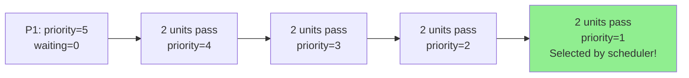

# Process Starvation and Aging in OS

> Starvation is when a ready process never gets CPU time because the scheduler always picks something else; aging fixes this by gradually boosting a waiting process's priority over time until it becomes high enough to be selected.

---

## Table of Contents

1. [What Is Starvation?](#1-what-is-starvation)
2. [How Starvation Happens](#2-how-starvation-happens)
3. [Example Scenario](#3-example-scenario)
4. [What Is Aging?](#4-what-is-aging)
5. [How Aging Works](#5-how-aging-works)
6. [Aging Walkthrough](#6-aging-walkthrough)
7. [Aging Pseudocode and Formula](#7-aging-pseudocode-and-formula)
8. [Starvation vs Deadlock](#8-starvation-vs-deadlock)
9. [Which Schedulers Cause Starvation?](#9-which-schedulers-cause-starvation)
10. [Practical Considerations](#10-practical-considerations)
11. [Key Takeaways](#11-key-takeaways)

---

## 1. What Is Starvation?

**Starvation** occurs when a process waits indefinitely in the ready queue because the scheduler keeps selecting other processes ahead of it.

The starving process is **ready to run** — it's not blocked, it's not deadlocked — it just never gets chosen.

**Bus stop analogy:**

```
  RUSH HOUR BUS STOP

  Express buses keep arriving → fill up with express passengers
  Local bus rider (low-priority process) waits and waits...
  Every time a spot opens, a new express passenger arrives and takes it.
  Local rider waits FOREVER → Starvation.
```

**Hospital emergency room analogy:**

```
  Critical patients (priority 1) always treated first
  Minor injury patient (priority 5) keeps getting pushed back
  If critical cases never stop arriving → minor patient never gets treated
  → Starvation
```

---

## 2. How Starvation Happens

Starvation is caused by scheduling algorithms that **favor certain processes** over others, combined with a workload where favored processes keep arriving.

```
  Priority Scheduling — starvation risk:

  TIME ──────────────────────────────────────────────────────────►

  P_high (priority 1):  ██████████░░░░░░░░░░░░░░
  P_high (priority 1):        ████████░░░░░░░░░░░
  P_high (priority 1):              ████████░░░░░
  P_high (priority 1):                    ████████ (new arrivals)
  P_low  (priority 5):  waiting..waiting..waiting..waiting.. ← STARVED

  P_low is always ready but never selected.
```

**Algorithms that can cause starvation:**

| Algorithm           | Why starvation can occur                                                       |
| ------------------- | ------------------------------------------------------------------------------ |
| Priority Scheduling | Low-priority processes skipped if high-priority jobs keep arriving             |
| SJF / SRTF          | Long processes skipped if short jobs keep arriving                             |
| Banker's Algorithm  | A process may be repeatedly deferred if its request keeps failing safety check |

---

## 3. Example Scenario

**System:** Priority scheduling, lower number = higher priority

| Process | Burst Time | Priority | Arrival Time |
| ------- | ---------- | -------- | ------------ |
| P1      | 10         | 5        | 0            |
| P2      | 5          | 1        | 1            |
| P3      | 8          | 2        | 2            |
| P4      | 6          | 1        | 3            |
| P5      | 4          | 3        | 4            |

```
  Execution order (preemptive priority, no aging):

  t=0:  P1 starts (only process, priority 5)
  t=1:  P2 arrives (priority 1) → P1 preempted!
  t=2:  P3 arrives (priority 2)
  t=3:  P4 arrives (priority 1) → ties with P2
  t=4:  P5 arrives (priority 3)

  Ready queue at t=4:
  [P2, P4] (priority 1) → selected first
  [P3]     (priority 2) → selected next
  [P5]     (priority 3) → selected next
  [P1]     (priority 5) → last, if ever reached

  If new priority-1 or priority-2 tasks keep arriving → P1 STARVES
```

P1 is not broken — it's simply never picked because something better always arrives.

---

## 4. What Is Aging?

**Aging** is the solution to starvation — it gradually **increases the priority** of processes that have been waiting a long time.

**Service center analogy:**

```
  Queue management system:

  New customer arrives → enters at normal priority
  Waits 10 minutes    → bumped up one priority level
  Waits 20 minutes    → bumped up again
  Waits 30 minutes    → now near the front of the queue

  No customer waits forever — the longer you wait, the higher you rise.
```

The key guarantee: **every process eventually gets CPU time**, regardless of its original priority.

---

## 5. How Aging Works

```
  Process P1 starts with priority 5 (low)

  System rule: every 2 time units of waiting → priority increases by 1
               (in "lower = better" convention: priority value decreases by 1)

  t=0:   P1 priority = 5,  waiting = 0
  t=2:   P1 priority = 4,  waiting = 2   (first boost)
  t=4:   P1 priority = 3,  waiting = 4   (second boost)
  t=6:   P1 priority = 2,  waiting = 6   (third boost)
  t=8:   P1 priority = 1,  waiting = 8   (matches highest!)
          → P1 is now selected by scheduler ✓
```

**Without aging:** P1 stays at priority 5 forever and may never run.
**With aging:** P1 gradually climbs the priority ladder until it runs.

---

## 6. Aging Walkthrough

Using the original example with aging (boost = 1 per 2 time units of waiting):

| Time | P1 Priority | Waiting Time | Status                           |
| ---- | ----------- | ------------ | -------------------------------- |
| 0    | 5           | 0            | Waiting                          |
| 2    | 4           | 2            | Waiting (priority boosted)       |
| 4    | 3           | 4            | Waiting (priority boosted)       |
| 6    | 2           | 6            | Waiting (priority boosted)       |
| 8    | 1           | 8            | **Now highest priority → runs!** |



---

## 7. Aging Pseudocode and Formula

### Pseudocode

```c
// Aging scheduler — runs periodically (e.g., every clock tick or time quantum)
for each process in readyQueue:
    // How long has this process been waiting?
    waitingTime = currentTime - process.arrivalTime - process.executedTime

    // Calculate priority boost from aging
    priorityBoost = waitingTime / agingInterval

    // Apply boost (subtract because lower = higher priority in this system)
    process.currentPriority = process.originalPriority - priorityBoost

    // Clamp to maximum priority (don't let it go below 1)
    if process.currentPriority < MINIMUM_PRIORITY:
        process.currentPriority = MINIMUM_PRIORITY

// Select the process with the best (lowest) current priority
selectedProcess = min(readyQueue, key = currentPriority)
```

### Aging Formula

$$\text{newPriority} = \text{originalPriority} - \left\lfloor \frac{\text{waitingTime}}{\text{agingFactor}} \right\rfloor$$

**Worked example:**

```
  originalPriority = 10   (lower is better)
  agingFactor      = 10   (boost every 10 time units)

  waitingTime = 0   → newPriority = 10 - 0  = 10  (no change)
  waitingTime = 10  → newPriority = 10 - 1  = 9
  waitingTime = 30  → newPriority = 10 - 3  = 7
  waitingTime = 50  → newPriority = 10 - 5  = 5
  waitingTime = 100 → newPriority = 10 - 10 = 0   (maximum priority!)
```

**Tuning the aging factor:**

| agingFactor         | Effect                                                                    |
| ------------------- | ------------------------------------------------------------------------- |
| Small (e.g. 5)      | Aggressive aging — priority climbs fast; may defeat purpose of priorities |
| Medium (e.g. 10–20) | Balanced — fair aging without disrupting normal scheduling                |
| Large (e.g. 50)     | Slow aging — still risks long waits before starvation is resolved         |

---

## 8. Starvation vs Deadlock

These look similar on the surface but are fundamentally different:

| Aspect               | Starvation                              | Deadlock                                          |
| -------------------- | --------------------------------------- | ------------------------------------------------- |
| Definition           | Process waits indefinitely for CPU time | Processes wait for each other in a circular cycle |
| Cause                | Scheduling policy always favors others  | Circular resource dependency                      |
| Process state        | **READY** — could run if selected       | **BLOCKED** — cannot run even if CPU is free      |
| Resources            | No resource held while starving         | Each process holds a resource and wants another   |
| Can it self-resolve? | No — needs scheduler intervention       | No — needs OS intervention                        |
| Solution             | Aging (gradually increase priority)     | Prevention, avoidance, or detection+recovery      |

```
  STARVATION:
  [Ready Queue]  P_low ──────────────────────────────► never reached
                 P_high1 → CPU
                 P_high2 → CPU
                 P_high3 → CPU  ← keeps happening

  DEADLOCK:
  P1 ──holds──► R1 ◄──needs── P2
  P1 ──needs──► R2 ──holds──► P2
  Both BLOCKED. CPU is free but neither can use it.
```

---

## 9. Which Schedulers Cause Starvation?

### Prone to starvation

**Priority Scheduling:**

- Low-priority processes may never run
- Most susceptible — aging is almost mandatory in real systems

**Shortest Job First (SJF) / SRTF:**

- Long processes may never run if short ones keep arriving
- Example: A large print job never prints because small jobs always jump the queue

### Immune to starvation by design

**First Come First Serve (FCFS):**

- Strict arrival order — every process eventually reaches the front
- No starvation possible (but long jobs can cause convoy effect)

**Round Robin:**

- Every process gets equal time slices in rotation
- Even with new arrivals, existing processes keep getting their turns
- Completely starvation-free

```
  Round Robin — starvation impossible:

  Cycle:   P1 → P2 → P3 → P4 → P1 → P2 → P3 → P4 → ...

  New process P5 arrives:
  Cycle:   ... → P4 → P5 → P1 → P2 → P3 → P4 → P5 → ...

  Every process gets a slot. Nobody waits forever.
```

| Algorithm        | Starvation Risk | Solution             |
| ---------------- | :-------------: | -------------------- |
| FCFS             |      None       | —                    |
| Round Robin      |      None       | —                    |
| Priority         |      High       | Aging                |
| SJF / SRTF       |      High       | Aging or time limit  |
| Multilevel Queue |     Medium      | Aging between queues |

---

## 10. Practical Considerations

### Choosing the right aging factor

```
  REAL-TIME / INTERACTIVE SYSTEM:
  → Use small agingFactor (fast aging)
  → Responsiveness matters; no process can lag too long

  BATCH PROCESSING SYSTEM:
  → Use large agingFactor (slow aging)
  → Priorities are meaningful; immediate response not critical

  GENERAL-PURPOSE OS:
  → Medium agingFactor
  → Balance between priority usefulness and fairness
```

### Trade-off: too fast vs too slow aging

```
  agingFactor too small (too fast):
  ────────────────────────────────
  All processes quickly reach similar priorities
  → System behaves like FCFS
  → Priority scheduling loses its advantage

  agingFactor too large (too slow):
  ─────────────────────────────────
  Low-priority processes still wait a long time
  → Starvation not fully prevented
  → May still experience very long waits

  Just right:
  ──────────
  High-priority tasks still run first
  Low-priority tasks get CPU after reasonable wait
  → Both fairness AND priority benefits
```

### Real OS examples

- **Linux (CFS — Completely Fair Scheduler):** Uses a virtual runtime (`vruntime`) concept — processes with less CPU time are favored, which naturally prevents starvation without explicit aging
- **Windows:** Uses a dynamic priority system — threads get priority boosts after waiting for I/O or user input; priorities decay back after running (similar to aging in reverse)
- **Unix (traditional):** Used explicit aging in multi-level feedback queues — processes that waited too long were moved to a higher-priority queue

---

## 10. Code Examples

> Working code that demonstrates priority scheduling causing starvation, then fixing it with aging.

### C++ — Simple Version

Priority scheduler without aging causes a low-priority process to starve; adding aging prevents it.

```cpp
#include <iostream>
#include <vector>
#include <algorithm>

struct Process {
    int  id;
    int  base_priority;     // original priority — lower number = higher priority
    int  current_priority;  // changes with aging
    int  wait_time;
    std::string name;
};

// Greedy priority scheduler (non-preemptive): always runs the highest-priority ready process
void schedule_without_aging(std::vector<Process> queue) {
    std::cout << "=== WITHOUT Aging ===\n";
    int t = 0;
    while (!queue.empty()) {
        // Pick the process with lowest priority number (= highest urgency)
        auto it = std::min_element(queue.begin(), queue.end(),
            [](const Process& a, const Process& b) {
                return a.current_priority < b.current_priority;
            });
        std::cout << "t=" << t++ << ": " << it->name
                  << " (priority=" << it->current_priority << ")\n";
        for (auto& p : queue)
            if (p.id != it->id) p.wait_time++;
        queue.erase(it);
    }
}

void schedule_with_aging(std::vector<Process> queue, int aging_interval = 2) {
    std::cout << "\n=== WITH Aging (interval=" << aging_interval << ") ===\n";
    int t = 0;
    while (!queue.empty()) {
        // Boost priority for every process that has waited long enough
        for (auto& p : queue) {
            if (p.wait_time > 0 && p.wait_time % aging_interval == 0
                && p.current_priority > 1) {
                p.current_priority--;  // lower number = better priority
                std::cout << "  [Aging] " << p.name
                          << " boosted to priority " << p.current_priority << "\n";
            }
        }
        auto it = std::min_element(queue.begin(), queue.end(),
            [](const Process& a, const Process& b) {
                return a.current_priority < b.current_priority;
            });
        std::cout << "t=" << t++ << ": " << it->name
                  << " (base=" << it->base_priority
                  << ", curr=" << it->current_priority
                  << ", waited=" << it->wait_time << ")\n";
        for (auto& p : queue)
            if (p.id != it->id) p.wait_time++;
        queue.erase(it);
    }
}

int main() {
    // P3 has very low priority — will it ever run?
    std::vector<Process> procs = {
        {1, 1, 1, 0, "P1-system"},
        {2, 1, 1, 0, "P2-system"},
        {3, 9, 9, 0, "P3-background"},  // low priority — starves without aging
        {4, 1, 1, 0, "P4-system"},
        {5, 1, 1, 0, "P5-system"},
    };
    schedule_without_aging(procs);
    schedule_with_aging(procs, 2);
    return 0;
}
```

### C++ — Medium / LeetCode Style

Effective priority formula `eff = base - (wait / factor)` — shows how aging factor controls starvation speed.

```cpp
#include <iostream>
#include <vector>
#include <algorithm>
#include <iomanip>

struct Process {
    int    id;
    int    base_priority;  // lower = higher urgency
    int    wait_time;
    int    burst_time;     // total time units needed
    bool   done;

    double effective_priority(double aging_factor) const {
        // aging pulls the effective priority DOWN (making the process more urgent)
        return base_priority - wait_time / aging_factor;
    }
};

void run(std::vector<Process> procs, double aging_factor) {
    std::cout << "\n--- aging_factor=" << aging_factor << " ---\n";
    std::cout << std::left
              << std::setw(5) << "t"
              << std::setw(16) << "Process"
              << std::setw(7) << "Base"
              << std::setw(7) << "Wait"
              << "Eff.Pri\n"
              << std::string(45, '-') << "\n";

    int t = 0, done_count = 0;
    while (done_count < (int)procs.size()) {
        // Pick the process with lowest effective priority value
        Process* chosen = nullptr;
        double   best   = 1e9;
        for (auto& p : procs) {
            if (!p.done) {
                double eff = p.effective_priority(aging_factor);
                if (eff < best) { best = eff; chosen = &p; }
            }
        }
        std::cout << std::left
                  << std::setw(5) << t
                  << std::setw(16) << ("P" + std::to_string(chosen->id))
                  << std::setw(7) << chosen->base_priority
                  << std::setw(7) << chosen->wait_time
                  << std::fixed << std::setprecision(2) << best << "\n";

        t++;
        chosen->burst_time--;
        if (chosen->burst_time == 0) { chosen->done = true; done_count++; }
        for (auto& p : procs)
            if (!p.done && &p != chosen) p.wait_time++;
    }
}

int main() {
    auto make = []() {
        return std::vector<Process>{
            {1, 1, 0, 2, false},   // high priority
            {2, 1, 0, 2, false},   // high priority
            {3, 8, 0, 1, false},   // LOW — does it run?
            {4, 1, 0, 2, false},   // high priority
        };
    };
    run(make(), 1.5);   // aggressive aging — P3 runs sooner
    run(make(), 10.0);  // slow aging — P3 may still wait much longer
    return 0;
}
```

### Python — Simple Version

Clearly shows P3 starving without aging, then getting served once aging kicks in.

```python
class Process:
    def __init__(self, pid, name, base_priority, burst=1):
        self.pid = pid
        self.name = name
        self.base_priority  = base_priority
        self.current_priority = base_priority  # modified by aging
        self.wait_time = 0
        self.burst = burst


def schedule_without_aging(processes):
    print("=== WITHOUT Aging ===")
    queue = processes[:]
    t = 0
    while queue:
        chosen = min(queue, key=lambda p: p.current_priority)
        print(f"  t={t}: {chosen.name} (priority={chosen.current_priority})")
        for p in queue:
            if p is not chosen: p.wait_time += chosen.burst
        queue.remove(chosen)
        t += chosen.burst


def schedule_with_aging(processes, aging_interval=2):
    print(f"\n=== WITH Aging (boost every {aging_interval} wait units) ===")
    queue = processes[:]
    t = 0
    while queue:
        # Apply aging: boost any process that has waited long enough
        for p in queue:
            if p.wait_time > 0 and p.wait_time % aging_interval == 0:
                if p.current_priority > 1:
                    p.current_priority -= 1
                    print(f"  [Aging] {p.name}: priority "
                          f"{p.current_priority+1} → {p.current_priority}")

        chosen = min(queue, key=lambda p: p.current_priority)
        print(f"  t={t}: {chosen.name} "
              f"(base={chosen.base_priority}, "
              f"curr={chosen.current_priority}, "
              f"waited={chosen.wait_time})")
        for p in queue:
            if p is not chosen: p.wait_time += chosen.burst
        queue.remove(chosen)
        t += chosen.burst


# P3 has lowest priority — observe the difference
def make_procs():
    return [
        Process(1, "P1-kernel",     1),
        Process(2, "P2-kernel",     1),
        Process(3, "P3-background", 9),  # will starve without aging
        Process(4, "P4-kernel",     1),
        Process(5, "P5-kernel",     1),
    ]

schedule_without_aging(make_procs())
schedule_with_aging(make_procs(), aging_interval=2)
```

### Python — Medium Level

Effective priority formula with configurable aging factor — shows how the factor trades off fairness vs priority.

```python
from dataclasses import dataclass, field
from copy import deepcopy
from typing import List

@dataclass
class Process:
    pid:           int
    name:          str
    base_priority: int   # lower = higher urgency (1 = highest)
    burst_time:    int
    wait_time:     int = 0
    done:          bool = False

    def effective_priority(self, aging_factor: float) -> float:
        """aging pulls this value down — making the process more competitive."""
        return self.base_priority - (self.wait_time / aging_factor)


def run_aged_scheduler(procs: List[Process], aging_factor: float):
    print(f"\n--- Aging factor = {aging_factor} ---")
    print(f"{'t':>3} {'Process':>14} {'Base':>5} {'Wait':>5} {'Eff':>7}")
    print("-" * 35)

    procs = deepcopy(procs)
    t, done = 0, 0

    while done < len(procs):
        ready   = [p for p in procs if not p.done]
        chosen  = min(ready, key=lambda p: p.effective_priority(aging_factor))
        eff     = chosen.effective_priority(aging_factor)

        print(f"{t:>3} {chosen.name:>14} {chosen.base_priority:>5} "
              f"{chosen.wait_time:>5} {eff:>7.2f}")

        chosen.burst_time -= 1
        t += 1
        if chosen.burst_time == 0:
            chosen.done = True
            done += 1

        for p in procs:
            if not p.done and p is not chosen:
                p.wait_time += 1


base = [
    Process(1, "P1-kernel",  1, 2),
    Process(2, "P2-kernel",  1, 2),
    Process(3, "P3-bg",      8, 1),  # will P3 get CPU time?
    Process(4, "P4-kernel",  1, 2),
]

run_aged_scheduler(base, aging_factor=1.5)  # fast aging — P3 served quickly
run_aged_scheduler(base, aging_factor=8.0)  # slow aging — P3 might still wait
```

---

## 11. Key Takeaways

- **Starvation** = a **ready** process never gets CPU time because the scheduler always picks something else
- Caused by scheduling algorithms that favor certain processes: priority scheduling, SJF, SRTF
- **Aging** = solution to starvation — gradually increase the priority of waiting processes over time
- Formula: `newPriority = originalPriority − (waitingTime / agingFactor)`
- The **agingFactor** controls speed: small = aggressive aging, large = slow aging
- **Round Robin** and **FCFS** are inherently starvation-free — every process gets its turn
- **Starvation ≠ Deadlock**: starving process is READY (could run if selected); deadlocked process is BLOCKED (can't run even if CPU is free)
- Most real-world priority schedulers (Linux CFS, Windows dynamic priority) include aging-like mechanisms to guarantee fairness
- Aging works by making the scheduler's definition of "highest priority" change over time — what started low enough to wait will eventually be high enough to run
