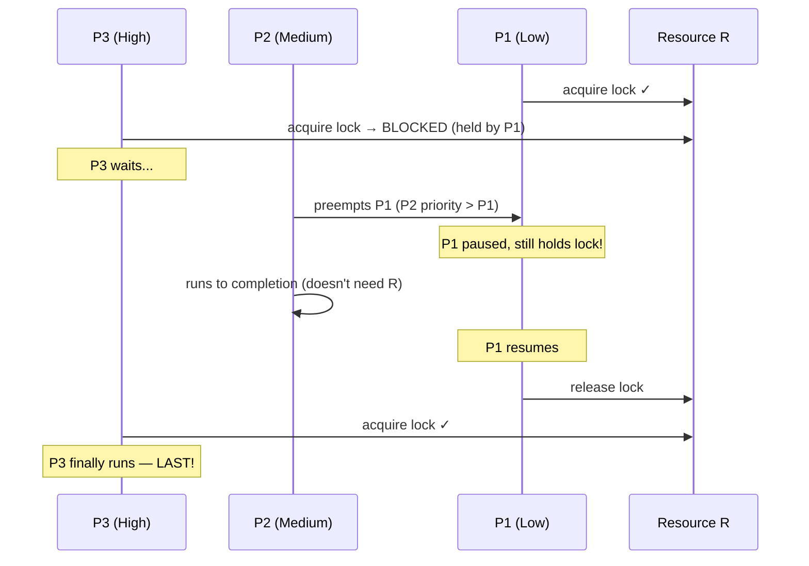

# Priority Inversion in OS

> Priority inversion happens when a high-priority process is forced to wait for a low-priority process to release a shared resource — made worse when medium-priority processes preempt the lock holder, causing the highest-priority task to run last; it is fixed by temporarily boosting the lock holder's priority (Priority Inheritance or Priority Ceiling Protocol).

---

## Table of Contents

1. [What Is Priority Inversion?](#1-what-is-priority-inversion)
2. [Step-by-Step Scenario](#2-step-by-step-scenario)
3. [Why It Is Dangerous](#3-why-it-is-dangerous)
4. [Famous Example: Mars Pathfinder (1997)](#4-famous-example-mars-pathfinder-1997)
5. [Causes of Priority Inversion](#5-causes-of-priority-inversion)
6. [Solution 1 — Priority Inheritance Protocol (PIP)](#6-solution-1--priority-inheritance-protocol-pip)
7. [Solution 2 — Priority Ceiling Protocol (PCP)](#7-solution-2--priority-ceiling-protocol-pcp)
8. [Comparison of Solutions](#8-comparison-of-solutions)
9. [Semaphore Code Example](#9-semaphore-code-example)
10. [Priority Inversion vs Starvation vs Deadlock](#10-priority-inversion-vs-starvation-vs-deadlock)
11. [Key Takeaways](#11-key-takeaways)

---

## 1. What Is Priority Inversion?

**Priority inversion** is a scheduling anomaly where a **high-priority process is forced to wait** behind a lower-priority process because the lower-priority process holds a resource (mutex/semaphore) that the high-priority process needs.

**VIP payment machine analogy:**

```
  VIP customer (P_high) arrives at coffee shop
  Wants to pay → payment machine is IN USE
  Regular customer (P_low) is using the machine
  Another customer (P_medium) cuts in line while P_low uses machine

  VIP must wait for:
    1. P_medium to finish (doesn't even use the machine!)
    2. P_low to finish and release the machine

  The HIGHEST priority customer runs LAST → priority inversion!
```

In normal priority scheduling:

```
  Expected:  P_high → P_medium → P_low
  Actual:    P_low (holds lock) ... P_medium (preempts) ... P_low resumes ... P_high

  P_high effectively runs after P_medium — priorities are INVERTED
```

---

## 2. Step-by-Step Scenario

**Three processes, one shared resource R:**

| Process | Priority           | Resource R      |
| ------- | ------------------ | --------------- |
| P1      | Low (1 = lowest)   | Holds lock on R |
| P2      | Medium (2)         | Does NOT need R |
| P3      | High (3 = highest) | Needs lock on R |

**Timeline without any fix:**

```
  TIME ──────────────────────────────────────────────────────────────►

  t=0:  P1 starts, acquires lock on R
        ─────[P1 holds R]──────────────────────────────────────────►

  t=1:  P3 arrives, tries to acquire R → R is locked → P3 BLOCKS
        P3: WAITING ──────────────────────────────────────────────►

  t=2:  P2 arrives, priority > P1 → P2 PREEMPTS P1
        P1 is paused (still holds lock!)
        ─────────────────────[P2 runs (no R needed)]──────────────►

  t=4:  P2 finishes → P1 resumes (now highest ready priority)
        ──────────────────────────────[P1 resumes, releases R]────►

  t=5:  P3 finally acquires R and runs
        ────────────────────────────────────────────[P3 runs]─────►

  Execution order: P1 → P2 → P1 → P3
  P3 (highest priority!) runs LAST — after P2 (medium priority)!
```



---

## 3. Why It Is Dangerous

In normal systems, a delayed high-priority task is merely an inconvenience. In **real-time systems**, it is catastrophic:

```
  Real-Time System Examples:
  ──────────────────────────────────────────────────────────────────
  Anti-lock Brake System (ABS):
    High-priority: Brake control (must respond in <5ms)
    Low-priority:  Sensor logging (holds shared buffer)
    Medium-priority: Diagnostics (preempts sensor logging)
    → Priority inversion: brake response delayed → accident

  Airbag Controller:
    High-priority: Airbag deployment (must fire within milliseconds)
    Low-priority:  Data recording (holds memory lock)
    → Priority inversion: airbag fires too late

  Spacecraft:
    High-priority: Communication system (see Mars Pathfinder)
    → System resets, mission at risk
```

**Two failure modes:**

1. **Bounded inversion** — P_high waits only until P_low releases the lock (acceptable)
2. **Unbounded inversion** — P_medium keeps preempting P_low, delaying P_high indefinitely (dangerous)

---

## 4. Famous Example: Mars Pathfinder (1997)

```
  MARS PATHFINDER — Priority Inversion in Space

  OS: VxWorks (real-time OS)
  Problem discovered: July 1997, days after landing

  Processes involved:
    High:   ASI/MET communication bus task (must run frequently)
    Low:    Meteorological data gathering (held shared semaphore)
    Medium: Several background tasks (kept preempting low task)

  What happened:
    1. Low-priority met task acquired shared semaphore
    2. High-priority bus task tried to acquire same semaphore → BLOCKED
    3. Medium-priority tasks preempted the met task repeatedly
    4. Bus task missed its deadline → watchdog timer detected it
    5. Watchdog reset the entire system
    6. Repeated resets → mission threatened

  Fix applied remotely from Earth:
    Engineers enabled the "priority inheritance" flag
    in VxWorks semaphore creation
    → Problem resolved with a one-line config change!
```

This incident made priority inversion famous and is now a standard case study in real-time OS design.

---

## 5. Causes of Priority Inversion

Priority inversion requires all of these conditions to occur together:

```
  1. Priority-based preemptive scheduling
         (the scheduler can interrupt a lower-priority task)

  2. Shared resource protected by a lock (mutex/semaphore)
         (only one process can hold it at a time)

  3. A LOW-priority process acquires the resource first

  4. A HIGH-priority process requests the same resource
         (and blocks, waiting for the lock)

  5. A MEDIUM-priority process arrives and preempts the low-priority process
         (which still holds the lock!)

  Result: HIGH waits for MEDIUM, even though MEDIUM doesn't use the resource
```

**Without condition 5** (no medium-priority process), the inversion is **bounded** — P_high waits only as long as P_low's critical section, which is usually short and acceptable.

**With condition 5**, the inversion is **unbounded** — P_high waits for all medium-priority processes to finish, which can be arbitrarily long.

---

## 6. Solution 1 — Priority Inheritance Protocol (PIP)

**Idea:** When a high-priority process blocks on a resource, the process currently holding that resource **inherits the high priority temporarily**.

```
  Rule: If P_high blocks waiting for a lock held by P_low,
        then P_low's effective priority = max(P_low.priority, P_high.priority)
        until P_low releases the lock.
```

**Same scenario WITH Priority Inheritance:**

```
  t=0:  P1 (priority 1) acquires lock on R

  t=1:  P3 (priority 3) tries to acquire R → BLOCKED
        *** P1 INHERITS priority 3 from P3 ***
        P1's effective priority = 3 (was 1)

  t=2:  P2 (priority 2) arrives
        P2 tries to preempt P1... but P1 now has priority 3!
        P2 (priority 2) CANNOT preempt P1 (priority 3) → P2 waits

  t=3:  P1 finishes critical section, releases lock
        P1 returns to original priority 1

  t=4:  P3 acquires lock, runs (highest ready priority)

  t=5:  P2 runs

  Execution order: P1 (boosted) → P3 → P2  ✓  Correct!
  P3 runs before P2, as intended.
```

```
  Priority Timeline:

  P1: ─[prio=1]─[BOOST to prio=3]─────────[release, back to prio=1]─►
  P2: ─────────────────────────────[wait]──[runs]─────────────────────►
  P3: ─────────[blocks on R]───────────────[runs after P1 releases]───►
                     ▲
                     P1 inherits P3's priority here
```

**Limitation:** With multiple locks and multiple processes, priority can chain through several hops (transitive inheritance). Implementation is complex.

---

## 7. Solution 2 — Priority Ceiling Protocol (PCP)

**Idea:** Each resource is pre-assigned a **priority ceiling** = the highest priority of any process that might ever lock it. When any process locks the resource, it **immediately inherits the ceiling priority** — even before any high-priority process blocks.

```
  Setup:
  Resource R → ceiling priority = 3  (P3 is the highest-priority user of R)

  Rule: When any process acquires R, its effective priority = max(own, ceiling)
```

**Same scenario WITH Priority Ceiling:**

```
  t=0:  P1 (priority 1) acquires lock on R
        *** P1 IMMEDIATELY gets priority 3 (ceiling of R) ***

  t=1:  P3 tries to acquire R → BLOCKED (P1 holds it at priority 3)
        P2 (priority 2) cannot preempt P1 (now priority 3)

  t=2:  P1 finishes critical section, releases lock
        P1 returns to original priority 1

  t=3:  P3 acquires lock, runs

  t=4:  P2 runs

  Execution order: P1 (at ceiling) → P3 → P2  ✓  Correct!
  Bonus: No blocking on P3's part when it finally gets the lock
```

**Extra benefit:** PCP can prevent **deadlocks** — because a process can only acquire a resource if its priority is strictly higher than the ceiling of all currently locked resources, preventing circular lock acquisition.

**Limitation:** You must know in advance which processes will use which resources, so the ceiling can be pre-assigned.

---

## 8. Comparison of Solutions

| Aspect                     | Priority Inheritance (PIP)        | Priority Ceiling (PCP)                |
| -------------------------- | --------------------------------- | ------------------------------------- |
| When priority changes      | When high-priority process BLOCKS | Immediately upon resource acquisition |
| Knowledge required upfront | None — purely reactive            | Must know resource usage patterns     |
| Blocking time for P_high   | Can be longer (waits for P_low)   | Shorter and more predictable          |
| Implementation complexity  | Moderate (handle chains)          | Higher (pre-assign ceilings)          |
| Prevents deadlock?         | No                                | Yes (in some formulations)            |
| CPU overhead               | Lower                             | Slightly higher                       |
| Best for                   | General-purpose systems           | Hard real-time, safety-critical       |
| Real-world example         | Mars Pathfinder fix (VxWorks)     | RTOS, automotive, aerospace           |

---

## 9. Semaphore Code Example

```c
// Shared resource protected by semaphore
semaphore mutex = 1;

// ── WITHOUT priority inheritance ─────────────────────────────────
// P1 (Low priority = 1)
void P1() {
    wait(mutex);              // Acquires lock
    perform_long_operation(); // Critical section
    signal(mutex);            // Releases lock
}

// P2 (Medium priority = 2) — doesn't need mutex
void P2() {
    perform_computation();    // Preempts P1 while P1 holds mutex
}

// P3 (High priority = 3)
void P3() {
    wait(mutex);   // BLOCKS — held by P1
    urgent_task(); // Critical section
    signal(mutex); // Releases lock
}

// Timeline WITHOUT inheritance:
//   P1 locks → P3 blocks → P2 preempts P1 → P2 runs →
//   P1 resumes → P1 unlocks → P3 runs
//   P3 waited for BOTH P1 and P2!

// ── WITH priority inheritance ─────────────────────────────────────
// Same code, but OS applies PIP automatically:
//   P1 locks → P3 blocks → OS boosts P1 to priority 3 →
//   P2 cannot preempt → P1 unlocks → P3 runs → P2 runs
//   P3 waited only for P1's critical section!
```

**In VxWorks (the Mars Pathfinder OS):**

```c
// Creating a mutex WITH priority inheritance
SEM_ID mutex = semMCreate(SEM_Q_PRIORITY | SEM_INVERSION_SAFE, SEM_FULL);
//                                              ^^^^^^^^^^^^^^^^^^^
//                        This flag enables priority inheritance!
// The Pathfinder fix was enabling this one flag.
```

**In POSIX (Linux/Unix):**

```c
pthread_mutex_t mutex;
pthread_mutexattr_t attr;

pthread_mutexattr_init(&attr);
pthread_mutexattr_setprotocol(&attr, PTHREAD_PRIO_INHERIT); // PIP
// or:
pthread_mutexattr_setprotocol(&attr, PTHREAD_PRIO_PROTECT); // PCP (with ceiling)
pthread_mutexattr_setprioceiling(&attr, ceiling_priority);

pthread_mutex_init(&mutex, &attr);
```

---

## 10. Priority Inversion vs Starvation vs Deadlock

| Aspect             | Priority Inversion                     | Starvation                          | Deadlock                           |
| ------------------ | -------------------------------------- | ----------------------------------- | ---------------------------------- |
| Who is affected    | High-priority process                  | Low-priority process                | Multiple processes (all blocked)   |
| Cause              | Low-priority holds resource high needs | Scheduler always picks someone else | Circular resource dependency       |
| Process state      | BLOCKED (waiting for lock)             | READY (never selected)              | BLOCKED (waiting for each other)   |
| Duration           | Temporary (ends when lock is released) | Can be indefinite                   | Permanent (without intervention)   |
| Solution           | Priority Inheritance / Ceiling         | Aging                               | Prevention / Avoidance / Detection |
| Can self-resolve?  | Yes, if medium tasks eventually finish | No                                  | No                                 |
| Resource involved? | Yes (shared resource)                  | No (just CPU time)                  | Yes (circular hold-and-wait)       |

```
  PRIORITY INVERSION:   P_high BLOCKED ──waiting for lock──► P_low (holds lock)
  STARVATION:           P_low  READY   ──never selected by──► scheduler
  DEADLOCK:             P1 BLOCKED ──waiting for R2──► P2 BLOCKED ──waiting for R1──► P1
```

---

## 11. Key Takeaways

- **Priority inversion** = a high-priority process waits behind a low-priority one because the low-priority process holds a shared resource (mutex/semaphore) the high-priority one needs
- It becomes **unbounded** when medium-priority processes preempt the lock holder, delaying the high-priority process indefinitely
- The **Mars Pathfinder (1997)** incident is the most famous real-world example — fixed remotely by enabling one flag in VxWorks
- Root causes: preemptive scheduling + shared locks + different-priority processes
- **Priority Inheritance Protocol (PIP):** When P_high blocks on a lock, P_low inherits P_high's priority until it releases the lock — reactive, simple, no upfront knowledge needed
- **Priority Ceiling Protocol (PCP):** Lock is pre-assigned a ceiling priority; any process that acquires the lock immediately gets the ceiling priority — proactive, prevents deadlock, but needs upfront resource-usage knowledge
- PIP is sufficient for most general-purpose systems; PCP is preferred in hard real-time and safety-critical systems
- In POSIX: `PTHREAD_PRIO_INHERIT` enables PIP; `PTHREAD_PRIO_PROTECT` enables PCP
- Priority inversion is **different from starvation** (high vs low priority affected) and **different from deadlock** (temporary vs permanent block)
- Without these protocols, high-priority tasks in real-time systems can miss critical deadlines — potentially fatal in safety systems
