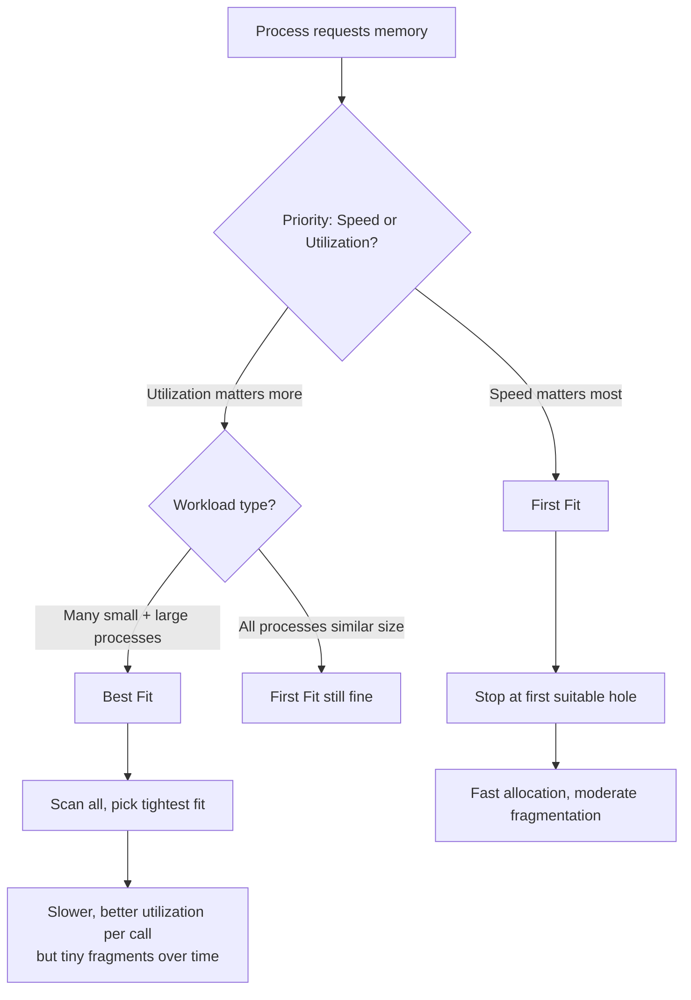

# First Fit vs Best Fit vs Worst Fit Memory Allocation

> When the OS needs to place a process in RAM, it must choose from available free memory blocks (holes); the three main strategies — First Fit, Best Fit, and Worst Fit — differ in which hole they pick, each trading search speed against fragmentation behavior.

---

## Table of Contents

1. [What Is Contiguous Memory Allocation?](#1-what-is-contiguous-memory-allocation)
2. [The Problem: Choosing a Hole](#2-the-problem-choosing-a-hole)
3. [First Fit](#3-first-fit)
4. [Best Fit](#4-best-fit)
5. [Worst Fit](#5-worst-fit)
6. [Side-by-Side Comparison](#6-side-by-side-comparison)
7. [Fragmentation](#7-fragmentation)
8. [Which Strategy Wins in Practice?](#8-which-strategy-wins-in-practice)
9. [Key Takeaways](#9-key-takeaways)

---

## 1. What Is Contiguous Memory Allocation?

In **contiguous memory allocation**, each process occupies one single continuous block of RAM addresses. The whole process must fit in an unbroken stretch — no gaps, no splitting across distant parts of memory.

**Theater seating analogy:**

```
  Theater rows = memory blocks
  Group of friends = one process
  Rule: the entire group must sit together in a single row

  ┌─────────────────────────────────────────────────────────────────┐
  │  Row A: 10 seats  │  Row B: 5 seats  │  Row C: 8 seats  │ ...  │
  └─────────────────────────────────────────────────────────────────┘

  A group of 7 cannot split across rows — needs one row with ≥ 7 seats
```

Over time, as processes load and unload, memory develops **holes** (free blocks scattered throughout). The OS must pick the right hole for each incoming process.

---

## 2. The Problem: Choosing a Hole

Assume we start with five free memory blocks and four processes arrive in order:

**Available blocks (holes):**

| Block | Size   |
| ----- | ------ |
| B1    | 100 KB |
| B2    | 500 KB |
| B3    | 200 KB |
| B4    | 300 KB |
| B5    | 600 KB |

**Processes to allocate:**

| Process | Size   |
| ------- | ------ |
| P1      | 212 KB |
| P2      | 417 KB |
| P3      | 112 KB |
| P4      | 426 KB |

```
  Memory layout at start:
  ┌───────┬───────────┬───────┬───────┬───────────┐
  │ B1    │ B2        │ B3    │ B4    │ B5        │
  │ 100KB │ 500KB     │ 200KB │ 300KB │ 600KB     │
  │ free  │ free      │ free  │ free  │ free      │
  └───────┴───────────┴───────┴───────┴───────────┘
```

Each strategy answers: **which block gets picked?**

---

## 3. First Fit

### How It Works

Scan the free block list **from the beginning** and allocate the **first block that is large enough**. Stop searching immediately once a fit is found.

> Like parking your car in the first open spot you see that fits — no comparison shopping, just grab the first available.

### Allocation Walkthrough

```
  P1 (212 KB):
    Check B1 (100 KB) → too small ✗
    Check B2 (500 KB) → fits ✓  → allocate B2, 288 KB remains in B2

  P2 (417 KB):
    Check B1 (100 KB) → too small ✗
    Check B2 (288 KB remaining) → too small ✗
    Check B3 (200 KB) → too small ✗
    Check B4 (300 KB) → too small ✗
    Check B5 (600 KB) → fits ✓  → allocate B5, 183 KB remains in B5

  P3 (112 KB):
    Check B1 (100 KB) → too small ✗
    Check B2 (288 KB remaining) → fits ✓  → allocate B2, 176 KB remains in B2

  P4 (426 KB):
    Check B1 (100 KB) → too small ✗
    Check B2 (176 KB remaining) → too small ✗
    Check B3 (200 KB) → too small ✗
    Check B4 (300 KB) → too small ✗
    Check B5 (183 KB remaining) → too small ✗
    → No suitable block found ✗  FAILS
```

### After First Fit Allocation

| Block  | Original | Allocated To | Remaining         |
| ------ | -------- | ------------ | ----------------- |
| B1     | 100 KB   | —            | 100 KB            |
| B2     | 500 KB   | P1, P3       | 176 KB            |
| B3     | 200 KB   | —            | 200 KB            |
| B4     | 300 KB   | —            | 300 KB            |
| B5     | 600 KB   | P2           | 183 KB            |
| **P4** | —        | —            | **NOT allocated** |

```
  Final memory layout (First Fit):
  ┌───────┬──────┬──────┬──────┬───────┬──────┬───────────┐
  │ B1    │ P1   │  P3  │ B2   │  B3   │  B4  │  P2  │ B5 │
  │ 100KB │212KB │112KB │176KB │ 200KB │300KB │417KB │183KB│
  │ free  │      │      │ free │ free  │ free │      │free │
  └───────┴──────┴──────┴──────┴───────┴──────┴──────┴────┘
```

### Pros and Cons

| Aspect        | Detail                                               |
| ------------- | ---------------------------------------------------- |
| Speed         | Fast — stops at the first fit, minimal scanning      |
| Fragmentation | Moderate — small fragments accumulate near the front |
| Large blocks  | Moderately preserved (skips to later blocks)         |
| Complexity    | Simple                                               |

---

## 4. Best Fit

### How It Works

Scan **all** free blocks and pick the **smallest block that is still large enough**. The goal is to leave the smallest possible leftover fragment.

> Like finding the parking spot that's just barely big enough for your car — snug fit, minimal waste.

### Allocation Walkthrough

```
  P1 (212 KB) → scan all, need smallest ≥ 212 KB:
    B2 (500 KB): fits, leftover = 288 KB
    B3 (200 KB): too small ✗
    B4 (300 KB): fits, leftover = 88 KB  ← smaller leftover
    B5 (600 KB): fits, leftover = 388 KB
    Best = B4 (88 KB leftover) ✓

  P2 (417 KB) → scan all, need smallest ≥ 417 KB:
    B2 (500 KB): fits, leftover = 83 KB  ← smallest leftover ✓
    B5 (600 KB): fits, leftover = 183 KB
    Best = B2 ✓

  P3 (112 KB) → scan all, need smallest ≥ 112 KB:
    B2 (83 KB remaining): too small ✗
    B3 (200 KB): fits, leftover = 88 KB  ← smallest leftover ✓
    B4 (88 KB remaining): too small ✗
    B5 (600 KB): fits, leftover = 488 KB
    Best = B3 ✓

  P4 (426 KB) → scan all, need smallest ≥ 426 KB:
    B5 (600 KB): fits, leftover = 174 KB ✓  (only option)
    Best = B5 ✓
```

### After Best Fit Allocation

| Block | Original | Allocated To | Remaining |
| ----- | -------- | ------------ | --------- |
| B1    | 100 KB   | —            | 100 KB    |
| B2    | 500 KB   | P2           | 83 KB     |
| B3    | 200 KB   | P3           | 88 KB     |
| B4    | 300 KB   | P1           | 88 KB     |
| B5    | 600 KB   | P4           | 174 KB    |

All 4 processes allocated successfully!

```
  Final memory layout (Best Fit):
  ┌───────┬──────┬─────┬──────┬─────┬──────┬─────┬──────┬──────┐
  │  B1   │  P2  │ B2  │  P3  │ B3  │  P1  │ B4  │  P4  │  B5  │
  │ 100KB │417KB │83KB │112KB │88KB │212KB │88KB │426KB │174KB │
  │ free  │      │free │      │free │      │free │      │ free │
  └───────┴──────┴─────┴──────┴─────┴──────┴─────┴──────┴──────┘
```

### Pros and Cons

| Aspect        | Detail                                                           |
| ------------- | ---------------------------------------------------------------- |
| Speed         | Slow — must scan all blocks every time                           |
| Fragmentation | High — creates many tiny leftover fragments (83 KB, 88 KB, etc.) |
| Large blocks  | Good — large blocks are preserved for larger processes           |
| Complexity    | Moderate                                                         |

---

## 5. Worst Fit

### How It Works

Scan **all** free blocks and pick the **largest available block**. The idea is to leave a large-enough leftover that can still serve future processes.

> Like parking in the biggest available space — what remains is still a sizeable gap, not a useless sliver.

### Allocation Walkthrough

```
  P1 (212 KB) → pick largest ≥ 212 KB:
    B5 (600 KB) is the largest ✓  → allocate, 388 KB remains in B5

  P2 (417 KB) → pick largest ≥ 417 KB:
    B2 (500 KB) is the largest remaining ✓  → allocate, 83 KB remains in B2

  P3 (112 KB) → pick largest ≥ 112 KB:
    B5 (388 KB remaining) is the largest ✓  → allocate, 276 KB remains in B5

  P4 (426 KB) → pick largest ≥ 426 KB:
    Remaining blocks: B1=100KB, B2=83KB, B3=200KB, B4=300KB, B5=276KB
    None is ≥ 426 KB → FAILS ✗
```

### After Worst Fit Allocation

| Block  | Original | Allocated To | Remaining         |
| ------ | -------- | ------------ | ----------------- |
| B1     | 100 KB   | —            | 100 KB            |
| B2     | 500 KB   | P2           | 83 KB             |
| B3     | 200 KB   | —            | 200 KB            |
| B4     | 300 KB   | —            | 300 KB            |
| B5     | 600 KB   | P1, P3       | 276 KB            |
| **P4** | —        | —            | **NOT allocated** |

```
  Final memory layout (Worst Fit):
  ┌───────┬──────┬─────┬───────┬───────┬──────┬──────┬──────┐
  │  B1   │  P2  │ B2  │  B3   │  B4   │  P1  │  P3  │  B5  │
  │ 100KB │417KB │83KB │ 200KB │ 300KB │212KB │112KB │276KB │
  │ free  │      │free │ free  │ free  │      │      │ free │
  └───────┴──────┴─────┴───────┴───────┴──────┴──────┴──────┘
```

### Pros and Cons

| Aspect        | Detail                                               |
| ------------- | ---------------------------------------------------- |
| Speed         | Slow — must scan all blocks every time               |
| Fragmentation | Moderate — leftovers are larger than Best Fit leaves |
| Large blocks  | Poor — depletes the largest blocks first             |
| Complexity    | Moderate                                             |

---

## 6. Side-by-Side Comparison

| Criteria                 | First Fit             | Best Fit                       | Worst Fit                        |
| ------------------------ | --------------------- | ------------------------------ | -------------------------------- |
| Selection rule           | First block ≥ request | Smallest block ≥ request       | Largest block ≥ request          |
| Scan required            | Partial (stops early) | Full                           | Full                             |
| Search speed             | Fast                  | Slow                           | Slow                             |
| Leftover fragment size   | Medium                | Tiny (often unusable)          | Large (often reusable)           |
| Fragmentation type       | Moderate external     | High external (many tiny gaps) | Moderate external                |
| Large block preservation | Moderate              | Good                           | Poor (destroys big blocks first) |
| Memory utilization       | Good                  | Better per-allocation          | Poor overall                     |
| P4 allocated in example  | No                    | Yes                            | No                               |
| Typical usage            | General purpose       | Varied process size workloads  | Rarely used in practice          |

### Which Strategy Allocated All 4 Processes?

```
  Scenario result:
  ┌─────────┬───────────┬──────────┬───────────┐
  │ Process │ First Fit │ Best Fit │ Worst Fit │
  ├─────────┼───────────┼──────────┼───────────┤
  │ P1      │    ✅     │    ✅    │    ✅     │
  │ P2      │    ✅     │    ✅    │    ✅     │
  │ P3      │    ✅     │    ✅    │    ✅     │
  │ P4      │    ❌     │    ✅    │    ❌     │
  └─────────┴───────────┴──────────┴───────────┘

  Best Fit won this scenario by preserving medium-sized blocks
  for P4 instead of wasting large blocks on small processes.
```

---

## 7. Fragmentation

### External Fragmentation

When free memory is **scattered across small non-contiguous holes**, even if the total free space is enough, no single hole is big enough for the process.

```
  Example: Need 400 KB process

  Free holes: 150 KB | 120 KB | 180 KB  → total = 450 KB (enough!)
  But no single hole ≥ 400 KB           → CANNOT allocate!

  This is external fragmentation.
```

**All three strategies can cause external fragmentation.** Best Fit creates the most tiny fragments. First Fit tends to fragment the beginning of the list. Worst Fit erodes large blocks.

### Compaction (the fix)

The OS can periodically **compact** memory — shuffle processes together to merge all free holes into one large block. This is expensive (requires moving processes) and needs execution-time address binding so relocated processes still work.

```
  Before compaction:
  [P1 200KB][Free 150KB][P2 300KB][Free 120KB][P3 100KB][Free 180KB]

  After compaction:
  [P1 200KB][P2 300KB][P3 100KB][Free 450KB]

  Now a 400 KB process can fit!
```

### Internal Fragmentation

When the OS allocates a **fixed-size partition** slightly larger than the process needs, the unused portion inside the allocated block is wasted. This is **internal fragmentation**.

```
  Block size = 512 KB, Process needs 500 KB
  Wasted = 12 KB (internal — inside the allocated block, unusable)
```

> External: wasted space **between** blocks. Internal: wasted space **within** an allocated block.

---

## 8. Which Strategy Wins in Practice?



**Verdict:**

- **First Fit** is the most commonly used in practice. It is fast and research shows it performs comparably to Best Fit in memory utilization over time, despite seeming less optimal per allocation.
- **Best Fit** sounds ideal but the tiny fragments it leaves behind often become permanently unusable, making overall utilization worse in the long run.
- **Worst Fit** is rarely used. It quickly destroys the large blocks a system depends on for big processes.

**Modern OS enhancements to First Fit:**

- Maintain **separate free lists** for different block size ranges (avoid scanning tiny blocks for large requests)
- Use **Next Fit** — a variation that resumes scanning from where the last allocation happened (prevents fragmentation buildup at the front)
- Use **buddy system allocation** — splits and merges blocks in powers of 2 for fast management

---

## 9. Key Takeaways

- **Contiguous allocation** places each process in one unbroken stretch of RAM
- The OS chooses among free holes (**holes** = free memory blocks scattered in RAM)
- **First Fit** — grab the first hole that fits; fast, simple, moderate fragmentation; most common in practice
- **Best Fit** — find the tightest-fitting hole; preserves large blocks but creates many tiny unusable fragments over time
- **Worst Fit** — take the largest hole; leaves bigger leftovers in theory, but quickly consumes the large blocks a system needs; rarely used
- All three cause **external fragmentation** — free memory scattered in pieces too small to be useful
- **Compaction** can fix external fragmentation but is expensive (process relocation + execution-time binding required)
- **Internal fragmentation** happens when allocated blocks are larger than the process needs (the extra bytes inside the block go wasted)
- In benchmarks, First Fit and Best Fit perform similarly in utilization, but First Fit is faster — giving it the practical edge
