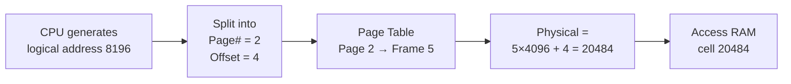
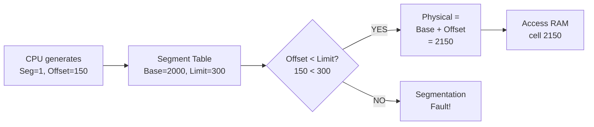

# Paging vs Segmentation in OS

> Paging divides memory into equal-sized fixed blocks (pages/frames) to eliminate external fragmentation; segmentation divides memory into variable-sized logical units (code, data, stack) to match program structure — modern OSes use paging, but both concepts underpin all memory management.

---

## Table of Contents

1. [The Core Problem Both Solve](#1-the-core-problem-both-solve)
2. [Paging](#2-paging)
3. [Paging Address Translation](#3-paging-address-translation)
4. [Paging: Advantages and Disadvantages](#4-paging-advantages-and-disadvantages)
5. [Segmentation](#5-segmentation)
6. [Segmentation Address Translation](#6-segmentation-address-translation)
7. [Segmentation: Advantages and Disadvantages](#7-segmentation-advantages-and-disadvantages)
8. [Memory Protection and Sharing](#8-memory-protection-and-sharing)
9. [Paging vs Segmentation: Side-by-Side](#9-paging-vs-segmentation-side-by-side)
10. [Segmented Paging (Hybrid)](#10-segmented-paging-hybrid)
11. [Real-World Usage](#11-real-world-usage)
12. [Key Takeaways](#12-key-takeaways)

---

## 1. The Core Problem Both Solve

Both paging and segmentation solve the same root issue: **how to give each process the illusion of a private, continuous address space while sharing one physical RAM.**

```
  THE PROBLEM:
  ┌────────────────────────────────────────────────────────┐
  │  Physical RAM is one long strip of numbered cells      │
  │  Multiple processes all need to use it simultaneously  │
  │  Processes may be larger than any single free hole     │
  │  Processes must not touch each other's memory          │
  └────────────────────────────────────────────────────────┘

  SOLUTION A — PAGING:      chop everything into equal pieces
  SOLUTION B — SEGMENTATION: chop by logical meaning (code/data/stack)
```

---

## 2. Paging

### What Is It?

**Paging** divides both physical RAM and a process's logical address space into **fixed-size equal blocks**.

- Blocks in **physical RAM** are called **frames**
- Blocks in **logical address space** are called **pages**
- Page size = Frame size (typically 4 KB in modern systems)

**Notebook analogy:**

```
  Physical RAM = notebook
  Frames       = fixed 4KB pages in the notebook
  Process pages = content you want to write

  You can write page 1 of your notes in any page of the notebook.
  The notebook doesn't care which physical page holds which logical page.
```

### Visual: Logical Pages → Physical Frames

```
  Process A logical space:          Physical RAM (frames):
  ┌─────────────────┐               ┌─────────────────┐
  │  Page 0 (4KB)   │─────────────► │  Frame 3 (4KB)  │
  │  Page 1 (4KB)   │─────────────► │  Frame 7 (4KB)  │
  │  Page 2 (4KB)   │─────────────► │  Frame 1 (4KB)  │
  │  Page 3 (4KB)   │─────────────► │  Frame 5 (4KB)  │
  └─────────────────┘               └─────────────────┘
        Contiguous                    Scattered! (pages can
        from process's view           be in any free frame)

  Page Table (per process):
  Page 0 → Frame 3
  Page 1 → Frame 7
  Page 2 → Frame 1
  Page 3 → Frame 5
```

Key insight: the **process sees contiguous memory** (pages 0,1,2,3 in order), but the **physical frames are scattered**. The page table holds the mapping.

---

## 3. Paging Address Translation

A logical address in paging has two parts:

$$\text{Logical Address} = \underbrace{\text{Page Number}}_{\text{index into page table}} \;|\; \underbrace{\text{Page Offset}}_{\text{byte within the page}}$$

```
  Given page size = 4096 bytes (4 KB):

  Page Number = Logical Address ÷ Page Size
  Page Offset = Logical Address mod Page Size
```

### Worked Example

```c
// System: page size = 4096 bytes
// Logical address = 8196

Step 1: Calculate page number and offset
  Page number = 8196 / 4096 = 2
  Page offset = 8196 % 4096 = 4

Step 2: Look up page table
  Page 2 → Frame 5   (from page table)

Step 3: Calculate physical address
  Physical = (Frame × Page Size) + Offset
           = (5 × 4096) + 4
           = 20484

Logical 8196  ──►  Physical 20484
```

### Address Translation Flow



### Page Table Entry Structure

```
  Each page table entry typically contains:
  ┌──────────────┬───────────┬──────┬───────┬─────────┐
  │ Frame Number │ Valid Bit │ Read │ Write │ Execute │
  └──────────────┴───────────┴──────┴───────┴─────────┘

  Valid Bit = 0 means page is not in RAM (triggers a page fault)
```

---

## 4. Paging: Advantages and Disadvantages

| Aspect                     | Detail                                                                                  |
| -------------------------- | --------------------------------------------------------------------------------------- |
| No external fragmentation  | All frames are the same size — any free frame fits any page                             |
| Simple allocation          | OS just needs to find any free frame                                                    |
| Easy swapping              | Individual pages can be swapped to disk independently                                   |
| Per-page protection        | Read/Write/Execute bits per page table entry                                            |
| **Internal fragmentation** | Last page is often partly empty (process needing 10 KB gets 3×4KB = 12 KB, wastes 2 KB) |
| **Page table overhead**    | Large processes need large page tables; every access requires a table lookup            |
| **No logical structure**   | Pages don't correspond to code vs data vs stack — they're arbitrary cuts                |

---

## 5. Segmentation

### What Is It?

**Segmentation** divides a process's logical address space into **variable-sized meaningful units** called **segments**. Each segment corresponds to a logical piece of the program:

```
  ┌────────────────────────────────────────────────────────┐
  │  Segment 0: Code   (read + execute only, ~2 KB)        │
  │  Segment 1: Data   (read + write, ~1 KB)               │
  │  Segment 2: Stack  (read + write, grows downward)      │
  │  Segment 3: Heap   (read + write, grows upward)        │
  └────────────────────────────────────────────────────────┘
```

**Library analogy:**

```
  Library = RAM
  Segments = sections (Fiction / Non-fiction / Reference / Magazines)

  Each section can be a different size — that's fine.
  Books within a section are grouped meaningfully, not split arbitrarily.
```

### Visual: Segment Table

```
  Process logical address space:
  ┌──────────────┐          Segment Table:              Physical RAM:
  │  Code seg 0  │──────►  [Seg 0: Base=1000, Limit=400] ──► RAM[1000–1399]
  │  Data seg 1  │──────►  [Seg 1: Base=2000, Limit=300] ──► RAM[2000–2299]
  │  Stack seg 2 │──────►  [Seg 2: Base=3500, Limit=200] ──► RAM[3500–3699]
  └──────────────┘

  Each segment lands wherever it fits — sizes differ!
  The segment table records where each segment starts (Base) and how big it is (Limit).
```

---

## 6. Segmentation Address Translation

A logical address in segmentation has two parts:

$$\text{Logical Address} = \underbrace{\text{Segment Number}}_{\text{index into segment table}} \;,\; \underbrace{\text{Offset}}_{\text{byte within segment}}$$

### Worked Example

```c
// Segment Table:
// Segment 0 (Code):  Base = 1000, Limit = 400
// Segment 1 (Data):  Base = 2000, Limit = 300
// Segment 2 (Stack): Base = 3500, Limit = 200

// Logical address: (Segment 1, Offset 150)

Step 1: Check bounds
  Offset (150) < Limit (300)? YES → valid ✓

Step 2: Calculate physical address
  Physical = Base + Offset = 2000 + 150 = 2150

// Logical (1, 150)  ──►  Physical 2150

// Invalid access: (Segment 1, Offset 350)
  Offset (350) < Limit (300)? NO → Segmentation Fault! ✗
```

### Address Translation Flow



---

## 7. Segmentation: Advantages and Disadvantages

| Aspect                       | Detail                                                                                    |
| ---------------------------- | ----------------------------------------------------------------------------------------- |
| Logical organization         | Segments match code/data/stack/heap — makes sense to programmer                           |
| Fine-grained protection      | Code segment: read+execute only; data: read+write; easy to enforce per-segment            |
| Sharing                      | Processes can share a segment (e.g., shared library) by pointing to the same base address |
| No internal fragmentation    | Segment is exactly as large as needed                                                     |
| **External fragmentation**   | Variable-size segments create gaps in RAM (just like contiguous allocation)               |
| **Complex allocation**       | Must find a contiguous hole large enough for each new segment                             |
| **Bounds checking overhead** | Every access requires comparing offset to limit                                           |

---

## 8. Memory Protection and Sharing

### Protection in Paging

Each page table entry stores permission bits:

```
  Page Table Entry:
  ┌──────────────┬───────────┬──────┬───────┬─────────┐
  │ Frame Number │ Valid Bit │ Read │ Write │ Execute │
  └──────────────┴───────────┴──────┴───────┴─────────┘

  Page 0: Frame 3, Valid=1, R=1, W=0, X=1   ← code (read + execute)
  Page 1: Frame 7, Valid=1, R=1, W=1, X=0   ← data  (read + write)
  Page 2: Frame 1, Valid=0, R=0, W=0, X=0   ← not in RAM → page fault on access
```

Write to a read-only page → hardware raises **protection fault** → OS handles.

### Protection in Segmentation

The segment table entry carries both limit (bounds check) and permissions:

```
  Segment Table Entry:
  ┌──────┬───────┬──────┬───────┬─────────┐
  │ Base │ Limit │ Read │ Write │ Execute │
  └──────┴───────┴──────┴───────┴─────────┘

  Segment 0 (Code):  Base=1000, Limit=400, R=1, W=0, X=1
  Segment 1 (Data):  Base=2000, Limit=300, R=1, W=1, X=0
  Segment 2 (Stack): Base=3500, Limit=200, R=1, W=1, X=0
```

### Sharing

```
  SEGMENTATION — easy sharing:
  Process A: Segment 0 (library) → Base=5000
  Process B: Segment 2 (library) → Base=5000  ← same segment!
  Both point to the same physical library code.

  PAGING — sharing possible but less intuitive:
  Process A page table: Page 3 → Frame 9
  Process B page table: Page 1 → Frame 9  ← same frame, different page numbers
  Requires careful coordination.
```

---

## 9. Paging vs Segmentation: Side-by-Side

| Aspect                 | Paging                             | Segmentation                                   |
| ---------------------- | ---------------------------------- | ---------------------------------------------- |
| Block size             | Fixed (e.g., 4 KB)                 | Variable (as large as the segment needs)       |
| Programmer visibility  | Invisible — OS handles it          | Visible — programmer may manage segments       |
| Address structure      | [Page# \| Offset]                  | [Segment# \| Offset]                           |
| Fragmentation          | Internal (last page partly wasted) | External (holes between segments)              |
| Table structure        | Page table (one entry per page)    | Segment table (one entry per segment)          |
| Protection             | Per-page bits (less natural)       | Per-segment bits (natural for code/data split) |
| Sharing                | Possible but clunky                | Easy (whole logical units shared)              |
| External fragmentation | None                               | Yes                                            |
| Internal fragmentation | Yes                                | None                                           |
| Used in modern OS      | Yes (Linux, Windows, macOS)        | Rarely alone; deprecated on 64-bit             |

---

## 10. Segmented Paging (Hybrid)

Many real systems combine both:

```
  Logical address → divided into Segments first (for logical meaning)
  Each Segment   → divided into Pages (for physical allocation)

  Logical address = [Segment# | Page# | Offset]

  Flow:
  Segment table → find segment's page table → find frame → physical address

  Benefit: logical organization of segmentation + no external fragmentation of paging
```

Intel x86 architecture used this model for years. Modern 64-bit systems have moved to a "flat" model (single segment of the whole 64-bit address space) backed entirely by paging.

---

## 11. Real-World Usage

```
  Linux:     Pure paging (4-level page tables on x86-64)
  Windows:   Pure paging (4/5-level page tables on x86-64)
  macOS:     Pure paging (ARM/x86-64)

  Historical:
  Intel x86 (32-bit): Segmented paging supported in hardware
  Intel x86-64:       Segmentation effectively disabled (base=0, limit=max)
                      — flat address space backed by paging

  Still uses segmentation:
  Embedded / RTOS:    Strong segment isolation for safety-critical code
  Some microcontrollers: Code/data/stack in separate physical memory banks
```

**Why did paging win?**

```
  ✓ Eliminates external fragmentation completely
  ✓ Fixed-size units = simple free-list management
  ✓ Natural fit for virtual memory (swap individual pages)
  ✓ Hardware TLB caches page table lookups → fast
  ✗ Segmentation: external fragmentation + complex hole-finding + variable-size swap units
```

---

## 12. Key Takeaways

- **Paging** = fixed-size pages (logical) mapped to frames (physical) via a page table
  - Eliminates external fragmentation; causes minor internal fragmentation
  - Address = [page number | offset] → table lookup → [frame | offset]
  - Permissions stored per page table entry (read/write/execute/valid bits)
- **Segmentation** = variable-size logical units (code/data/stack/heap) each with base + limit
  - Natural protection boundaries and easy sharing; causes external fragmentation
  - Address = [segment# | offset] → bounds check → base + offset
  - Permissions stored per segment table entry
- **Key structural difference:** paging translation is a simple **lookup**; segmentation translation is **bounds check + addition**
- **Fragmentation rule:** paging → internal; segmentation → external (they have opposite problems)
- **Sharing:** segmentation makes it easy (share entire logical units); paging requires matching page table entries to the same frame
- **Modern OSes use paging** (Linux, Windows, macOS) because it eliminates external fragmentation and pairs naturally with virtual memory
- **Segmented paging** (hybrid) combines both — logical segments each sub-divided into pages — used historically on x86
- Internal fragmentation in paging: process needs $n$ bytes → gets $\lceil n / \text{page size} \rceil$ pages → wastes up to $\text{page size} - 1$ bytes in the last page
