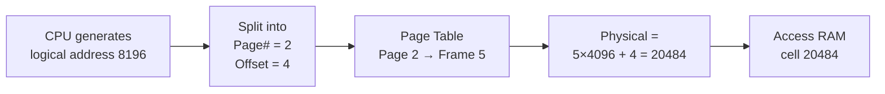
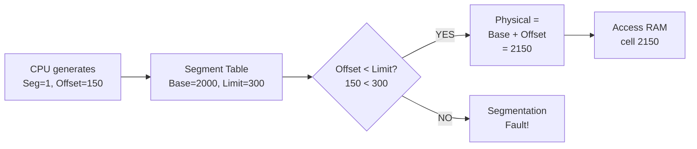

# Paging vs Segmentation in OS

> Paging divides memory into equal-sized fixed blocks (pages/frames) to eliminate external fragmentation; segmentation divides memory into variable-sized logical units (code, data, stack) to match program structure — modern OSes use paging, but both concepts underpin all memory management.

---

## Table of Contents

1. [The Core Problem Both Solve](#1-the-core-problem-both-solve)
2. [Paging](#2-paging)
3. [Paging Address Translation](#3-paging-address-translation)
4. [Paging: Advantages and Disadvantages](#4-paging-advantages-and-disadvantages)
5. [Segmentation](#5-segmentation)
6. [Segmentation Address Translation](#6-segmentation-address-translation)
7. [Segmentation: Advantages and Disadvantages](#7-segmentation-advantages-and-disadvantages)
8. [Memory Protection and Sharing](#8-memory-protection-and-sharing)
9. [Paging vs Segmentation: Side-by-Side](#9-paging-vs-segmentation-side-by-side)
10. [Segmented Paging (Hybrid)](#10-segmented-paging-hybrid)
11. [Real-World Usage](#11-real-world-usage)
12. [Key Takeaways](#12-key-takeaways)

---

## 1. The Core Problem Both Solve

Both paging and segmentation solve the same root issue: **how to give each process the illusion of a private, continuous address space while sharing one physical RAM.**

```
  THE PROBLEM:
  ┌────────────────────────────────────────────────────────┐
  │  Physical RAM is one long strip of numbered cells      │
  │  Multiple processes all need to use it simultaneously  │
  │  Processes may be larger than any single free hole     │
  │  Processes must not touch each other's memory          │
  └────────────────────────────────────────────────────────┘

  SOLUTION A — PAGING:      chop everything into equal pieces
  SOLUTION B — SEGMENTATION: chop by logical meaning (code/data/stack)
```

---

## 2. Paging

### What Is It?

**Paging** divides both physical RAM and a process's logical address space into **fixed-size equal blocks**.

- Blocks in **physical RAM** are called **frames**
- Blocks in **logical address space** are called **pages**
- Page size = Frame size (typically 4 KB in modern systems)

**Notebook analogy:**

```
  Physical RAM = notebook
  Frames       = fixed 4KB pages in the notebook
  Process pages = content you want to write

  You can write page 1 of your notes in any page of the notebook.
  The notebook doesn't care which physical page holds which logical page.
```

### Visual: Logical Pages → Physical Frames

```
  Process A logical space:          Physical RAM (frames):
  ┌─────────────────┐               ┌─────────────────┐
  │  Page 0 (4KB)   │─────────────► │  Frame 3 (4KB)  │
  │  Page 1 (4KB)   │─────────────► │  Frame 7 (4KB)  │
  │  Page 2 (4KB)   │─────────────► │  Frame 1 (4KB)  │
  │  Page 3 (4KB)   │─────────────► │  Frame 5 (4KB)  │
  └─────────────────┘               └─────────────────┘
        Contiguous                    Scattered! (pages can
        from process's view           be in any free frame)

  Page Table (per process):
  Page 0 → Frame 3
  Page 1 → Frame 7
  Page 2 → Frame 1
  Page 3 → Frame 5
```

Key insight: the **process sees contiguous memory** (pages 0,1,2,3 in order), but the **physical frames are scattered**. The page table holds the mapping.

---

## 3. Paging Address Translation

A logical address in paging has two parts:

$$\text{Logical Address} = \underbrace{\text{Page Number}}_{\text{index into page table}} \;|\; \underbrace{\text{Page Offset}}_{\text{byte within the page}}$$

```
  Given page size = 4096 bytes (4 KB):

  Page Number = Logical Address ÷ Page Size
  Page Offset = Logical Address mod Page Size
```

### Worked Example

```c
// System: page size = 4096 bytes
// Logical address = 8196

Step 1: Calculate page number and offset
  Page number = 8196 / 4096 = 2
  Page offset = 8196 % 4096 = 4

Step 2: Look up page table
  Page 2 → Frame 5   (from page table)

Step 3: Calculate physical address
  Physical = (Frame × Page Size) + Offset
           = (5 × 4096) + 4
           = 20484

Logical 8196  ──►  Physical 20484
```

### Address Translation Flow



### Page Table Entry Structure

```
  Each page table entry typically contains:
  ┌──────────────┬───────────┬──────┬───────┬─────────┐
  │ Frame Number │ Valid Bit │ Read │ Write │ Execute │
  └──────────────┴───────────┴──────┴───────┴─────────┘

  Valid Bit = 0 means page is not in RAM (triggers a page fault)
```

---

## 4. Paging: Advantages and Disadvantages

| Aspect                     | Detail                                                                                  |
| -------------------------- | --------------------------------------------------------------------------------------- |
| No external fragmentation  | All frames are the same size — any free frame fits any page                             |
| Simple allocation          | OS just needs to find any free frame                                                    |
| Easy swapping              | Individual pages can be swapped to disk independently                                   |
| Per-page protection        | Read/Write/Execute bits per page table entry                                            |
| **Internal fragmentation** | Last page is often partly empty (process needing 10 KB gets 3×4KB = 12 KB, wastes 2 KB) |
| **Page table overhead**    | Large processes need large page tables; every access requires a table lookup            |
| **No logical structure**   | Pages don't correspond to code vs data vs stack — they're arbitrary cuts                |

---

## 5. Segmentation

### What Is It?

**Segmentation** divides a process's logical address space into **variable-sized meaningful units** called **segments**. Each segment corresponds to a logical piece of the program:

```
  ┌────────────────────────────────────────────────────────┐
  │  Segment 0: Code   (read + execute only, ~2 KB)        │
  │  Segment 1: Data   (read + write, ~1 KB)               │
  │  Segment 2: Stack  (read + write, grows downward)      │
  │  Segment 3: Heap   (read + write, grows upward)        │
  └────────────────────────────────────────────────────────┘
```

**Library analogy:**

```
  Library = RAM
  Segments = sections (Fiction / Non-fiction / Reference / Magazines)

  Each section can be a different size — that's fine.
  Books within a section are grouped meaningfully, not split arbitrarily.
```

### Visual: Segment Table

```
  Process logical address space:
  ┌──────────────┐          Segment Table:              Physical RAM:
  │  Code seg 0  │──────►  [Seg 0: Base=1000, Limit=400] ──► RAM[1000–1399]
  │  Data seg 1  │──────►  [Seg 1: Base=2000, Limit=300] ──► RAM[2000–2299]
  │  Stack seg 2 │──────►  [Seg 2: Base=3500, Limit=200] ──► RAM[3500–3699]
  └──────────────┘

  Each segment lands wherever it fits — sizes differ!
  The segment table records where each segment starts (Base) and how big it is (Limit).
```

---

## 6. Segmentation Address Translation

A logical address in segmentation has two parts:

$$\text{Logical Address} = \underbrace{\text{Segment Number}}_{\text{index into segment table}} \;,\; \underbrace{\text{Offset}}_{\text{byte within segment}}$$

### Worked Example

```c
// Segment Table:
// Segment 0 (Code):  Base = 1000, Limit = 400
// Segment 1 (Data):  Base = 2000, Limit = 300
// Segment 2 (Stack): Base = 3500, Limit = 200

// Logical address: (Segment 1, Offset 150)

Step 1: Check bounds
  Offset (150) < Limit (300)? YES → valid ✓

Step 2: Calculate physical address
  Physical = Base + Offset = 2000 + 150 = 2150

// Logical (1, 150)  ──►  Physical 2150

// Invalid access: (Segment 1, Offset 350)
  Offset (350) < Limit (300)? NO → Segmentation Fault! ✗
```

### Address Translation Flow



---

## 7. Segmentation: Advantages and Disadvantages

| Aspect                       | Detail                                                                                    |
| ---------------------------- | ----------------------------------------------------------------------------------------- |
| Logical organization         | Segments match code/data/stack/heap — makes sense to programmer                           |
| Fine-grained protection      | Code segment: read+execute only; data: read+write; easy to enforce per-segment            |
| Sharing                      | Processes can share a segment (e.g., shared library) by pointing to the same base address |
| No internal fragmentation    | Segment is exactly as large as needed                                                     |
| **External fragmentation**   | Variable-size segments create gaps in RAM (just like contiguous allocation)               |
| **Complex allocation**       | Must find a contiguous hole large enough for each new segment                             |
| **Bounds checking overhead** | Every access requires comparing offset to limit                                           |

---

## 8. Memory Protection and Sharing

### Protection in Paging

Each page table entry stores permission bits:

```
  Page Table Entry:
  ┌──────────────┬───────────┬──────┬───────┬─────────┐
  │ Frame Number │ Valid Bit │ Read │ Write │ Execute │
  └──────────────┴───────────┴──────┴───────┴─────────┘

  Page 0: Frame 3, Valid=1, R=1, W=0, X=1   ← code (read + execute)
  Page 1: Frame 7, Valid=1, R=1, W=1, X=0   ← data  (read + write)
  Page 2: Frame 1, Valid=0, R=0, W=0, X=0   ← not in RAM → page fault on access
```

Write to a read-only page → hardware raises **protection fault** → OS handles.

### Protection in Segmentation

The segment table entry carries both limit (bounds check) and permissions:

```
  Segment Table Entry:
  ┌──────┬───────┬──────┬───────┬─────────┐
  │ Base │ Limit │ Read │ Write │ Execute │
  └──────┴───────┴──────┴───────┴─────────┘

  Segment 0 (Code):  Base=1000, Limit=400, R=1, W=0, X=1
  Segment 1 (Data):  Base=2000, Limit=300, R=1, W=1, X=0
  Segment 2 (Stack): Base=3500, Limit=200, R=1, W=1, X=0
```

### Sharing

```
  SEGMENTATION — easy sharing:
  Process A: Segment 0 (library) → Base=5000
  Process B: Segment 2 (library) → Base=5000  ← same segment!
  Both point to the same physical library code.

  PAGING — sharing possible but less intuitive:
  Process A page table: Page 3 → Frame 9
  Process B page table: Page 1 → Frame 9  ← same frame, different page numbers
  Requires careful coordination.
```

---

## 9. Paging vs Segmentation: Side-by-Side

| Aspect                 | Paging                             | Segmentation                                   |
| ---------------------- | ---------------------------------- | ---------------------------------------------- |
| Block size             | Fixed (e.g., 4 KB)                 | Variable (as large as the segment needs)       |
| Programmer visibility  | Invisible — OS handles it          | Visible — programmer may manage segments       |
| Address structure      | [Page# \| Offset]                  | [Segment# \| Offset]                           |
| Fragmentation          | Internal (last page partly wasted) | External (holes between segments)              |
| Table structure        | Page table (one entry per page)    | Segment table (one entry per segment)          |
| Protection             | Per-page bits (less natural)       | Per-segment bits (natural for code/data split) |
| Sharing                | Possible but clunky                | Easy (whole logical units shared)              |
| External fragmentation | None                               | Yes                                            |
| Internal fragmentation | Yes                                | None                                           |
| Used in modern OS      | Yes (Linux, Windows, macOS)        | Rarely alone; deprecated on 64-bit             |

---

## 10. Segmented Paging (Hybrid)

Many real systems combine both:

```
  Logical address → divided into Segments first (for logical meaning)
  Each Segment   → divided into Pages (for physical allocation)

  Logical address = [Segment# | Page# | Offset]

  Flow:
  Segment table → find segment's page table → find frame → physical address

  Benefit: logical organization of segmentation + no external fragmentation of paging
```

Intel x86 architecture used this model for years. Modern 64-bit systems have moved to a "flat" model (single segment of the whole 64-bit address space) backed entirely by paging.

---

## 11. Real-World Usage

```
  Linux:     Pure paging (4-level page tables on x86-64)
  Windows:   Pure paging (4/5-level page tables on x86-64)
  macOS:     Pure paging (ARM/x86-64)

  Historical:
  Intel x86 (32-bit): Segmented paging supported in hardware
  Intel x86-64:       Segmentation effectively disabled (base=0, limit=max)
                      — flat address space backed by paging

  Still uses segmentation:
  Embedded / RTOS:    Strong segment isolation for safety-critical code
  Some microcontrollers: Code/data/stack in separate physical memory banks
```

**Why did paging win?**

```
  ✓ Eliminates external fragmentation completely
  ✓ Fixed-size units = simple free-list management
  ✓ Natural fit for virtual memory (swap individual pages)
  ✓ Hardware TLB caches page table lookups → fast
  ✗ Segmentation: external fragmentation + complex hole-finding + variable-size swap units
```

---

## 11. Code Examples

> Working code that demonstrates Paging and Segmentation address translation in practice.

### C++ — Simple Version
Simulate paging (page number + offset → frame lookup) and segmentation (segment + offset → base+limit check) side by side.

```cpp
// Paging and Segmentation address translation
// Compile: g++ -std=c++17 paging_seg.cpp -o paging_seg

#include <iostream>
#include <string>
using namespace std;

// ===== PAGING =====
const int PAGE_SIZE = 256;  // each page/frame is 256 bytes

// Page table: index = logical page number, value = physical frame number (-1 = not in RAM)
int pageTable[] = {5, 3, -1, 8, 2};  // 5 logical pages

// Translate a logical address using paging.
// Logical address format: [page_number | offset]
int pagingTranslate(int logical) {
    int pageNum = logical / PAGE_SIZE;  // upper bits = page number
    int offset  = logical % PAGE_SIZE;  // lower bits = offset within page

    if (pageNum < 0 || pageNum >= 5) {
        cout << "  -> Invalid page number " << pageNum << " (segfault)\n";
        return -1;
    }
    if (pageTable[pageNum] == -1) {
        cout << "  -> Page fault! Page " << pageNum << " not in RAM\n";
        return -1;
    }
    int frame = pageTable[pageNum];
    return frame * PAGE_SIZE + offset;  // physical = frame * size + offset
}

// ===== SEGMENTATION =====
struct Segment {
    string name;
    int    base;   // physical start address
    int    limit;  // maximum bytes in this segment
};

// Segment table: code, data, stack segments
Segment segTable[] = {
    {"code",  1000, 600},
    {"data",  3000, 400},
    {"stack", 5000, 200},
};

// Translate a segmented address [segment_number, offset].
int segmentTranslate(int segNum, int offset) {
    if (segNum < 0 || segNum >= 3) {
        cout << "  -> Invalid segment " << segNum << "\n";
        return -1;
    }
    if (offset < 0 || offset >= segTable[segNum].limit) {
        cout << "  -> Segment overflow! offset " << offset
             << " >= limit " << segTable[segNum].limit << "\n";
        return -1;
    }
    return segTable[segNum].base + offset;  // physical = base + offset
}

int main() {
    cout << "=== PAGING (page size = " << PAGE_SIZE << " bytes) ===\n";
    // logical 0:   page 0, offset 0   -> frame 5, physical 1280
    // logical 100: page 0, offset 100 -> frame 5, physical 1380
    // logical 256: page 1, offset 0   -> frame 3, physical  768
    // logical 512: page 2, offset 0   -> page fault (page 2 = -1)
    // logical 770: page 3, offset 2   -> frame 8, physical 2050
    for (int la : {0, 100, 256, 512, 770}) {
        cout << "  Logical " << la << ": ";
        int pa = pagingTranslate(la);
        if (pa != -1)
            cout << "-> Physical " << pa
                 << " (page " << la/PAGE_SIZE << ", offset " << la%PAGE_SIZE << ")\n";
    }

    cout << "\n=== SEGMENTATION ===\n";
    // (seg 0, offset 100): code segment, 100 bytes in -> physical 1100
    // (seg 1, offset 200): data segment, 200 bytes in -> physical 3200
    // (seg 2, offset 500): stack limit is 200, overflow!
    for (auto [s, o] : vector<pair<int,int>>{{0,100},{1,200},{2,50},{2,500},{1,399}}) {
        cout << "  Seg " << s << " offset " << o << ": ";
        int pa = segmentTranslate(s, o);
        if (pa != -1)
            cout << "-> Physical " << pa
                 << " (" << segTable[s].name << " base=" << segTable[s].base << ")\n";
    }
    return 0;
}
```

### C++ — Medium / LeetCode Style
Paging with a TLB cache — count TLB hits vs misses; show how a 4-entry TLB cuts most page-table lookups.

```cpp
// Paging with TLB (Translation Lookaside Buffer)
// TLB is a small hardware cache: if the page is in TLB -> no page table walk.
// Compile: g++ -std=c++17 tlb.cpp -o tlb

#include <iostream>
#include <unordered_map>
#include <vector>
using namespace std;

const int PAGE_SIZE = 256;
const int TLB_SIZE  = 4;   // hardware TLB holds 4 entries (simulated, FIFO eviction)

// Full page table (16 pages; -1 = not in RAM)
int pageTable[16] = {5, 3, -1, 8, 2, 7, -1, 1, 9, -1, 6, 4, -1, 0, 11, 10};

unordered_map<int,int> tlb;          // page_number -> frame_number
vector<int>            tlbOrder;     // FIFO eviction order
int tlbHits = 0, tlbMisses = 0, pageFaults = 0;

int translate(int logical) {
    int pn  = logical / PAGE_SIZE;
    int off = logical % PAGE_SIZE;

    int frame;
    if (tlb.count(pn)) {
        // TLB hit: no memory access needed — answer is in the CPU cache
        tlbHits++;
        frame = tlb[pn];
    } else {
        // TLB miss: walk the page table (one extra memory access)
        tlbMisses++;
        if (pageTable[pn] == -1) {
            pageFaults++;
            cout << "  PAGE FAULT: page " << pn << " not in RAM\n";
            return -1;
        }
        frame = pageTable[pn];
        // Insert into TLB; evict oldest entry if full (FIFO)
        if ((int)tlb.size() == TLB_SIZE) {
            tlb.erase(tlbOrder.front());
            tlbOrder.erase(tlbOrder.begin());
        }
        tlb[pn] = frame;
        tlbOrder.push_back(pn);
    }
    return frame * PAGE_SIZE + off;
}

int main() {
    // Access the same pages repeatedly to see TLB hit rate improve
    vector<int> addresses = {0, 100, 256, 512, 0, 100, 770, 1024, 256, 0};

    cout << "=== Paging with TLB (size=" << TLB_SIZE
         << ", page=" << PAGE_SIZE << " bytes) ===\n";
    for (int la : addresses) {
        int pa = translate(la);
        if (pa != -1)
            cout << "  Logical " << la << " -> Physical " << pa << "\n";
    }

    int total = tlbHits + tlbMisses;
    cout << "\nTLB Hits:   " << tlbHits   << " / " << total << "\n";
    cout << "TLB Misses: " << tlbMisses  << " / " << total << "\n";
    cout << "Page Faults:" << pageFaults  << "\n";
    cout << "Hit Rate:   " << (100.0*tlbHits/total) << "%\n";
    return 0;
}
// Expected: 5 hits, 5 misses (including 1 page fault), hit rate 50%
```

### Python — Simple Version
Simulate both paging and segmentation address translation with step-by-step output.

```python
# Paging and Segmentation address translation side by side.
# Run: python paging_seg.py

PAGE_SIZE = 256  # bytes per page/frame

# Page table: index = page number, value = frame number (-1 = not in RAM)
page_table = [5, 3, -1, 8, 2]  # 5 logical pages

def paging_translate(logical: int) -> tuple[int | None, str]:
    """Decode logical into [page | offset], look up frame in page table."""
    page_num = logical // PAGE_SIZE
    offset   = logical %  PAGE_SIZE

    if page_num >= len(page_table):
        return None, f"invalid page {page_num}"
    if page_table[page_num] == -1:
        return None, f"page fault (page {page_num} not in RAM)"

    frame    = page_table[page_num]
    physical = frame * PAGE_SIZE + offset
    return physical, f"page {page_num} offset {offset} -> frame {frame}"


# Segment table: code, data, stack — each has a base address and a limit
segment_table = [
    {"name": "code",  "base": 1000, "limit": 600},
    {"name": "data",  "base": 3000, "limit": 400},
    {"name": "stack", "base": 5000, "limit": 200},
]

def segment_translate(seg_num: int, offset: int) -> tuple[int | None, str]:
    """Check segment bounds, then compute base + offset."""
    if seg_num >= len(segment_table):
        return None, "invalid segment number"
    seg = segment_table[seg_num]
    if offset >= seg["limit"]:
        return None, f"overflow (offset {offset} >= limit {seg['limit']})"
    return seg["base"] + offset, f"segment '{seg['name']}' offset {offset}"


def main():
    print("=== PAGING (page size = 256 bytes) ===")
    for la in [0, 100, 256, 512, 770]:
        pa, info = paging_translate(la)
        if pa is None:
            print(f"  Logical {la:5d} -> ERROR: {info}")
        else:
            print(f"  Logical {la:5d} -> Physical {pa:5d}  ({info})")

    print("\n=== SEGMENTATION ===")
    for sn, off in [(0, 100), (1, 200), (2, 50), (2, 500), (1, 399)]:
        pa, info = segment_translate(sn, off)
        if pa is None:
            print(f"  Seg {sn} offset {off:3d} -> ERROR: {info}")
        else:
            print(f"  Seg {sn} offset {off:3d} -> Physical {pa:5d}  ({info})")


main()
# Paging output:
#   Logical   0 -> Physical  1280  (page 0 offset 0 -> frame 5)
#   Logical 100 -> Physical  1380  (page 0 offset 100 -> frame 5)
#   Logical 256 -> Physical   768  (page 1 offset 0 -> frame 3)
#   Logical 512 -> ERROR: page fault (page 2 not in RAM)
#   Logical 770 -> Physical  2050  (page 3 offset 2 -> frame 8)
```

### Python — Medium Level
Paging with a TLB cache using an `OrderedDict` for LRU eviction; track hit rate.

```python
# Paging with TLB — hardware address cache simulation.
# Run: python tlb.py

from collections import OrderedDict

PAGE_SIZE    = 256
TLB_CAPACITY = 4  # hardware TLB holds 4 entries

# Full page table (16 pages; -1 = not in RAM)
page_table = [5, 3, -1, 8, 2, 7, -1, 1, 9, -1, 6, 4, -1, 0, 11, 10]

# TLB: OrderedDict acts as an LRU cache (most-recently used at the end)
tlb   = OrderedDict()
stats = {"hits": 0, "misses": 0, "faults": 0}


def translate(logical: int) -> int | None:
    pn  = logical // PAGE_SIZE
    off = logical %  PAGE_SIZE

    if pn in tlb:
        # TLB hit — no page table access needed
        stats["hits"] += 1
        tlb.move_to_end(pn)   # mark as most recently used
        frame = tlb[pn]
    else:
        # TLB miss — walk the page table in memory
        stats["misses"] += 1
        if page_table[pn] == -1:
            stats["faults"] += 1
            print(f"  PAGE FAULT: page {pn}")
            return None
        frame = page_table[pn]
        # Insert into TLB; evict LRU entry if full
        if len(tlb) == TLB_CAPACITY:
            tlb.popitem(last=False)   # remove least recently used
        tlb[pn] = frame

    return frame * PAGE_SIZE + off


def main():
    # Access the same pages repeatedly — TLB hits increase on repeated accesses
    addresses = [0, 100, 256, 512, 0, 100, 770, 1024, 256, 0]

    print(f"=== Paging with TLB (capacity={TLB_CAPACITY}, page={PAGE_SIZE}B) ===\n")
    for la in addresses:
        pa = translate(la)
        if pa is not None:
            print(f"  Logical {la:5d} -> Physical {pa:5d}")

    total    = stats["hits"] + stats["misses"]
    hit_rate = stats["hits"] / total * 100
    print(f"\nTLB Hits    : {stats['hits']}/{total}")
    print(f"TLB Misses  : {stats['misses']}/{total}  (incl. {stats['faults']} page fault(s))")
    print(f"Hit Rate    : {hit_rate:.0f}%")
    # 5 hits (repeated accesses to pages 0,1,3,4 already in TLB)
    # 5 misses (first access to each unique page, plus 1 page fault for page 2)


main()
```

---

## 12. Key Takeaways

- **Paging** = fixed-size pages (logical) mapped to frames (physical) via a page table
  - Eliminates external fragmentation; causes minor internal fragmentation
  - Address = [page number | offset] → table lookup → [frame | offset]
  - Permissions stored per page table entry (read/write/execute/valid bits)
- **Segmentation** = variable-size logical units (code/data/stack/heap) each with base + limit
  - Natural protection boundaries and easy sharing; causes external fragmentation
  - Address = [segment# | offset] → bounds check → base + offset
  - Permissions stored per segment table entry
- **Key structural difference:** paging translation is a simple **lookup**; segmentation translation is **bounds check + addition**
- **Fragmentation rule:** paging → internal; segmentation → external (they have opposite problems)
- **Sharing:** segmentation makes it easy (share entire logical units); paging requires matching page table entries to the same frame
- **Modern OSes use paging** (Linux, Windows, macOS) because it eliminates external fragmentation and pairs naturally with virtual memory
- **Segmented paging** (hybrid) combines both — logical segments each sub-divided into pages — used historically on x86
- Internal fragmentation in paging: process needs $n$ bytes → gets $\lceil n / \text{page size} \rceil$ pages → wastes up to $\text{page size} - 1$ bytes in the last page
