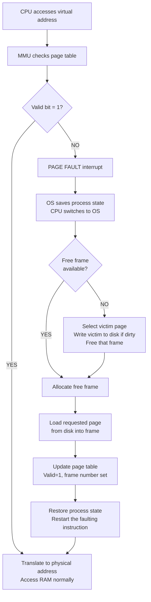

# Virtual Memory and Demand Paging

> Virtual memory makes every process believe it has more RAM than physically exists by using disk space as overflow; demand paging implements this lazily — pages are only loaded from disk into RAM when actually accessed, triggered by a page fault.

---

## Table of Contents

1. [What Is Virtual Memory?](#1-what-is-virtual-memory)
2. [How Virtual Memory Works](#2-how-virtual-memory-works)
3. [What Is Demand Paging?](#3-what-is-demand-paging)
4. [The Valid/Invalid Bit](#4-the-validinvalid-bit)
5. [Page Fault Handling — Step by Step](#5-page-fault-handling--step-by-step)
6. [Page Fault Walkthrough Example](#6-page-fault-walkthrough-example)
7. [Virtual Address Translation](#7-virtual-address-translation)
8. [Performance: Effective Access Time](#8-performance-effective-access-time)
9. [Advantages and Disadvantages](#9-advantages-and-disadvantages)
10. [Real-World Applications](#10-real-world-applications)
11. [Key Takeaways](#11-key-takeaways)

---

## 1. What Is Virtual Memory?

**Virtual memory** is a memory management technique that gives every process the illusion of a large, private, contiguous memory space — even when physical RAM is limited or fragmented.

The OS uses **disk space** (a swap partition or pagefile) as an extension of RAM. Pages that don't fit in physical RAM live on disk and are swapped in when needed.

**Library borrowing analogy:**

```
  Physical RAM = small reading desk (limited space)
  Disk (swap)  = library shelves (massive but far away)
  Pages        = books you need to read

  You keep only the books you're currently reading on your desk.
  When you need a book that's on the shelf, you walk over and get it.
  When your desk is full, you return a finished book to the shelf first.
```

**Three key benefits:**

```
  1. Programs can be larger than physical RAM
  2. More processes can run simultaneously
  3. Process isolation — each process has its own virtual address space,
     cannot accidentally read or write another's memory
```

---

## 2. How Virtual Memory Works

```
  Process's view (virtual):              Physical RAM:          Disk (swap):
  ┌─────────────────────────┐           ┌─────────────────┐    ┌─────────────────┐
  │  Page 0 (in RAM) ───────┼──────────►│ Frame 3         │    │                 │
  │  Page 1 (on disk) ──────┼───────────┼─────────────────┼───►│ Page 1 stored   │
  │  Page 2 (in RAM) ───────┼──────────►│ Frame 0         │    │                 │
  │  Page 3 (on disk) ──────┼───────────┼─────────────────┼───►│ Page 3 stored   │
  │  Page 4 (in RAM) ───────┼──────────►│ Frame 7         │    │                 │
  └─────────────────────────┘           └─────────────────┘    └─────────────────┘

  The process sees all pages 0-4 as if they are always there.
  In reality, only pages 0, 2, 4 are currently in physical RAM.
  Pages 1 and 3 live on disk — they'll be fetched if accessed.
```

**What manages this?**

- **Page table** — per-process table mapping virtual page numbers to physical frame numbers (or marking them as "on disk")
- **MMU** — hardware that intercepts every memory access and does the translation
- **OS** — handles page faults (disk I/O, page table updates)

---

## 3. What Is Demand Paging?

**Demand paging** = load a page into RAM **only when it is accessed**, not ahead of time.

When a process starts, **no pages are in RAM**. Pages are loaded one by one, only as the CPU tries to access them.

**Streaming analogy:**

```
  Downloading entire movie = loading all pages at startup (old approach)
  Streaming video          = demand paging (load only what's playing now)

  Streaming is faster to start, uses less storage, and you never
  download parts you never watch. Demand paging works the same way.
```

**Why it works in practice:** most programs follow the **locality of reference** principle:

- **Temporal locality** — recently accessed data will likely be accessed again soon
- **Spatial locality** — data near recently accessed data will likely be accessed soon

This means a small set of "hot" pages gets most of the accesses, so the other pages can safely stay on disk.

---

## 4. The Valid/Invalid Bit

Each page table entry contains a **valid/invalid bit**:

```
  Page Table Entry:
  ┌──────────────┬──────────────┬──────┬───────┬─────────┐
  │ Frame Number │ Valid/Invalid│ Read │ Write │ Execute │
  └──────────────┴──────────────┴──────┴───────┴─────────┘

  Valid   (1) = page is currently loaded in a physical frame → access directly
  Invalid (0) = page is on disk → access triggers a PAGE FAULT
```

```
  Example page table:
  Page 0: Frame 3, Valid=1   → in RAM, accessible
  Page 1: ——————, Valid=0   → on disk, page fault if accessed
  Page 2: Frame 0, Valid=1   → in RAM, accessible
  Page 3: ——————, Valid=0   → on disk, page fault if accessed
```

---

## 5. Page Fault Handling — Step by Step

A **page fault** is NOT a crash — it is a normal interrupt that tells the OS "I need this page from disk."



**The 9 steps in plain English:**

| Step | What Happens                                                 |
| ---- | ------------------------------------------------------------ |
| 1    | CPU tries to access a virtual address                        |
| 2    | MMU checks page table — valid bit = 0                        |
| 3    | MMU triggers page fault interrupt                            |
| 4    | OS saves the current process state (registers, PC)           |
| 5    | OS finds where the page lives on disk                        |
| 6    | OS finds a free frame (or evicts a victim page)              |
| 7    | Disk I/O: loads the page from disk into the frame            |
| 8    | OS updates page table: frame number set, valid bit = 1       |
| 9    | OS restores process state, restarts the faulting instruction |

The process never knows a page fault happened — it just sees the instruction complete.

---

## 6. Page Fault Walkthrough Example

**Setup:** 4 virtual pages, 3 physical frames

```
  Initial state — nothing loaded:
  Page Table: Page 0: Invalid | Page 1: Invalid | Page 2: Invalid | Page 3: Invalid
  Physical RAM: [Frame 0: empty] [Frame 1: empty] [Frame 2: empty]
```

| Step | Access | Page in RAM? | Action                                                                      | RAM State After              |
| ---- | ------ | ------------ | --------------------------------------------------------------------------- | ---------------------------- |
| 1    | Page 0 | No → fault   | Load Page 0 → Frame 0, valid=1                                              | F0=Page0, F1=–, F2=–         |
| 2    | Page 1 | No → fault   | Load Page 1 → Frame 1, valid=1                                              | F0=Page0, F1=Page1, F2=–     |
| 3    | Page 2 | No → fault   | Load Page 2 → Frame 2, valid=1                                              | F0=Page0, F1=Page1, F2=Page2 |
| 4    | Page 0 | Yes ✓        | Direct access, no fault                                                     | F0=Page0, F1=Page1, F2=Page2 |
| 5    | Page 3 | No → fault   | All frames full! Must evict a victim (e.g., Page 1) → Load Page 3 → Frame 1 | F0=Page0, F1=Page3, F2=Page2 |

Step 4 shows temporal locality in action — previously loaded pages avoid faults on re-access.

---

## 7. Virtual Address Translation

The CPU always generates **virtual addresses**. The MMU translates them to physical addresses using the page table.

A virtual address is split into two parts:

$$\text{Virtual Address} = \underbrace{\text{Page Number}}_{\lceil \log_2(\text{num pages}) \rceil \text{ bits}} \;|\; \underbrace{\text{Page Offset}}_{\log_2(\text{page size}) \text{ bits}}$$

**Rule of thumb for a 32-bit system with 4 KB pages:**

```
  Page size = 4096 = 2^12  → offset uses lower 12 bits
  Remaining 20 bits        → page number (can address 2^20 = 1M pages)

  Virtual Address (32 bits):
  ┌──────────────────────────────┬────────────────────────┐
  │  Page Number  (bits 31-12)   │  Offset  (bits 11-0)   │
  └──────────────────────────────┴────────────────────────┘
```

### Worked Example

```c
// Page size = 1 KB (1024 bytes = 2^10)
// Virtual address = 5200

Step 1: Split the address
  Page number = 5200 / 1024 = 5
  Page offset = 5200 % 1024 = 80

Step 2: Page table lookup
  Page 5 → Frame 2   (page table says page 5 is in frame 2)

Step 3: Compute physical address
  Physical = (Frame × Page size) + Offset
           = (2 × 1024) + 80
           = 2048 + 80
           = 2128

Virtual 5200  ──►  Physical 2128

If page 5 had valid=0, step 2 would trigger a page fault instead.
```

---

## 8. Performance: Effective Access Time

Every page fault costs a disk I/O — millions of times slower than RAM. Even a low fault rate hurts badly.

$$\text{EAT} = (1 - p) \times t_{\text{mem}} + p \times t_{\text{fault}}$$

Where:

- $p$ = page fault rate (probability that an access causes a fault)
- $t_{\text{mem}}$ = time to access RAM (nanoseconds)
- $t_{\text{fault}}$ = time to handle a page fault including disk I/O (milliseconds)

### Example Calculation

```c
// Realistic values:
memory_access_time = 100 ns
page_fault_time    = 10,000,000 ns  (10 ms — includes disk seek, rotational delay, transfer)
page_fault_rate    = 0.001          (0.1% of accesses fault)

EAT = (1 - 0.001) × 100 + 0.001 × 10,000,000
    = 0.999 × 100 + 0.001 × 10,000,000
    = 99.9 + 10,000
    = 10,099.9 ns

Normal RAM access:  100 ns
With 0.1% faults: ~10,100 ns  ← 101× SLOWER!
```

```
  Impact of page fault rate on EAT:

  Fault Rate │ EAT
  ───────────┼────────────
  0%         │ 100 ns        (pure RAM)
  0.01%      │ ~1,100 ns     (11× slower)
  0.1%       │ ~10,100 ns    (101× slower)
  1%         │ ~100,100 ns   (1001× slower)
  10%        │ ~1,000,100 ns (10,001× slower!)
```

This is why OSes invest heavily in smart page replacement algorithms and working set management — keeping the fault rate near zero is critical.

---

## 9. Advantages and Disadvantages

| Aspect             | Advantage                                     | Disadvantage                                  |
| ------------------ | --------------------------------------------- | --------------------------------------------- |
| Memory utilization | Only active pages consume RAM                 | Page table itself consumes memory             |
| Program size       | Programs can exceed physical RAM              | Excessive paging causes thrashing             |
| Multiprogramming   | More processes run simultaneously             | Complex OS memory management required         |
| Startup time       | Fast — only first-needed pages loaded (lazy)  | First access to each page incurs delay        |
| Security           | Process isolation via separate address spaces | Translation overhead on every access          |
| Flexibility        | Pages can live in any free frame              | Depends on disk speed for page fault recovery |

---

## 10. Real-World Applications

### Desktop / Server OS

```
  Linux:   swap partition (ext4 or dedicated swap area)
  Windows: pagefile.sys on C:\ drive
  macOS:   swap files in /private/var/vm/

  All use demand paging with multi-level page tables.
  SSD swap is ~1000× faster than HDD swap but still ~10× slower than RAM.
```

### Web Browsers

```
  Dozens of open tabs → each tab's content may have hundreds of pages
  Inactive tabs → their pages stay on disk
  Switch to a tab → page faults load that tab's content back into RAM

  This is why switching to a long-inactive tab sometimes feels slow.
```

### Mobile Devices

```
  Android:
    Uses compressed memory (zRAM) — compresses cold pages in RAM instead
    of writing them to flash storage.
    Rationale: compression is faster than flash I/O.

  iOS:
    Much less aggressive about paging — aggressively terminates background
    apps to free RAM instead.
    Rationale: flash memory has limited write cycles; preserve flash lifespan.
```

---

## 10. Code Examples

> Working code that demonstrates Virtual Memory and Demand Paging in practice.

### C++ — Simple Version
Simulate demand paging — all pages start on disk, and the OS loads them into RAM only when accessed (lazy loading with FIFO eviction).

```cpp
// Demand Paging Simulation — pages loaded from disk only when accessed
// Compile: g++ -std=c++17 demand_paging.cpp -o demand_paging

#include <iostream>
#include <vector>
#include <set>
using namespace std;

const int NUM_FRAMES = 3;  // physical RAM can hold 3 pages at most
const int NUM_PAGES  = 8;  // process has 8 virtual pages (all start on disk)

// valid[page] = true means page is currently in RAM; false means it's on disk
bool valid[NUM_PAGES] = {};  // all false at start (demand paging: nothing pre-loaded)

// FIFO queue: tracks which page was loaded first (front = oldest = evict next)
vector<int> fifoQueue;
int pageFaults = 0;

// Called by the OS when a page fault occurs — loads page from disk into RAM
void loadPage(int page) {
    pageFaults++;
    cout << "  [Page Fault #" << pageFaults << "] Page " << page
         << " not in RAM — loading from disk\n";

    if ((int)fifoQueue.size() < NUM_FRAMES) {
        // Free frame available: just load
        fifoQueue.push_back(page);
    } else {
        // No free frames: evict the oldest page (FIFO)
        int evict = fifoQueue.front();
        fifoQueue.erase(fifoQueue.begin());
        valid[evict] = false;
        cout << "    Evicted page " << evict << " to make room\n";
        fifoQueue.push_back(page);
    }
    valid[page] = true;

    cout << "    RAM now: [";
    for (int i = 0; i < (int)fifoQueue.size(); i++)
        cout << (i ? ", " : "") << fifoQueue[i];
    cout << "]\n";
}

void accessPage(int page) {
    cout << "Access page " << page << ": ";
    if (valid[page]) {
        cout << "HIT\n";
    } else {
        cout << "MISS\n";
        loadPage(page);
    }
}

int main() {
    // Reference string: the sequence of pages this process accesses over time
    vector<int> refs = {0, 1, 2, 3, 0, 1, 4, 0, 1, 2, 3, 4};

    cout << "=== Demand Paging (" << NUM_FRAMES << " frames, "
         << NUM_PAGES << " virtual pages) ===\n\n";

    for (int page : refs)
        accessPage(page);

    cout << "\nTotal: " << pageFaults << " page faults / "
         << refs.size() << " accesses"
         << " (" << (100.0*pageFaults/refs.size()) << "% fault rate)\n";
    return 0;
}
// Page faults: 9 out of 12 accesses (pages 0,1 hit twice at the end)
```

### C++ — Medium / LeetCode Style
Simulate demand paging and compute **Effective Access Time (EAT)** — the formula that shows how devastating even a 1% fault rate is.

```cpp
// Demand Paging + EAT: EAT = (1-p)*mem_time + p*fault_time
// Compile: g++ -std=c++17 eat.cpp -o eat

#include <iostream>
#include <vector>
#include <set>
#include <iomanip>
using namespace std;

// Run FIFO demand paging simulation; return page fault count
int simulateFIFO(const vector<int>& refs, int frames) {
    set<int>    inRAM;
    vector<int> queue;   // FIFO order
    int faults = 0;

    for (int page : refs) {
        if (inRAM.count(page)) continue;   // hit
        faults++;
        if ((int)queue.size() == frames) {
            inRAM.erase(queue.front());
            queue.erase(queue.begin());
        }
        queue.push_back(page);
        inRAM.insert(page);
    }
    return faults;
}

// Compute and print EAT for a given fault rate
void printEAT(double faultRate,
              double memTimeNs   = 100.0,
              double faultTimeNs = 8'000'000.0) {
    double eat = (1.0 - faultRate) * memTimeNs + faultRate * faultTimeNs;
    cout << fixed << setprecision(1);
    cout << "  p = " << faultRate * 100 << "%"
         << "  | EAT = " << eat << " ns"
         << "  | slowdown = " << eat / memTimeNs << "x\n";
}

int main() {
    vector<int> refs   = {0, 1, 2, 3, 0, 1, 4, 0, 1, 2, 3, 4};
    int         frames = 3;

    int faults = simulateFIFO(refs, frames);
    double p   = (double)faults / refs.size();

    cout << "=== Demand Paging Stats ===\n";
    cout << "Frames: " << frames << "  |  Faults: " << faults
         << "/" << refs.size() << "  |  Rate: " << p*100 << "%\n\n";

    cout << "=== EAT Analysis (mem=100ns, fault=8ms) ===\n";
    // Show EAT for various fault rates to illustrate the performance cliff
    for (double rate : {0.0, 0.001, 0.01, 0.1, p}) {
        printEAT(rate);
    }

    cout << "\nKey insight: even 1% fault rate -> "
         << (1 - 0.01) * 100 + 0.01 * 8'000'000 / 100 << "x slower than zero faults\n";
    return 0;
}
// p=0.0%   | EAT =     100.0 ns | slowdown = 1.0x
// p=0.1%   | EAT =    8099.9 ns | slowdown = 81.0x
// p=1.0%   | EAT =   79100.0 ns | slowdown = 791.0x
// p=10.0%  | EAT =  800090.0 ns | slowdown = 8000.9x
```

### Python — Simple Version
Simulate demand paging step by step — show exactly when each page fault occurs and what gets evicted.

```python
# Demand Paging Simulation — lazy page loading with FIFO eviction.
# Run: python demand_paging.py

NUM_FRAMES = 3   # physical RAM can hold 3 pages


def simulate_demand_paging(refs: list[int], num_frames: int):
    in_ram    : set[int]  = set()
    fifo_queue: list[int] = []   # oldest page is at index 0
    faults = 0

    print(f"{'Ref':<5} {'Result':<12} {'RAM contents'}")
    print("-" * 35)

    for page in refs:
        if page in in_ram:
            result = "HIT"
        else:
            result = "FAULT"
            faults += 1

            if len(fifo_queue) == num_frames:
                # No free frames — evict the oldest (FIFO)
                evicted = fifo_queue.pop(0)
                in_ram.discard(evicted)

            fifo_queue.append(page)
            in_ram.add(page)

        print(f"pg {page:<2}  {result:<12} {sorted(in_ram)}")

    return faults


refs   = [0, 1, 2, 3, 0, 1, 4, 0, 1, 2, 3, 4]
faults = simulate_demand_paging(refs, NUM_FRAMES)

print(f"\nPage faults : {faults} / {len(refs)}")
print(f"Fault rate  : {faults/len(refs)*100:.1f}%")
# 9 faults out of 12 accesses
```

### Python — Medium Level
Compute **Effective Access Time (EAT)** for different fault rates and show the performance cliff.

```python
# Demand Paging + EAT analysis.
# EAT = (1 - p) * mem_time + p * fault_time
# Run: python eat.py


def simulate_fifo(refs: list[int], frames: int) -> int:
    """Run FIFO page replacement; return total page fault count."""
    in_ram     = set()
    fifo_queue = []
    faults     = 0

    for page in refs:
        if page in in_ram:
            continue
        faults += 1
        if len(fifo_queue) == frames:
            evicted = fifo_queue.pop(0)
            in_ram.discard(evicted)
        fifo_queue.append(page)
        in_ram.add(page)

    return faults


def eat(fault_rate: float,
        mem_ns:   float = 100.0,
        fault_ns: float = 8_000_000.0) -> float:
    """Effective Access Time formula."""
    return (1 - fault_rate) * mem_ns + fault_rate * fault_ns


def main():
    refs   = [0, 1, 2, 3, 0, 1, 4, 0, 1, 2, 3, 4]
    frames = 3

    faults = simulate_fifo(refs, frames)
    p      = faults / len(refs)

    print("=== Demand Paging Simulation ===")
    print(f"Reference string length : {len(refs)}")
    print(f"Frames                  : {frames}")
    print(f"Page faults             : {faults}  ({p*100:.1f}% rate)")

    print("\n=== Effective Access Time (mem=100ns, page fault=8ms) ===")
    print(f"{'Fault rate':<15} {'EAT':>12}  {'Slowdown':>10}")
    print("-" * 42)

    for rate in [0, 0.001, 0.01, 0.1, p]:
        e        = eat(rate)
        slowdown = e / 100.0
        print(f"{rate*100:>8.1f}%      {e:>12,.0f} ns  {slowdown:>9.1f}x")

    print("\n=> Even 0.1% fault rate makes memory access ~80x slower!")
    print("=> Locality of reference keeps real fault rates near 0 in practice.")


main()
```

---

## 11. Key Takeaways

- **Virtual memory** = abstraction that lets processes use more address space than physical RAM by backing overflow pages with disk (swap)
- Every process gets its own **virtual address space** starting at 0 — isolation is free
- **Demand paging** = pages are loaded into RAM **only when accessed** (lazy loading), not at program start
- The **valid/invalid bit** in each page table entry tells the MMU whether the page is in RAM (1) or on disk (0)
- A **page fault** (valid=0 access) is a normal interrupt — 9-step OS handler: save state → find free frame → load from disk → update page table → restart instruction
- **Effective Access Time** formula: $\text{EAT} = (1-p) \cdot t_{\text{mem}} + p \cdot t_{\text{fault}}$
- Even a **0.1% fault rate** makes memory access 100× slower — keeping $p$ near 0 is essential
- **Locality of reference** (temporal + spatial) makes demand paging practical — hot pages stay in RAM, cold pages stay on disk
- When RAM fills up, the OS must **evict a victim page** to make room (page replacement algorithms — next topic)
- Thrashing occurs when the page fault rate is so high the CPU spends most of its time doing disk I/O instead of useful work
