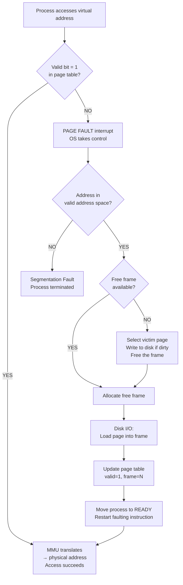

# Page Fault Handling

> A page fault is a normal hardware interrupt that fires when a process accesses a virtual page not currently in physical RAM; the OS handles it transparently in 6 steps — save state, validate, find frame, load from disk, update page table, restart instruction — and the process never knows it happened.

---

## Table of Contents

1. [What Is a Page Fault?](#1-what-is-a-page-fault)
2. [Types of Page Faults](#2-types-of-page-faults)
3. [When Do Page Faults Occur?](#3-when-do-page-faults-occur)
4. [6-Step Handling Process](#4-6-step-handling-process)
5. [Complete Flowchart](#5-complete-flowchart)
6. [Practical Walkthrough Example](#6-practical-walkthrough-example)
7. [Performance Impact](#7-performance-impact)
8. [Pure Demand Paging vs Prepaging](#8-pure-demand-paging-vs-prepaging)
9. [Copy-on-Write and Page Faults](#9-copy-on-write-and-page-faults)
10. [Key Takeaways](#10-key-takeaways)

---

## 1. What Is a Page Fault?

A **page fault** is a hardware interrupt generated by the MMU when a process tries to access a virtual page whose **valid bit in the page table is 0** (the page is not in physical RAM).

> It is NOT an error — it is a normal, expected event in any virtual memory system.

**Library desk analogy:**

```
  Your desk = physical RAM (limited space)
  Library shelves = disk/swap (large but slow)
  Book you need = a page

  You reach for a book → not on desk (page fault!)
  You go to the shelf, bring it back, place it on the desk
  Then continue reading — exactly where you left off
```

---

## 2. Types of Page Faults

| Type             | What Happened                                                                                           | Cost                 | OS Action                                         |
| ---------------- | ------------------------------------------------------------------------------------------------------- | -------------------- | ------------------------------------------------- |
| **Minor (Soft)** | Page is in memory but not mapped in page table (e.g., shared library already loaded by another process) | Low — no disk I/O    | Update page table entry only                      |
| **Major (Hard)** | Page is genuinely not in RAM — must be loaded from disk                                                 | High — full disk I/O | Find frame, read from disk, update table          |
| **Invalid**      | Process accessed an illegal address (outside its address space)                                         | —                    | OS terminates process with **Segmentation Fault** |

Major page faults are the expensive ones we focus on.

---

## 3. When Do Page Faults Occur?

| Scenario          | Why                                             | Example                                   |
| ----------------- | ----------------------------------------------- | ----------------------------------------- |
| Program start     | No pages loaded yet (demand paging — lazy load) | Opening any application                   |
| New function call | Code page for that function not yet in RAM      | Calling a print dialog for the first time |
| Large data access | Data page not yet loaded                        | Reading element 10,000 of a large array   |
| Stack growth      | Stack expands during deep recursion             | Deeply nested function calls              |
| Process swap-in   | Process was swapped out; its pages are on disk  | Switching back to a long-idle tab         |

---

## 4. 6-Step Handling Process

```
  Step 1 → Step 2 → Step 3 → Step 4 → Step 5 → Step 6
  Trap      Validate  Frame    Disk I/O  Update   Restart
  to OS     address   search            table    instruction
```

### Step 1: Trap to OS

```
  CPU generates virtual address
  → MMU checks page table → valid bit = 0
  → MMU raises PAGE FAULT interrupt
  → CPU switches to OS kernel mode
  → OS saves the process state (registers, PC)
  → Process enters WAITING state
```

### Step 2: Check Validity of Reference

```
  OS inspects the process's PCB internal table:

  Is the address in a valid region of the process's address space?

  YES → proceed to step 3
  NO  → address is illegal → OS sends SIGSEGV → process terminated
```

### Step 3: Find a Free Frame

```
  OS checks the free frame list:

  Free frame available?
    YES → allocate it immediately → go to step 4
    NO  → must evict a VICTIM PAGE:
          1. Select victim using a replacement algorithm (FIFO/LRU/etc.)
          2. If victim page is DIRTY (modified) → write it to disk first
          3. Mark victim's page table entry as invalid
          4. Use the freed frame → go to step 4
```

### Step 4: Read Page from Disk

```
  OS issues disk I/O request:
    Read → swap space address → target frame in RAM

  Process stays in WAITING state (may take 8-10 ms)
  CPU switches to another ready process (no CPU wasted!)
  Disk controller raises interrupt when read completes
```

### Step 5: Update Page Table

```
  OS updates the page table entry for the faulting page:
    Frame number  → physical frame where page now lives
    Valid bit     → 1 (page is now in RAM)
    Reference bit → 1 (just accessed)
    Dirty bit     → 0 (just loaded, not yet modified)

  Process moved from WAITING → READY queue
```

### Step 6: Restart the Faulting Instruction

```
  OS restores the process's saved state (registers, PC)
  CPU picks up the process from the READY queue
  CPU reruns the exact instruction that caused the fault
  This time: valid bit = 1 → MMU translates → access succeeds

  The process never knew a page fault happened!
```

---

## 5. Complete Flowchart



---

## 6. Practical Walkthrough Example

**Process page table (initial state):**

| Page | Frame | Valid |
| ---- | ----- | ----- |
| 0    | 5     | 1     |
| 1    | 8     | 1     |
| 2    | —     | 0     |
| 3    | —     | 0     |
| 4    | 12    | 1     |

**Process accesses page 3 (valid = 0 → page fault):**

```
  Step 1: MMU detects valid=0 for page 3 → page fault interrupt
  Step 2: OS checks: page 3 is within process's valid address space → OK
  Step 3: Free frame list has frame 15 available → allocate it
  Step 4: OS reads page 3 from disk → into frame 15 (disk I/O ~8ms)
  Step 5: Page table updated:
```

| Page  | Frame  | Valid |
| ----- | ------ | ----- |
| 0     | 5      | 1     |
| 1     | 8      | 1     |
| 2     | —      | 0     |
| **3** | **15** | **1** |
| 4     | 12     | 1     |

```
  Step 6: Instruction restarted → MMU translates page 3 → frame 15 → access succeeds ✓
```

---

## 7. Performance Impact

### Effective Access Time with Page Faults

$$\text{EAT} = (1-p) \times t_{\text{mem}} + p \times t_{\text{fault}}$$

```c
// Assumptions:
memory_access_time = 100 ns
page_fault_time    = 8,000,000 ns  (8 ms disk seek + transfer)

// With p = 0.01 (1% fault rate):
EAT = (0.99 × 100) + (0.01 × 8,000,000)
    = 99 + 80,000
    = 80,099 ns  ←  ~800× slower than RAM!
```

```
  Fault Rate │ EAT          │ Slowdown vs pure RAM
  ───────────┼──────────────┼─────────────────────
  0%         │ 100 ns       │ 1×
  0.01%      │ ~900 ns      │ 9×
  0.1%       │ ~8,100 ns    │ 81×
  1%         │ ~80,100 ns   │ 801×
  10%        │ ~800,100 ns  │ 8,001×!
```

### Strategies to Reduce Page Faults

| Strategy                     | How It Helps                                               |
| ---------------------------- | ---------------------------------------------------------- |
| More physical RAM            | Fewer evictions, more pages stay in memory                 |
| Better replacement algorithm | Keep the "right" pages in memory                           |
| Working set management       | Each process gets enough frames for its active pages       |
| Locality of reference        | Programs accessing nearby data naturally have fewer faults |
| Prepaging                    | Load predicted pages before they're needed                 |

---

## 8. Pure Demand Paging vs Prepaging

### Pure Demand Paging

```
  Process starts with ZERO pages in RAM
  Every first access faults → loads that page
  Advantage: only actually-needed pages ever load
  Disadvantage: many faults at startup (cold start)
```

### Prepaging

```
  OS predicts which pages will be needed and loads them ahead of time
  Example: load the first few code + data pages at process start
  Example: when a swapped-out process comes back, reload its whole working set

  Trade-off: may load pages never used (wasted I/O)
             vs. fewer interruptions during execution
```

Most modern OSes use a hybrid — pure demand paging during normal execution, prepaging when a process is swapped back in.

---

## 9. Copy-on-Write and Page Faults

**Copy-on-Write (COW)** is a clever optimization that uses page faults intentionally:

```
  Parent process forks → child is created

  WITHOUT COW:  entire parent memory copied immediately (expensive!)
  WITH COW:     parent and child SHARE the same physical pages
                Pages marked READ-ONLY in both page tables

  If either process writes to a shared page:
    → Write to read-only page → page fault!
    → OS fault handler: create a private copy for the writing process
    → Update that process's page table to point to the new copy
    → Allow the write to proceed

  Result: only modified pages are ever actually copied!
  Linux fork() uses COW — this is why fork() is very fast.
```

```
  Before write:
  Parent page table:  Page 2 → Frame 7 (read-only, shared)
  Child  page table:  Page 2 → Frame 7 (read-only, shared)

  After child writes to page 2:
  Parent page table:  Page 2 → Frame 7  (unchanged)
  Child  page table:  Page 2 → Frame 11 (new private copy)
```

---

## 9. Code Examples

> Working code that demonstrates the Page Fault Handler in practice.

### C++ — Simple Version

Simulate the full 6-step page fault handler — valid bit check, find/evict frame, load from disk, update page table, restart instruction.

```cpp
// Page Fault Handler Simulation — 6-step OS routine
// Compile: g++ -std=c++17 page_fault.cpp -o page_fault

#include <iostream>
#include <vector>
#include <queue>
using namespace std;

const int NUM_FRAMES = 4;
const int NUM_PAGES  = 8;

// Page table entry: valid bit, frame number, dirty bit
struct PTE {
    bool valid;     // 1 = page is in RAM, 0 = page is on disk
    int  frame;     // physical frame holding this page (-1 if invalid)
    bool dirty;     // 1 = page was written to (must write back on eviction)
};

PTE pageTable[NUM_PAGES] = {};       // all invalid at start
int frameToPage[NUM_FRAMES];         // which page occupies each frame (-1 = empty)
queue<int> freeFrames;               // free frame pool
int pageFaults = 0;

// Full page fault handler — called by the OS when MMU finds valid=0
void handlePageFault(int faultingPage) {
    pageFaults++;
    cout << "\n[PAGE FAULT #" << pageFaults << "] Page "
         << faultingPage << " not in RAM\n";

    // Step 1: Is this a legal access? (check OS process table)
    if (faultingPage < 0 || faultingPage >= NUM_PAGES) {
        cout << "  Step 1: ILLEGAL address -> SEGFAULT, kill process\n";
        return;
    }
    cout << "  Step 1: Valid page, process state saved\n";

    // Steps 2–3: Find a free frame (or evict a victim)
    int frame;
    if (!freeFrames.empty()) {
        frame = freeFrames.front();
        freeFrames.pop();
        cout << "  Step 2-3: Free frame " << frame << " available\n";
    } else {
        // FIFO eviction (real OS uses clock/LRU approximation)
        frame = 0;   // simplified: always try frame 0 first when full
        // Find the actual oldest-loaded frame in a real impl via a queue
        int victim = frameToPage[frame];
        cout << "  Step 2-3: Evicting page " << victim
             << " from frame " << frame;
        if (pageTable[victim].dirty)
            cout << " (dirty — write to disk first)";
        cout << "\n";
        pageTable[victim] = {false, -1, false};
    }

    // Step 4: Load faulting page from disk into the free frame
    cout << "  Step 4: Load page " << faultingPage
         << " from disk into frame " << frame << "\n";

    // Step 5: Update the page table
    pageTable[faultingPage] = {true, frame, false};
    frameToPage[frame]      = faultingPage;
    cout << "  Step 5: Page table updated — page "
         << faultingPage << " -> frame " << frame << "\n";

    // Step 6: Restart the faulting instruction (the CPU re-fetches it)
    cout << "  Step 6: Instruction restarted, process resumes\n";
}

void accessPage(int page, bool write = false) {
    cout << "\nAccess page " << page << (write ? " (WRITE)" : " (READ)") << ": ";
    if (pageTable[page].valid) {
        cout << "HIT (frame " << pageTable[page].frame << ")\n";
        if (write) pageTable[page].dirty = true;
    } else {
        cout << "MISS\n";
        handlePageFault(page);
        if (write) pageTable[page].dirty = true;
    }
}

int main() {
    // Initialise: all 4 frames are free, all pages start on disk
    for (int i = 0; i < NUM_FRAMES; i++) {
        freeFrames.push(i);
        frameToPage[i] = -1;
    }

    cout << "=== Page Fault Handler (" << NUM_FRAMES
         << " frames, " << NUM_PAGES << " virtual pages) ===";

    accessPage(0);           // fault: load into frame 0
    accessPage(1);           // fault: load into frame 1
    accessPage(2);           // fault: load into frame 2
    accessPage(3);           // fault: load into frame 3
    accessPage(0);           // HIT
    accessPage(1, true);     // HIT, sets dirty bit
    accessPage(4);           // fault: no free frames, evict (frame 0)
    accessPage(0);           // fault: page 0 was evicted

    cout << "\n\nTotal page faults: " << pageFaults << "\n";
    return 0;
}
```

### C++ — Medium / LeetCode Style

Page fault handler with **clock (second-chance) eviction** — the algorithm Linux and Windows actually approximate.

```cpp
// Page Fault Handler with Clock (Second-Chance) Eviction
// Compile: g++ -std=c++17 page_fault_clock.cpp -o page_fault_clock

#include <iostream>
#include <vector>
using namespace std;

struct Frame {
    int  page;        // page number occupying this frame (-1 = empty)
    bool referenced;  // reference bit for clock algorithm
    bool dirty;       // dirty bit for write-back tracking
};

class PageFaultHandler {
    vector<Frame> frames;
    vector<bool>  valid;
    vector<int>   frameOf;   // frameOf[page] = frame number
    int clockHand = 0;
    int faults = 0, accesses = 0;

public:
    PageFaultHandler(int nFrames, int nPages)
        : frames(nFrames, {-1, false, false}),
          valid(nPages, false),
          frameOf(nPages, -1) {}

    // Clock eviction: skip pages with reference bit=1 (give them a second chance)
    int clockEvict() {
        while (true) {
            if (!frames[clockHand].referenced) {
                int victim = clockHand;
                clockHand  = (clockHand + 1) % frames.size();
                return victim;
            }
            frames[clockHand].referenced = false;   // second chance granted
            clockHand = (clockHand + 1) % frames.size();
        }
    }

    void access(int page, bool write = false) {
        accesses++;
        if (valid[page]) {
            frames[frameOf[page]].referenced = true;    // update reference bit
            if (write) frames[frameOf[page]].dirty = true;
            return;
        }

        // PAGE FAULT
        faults++;
        // Find a free frame, or evict via clock
        int target = -1;
        for (int i = 0; i < (int)frames.size(); i++)
            if (frames[i].page == -1) { target = i; break; }

        if (target == -1) {
            target = clockEvict();
            int victim = frames[target].page;
            valid[victim]    = false;
            frameOf[victim]  = -1;
            cout << "  [FAULT #" << faults << "] Evict page " << victim
                 << (frames[target].dirty ? " (write-back)" : "")
                 << " -> load page " << page << " into frame " << target << "\n";
        } else {
            cout << "  [FAULT #" << faults << "] Free frame " << target
                 << " -> load page " << page << "\n";
        }

        frames[target] = {page, true, write};
        valid[page]    = true;
        frameOf[page]  = target;
    }

    void printStats() {
        double rate = 100.0 * faults / accesses;
        cout << "\nAccesses: " << accesses << "  Faults: " << faults
             << "  Fault rate: " << rate << "%\n";
    }
};

int main() {
    PageFaultHandler h(3, 8);
    vector<int> refs = {0, 1, 2, 3, 0, 1, 4, 0, 1, 2, 3, 4};

    cout << "=== Page Fault Handler: Clock Eviction (3 frames) ===\n";
    for (int p : refs) h.access(p);
    h.printStats();
    return 0;
}
```

### Python — Simple Version

Simulate the full 6-step page fault handler with step-by-step printed output.

```python
# Page Fault Handler — 6-step OS routine.
# Run: python page_fault.py

NUM_FRAMES = 4
NUM_PAGES  = 8

# Page table: each entry tracks whether the page is in RAM and where
page_table  = [{"valid": False, "frame": -1, "dirty": False}
               for _ in range(NUM_PAGES)]
frame_to_page = [-1] * NUM_FRAMES      # which page is in each frame
free_frames   = list(range(NUM_FRAMES)) # all frames start free
page_faults   = 0


def handle_page_fault(page: int):
    """OS page fault handler — called when MMU sees valid=0."""
    global page_faults
    page_faults += 1
    print(f"\n  [PAGE FAULT #{page_faults}] page {page} not in RAM")

    # Step 1: Validate — is this address legally owned by the process?
    if not (0 <= page < NUM_PAGES):
        print("  Step 1: ILLEGAL access -> SEGFAULT, OS terminates process")
        return
    print("  Step 1: Valid access, CPU state saved (registers, PC)")

    # Steps 2-3: Find a free frame, or evict via FIFO
    if free_frames:
        frame = free_frames.pop(0)
        print(f"  Step 2-3: Free frame {frame} available")
    else:
        # Evict page in frame 0 (simplified FIFO — real OS uses clock/LRU)
        frame        = 0
        victim_page  = frame_to_page[frame]
        write_back   = " (dirty — write to disk)" if page_table[victim_page]["dirty"] else ""
        print(f"  Step 2-3: No free frames — evict page {victim_page}"
              f" from frame {frame}{write_back}")
        page_table[victim_page].update({"valid": False, "frame": -1})
        frame_to_page[frame] = -1

    # Step 4: Load page from disk into the chosen frame
    print(f"  Step 4: Loading page {page} from disk into frame {frame}")

    # Step 5: Update page table
    page_table[page].update({"valid": True, "frame": frame})
    frame_to_page[frame] = page
    print(f"  Step 5: Page table updated — page {page} -> frame {frame}")

    # Step 6: Restart the faulting instruction
    print(f"  Step 6: Instruction restarted, process resumes")


def access_page(page: int, write: bool = False):
    """Simulate a process accessing a virtual page."""
    mode = "WRITE" if write else "READ"
    print(f"\nAccess page {page} ({mode}): ", end="")
    if page_table[page]["valid"]:
        print(f"HIT (frame {page_table[page]['frame']})")
        if write:
            page_table[page]["dirty"] = True
    else:
        print("MISS")
        handle_page_fault(page)
        if write:
            page_table[page]["dirty"] = True


print("=== Page Fault Handler Simulation ===")
print(f"Frames: {NUM_FRAMES}  |  Virtual pages: {NUM_PAGES}")

access_page(0)           # fault: load page 0 → frame 0
access_page(1)           # fault: load page 1 → frame 1
access_page(2)           # fault: load page 2 → frame 2
access_page(3)           # fault: load page 3 → frame 3
access_page(0)           # HIT
access_page(1, write=True)  # HIT, marks dirty
access_page(4)           # fault: no free frames, evict page from frame 0
access_page(0)           # fault: page 0 was evicted

print(f"\nTotal page faults: {page_faults}")
```

### Python — Medium Level

Page fault handler with **clock (second-chance) eviction** — the algorithm used in real OS kernels.

```python
# Page Fault Handler with Clock (Second-Chance) Eviction.
# Run: python page_fault_clock.py


class PageFaultHandler:
    """
    OS page fault handler using the Clock eviction algorithm.
    Clock: give each page a 'reference bit'; when eviction is needed,
    skip pages whose reference bit is 1 (clear it to 0 instead).
    Evict the first page found with reference bit = 0.
    """

    def __init__(self, num_frames: int, num_pages: int):
        # Each frame stores: {page, ref_bit, dirty_bit}
        self.frames     = [{"page": -1, "ref": False, "dirty": False}
                           for _ in range(num_frames)]
        self.page_table = [{"valid": False, "frame": -1}
                           for _ in range(num_pages)]
        self.clock_hand = 0
        self.faults     = 0
        self.accesses   = 0

    def _clock_evict(self) -> int:
        """Return the index of the frame to evict using the clock algorithm."""
        while True:
            f = self.frames[self.clock_hand]
            if not f["ref"]:
                victim = self.clock_hand
                self.clock_hand = (self.clock_hand + 1) % len(self.frames)
                return victim
            # Second chance: clear reference bit and advance
            f["ref"] = False
            self.clock_hand = (self.clock_hand + 1) % len(self.frames)

    def access(self, page: int, write: bool = False):
        self.accesses += 1
        pt = self.page_table[page]

        if pt["valid"]:
            # Hit: set reference bit (page was just used — don't evict it soon)
            f        = self.frames[pt["frame"]]
            f["ref"] = True
            if write:
                f["dirty"] = True
            return

        # PAGE FAULT
        self.faults += 1

        # Find a free frame, or evict via clock
        free = next((i for i, f in enumerate(self.frames) if f["page"] == -1), -1)

        if free != -1:
            target = free
            print(f"  [FAULT #{self.faults}] page {page} -> free frame {target}")
        else:
            target      = self._clock_evict()
            evict_page  = self.frames[target]["page"]
            wb          = " (write-back)" if self.frames[target]["dirty"] else ""
            print(f"  [FAULT #{self.faults}] evict page {evict_page}{wb}"
                  f" -> load page {page} into frame {target}")
            self.page_table[evict_page].update({"valid": False, "frame": -1})

        self.frames[target] = {"page": page, "ref": True, "dirty": write}
        pt.update({"valid": True, "frame": target})

    def stats(self):
        rate = self.faults / self.accesses * 100 if self.accesses else 0
        print(f"\nAccesses: {self.accesses} | Faults: {self.faults} | "
              f"Rate: {rate:.1f}%")


handler = PageFaultHandler(num_frames=3, num_pages=8)
refs    = [0, 1, 2, 3, 0, 1, 4, 0, 1, 2, 3, 4]

print("=== Page Fault Handler: Clock Eviction (3 frames) ===")
for p in refs:
    handler.access(p)

handler.stats()
```

---

## 10. Key Takeaways

- A **page fault** fires when the MMU sees valid bit = 0 in the page table — it is a **normal interrupt**, not an error
- **Three types:** minor (just update table), major (disk I/O needed), invalid (illegal address → segfault)
- **6-step handling:** trap → validate → find frame → load from disk → update table → restart instruction
- The faulting process **waits** during disk I/O; the CPU runs other processes (no CPU wasted)
- The instruction is **restarted** (not resumed mid-way) — this works because instructions are atomic w.r.t. memory
- Performance hit is severe: even **1% fault rate** makes memory access ~800× slower
- **Pure demand paging** = start with no pages, load each one on first access
- **Prepaging** = predict and pre-load pages to avoid cold-start faults
- **Copy-on-Write** uses intentional page faults to make `fork()` fast — pages are shared until modified
- Minimizing page faults is the goal of all page replacement algorithms (next topic)
