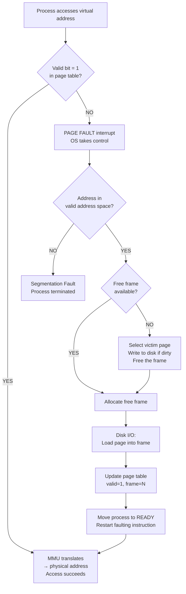

# Page Fault Handling

> A page fault is a normal hardware interrupt that fires when a process accesses a virtual page not currently in physical RAM; the OS handles it transparently in 6 steps — save state, validate, find frame, load from disk, update page table, restart instruction — and the process never knows it happened.

---

## Table of Contents

1. [What Is a Page Fault?](#1-what-is-a-page-fault)
2. [Types of Page Faults](#2-types-of-page-faults)
3. [When Do Page Faults Occur?](#3-when-do-page-faults-occur)
4. [6-Step Handling Process](#4-6-step-handling-process)
5. [Complete Flowchart](#5-complete-flowchart)
6. [Practical Walkthrough Example](#6-practical-walkthrough-example)
7. [Performance Impact](#7-performance-impact)
8. [Pure Demand Paging vs Prepaging](#8-pure-demand-paging-vs-prepaging)
9. [Copy-on-Write and Page Faults](#9-copy-on-write-and-page-faults)
10. [Key Takeaways](#10-key-takeaways)

---

## 1. What Is a Page Fault?

A **page fault** is a hardware interrupt generated by the MMU when a process tries to access a virtual page whose **valid bit in the page table is 0** (the page is not in physical RAM).

> It is NOT an error — it is a normal, expected event in any virtual memory system.

**Library desk analogy:**

```
  Your desk = physical RAM (limited space)
  Library shelves = disk/swap (large but slow)
  Book you need = a page

  You reach for a book → not on desk (page fault!)
  You go to the shelf, bring it back, place it on the desk
  Then continue reading — exactly where you left off
```

---

## 2. Types of Page Faults

| Type             | What Happened                                                                                           | Cost                 | OS Action                                         |
| ---------------- | ------------------------------------------------------------------------------------------------------- | -------------------- | ------------------------------------------------- |
| **Minor (Soft)** | Page is in memory but not mapped in page table (e.g., shared library already loaded by another process) | Low — no disk I/O    | Update page table entry only                      |
| **Major (Hard)** | Page is genuinely not in RAM — must be loaded from disk                                                 | High — full disk I/O | Find frame, read from disk, update table          |
| **Invalid**      | Process accessed an illegal address (outside its address space)                                         | —                    | OS terminates process with **Segmentation Fault** |

Major page faults are the expensive ones we focus on.

---

## 3. When Do Page Faults Occur?

| Scenario          | Why                                             | Example                                   |
| ----------------- | ----------------------------------------------- | ----------------------------------------- |
| Program start     | No pages loaded yet (demand paging — lazy load) | Opening any application                   |
| New function call | Code page for that function not yet in RAM      | Calling a print dialog for the first time |
| Large data access | Data page not yet loaded                        | Reading element 10,000 of a large array   |
| Stack growth      | Stack expands during deep recursion             | Deeply nested function calls              |
| Process swap-in   | Process was swapped out; its pages are on disk  | Switching back to a long-idle tab         |

---

## 4. 6-Step Handling Process

```
  Step 1 → Step 2 → Step 3 → Step 4 → Step 5 → Step 6
  Trap      Validate  Frame    Disk I/O  Update   Restart
  to OS     address   search            table    instruction
```

### Step 1: Trap to OS

```
  CPU generates virtual address
  → MMU checks page table → valid bit = 0
  → MMU raises PAGE FAULT interrupt
  → CPU switches to OS kernel mode
  → OS saves the process state (registers, PC)
  → Process enters WAITING state
```

### Step 2: Check Validity of Reference

```
  OS inspects the process's PCB internal table:

  Is the address in a valid region of the process's address space?

  YES → proceed to step 3
  NO  → address is illegal → OS sends SIGSEGV → process terminated
```

### Step 3: Find a Free Frame

```
  OS checks the free frame list:

  Free frame available?
    YES → allocate it immediately → go to step 4
    NO  → must evict a VICTIM PAGE:
          1. Select victim using a replacement algorithm (FIFO/LRU/etc.)
          2. If victim page is DIRTY (modified) → write it to disk first
          3. Mark victim's page table entry as invalid
          4. Use the freed frame → go to step 4
```

### Step 4: Read Page from Disk

```
  OS issues disk I/O request:
    Read → swap space address → target frame in RAM

  Process stays in WAITING state (may take 8-10 ms)
  CPU switches to another ready process (no CPU wasted!)
  Disk controller raises interrupt when read completes
```

### Step 5: Update Page Table

```
  OS updates the page table entry for the faulting page:
    Frame number  → physical frame where page now lives
    Valid bit     → 1 (page is now in RAM)
    Reference bit → 1 (just accessed)
    Dirty bit     → 0 (just loaded, not yet modified)

  Process moved from WAITING → READY queue
```

### Step 6: Restart the Faulting Instruction

```
  OS restores the process's saved state (registers, PC)
  CPU picks up the process from the READY queue
  CPU reruns the exact instruction that caused the fault
  This time: valid bit = 1 → MMU translates → access succeeds

  The process never knew a page fault happened!
```

---

## 5. Complete Flowchart



---

## 6. Practical Walkthrough Example

**Process page table (initial state):**

| Page | Frame | Valid |
| ---- | ----- | ----- |
| 0    | 5     | 1     |
| 1    | 8     | 1     |
| 2    | —     | 0     |
| 3    | —     | 0     |
| 4    | 12    | 1     |

**Process accesses page 3 (valid = 0 → page fault):**

```
  Step 1: MMU detects valid=0 for page 3 → page fault interrupt
  Step 2: OS checks: page 3 is within process's valid address space → OK
  Step 3: Free frame list has frame 15 available → allocate it
  Step 4: OS reads page 3 from disk → into frame 15 (disk I/O ~8ms)
  Step 5: Page table updated:
```

| Page  | Frame  | Valid |
| ----- | ------ | ----- |
| 0     | 5      | 1     |
| 1     | 8      | 1     |
| 2     | —      | 0     |
| **3** | **15** | **1** |
| 4     | 12     | 1     |

```
  Step 6: Instruction restarted → MMU translates page 3 → frame 15 → access succeeds ✓
```

---

## 7. Performance Impact

### Effective Access Time with Page Faults

$$\text{EAT} = (1-p) \times t_{\text{mem}} + p \times t_{\text{fault}}$$

```c
// Assumptions:
memory_access_time = 100 ns
page_fault_time    = 8,000,000 ns  (8 ms disk seek + transfer)

// With p = 0.01 (1% fault rate):
EAT = (0.99 × 100) + (0.01 × 8,000,000)
    = 99 + 80,000
    = 80,099 ns  ←  ~800× slower than RAM!
```

```
  Fault Rate │ EAT          │ Slowdown vs pure RAM
  ───────────┼──────────────┼─────────────────────
  0%         │ 100 ns       │ 1×
  0.01%      │ ~900 ns      │ 9×
  0.1%       │ ~8,100 ns    │ 81×
  1%         │ ~80,100 ns   │ 801×
  10%        │ ~800,100 ns  │ 8,001×!
```

### Strategies to Reduce Page Faults

| Strategy                     | How It Helps                                               |
| ---------------------------- | ---------------------------------------------------------- |
| More physical RAM            | Fewer evictions, more pages stay in memory                 |
| Better replacement algorithm | Keep the "right" pages in memory                           |
| Working set management       | Each process gets enough frames for its active pages       |
| Locality of reference        | Programs accessing nearby data naturally have fewer faults |
| Prepaging                    | Load predicted pages before they're needed                 |

---

## 8. Pure Demand Paging vs Prepaging

### Pure Demand Paging

```
  Process starts with ZERO pages in RAM
  Every first access faults → loads that page
  Advantage: only actually-needed pages ever load
  Disadvantage: many faults at startup (cold start)
```

### Prepaging

```
  OS predicts which pages will be needed and loads them ahead of time
  Example: load the first few code + data pages at process start
  Example: when a swapped-out process comes back, reload its whole working set

  Trade-off: may load pages never used (wasted I/O)
             vs. fewer interruptions during execution
```

Most modern OSes use a hybrid — pure demand paging during normal execution, prepaging when a process is swapped back in.

---

## 9. Copy-on-Write and Page Faults

**Copy-on-Write (COW)** is a clever optimization that uses page faults intentionally:

```
  Parent process forks → child is created

  WITHOUT COW:  entire parent memory copied immediately (expensive!)
  WITH COW:     parent and child SHARE the same physical pages
                Pages marked READ-ONLY in both page tables

  If either process writes to a shared page:
    → Write to read-only page → page fault!
    → OS fault handler: create a private copy for the writing process
    → Update that process's page table to point to the new copy
    → Allow the write to proceed

  Result: only modified pages are ever actually copied!
  Linux fork() uses COW — this is why fork() is very fast.
```

```
  Before write:
  Parent page table:  Page 2 → Frame 7 (read-only, shared)
  Child  page table:  Page 2 → Frame 7 (read-only, shared)

  After child writes to page 2:
  Parent page table:  Page 2 → Frame 7  (unchanged)
  Child  page table:  Page 2 → Frame 11 (new private copy)
```

---

## 10. Key Takeaways

- A **page fault** fires when the MMU sees valid bit = 0 in the page table — it is a **normal interrupt**, not an error
- **Three types:** minor (just update table), major (disk I/O needed), invalid (illegal address → segfault)
- **6-step handling:** trap → validate → find frame → load from disk → update table → restart instruction
- The faulting process **waits** during disk I/O; the CPU runs other processes (no CPU wasted)
- The instruction is **restarted** (not resumed mid-way) — this works because instructions are atomic w.r.t. memory
- Performance hit is severe: even **1% fault rate** makes memory access ~800× slower
- **Pure demand paging** = start with no pages, load each one on first access
- **Prepaging** = predict and pre-load pages to avoid cold-start faults
- **Copy-on-Write** uses intentional page faults to make `fork()` fast — pages are shared until modified
- Minimizing page faults is the goal of all page replacement algorithms (next topic)
