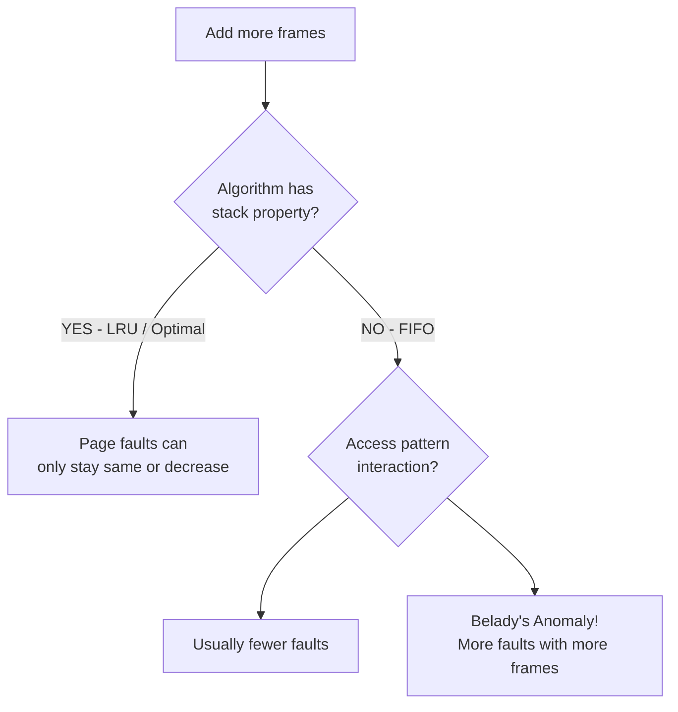

# Belady's Anomaly

> Belady's Anomaly is the counterintuitive phenomenon where adding more physical frames causes **more** page faults (not fewer) with the FIFO page replacement algorithm; it happens because FIFO's age-based eviction doesn't track usage, so more frames changes which pages survive and can accidentally worsen the replacement sequence.

---

## Table of Contents

1. [What Is Belady's Anomaly?](#1-what-is-beladys-anomaly)
2. [Why It Happens](#2-why-it-happens)
3. [Which Algorithms Are Affected?](#3-which-algorithms-are-affected)
4. [The Stack Property (Inclusion Property)](#4-the-stack-property-inclusion-property)
5. [Demonstration: FIFO with 3 vs 4 Frames](#5-demonstration-fifo-with-3-vs-4-frames)
6. [FIFO vs LRU Behaviour Comparison](#6-fifo-vs-lru-behaviour-comparison)
7. [Practical Implications](#7-practical-implications)
8. [Key Takeaways](#8-key-takeaways)

---

## 1. What Is Belady's Anomaly?

**Belady's Anomaly** is the observation that, for certain page replacement algorithms, increasing the number of frames in physical memory can cause the number of page faults to **increase** instead of decrease or stay the same.

Discovered by **László Bélády in 1969** while studying FIFO.

> Normal expectation: more RAM = fewer page faults (more pages fit, less disk I/O)
> Belady's discovery: with FIFO, this is NOT always true.

**Desk drawer analogy:**

```
  You have 3 drawers for your most-used tools.
  A "dumb organizer" (FIFO) always removes the tool placed there longest ago.

  When you get a 4th drawer, the organizer now has MORE choices.
  But because it still only looks at "how long has this been here",
  different tools survive now — and the tools you actually need most
  end up getting thrown out at the wrong moment.

  More drawers, more confusion, more times you reach for something missing.
```

---

## 2. Why It Happens

FIFO's eviction decision is based **only on time in memory** (insertion order), with zero regard for how often or recently a page is actually used.

When the frame count changes, the entire replacement sequence cascades differently:

- Different pages survive longer
- Different pages are present when future accesses happen
- Some critical pages that were "sheltered" by other pages in the 3-frame case get evicted earlier in the 4-frame case

```
  Root cause: FIFO lacks the STACK PROPERTY.

  Stack property = "if page P is in memory with N frames,
                    it will also be in memory with N+1 frames"

  FIFO does NOT guarantee this.
  LRU and Optimal DO guarantee this.
```

---

## 3. Which Algorithms Are Affected?

| Algorithm                  | Belady's Anomaly? | Why?                                                    |
| -------------------------- | ----------------- | ------------------------------------------------------- |
| **FIFO**                   | **Yes**           | Age-based eviction — no usage tracking                  |
| Other non-stack algorithms | Potentially       | If they lack the inclusion property                     |
| **LRU**                    | **No**            | Stack-based — satisfies inclusion property              |
| **Optimal**                | **No**            | Always makes the best choice — no anomaly by definition |
| Second-Chance (Clock)      | Generally No      | Approximates LRU behaviour                              |

---

## 4. The Stack Property (Inclusion Property)

An algorithm satisfies the **stack/inclusion property** if:

$$\text{Pages in memory with } n \text{ frames} \subseteq \text{Pages in memory with } n+1 \text{ frames}$$

In plain English: **if a page is loaded with N frames, it will still be loaded when you add a frame**. More frames only ever helps — never hurts.

```
  LRU with 3 frames keeps: {A, B, C}  (the 3 most recently used)
  LRU with 4 frames keeps: {A, B, C, D}  (the 4 most recently used)
  {A, B, C} ⊆ {A, B, C, D} ✓ — inclusion property holds

  FIFO with 3 frames keeps: {X, Y, Z}  (oldest three present)
  FIFO with 4 frames keeps: {W, X, Y, Z}  (BUT the order changed!)
  {X, Y, Z} is NOT necessarily ⊆ {W, X, Y, Z} — inclusion can fail ✗
```

---

## 5. Demonstration: FIFO with 3 vs 4 Frames

**Reference string:** `1, 2, 3, 4, 1, 2, 5, 1, 2, 3, 4, 5`

### Case A: 3 Frames

```
  Ref:   1  2  3  4  1  2  5  1  2  3  4  5
         ─────────────────────────────────────
  F1:    1  1  1  4  4  4  5  5  5  5  4  4
  F2:    ─  2  2  2  1  1  1  1  1  1  1  1
  F3:    ─  ─  3  3  3  2  2  2  2  3  3  3
         ─────────────────────────────────────
  Fault: ✗  ✗  ✗  ✗  ✗  ✗  ✗  ·  ·  ✗  ✗  ✗

  Total Faults: 9
```

### Case B: 4 Frames

```
  Ref:   1  2  3  4  1  2  5  1  2  3  4  5
         ─────────────────────────────────────
  F1:    1  1  1  1  1  1  5  5  5  5  4  4
  F2:    ─  2  2  2  2  2  2  1  1  1  1  1
  F3:    ─  ─  3  3  3  3  3  3  2  2  2  2
  F4:    ─  ─  ─  4  4  4  4  4  4  3  3  5
         ─────────────────────────────────────
  Fault: ✗  ✗  ✗  ✗  ·  ·  ✗  ✗  ✗  ✗  ✗  ✗

  Total Faults: 10
```

### The Anomaly in Numbers

```
  ┌─────────────┬──────────────────┬──────────────────────────────────┐
  │ Frame Count │ FIFO Page Faults │ Expected direction                │
  ├─────────────┼──────────────────┼──────────────────────────────────┤
  │ 3 frames    │ 9                │                                   │
  │ 4 frames    │ 10  ← MORE!      │ ← Should be ≤ 9, not > 9!        │
  └─────────────┴──────────────────┴──────────────────────────────────┘

  Adding one frame INCREASED faults by 1.
  This is Belady's Anomaly.
```

**What changed?** With 4 frames, pages 1 and 2 survived long enough to avoid eviction at positions 4–5 (so no faults there). But this pushed the "old page" queue differently — pages 1, 2, 3 were later evicted at moments when they were actually needed again, causing faults that didn't happen in the 3-frame case.

---

## 6. FIFO vs LRU Behaviour Comparison

| Aspect                         | FIFO                   | LRU                                    |
| ------------------------------ | ---------------------- | -------------------------------------- |
| Eviction basis                 | Order of arrival (age) | Recency of use                         |
| Stack property                 | No                     | Yes                                    |
| Belady's Anomaly               | Can occur              | Never occurs                           |
| Inclusion property             | Not guaranteed         | Always satisfied                       |
| Performance as frames increase | Unpredictable          | Monotonically improves (or stays same) |
| Implementation complexity      | Low                    | Medium                                 |



---

## 7. Practical Implications

**Why does this matter in real systems?**

```
  Scenario: A sysadmin adds 4 GB of RAM to a server running old software
            that uses a FIFO-like page management strategy.

  Expected: System becomes faster
  Possible: System performance DEGRADES on certain workloads

  Root cause: Belady's Anomaly with the right (wrong?) reference pattern.
```

**Design lessons:**

1. **Don't use FIFO in production** — LRU approximations are universally preferred
2. **Don't assume more RAM = better performance** without testing — benchmark with realistic workloads
3. **Test across different frame counts** — if using any non-stack algorithm, verify monotonic improvement
4. **Modern OSes are immune** — Linux, Windows, macOS all use LRU-approximation algorithms which satisfy the stack property

---

## 8. Key Takeaways

- **Belady's Anomaly** = adding more physical frames causes MORE page faults with FIFO (discovered by László Bélády, 1969)
- It occurs because **FIFO only tracks age**, not usage — so adding frames changes the entire replacement cascade in unpredictable ways
- **Stack/inclusion property** = set of pages in memory with N frames ⊆ set with N+1 frames; algorithms with this property are IMMUNE to Belady's Anomaly
- **FIFO violates** the stack property → susceptible to the anomaly
- **LRU and Optimal satisfy** the stack property → immune (more frames never increases faults)
- Classic demonstration: reference string `1,2,3,4,1,2,5,1,2,3,4,5` with FIFO gives 9 faults with 3 frames but 10 faults with 4 frames
- **Practical fix:** use LRU or LRU-approximations (Second-Chance/Clock algorithm) which are both efficient and anomaly-free
- This is one of the main reasons **FIFO is not used in modern general-purpose operating systems**
