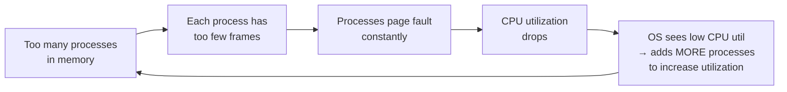

# Thrashing in OS and the Working Set Model

> Thrashing is a state where the OS spends more time swapping pages between RAM and disk than executing actual instructions — CPU utilization collapses even though the disk is maxed out; the Working Set Model prevents it by ensuring each process only runs when it has enough frames to hold its actively-used pages.

---

## Table of Contents

1. [What Is Thrashing?](#1-what-is-thrashing)
2. [How Thrashing Occurs — The Vicious Cycle](#2-how-thrashing-occurs--the-vicious-cycle)
3. [Symptoms of Thrashing](#3-symptoms-of-thrashing)
4. [Cause: Degree of Multiprogramming](#4-cause-degree-of-multiprogramming)
5. [The Working Set Model](#5-the-working-set-model)
6. [Working Set Window (Δ)](#6-working-set-window-δ)
7. [Preventing Thrashing with Working Sets](#7-preventing-thrashing-with-working-sets)
8. [Working Set vs Page Fault Frequency](#8-working-set-vs-page-fault-frequency)
9. [Practical Example](#9-practical-example)
10. [Key Takeaways](#10-key-takeaways)

---

## 1. What Is Thrashing?

**Thrashing** occurs when a system spends more time handling page faults (swapping pages to/from disk) than executing actual process instructions.

**Librarian analogy:**

```
  A librarian is supposed to help readers → CPU executing processes.
  Books in storage = pages on disk.
  Library desk = physical RAM.

  If the librarian spends ALL day walking to storage and back
  fetching books for readers but never has time to actually help them,
  that's thrashing — 100% busy, 0% productive.
```

```
  Normal state:
  CPU: [execute][execute][execute][page fault → fix][execute][execute]
  Disk: idle most of the time

  Thrashing state:
  CPU: [wait][wait][wait][wait][wait][barely executes][wait][wait]
  Disk: ████████████████████████████████████████████ constantly maxed out
```

---

## 2. How Thrashing Occurs — The Vicious Cycle



The OS makes things worse by trying to fix them:

1. Low CPU utilization detected
2. OS loads another process to "use" the idle CPU
3. Now even fewer frames per process
4. Even more page faults
5. CPU drops even lower → repeat

---

## 3. Symptoms of Thrashing

```
  Hard disk LED stays constantly lit     ← pages being swapped continuously
  CPU utilization drops below 20%        ← CPU mostly waiting for disk I/O
  Applications freeze or crawl           ← processes blocked on page faults
  Opening a menu takes several seconds   ← even tiny operations cause faults
  Task Manager: Disk = 100%, CPU = 10%   ← the classic thrashing signature
```

---

## 4. Cause: Degree of Multiprogramming

There is an **optimal number of processes** in memory. Beyond that point, more processes cause thrashing.

| Processes in Memory | Memory Per Process | Fault Rate      | CPU Utilization | State               |
| ------------------- | ------------------ | --------------- | --------------- | ------------------- |
| 2                   | 1.5 GB             | Low (5%)        | 40%             | Underutilized       |
| 4                   | 750 MB             | Medium (15%)    | **85%**         | **Optimal**         |
| 6                   | 500 MB             | High (45%)      | 65%             | Beginning to thrash |
| 8                   | 375 MB             | Very High (80%) | 20%             | Severe thrashing    |

```
  CPU Utilization vs Number of Processes:

  CPU%
  100│         ▲ Optimal
     │       ╱   ╲
  80 │     ╱       ╲   ← Thrashing begins here
     │   ╱           ╲
  60 │ ╱               ╲
     │                   ╲
  40 │                     ╲
     │                       ╲
  20 │                         ╲ ← Severe thrashing
     └────────────────────────────→
     0    2    4    6    8   10   Number of processes
```

---

## 5. The Working Set Model

The **Working Set Model** (Peter Denning, 1968) defines the set of pages a process is actively using in a recent time window and ensures the process only runs if all those pages fit in RAM.

**Working set** = set of unique pages referenced in the most recent **Δ** page accesses (Δ = working set window).

```
  If a process's working set fits in memory → it runs efficiently, few faults
  If a process's working set does NOT fit in memory → suspend it entirely

  Better to have 3 processes running well than 6 processes all thrashing!
```

Key insight: the working set models **locality of reference** — at any given time, a process actively uses only a small subset of its total pages.

---

## 6. Working Set Window (Δ)

```
  Reference string: 1, 2, 3, 4, 1, 2, 5, 1, 2, 3, 4, 5
  Working set window: Δ = 5

  At time 5 (refs 1-5): last 5 = {1,2,3,4,1}  → Working Set = {1, 2, 3, 4}  → WSS = 4
  At time 8 (refs 4-8): last 5 = {1,2,5,1,2}  → Working Set = {1, 2, 5}     → WSS = 3
  At time 12(refs 8-12):last 5 = {1,2,3,4,5}  → Working Set = {1, 2, 3, 4, 5} → WSS = 5
```

WSS (Working Set Size) = number of distinct pages in the working set window = **minimum frames this process needs right now**.

### Choosing Δ

| Δ Value                     | Effect                    | Risk              |
| --------------------------- | ------------------------- | ----------------- |
| Too small (e.g., 100)       | Misses some active pages  | Extra page faults |
| Optimal (~10,000–100,000)   | Captures true working set | None              |
| Too large (e.g., 1,000,000) | Includes stale pages      | Wastes frames     |

Modern OSes adapt Δ dynamically based on workload.

---

## 7. Preventing Thrashing with Working Sets

### The Rule

$$\sum_{\text{all processes}} \text{WSS}(P_i) \leq \text{Available Frames}$$

If total working set demand exceeds available frames → suspend the lowest-priority process until:

$$\sum \text{WSS}(P_i) \leq \text{Available Frames}$$

### Algorithm

```python
# Pseudocode: Working Set Strategy

while True:
    for each process P:
        compute WSS(P)  # pages referenced in last Δ accesses

    total_demand = sum(WSS(P) for all P)
    available    = total_physical_frames - OS_reserved_frames

    if total_demand > available:
        victim = select_lowest_priority_process()
        suspend(victim)          # swap victim out entirely
        total_demand -= WSS(victim)
    else:
        # Can we resume any suspended processes?
        for each suspended process SP:
            if total_demand + WSS(SP) <= available:
                resume(SP)
                total_demand += WSS(SP)
```

**Key decision:** suspend a process entirely (remove all its frames) rather than give every process a few frames and let everyone thrash.

---

## 8. Working Set vs Page Fault Frequency

An alternative is **Page Fault Frequency (PFF)** — a reactive approach:

```
  PFF Upper threshold: if fault rate > upper limit → give process MORE frames
  PFF Lower threshold: if fault rate < lower limit → take frames AWAY from process

  If no free frames available when needed → suspend a process (same as WS)
```

| Aspect     | Working Set Model                   | Page Fault Frequency (PFF)   |
| ---------- | ----------------------------------- | ---------------------------- |
| Approach   | Proactive — predict needs           | Reactive — respond to faults |
| Metric     | Pages in Δ-window                   | Fault rate                   |
| Overhead   | Higher (track all references)       | Lower (count faults only)    |
| Prevention | Prevents thrashing before it starts | Detects and then corrects    |
| Accuracy   | Better future prediction            | Simpler implementation       |

Many modern OSes use a **hybrid** — PFF for normal frame adjustment, Working Set for extreme cases.

---

## 9. Practical Example

**System:** 6 GB available for processes, Δ = 10,000 references

| Process          | Total Size | Working Set Size | Notes                  |
| ---------------- | ---------- | ---------------- | ---------------------- |
| A (Browser)      | 1.5 GB     | 800 MB           | Stable — viewing pages |
| B (Video Editor) | 2.5 GB     | 1.8 GB           | Active editing         |
| C (Compiler)     | 1.2 GB     | 600 MB           | Burst activity         |
| D (Database)     | 3.0 GB     | 2.0 GB           | Constant queries       |

```
  Without Working Set Model:
  Total size needed = 1.5 + 2.5 + 1.2 + 3.0 = 8.2 GB
  Available = 6 GB  → Shortfall = 2.2 GB → THRASHING

  With Working Set Model:
  Total WSS = 0.8 + 1.8 + 0.6 + 2.0 = 5.2 GB
  Available = 6 GB  → 5.2 < 6.0 → ALL PROCESSES RUN SMOOTHLY ✓

  Now add Process E with WSS = 1.5 GB:
  New total WSS = 5.2 + 1.5 = 6.7 GB > 6 GB
  OS suspends lowest-priority process (e.g., C: saves 0.6 GB)
  New total = 6.7 - 0.6 = 6.1 GB still > 6 GB
  OS suspends another or rejects E until memory frees up
```

---

## 9. Code Examples

> Working code that demonstrates the Working Set Model and thrashing prevention in practice.

### C++ — Simple Version

Compute the working set W(t, Δ) at each time step — the set of distinct pages referenced in the last Δ time units.

```cpp
// Working Set Model: compute W(t, delta) for each time step
// Compile: g++ -std=c++17 working_set.cpp -o working_set

#include <iostream>
#include <vector>
#include <set>
#include <algorithm>
using namespace std;

// Compute working set W(t, delta) = distinct pages in refs[t-delta .. t]
// 't' is the current reference index, delta is the window size
set<int> workingSet(const vector<int>& refs, int t, int delta) {
    int start = max(0, t - delta + 1);  // window: [start, t]
    return set<int>(refs.begin() + start, refs.begin() + t + 1);
}

int main() {
    // Reference string: page accesses over time (each index = one time unit)
    vector<int> refs = {1, 2, 1, 3, 4, 1, 5, 2, 1, 3, 1, 2};
    int delta = 4;  // working set window size

    cout << "Reference string: ";
    for (int p : refs) cout << p << " ";
    cout << "\nWindow (delta) = " << delta << "\n\n";

    cout << "Time | Page | Working Set W(t," << delta << ")  | WSS\n";
    cout << "-----|------|----------------------|-----\n";

    for (int t = 0; t < (int)refs.size(); t++) {
        set<int> ws = workingSet(refs, t, delta);
        cout << "  " << t << "  |   " << refs[t] << "  | {";
        bool first = true;
        for (int p : ws) { if (!first) cout << ","; cout << p; first = false; }
        cout << "}";
        // Pad to fixed width
        cout << string(max(0, 20 - (int)(ws.size()*2)), ' ');
        cout << "  | " << ws.size() << "\n";
    }

    cout << "\nKey insight: WSS = how many frames this process NEEDS right now\n";
    cout << "If total WSS > available frames -> thrashing!\n";
    return 0;
}
```

### C++ — Medium / LeetCode Style

Simulate two processes competing for a shared RAM pool; show how total WSS vs available frames predicts thrashing.

```cpp
// Thrashing Simulation: two processes, track total WSS vs available frames
// Compile: g++ -std=c++17 thrashing.cpp -o thrashing

#include <iostream>
#include <vector>
#include <set>
#include <algorithm>
#include <iomanip>
using namespace std;

// Compute Working Set Size (number of distinct pages in last delta accesses)
int wss(const vector<int>& refs, int t, int delta) {
    int start = max(0, t - delta + 1);
    set<int> ws(refs.begin() + start, refs.begin() + t + 1);
    return (int)ws.size();
}

// Simulate demand paging for a process; return page fault count up to time t
// using a fixed frame count 'frames' and FIFO eviction
int pageFaultsSoFar(const vector<int>& refs, int frames, int upTo) {
    vector<int> queue;
    set<int>    inRAM;
    int faults = 0;
    for (int i = 0; i <= upTo && i < (int)refs.size(); i++) {
        int page = refs[i];
        if (inRAM.count(page)) continue;
        faults++;
        if ((int)queue.size() == frames) {
            inRAM.erase(queue.front());
            queue.erase(queue.begin());
        }
        queue.push_back(page);
        inRAM.insert(page);
    }
    return faults;
}

int main() {
    // Two processes with different access patterns
    vector<int> p1refs = {1, 2, 1, 3, 1, 2, 1, 4, 1, 2, 1, 3};
    vector<int> p2refs = {5, 6, 7, 5, 6, 8, 5, 6, 7, 9, 5, 6};
    int delta        = 4;
    int totalFrames  = 6;  // total physical frames available

    cout << "Total available frames: " << totalFrames << "\n";
    cout << "Window (delta):         " << delta << "\n\n";

    cout << setw(4) << "t"
         << setw(8) << "P1 WSS"
         << setw(8) << "P2 WSS"
         << setw(12) << "Total WSS"
         << setw(12) << "Status\n";
    cout << string(44, '-') << "\n";

    int len = min(p1refs.size(), p2refs.size());
    for (int t = 0; t < (int)len; t++) {
        int w1    = wss(p1refs, t, delta);
        int w2    = wss(p2refs, t, delta);
        int total = w1 + w2;
        bool thrashing = total > totalFrames;
        cout << setw(4) << t
             << setw(8) << w1
             << setw(8) << w2
             << setw(12) << total
             << setw(12) << (thrashing ? "THRASHING!" : "OK") << "\n";
    }

    cout << "\nPrevention rule: if total WSS > available frames,\n"
         << "suspend one process entirely rather than let both thrash.\n";
    return 0;
}
```

### Python — Simple Version

Compute and display the working set W(t, Δ) at each time step for a single process.

```python
# Working Set Model — compute W(t, delta) at each time step.
# Run: python working_set.py


def working_set(refs: list[int], t: int, delta: int) -> set[int]:
    """
    W(t, delta) = distinct pages referenced in refs[t-delta+1 .. t]
    This is the 'hot set' — what the process is actively using RIGHT NOW.
    """
    start = max(0, t - delta + 1)
    return set(refs[start : t + 1])


def main():
    refs  = [1, 2, 1, 3, 4, 1, 5, 2, 1, 3, 1, 2]
    delta = 4   # working set window: look back at last 4 accesses

    print(f"Reference string : {refs}")
    print(f"Window (delta)   : {delta}")
    print()
    print(f"{'t':<4} {'Page':<6} {'Working Set W(t,Δ)':<22} {'WSS':>4}")
    print("-" * 38)

    for t, page in enumerate(refs):
        ws  = working_set(refs, t, delta)
        wss = len(ws)
        print(f"{t:<4} {page:<6} {str(sorted(ws)):<22} {wss:>4}")

    print()
    print("WSS = Working Set Size = how many frames this process NEEDS now")
    print("If total WSS of all processes > RAM frames -> thrashing risk!")


main()
```

### Python — Medium Level

Simulate two processes sharing a RAM pool; use WSS to detect and prevent thrashing by suspending the lower-priority process.

```python
# Thrashing prevention using Working Set Model.
# Run: python thrashing.py


def working_set_size(refs: list[int], t: int, delta: int) -> int:
    """Return the number of distinct pages in the last delta accesses."""
    start = max(0, t - delta + 1)
    return len(set(refs[start : t + 1]))


def simulate_thrashing(p1_refs: list[int], p2_refs: list[int],
                        total_frames: int, delta: int):
    """
    At each time step, check if total WSS of both processes exceeds
    available frames. If so, flag as thrashing.
    """
    print(f"Total frames: {total_frames}  |  Window (delta): {delta}\n")
    print(f"{'t':<4} {'P1 WSS':<8} {'P2 WSS':<8} {'Total':>7}  Status")
    print("-" * 42)

    length = min(len(p1_refs), len(p2_refs))
    for t in range(length):
        w1    = working_set_size(p1_refs, t, delta)
        w2    = working_set_size(p2_refs, t, delta)
        total = w1 + w2
        status = "THRASHING — suspend a process!" if total > total_frames else "OK"
        print(f"{t:<4} {w1:<8} {w2:<8} {total:>7}  {status}")

    print()
    print("Solution: if total_WSS > frames, suspend the lowest-priority")
    print("process entirely (reclaim ALL its frames) rather than letting")
    print("both processes thrash with a few frames each.")


# Process 1: accesses a small, stable working set (pages 1,2,3)
p1 = [1, 2, 1, 3, 1, 2, 1, 3, 1, 2, 1, 3]
# Process 2: frequently introduces new pages — expanding working set
p2 = [4, 5, 6, 4, 7, 5, 8, 4, 9, 5, 6, 4]

simulate_thrashing(p1, p2, total_frames=6, delta=4)
```

---

## 10. Key Takeaways

- **Thrashing** = system spends more time swapping pages than executing code; CPU utilization collapses, disk is maxed
- Root cause: too many processes competing for too little RAM — each gets fewer frames than their working set requires
- The **vicious cycle**: low CPU util → OS adds more processes → even less frames per process → more faults → even lower CPU util
- Thrashing symptoms: disk LED always on, CPU < 20% utilization, everything freezes
- **Working Set** = the set of pages a process actively uses in its last Δ references (the "hot pages" right now)
- **WSS (Working Set Size)** = number of distinct pages in the working set = minimum frames needed by that process
- **Prevention rule:** only run a process if its entire working set fits in available frames; otherwise suspend it entirely
- Suspending one process completely is better than letting all processes thrash on a few frames each
- **Page Fault Frequency (PFF)** is a simpler reactive alternative — adjust frames based on observed fault rate
- In practice: close unused applications, add RAM, or reduce number of simultaneous heavy processes
