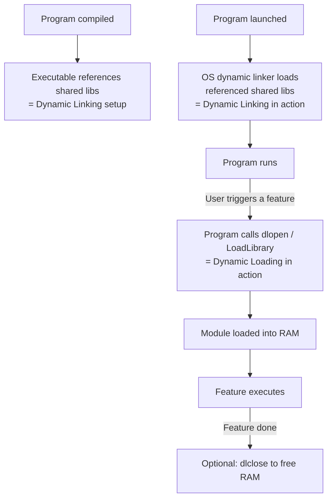

# Dynamic Linking vs Dynamic Loading

> Dynamic Linking connects shared libraries to a program at startup so multiple programs share one copy in memory; Dynamic Loading lets a program explicitly load code modules on demand during execution — both save memory compared to baking everything in at compile time, but they do it at different points and for different reasons.

---

## Table of Contents

1. [Static Linking vs Dynamic Linking](#1-static-linking-vs-dynamic-linking)
2. [What Is Dynamic Linking?](#2-what-is-dynamic-linking)
3. [Static Loading vs Dynamic Loading](#3-static-loading-vs-dynamic-loading)
4. [What Is Dynamic Loading?](#4-what-is-dynamic-loading)
5. [Dynamic Linking vs Dynamic Loading — Side by Side](#5-dynamic-linking-vs-dynamic-loading--side-by-side)
6. [How They Work Together](#6-how-they-work-together)
7. [Real-World Examples](#7-real-world-examples)
8. [Security and Pitfalls](#8-security-and-pitfalls)
9. [Key Takeaways](#9-key-takeaways)

---

## 1. Static Linking vs Dynamic Linking

**Static Linking** = library code is physically copied into your executable at compile time.

```
  Static linking:
  ┌─────────────────────────────────────────────┐
  │         my_program.exe                      │
  │  ┌──────────────┐  ┌────────────────────┐   │
  │  │  your code   │  │  math library code │   │
  │  └──────────────┘  └────────────────────┘   │
  └─────────────────────────────────────────────┘

  If 10 programs all need math library → 10 copies in RAM!
```

| Property                       | Static Linking              | Dynamic Linking                     |
| ------------------------------ | --------------------------- | ----------------------------------- |
| Library in executable?         | Yes — full copy             | No — just a reference               |
| Executable size                | Large                       | Small                               |
| Memory usage (10 programs)     | 10× library RAM             | 1× library RAM (shared)             |
| Startup speed                  | Fast (everything ready)     | Slight delay (OS resolves)          |
| Library update                 | Must recompile all programs | Update library → all programs fixed |
| External dependency at runtime | None                        | Library must exist on system        |

---

## 2. What Is Dynamic Linking?

**Dynamic Linking** = the executable stores only **references** to shared library code; the OS loads and links those libraries when the program starts.

```
  Dynamic linking:
  ┌────────────────────────────────────┐
  │         my_program.exe             │
  │  ┌──────────────┐  ┌────────────┐  │
  │  │  your code   │  │ "needs:    │  │
  │  └──────────────┘  │ math.dll"  │  │
  │                    └────────────┘  │
  └────────────────────────────────────┘
                    │
                    ▼  (at program startup)
  ┌─────────────────────────────────────────────┐
  │  Physical RAM                               │
  │  ┌──────────────┐  ┌────────────────────┐   │
  │  │ my_program   │──│   math.dll (shared)│   │
  │  └──────────────┘  └────────────────────┘   │
  │  ┌──────────────┐  /                        │
  │  │ other_app    │─/   same copy!             │
  │  └──────────────┘                           │
  └─────────────────────────────────────────────┘
```

**Community toolbox analogy:**

```
  Static = everyone buys their own hammer.
  Dynamic = everyone shares one hammer from the community shed.
  The "community shed" is a .dll (Windows) or .so (Linux) file.
```

### Advantages of Dynamic Linking

- One copy of library in RAM serves all programs using it
- Smaller executable files
- Patch the library once → all programs benefit immediately
- Enables plugin architectures (optional features as separate DLLs)

### Disadvantages

- Program won't run if library is missing or wrong version
- Slight startup overhead while OS resolves addresses
- "DLL Hell" — version conflicts between programs

---

## 3. Static Loading vs Dynamic Loading

**Static Loading** = the entire program is loaded into RAM before execution begins — all-or-nothing.

```
  Static loading:
  You launch "photo_editor.exe"
  → OS loads ALL code: blur filter, sepia filter, red-eye removal, crop tool,
    panorama stitcher, RAW converter... (even filters you never open today)
  → Only THEN does the program start
  → Wastes RAM if you only use crop tool
```

---

## 4. What Is Dynamic Loading?

**Dynamic Loading** = the program starts with only core code loaded, then explicitly asks the OS to load more modules as they become needed at runtime.

```
  Dynamic loading:
  You launch "photo_editor.exe"
  → OS loads ONLY: core UI, basic edit tools
  → Program starts fast!

  You click "Sepia Tone" filter:
  → Program calls dlopen("sepia_filter.so") [Unix] or LoadLibrary("sepia.dll") [Windows]
  → OS loads JUST that filter module into RAM
  → Filter runs; module stays loaded or gets unloaded after use
```

**Movie streaming analogy:**

```
  Static Loading  = download the entire 2-hour film before pressing play
  Dynamic Loading = stream it — buffer only what you're about to watch
```

### System Calls for Dynamic Loading

| Platform   | Load a module   | Get function pointer | Unload          |
| ---------- | --------------- | -------------------- | --------------- |
| Unix/Linux | `dlopen()`      | `dlsym()`            | `dlclose()`     |
| Windows    | `LoadLibrary()` | `GetProcAddress()`   | `FreeLibrary()` |

### Advantages

- Faster program startup (only essentials load initially)
- Memory-efficient (unused features never touch RAM)
- Plugin-friendly — load modules based on user action or config
- Can load platform-specific code conditionally

### Disadvantages

- Developer must explicitly manage load/unload calls
- Brief delay when a module loads on demand for the first time
- Error handling is more complex (loading can fail at runtime)

---

## 5. Dynamic Linking vs Dynamic Loading — Side by Side

| Aspect                  | Dynamic Linking                            | Dynamic Loading                        |
| ----------------------- | ------------------------------------------ | -------------------------------------- |
| **When it happens**     | Program startup                            | During execution (on demand)           |
| **What it links/loads** | Shared system libraries                    | Program's own modules/plugins          |
| **Who controls it**     | OS + dynamic linker                        | Your program code                      |
| **Programmer effort**   | None (linker handles it)                   | Explicit API calls required            |
| **Memory benefit**      | Shared library = one copy for all programs | Unused modules stay out of RAM         |
| **Typical file types**  | `.dll`, `.so`, `.dylib`                    | Same types, but loaded on demand       |
| **Example**             | `C standard library`, `OpenGL`             | Browser extension, photo filter plugin |



---

## 6. How They Work Together

A single program often uses BOTH simultaneously:

```
  Web Browser example:

  Dynamic Linking (automatic, at startup):
  ├── libc.so         — C standard library (shared with thousands of apps)
  ├── libssl.so       — SSL/TLS encryption (shared with curl, wget, etc.)
  └── libgraphics.so  — Graphics rendering (shared with other GUI apps)

  Dynamic Loading (explicit, on demand):
  ├── video_codec.so      — loaded when you first play a video
  ├── pdf_renderer.so     — loaded when you open a PDF tab
  ├── webassembly.so      — loaded when a page uses WebAssembly
  └── browser_ext_A.so   — loaded when extension A is enabled
```

---

## 7. Real-World Examples

### Web Browsers

- Dynamically **linked** to system graphics, networking, text rendering libraries
- Dynamically **load** video codecs, PDF renderers, and extensions on demand

### Device Drivers

```
  You plug in a USB device:
  → OS detects the device
  → OS dynamically LOADS the appropriate driver into kernel memory

  You unplug it:
  → OS dynamically UNLOADS the driver → frees memory

  Without dynamic loading: driver for every possible device would be in RAM at boot!
```

### Python Imports

```python
  import numpy   # Dynamic loading in action!
  # Python loads numpy's compiled .so/.pyd file into memory HERE
  # Not at program startup — at this line of code
```

---

## 8. Security and Pitfalls

### DLL Hijacking / Library Injection

```
  Risk: Attacker replaces a shared library with a malicious version
  → Every program using that library is compromised

  Mitigations:
  - Digital signatures on system libraries
  - Secure file permissions (libraries readable only by root/admin)
  - Secure boot and integrity verification
  - Code signing enforcement
```

### DLL Hell

```
  Problem: Program A needs math_lib version 1.0
           Program B needs math_lib version 2.0
           They conflict on the same system

  Solutions:
  - Windows: Side-by-side assemblies (both versions coexist)
  - Linux: Versioned library names (libmath.so.1, libmath.so.2)
  - Modern: Containers (Docker) — each app gets its own isolated library set
```

### Performance Note

- Shared library code must be **position-independent** (PIC) — can run at any address
- PIC adds a tiny indirection overhead vs. statically linked code
- In practice, memory savings far outweigh this minor slowdown

---

## 8. Code Examples

> Working code that demonstrates Dynamic Linking and Dynamic Loading concepts in practice.

### C++ — Simple Version
Simulate dynamic linking (one shared library copy serves all processes) vs static linking (each process carries its own copy); show the RAM savings.

```cpp
// Dynamic Linking vs Static Linking — RAM usage comparison
// Compile: g++ -std=c++17 dyn_link.cpp -o dyn_link

#include <iostream>
#include <vector>
#include <string>
#include <numeric>
using namespace std;

struct Process {
    string name;
    int    ownCodeKB;    // process's own code size (KB)
    bool   usesLibC;     // does this process use libc?
    bool   usesLibSSL;   // does this process use OpenSSL?
};

// Simulate static linking: each process carries ALL library code it uses
int staticRAM(const vector<Process>& procs, int libcKB, int libsslKB) {
    int total = 0;
    for (auto& p : procs) {
        total += p.ownCodeKB;
        if (p.usesLibC)   total += libcKB;    // COPY of libc inside this binary
        if (p.usesLibSSL) total += libsslKB;  // COPY of libssl inside this binary
    }
    return total;
}

// Simulate dynamic linking: the library is loaded ONCE; all processes share it
int dynamicRAM(const vector<Process>& procs, int libcKB, int libsslKB) {
    bool needsLibC   = false;
    bool needsLibSSL = false;
    int  total       = 0;

    for (auto& p : procs) {
        total       += p.ownCodeKB;   // only the process's own code is private
        needsLibC   |= p.usesLibC;
        needsLibSSL |= p.usesLibSSL;
    }

    // Shared libraries loaded into RAM exactly once
    if (needsLibC)   total += libcKB;
    if (needsLibSSL) total += libsslKB;

    return total;
}

int main() {
    // 5 processes all using the same standard C library and OpenSSL
    vector<Process> procs = {
        {"nginx",    200, true, true},
        {"python3",  400, true, false},
        {"curl",     100, true, true},
        {"sshd",     150, true, true},
        {"bash",     80,  true, false},
    };

    const int LIBC_KB   = 2000;   // libc is ~2 MB
    const int LIBSSL_KB = 1500;   // OpenSSL is ~1.5 MB

    int staticTotal  = staticRAM(procs, LIBC_KB, LIBSSL_KB);
    int dynamicTotal = dynamicRAM(procs, LIBC_KB, LIBSSL_KB);
    int savings      = staticTotal - dynamicTotal;

    cout << "=== Static Linking ===\n";
    for (auto& p : procs) {
        int size = p.ownCodeKB
                 + (p.usesLibC   ? LIBC_KB   : 0)
                 + (p.usesLibSSL ? LIBSSL_KB : 0);
        cout << "  " << p.name << ": " << size << " KB\n";
    }
    cout << "  Total RAM: " << staticTotal << " KB\n\n";

    cout << "=== Dynamic Linking ===\n";
    for (auto& p : procs) {
        cout << "  " << p.name << ": " << p.ownCodeKB
             << " KB (own code) + shared libs\n";
    }
    cout << "  libc  (shared, ONE copy): " << LIBC_KB   << " KB\n";
    cout << "  libssl (shared, ONE copy): " << LIBSSL_KB << " KB\n";
    cout << "  Total RAM: " << dynamicTotal << " KB\n\n";

    cout << "=== Savings ===\n";
    cout << "  Static:  " << staticTotal  << " KB\n";
    cout << "  Dynamic: " << dynamicTotal << " KB\n";
    cout << "  Saved:   " << savings << " KB  ("
         << (100.0 * savings / staticTotal) << "% reduction)\n";

    return 0;
}
```

### C++ — Medium / LeetCode Style
Simulate **dynamic loading** — modules are loaded on demand only when first called; track which modules are in memory and when they are loaded.

```cpp
// Dynamic Loading Simulation: load modules on demand (lazy loading)
// Models how dlopen()/LoadLibrary() work at runtime.
// Compile: g++ -std=c++17 dyn_load.cpp -o dyn_load

#include <iostream>
#include <unordered_map>
#include <vector>
#include <string>
using namespace std;

// Represents a loadable module (like a plugin or optional DLL)
struct Module {
    string name;
    int    sizeKB;
    bool   loaded = false;   // loaded = false means it's on disk, not in RAM
};

// Module registry — all modules start on disk (not loaded)
unordered_map<string, Module> moduleRegistry = {
    {"crypto",    {"crypto",    800, false}},
    {"database",  {"database", 1200, false}},
    {"imageproc", {"imageproc", 500, false}},
    {"network",   {"network",   300, false}},
};

int totalRAM = 0;

// Dynamic loader: load the module into RAM only if not already loaded
// This is what dlopen() / LoadLibrary() do under the hood
void callFunction(const string& moduleName, const string& funcName) {
    auto& mod = moduleRegistry[moduleName];
    if (!mod.loaded) {
        cout << "[dlopen]  Loading '" << moduleName
             << "' (" << mod.sizeKB << " KB) into RAM\n";
        mod.loaded = true;
        totalRAM  += mod.sizeKB;
    } else {
        cout << "[cache]   '" << moduleName << "' already in RAM — reuse\n";
    }
    cout << "          Calling " << moduleName << "::" << funcName << "()\n";
}

int main() {
    cout << "=== Dynamic Loading Simulation ===\n";
    cout << "Program starts. No modules in RAM yet.\n\n";

    // Only modules that are actually called get loaded — lazy loading
    callFunction("network",  "sendRequest");    // first call: load network
    callFunction("network",  "receiveData");    // second call: already in RAM
    callFunction("database", "queryDB");        // load database on demand
    callFunction("crypto",   "encrypt");        // load crypto module on demand
    callFunction("database", "insertRow");      // database already loaded
    // "imageproc" is never called — it stays on disk, never wasting RAM

    int neverLoaded = 0;
    cout << "\n=== Memory Summary ===\n";
    for (auto& [name, mod] : moduleRegistry) {
        cout << "  " << name << ": " << (mod.loaded ? "IN RAM" : "on disk (never needed)") << "\n";
        if (!mod.loaded) neverLoaded++;
    }
    cout << "\nTotal RAM used: " << totalRAM << " KB\n";
    cout << "Modules skipped (stayed on disk): " << neverLoaded << "\n";
    cout << "\n=> Dynamic loading: pay only for what you actually use!\n";

    return 0;
}
```

### Python — Simple Version
Simulate dynamic linking (shared library loaded once) vs static linking (every process carries its own copy); compute memory savings.

```python
# Dynamic Linking vs Static Linking — RAM usage simulation.
# Run: python dyn_link.py


def static_ram(processes: list[dict], libraries: dict[str, int]) -> int:
    """
    Static linking: each process binary includes a full copy of every
    library it uses. 5 processes * 2 MB libc = 10 MB wasted.
    """
    total = 0
    for proc in processes:
        total += proc["own_kb"]
        for lib in proc["uses"]:
            total += libraries[lib]   # each process has its OWN copy
    return total


def dynamic_ram(processes: list[dict], libraries: dict[str, int]) -> int:
    """
    Dynamic linking: the OS loads each shared library ONCE.
    Every process that needs it maps the same physical pages into its address space.
    """
    # Own code: still private per process
    total = sum(p["own_kb"] for p in processes)
    # Shared libraries: loaded at most once regardless of how many processes use them
    needed = set(lib for p in processes for lib in p["uses"])
    total += sum(libraries[lib] for lib in needed)
    return total


def main():
    processes = [
        {"name": "nginx",   "own_kb": 200, "uses": ["libc", "libssl"]},
        {"name": "python3", "own_kb": 400, "uses": ["libc"]},
        {"name": "curl",    "own_kb": 100, "uses": ["libc", "libssl"]},
        {"name": "sshd",    "own_kb": 150, "uses": ["libc", "libssl"]},
        {"name": "bash",    "own_kb": 80,  "uses": ["libc"]},
    ]
    libraries = {
        "libc":   2000,   # ~2 MB standard C library
        "libssl": 1500,   # ~1.5 MB OpenSSL
    }

    s_total = static_ram(processes, libraries)
    d_total = dynamic_ram(processes, libraries)
    savings = s_total - d_total

    print("=== Static Linking ===")
    for p in processes:
        size = p["own_kb"] + sum(libraries[l] for l in p["uses"])
        print(f"  {p['name']:<10}: {size:>5} KB  (own + embedded lib copies)")
    print(f"  Total: {s_total} KB\n")

    print("=== Dynamic Linking ===")
    for p in processes:
        print(f"  {p['name']:<10}: {p['own_kb']:>5} KB  (own code only)")
    needed = set(l for p in processes for l in p["uses"])
    for lib in sorted(needed):
        print(f"  [shared] {lib}: {libraries[lib]} KB  <- ONE copy for ALL processes")
    print(f"  Total: {d_total} KB\n")

    pct = savings / s_total * 100
    print(f"=== Memory Savings ===")
    print(f"  Static:  {s_total} KB")
    print(f"  Dynamic: {d_total} KB")
    print(f"  Saved:   {savings} KB  ({pct:.0f}% reduction)")


main()
```

### Python — Medium Level
Simulate **dynamic loading** with a module loader class — modules are loaded on first call and cached for subsequent calls (mimicking `dlopen()` / `importlib`).

```python
# Dynamic Loading — load modules on demand, cache after first load.
# This is how Python's 'import' and dlopen()/LoadLibrary() work.
# Run: python dyn_load.py

import sys


class DynamicLoader:
    """
    Simulates the OS dynamic loading mechanism (dlopen / LoadLibrary).
    Modules are NOT loaded at program start — only when first called.
    After first load, the module stays in the cache (RAM) for reuse.
    """

    def __init__(self):
        # Registry: all modules start on disk (loaded=False)
        self._registry: dict[str, dict] = {
            "crypto":    {"size_kb": 800,  "loaded": False, "obj": None},
            "database":  {"size_kb": 1200, "loaded": False, "obj": None},
            "imageproc": {"size_kb": 500,  "loaded": False, "obj": None},
            "network":   {"size_kb": 300,  "loaded": False, "obj": None},
        }
        self._ram_used = 0

    def call(self, module: str, function: str, *args):
        """
        Load the module on first access, then call the function.
        On subsequent calls, the module is already in the cache.
        """
        mod = self._registry[module]
        if not mod["loaded"]:
            print(f"[load]   '{module}' ({mod['size_kb']} KB) loaded from disk → RAM")
            mod["loaded"] = True
            self._ram_used += mod["size_kb"]
        else:
            print(f"[cache]  '{module}' already in RAM")

        print(f"         {module}.{function}({', '.join(str(a) for a in args)})")

    @property
    def ram_kb(self) -> int:
        return self._ram_used

    def summary(self):
        print("\n=== Module Load Status ===")
        for name, mod in self._registry.items():
            status = f"IN RAM ({mod['size_kb']} KB)" if mod["loaded"] else "on disk (never needed)"
            print(f"  {name:<12}: {status}")
        unloaded_kb = sum(m["size_kb"] for m in self._registry.values() if not m["loaded"])
        print(f"\nRAM used   : {self._ram_used} KB")
        print(f"Disk only  : {unloaded_kb} KB  (saved by not pre-loading)")
        print(f"\n=> Dynamic loading: startup is instant; only loaded modules use RAM")


loader = DynamicLoader()

print("=== Dynamic Loading Demo ===")
print("Program starts — no modules in RAM yet.\n")

loader.call("network",  "send_request", "https://example.com")
loader.call("network",  "receive_data")            # already loaded — reuse
loader.call("database", "query", "SELECT * FROM users")
loader.call("crypto",   "encrypt", "secret_data")
loader.call("database", "insert", {"user": "alice"})  # already loaded
# imageproc is never called → stays on disk forever

loader.summary()
```

---

## 9. Key Takeaways

- **Static Linking** = library code baked into the executable at compile time — self-contained but wastes RAM if many programs share the same library
- **Dynamic Linking** = executable stores only references; OS loads and connects shared libraries (`.dll`/`.so`) at program startup automatically — one copy in RAM serves all programs
- **Static Loading** = entire program loaded into RAM before execution starts — simple but wasteful for large apps with many optional features
- **Dynamic Loading** = program explicitly calls `dlopen()`/`LoadLibrary()` at runtime to load modules on demand — fast startup, minimal RAM usage
- **Key difference:** Dynamic Linking is about _sharing_ code between programs (OS-managed, at startup); Dynamic Loading is about _deferring_ code until needed (programmer-managed, during execution)
- They are **complementary** — most real applications use both at the same time
- **Risks:** DLL hijacking (malicious library replacement), DLL Hell (version conflicts); solved by code signing, versioned naming, and containerization
- **Python `import`** is a real-world example of dynamic loading every developer encounters
- Dynamic techniques are fundamental to how modern operating systems run many large programs efficiently within limited RAM
