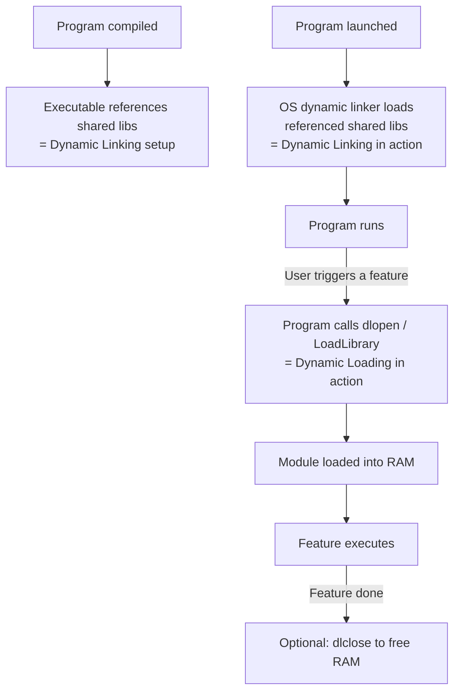

# Dynamic Linking vs Dynamic Loading

> Dynamic Linking connects shared libraries to a program at startup so multiple programs share one copy in memory; Dynamic Loading lets a program explicitly load code modules on demand during execution — both save memory compared to baking everything in at compile time, but they do it at different points and for different reasons.

---

## Table of Contents

1. [Static Linking vs Dynamic Linking](#1-static-linking-vs-dynamic-linking)
2. [What Is Dynamic Linking?](#2-what-is-dynamic-linking)
3. [Static Loading vs Dynamic Loading](#3-static-loading-vs-dynamic-loading)
4. [What Is Dynamic Loading?](#4-what-is-dynamic-loading)
5. [Dynamic Linking vs Dynamic Loading — Side by Side](#5-dynamic-linking-vs-dynamic-loading--side-by-side)
6. [How They Work Together](#6-how-they-work-together)
7. [Real-World Examples](#7-real-world-examples)
8. [Security and Pitfalls](#8-security-and-pitfalls)
9. [Key Takeaways](#9-key-takeaways)

---

## 1. Static Linking vs Dynamic Linking

**Static Linking** = library code is physically copied into your executable at compile time.

```
  Static linking:
  ┌─────────────────────────────────────────────┐
  │         my_program.exe                      │
  │  ┌──────────────┐  ┌────────────────────┐   │
  │  │  your code   │  │  math library code │   │
  │  └──────────────┘  └────────────────────┘   │
  └─────────────────────────────────────────────┘

  If 10 programs all need math library → 10 copies in RAM!
```

| Property                       | Static Linking              | Dynamic Linking                     |
| ------------------------------ | --------------------------- | ----------------------------------- |
| Library in executable?         | Yes — full copy             | No — just a reference               |
| Executable size                | Large                       | Small                               |
| Memory usage (10 programs)     | 10× library RAM             | 1× library RAM (shared)             |
| Startup speed                  | Fast (everything ready)     | Slight delay (OS resolves)          |
| Library update                 | Must recompile all programs | Update library → all programs fixed |
| External dependency at runtime | None                        | Library must exist on system        |

---

## 2. What Is Dynamic Linking?

**Dynamic Linking** = the executable stores only **references** to shared library code; the OS loads and links those libraries when the program starts.

```
  Dynamic linking:
  ┌────────────────────────────────────┐
  │         my_program.exe             │
  │  ┌──────────────┐  ┌────────────┐  │
  │  │  your code   │  │ "needs:    │  │
  │  └──────────────┘  │ math.dll"  │  │
  │                    └────────────┘  │
  └────────────────────────────────────┘
                    │
                    ▼  (at program startup)
  ┌─────────────────────────────────────────────┐
  │  Physical RAM                               │
  │  ┌──────────────┐  ┌────────────────────┐   │
  │  │ my_program   │──│   math.dll (shared)│   │
  │  └──────────────┘  └────────────────────┘   │
  │  ┌──────────────┐  /                        │
  │  │ other_app    │─/   same copy!             │
  │  └──────────────┘                           │
  └─────────────────────────────────────────────┘
```

**Community toolbox analogy:**

```
  Static = everyone buys their own hammer.
  Dynamic = everyone shares one hammer from the community shed.
  The "community shed" is a .dll (Windows) or .so (Linux) file.
```

### Advantages of Dynamic Linking

- One copy of library in RAM serves all programs using it
- Smaller executable files
- Patch the library once → all programs benefit immediately
- Enables plugin architectures (optional features as separate DLLs)

### Disadvantages

- Program won't run if library is missing or wrong version
- Slight startup overhead while OS resolves addresses
- "DLL Hell" — version conflicts between programs

---

## 3. Static Loading vs Dynamic Loading

**Static Loading** = the entire program is loaded into RAM before execution begins — all-or-nothing.

```
  Static loading:
  You launch "photo_editor.exe"
  → OS loads ALL code: blur filter, sepia filter, red-eye removal, crop tool,
    panorama stitcher, RAW converter... (even filters you never open today)
  → Only THEN does the program start
  → Wastes RAM if you only use crop tool
```

---

## 4. What Is Dynamic Loading?

**Dynamic Loading** = the program starts with only core code loaded, then explicitly asks the OS to load more modules as they become needed at runtime.

```
  Dynamic loading:
  You launch "photo_editor.exe"
  → OS loads ONLY: core UI, basic edit tools
  → Program starts fast!

  You click "Sepia Tone" filter:
  → Program calls dlopen("sepia_filter.so") [Unix] or LoadLibrary("sepia.dll") [Windows]
  → OS loads JUST that filter module into RAM
  → Filter runs; module stays loaded or gets unloaded after use
```

**Movie streaming analogy:**

```
  Static Loading  = download the entire 2-hour film before pressing play
  Dynamic Loading = stream it — buffer only what you're about to watch
```

### System Calls for Dynamic Loading

| Platform   | Load a module   | Get function pointer | Unload          |
| ---------- | --------------- | -------------------- | --------------- |
| Unix/Linux | `dlopen()`      | `dlsym()`            | `dlclose()`     |
| Windows    | `LoadLibrary()` | `GetProcAddress()`   | `FreeLibrary()` |

### Advantages

- Faster program startup (only essentials load initially)
- Memory-efficient (unused features never touch RAM)
- Plugin-friendly — load modules based on user action or config
- Can load platform-specific code conditionally

### Disadvantages

- Developer must explicitly manage load/unload calls
- Brief delay when a module loads on demand for the first time
- Error handling is more complex (loading can fail at runtime)

---

## 5. Dynamic Linking vs Dynamic Loading — Side by Side

| Aspect                  | Dynamic Linking                            | Dynamic Loading                        |
| ----------------------- | ------------------------------------------ | -------------------------------------- |
| **When it happens**     | Program startup                            | During execution (on demand)           |
| **What it links/loads** | Shared system libraries                    | Program's own modules/plugins          |
| **Who controls it**     | OS + dynamic linker                        | Your program code                      |
| **Programmer effort**   | None (linker handles it)                   | Explicit API calls required            |
| **Memory benefit**      | Shared library = one copy for all programs | Unused modules stay out of RAM         |
| **Typical file types**  | `.dll`, `.so`, `.dylib`                    | Same types, but loaded on demand       |
| **Example**             | `C standard library`, `OpenGL`             | Browser extension, photo filter plugin |



---

## 6. How They Work Together

A single program often uses BOTH simultaneously:

```
  Web Browser example:

  Dynamic Linking (automatic, at startup):
  ├── libc.so         — C standard library (shared with thousands of apps)
  ├── libssl.so       — SSL/TLS encryption (shared with curl, wget, etc.)
  └── libgraphics.so  — Graphics rendering (shared with other GUI apps)

  Dynamic Loading (explicit, on demand):
  ├── video_codec.so      — loaded when you first play a video
  ├── pdf_renderer.so     — loaded when you open a PDF tab
  ├── webassembly.so      — loaded when a page uses WebAssembly
  └── browser_ext_A.so   — loaded when extension A is enabled
```

---

## 7. Real-World Examples

### Web Browsers

- Dynamically **linked** to system graphics, networking, text rendering libraries
- Dynamically **load** video codecs, PDF renderers, and extensions on demand

### Device Drivers

```
  You plug in a USB device:
  → OS detects the device
  → OS dynamically LOADS the appropriate driver into kernel memory

  You unplug it:
  → OS dynamically UNLOADS the driver → frees memory

  Without dynamic loading: driver for every possible device would be in RAM at boot!
```

### Python Imports

```python
  import numpy   # Dynamic loading in action!
  # Python loads numpy's compiled .so/.pyd file into memory HERE
  # Not at program startup — at this line of code
```

---

## 8. Security and Pitfalls

### DLL Hijacking / Library Injection

```
  Risk: Attacker replaces a shared library with a malicious version
  → Every program using that library is compromised

  Mitigations:
  - Digital signatures on system libraries
  - Secure file permissions (libraries readable only by root/admin)
  - Secure boot and integrity verification
  - Code signing enforcement
```

### DLL Hell

```
  Problem: Program A needs math_lib version 1.0
           Program B needs math_lib version 2.0
           They conflict on the same system

  Solutions:
  - Windows: Side-by-side assemblies (both versions coexist)
  - Linux: Versioned library names (libmath.so.1, libmath.so.2)
  - Modern: Containers (Docker) — each app gets its own isolated library set
```

### Performance Note

- Shared library code must be **position-independent** (PIC) — can run at any address
- PIC adds a tiny indirection overhead vs. statically linked code
- In practice, memory savings far outweigh this minor slowdown

---

## 9. Key Takeaways

- **Static Linking** = library code baked into the executable at compile time — self-contained but wastes RAM if many programs share the same library
- **Dynamic Linking** = executable stores only references; OS loads and connects shared libraries (`.dll`/`.so`) at program startup automatically — one copy in RAM serves all programs
- **Static Loading** = entire program loaded into RAM before execution starts — simple but wasteful for large apps with many optional features
- **Dynamic Loading** = program explicitly calls `dlopen()`/`LoadLibrary()` at runtime to load modules on demand — fast startup, minimal RAM usage
- **Key difference:** Dynamic Linking is about _sharing_ code between programs (OS-managed, at startup); Dynamic Loading is about _deferring_ code until needed (programmer-managed, during execution)
- They are **complementary** — most real applications use both at the same time
- **Risks:** DLL hijacking (malicious library replacement), DLL Hell (version conflicts); solved by code signing, versioned naming, and containerization
- **Python `import`** is a real-world example of dynamic loading every developer encounters
- Dynamic techniques are fundamental to how modern operating systems run many large programs efficiently within limited RAM
