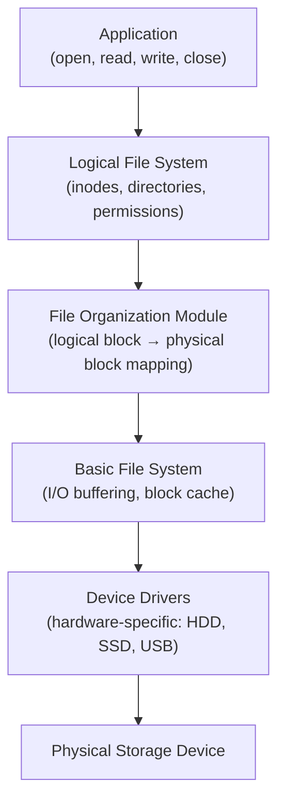

# File System Basics: Concepts and Key Components

> A file system is the set of rules and structures an OS uses to organize, store, and retrieve data on a storage device — it bridges human-readable file names and the raw bytes on disk through a layered architecture of boot blocks, superblocks, inodes, and data blocks.

---

## Table of Contents

1. [What Is a File System?](#1-what-is-a-file-system)
2. [Core Concepts: Files, Directories, Paths](#2-core-concepts-files-directories-paths)
3. [Key File System Components](#3-key-file-system-components)
4. [How File Systems Organize Data](#4-how-file-systems-organize-data)
5. [File System Operations](#5-file-system-operations)
6. [File System Layers](#6-file-system-layers)
7. [File System Mounting](#7-file-system-mounting)
8. [Key Takeaways](#8-key-takeaways)

---

## 1. What Is a File System?

A **file system** is a method an OS uses to store, organize, and retrieve files on storage devices (HDD, SSD, USB).

**Library analogy:**

```
  Raw disk without a file system = a warehouse where books are piled randomly.
  File system = the cataloging system — shelves, call numbers, an index —
                that tells you exactly where each book is.
```

**Why file systems matter:**

- Provide **hierarchical structure** (directories/folders) so millions of files stay organized
- Enable **fast lookup** via indexes and metadata (no need to scan the whole disk)
- Enforce **security** — permissions control who can read, write, or execute each file
- Enable **recovery** — journaling and checksums let the OS fix errors after crashes

---

## 2. Core Concepts: Files, Directories, Paths

### Files

A **file** is a named collection of related data (document, image, executable). Every file has **attributes** (metadata):

```
  Name          report.txt
  Type          text file (.txt)
  Size          42 KB
  Owner         alice
  Permissions   rw-r--r--
  Created       2024-03-01 09:00
  Modified      2024-03-15 14:30
  Location      inode #1234 → data blocks 501, 502, 503
```

### Directories

A **directory** (folder) is a special file containing a table of `{name → inode number}` entries. Directories can contain other directories, forming a **tree**.

```
  /
  ├── home/
  │   └── alice/
  │       ├── report.txt   ← entry: "report.txt → inode 1234"
  │       └── photos/
  └── etc/
```

### Paths

| Type     | Example                  | Meaning                        |
| -------- | ------------------------ | ------------------------------ |
| Absolute | `/home/alice/report.txt` | From root — always unambiguous |
| Relative | `photos/sunset.jpg`      | From current working directory |

---

## 3. Key File System Components

```
  Disk layout of a typical Unix-like file system:

  ┌──────────────────────────────────────────┐
  │  Boot Block   │  Superblock  │ Inode Table│ … Data Blocks …  │
  │  (1 block)    │  (1 block)   │ (N blocks) │                  │
  └──────────────────────────────────────────┘
```

### Boot Block

- Located at the very **beginning** of the disk
- Contains the **bootstrap loader** — first code BIOS/UEFI reads to start the OS
- Reserved even on non-bootable drives (structural consistency)

### Superblock

- Stores **metadata about the entire file system** — type, total size, block size, number of free blocks, pointers to other structures
- So critical that **multiple backup copies** are kept; if the primary is corrupted, recovery tools use a backup

### Inode Table

An **inode** (index node) stores metadata about one file/directory:

```
  Inode #1234:
  ├── type: regular file
  ├── permissions: rw-r--r--
  ├── owner: alice (uid 1001)
  ├── size: 43008 bytes
  ├── timestamps: created / modified / accessed
  └── block pointers:
       direct[0] → block 501
       direct[1] → block 502
       direct[2] → block 503
       indirect → (points to a block of more pointers for large files)
```

**Key insight:** The inode does NOT store the file name. The name lives in the **directory entry**. This is how **hard links** work — two directory entries pointing to the same inode number.

### Data Blocks

- The bulk of the disk — fixed-size chunks (typically 4 KB) holding **actual file content**
- Free blocks are tracked in a **free-block bitmap** (1 bit per block: 0=free, 1=used)
- Small files: a few direct block pointers in the inode suffice
- Large files: indirect → double-indirect → triple-indirect pointer levels

### Directory Entries

- Each entry: `{file name, inode number}`
- Opening `/home/alice/report.txt`:
  1. Look up "home" in root inode → find inode of `home/`
  2. Look up "alice" in `home/` → find inode of `alice/`
  3. Look up "report.txt" in `alice/` → find inode 1234
  4. Read inode 1234 → get block pointers → read data blocks

---

## 4. How File Systems Organize Data

### Logical vs Physical Organization

```
  User sees (logical):              Disk reality (physical):
  /home/alice/
    report.txt (42 KB)     →   Blocks 501, 502, 503 (may be scattered on disk)
    photos/ (500 MB)       →   Blocks 1001-1125 (contiguous or fragmented)
```

### Block Addressing for Large Files

```
  Inode block pointer structure:

  Direct pointers (12):    → blocks 0-11 of file   (12 × 4KB = 48 KB direct)
  Single indirect:         → 1 block of pointers   (1024 × 4KB = 4 MB range)
  Double indirect:         → pointer to pointers   (1024² × 4KB = 4 GB range)
  Triple indirect:         → 3 levels deep         (1024³ × 4KB = 4 TB range)
```

---

## 5. File System Operations

### Creating a File

1. Allocate a free inode from the inode table
2. Initialize inode (permissions, timestamps, owner)
3. If initial content exists, allocate data blocks; store block addresses in inode
4. Add a `{name → inode}` entry to the parent directory

### Reading a File

1. Traverse path from root → find target inode number via directory entries
2. Read inode → get permissions, size, block pointers
3. Read data blocks in order → return file content to caller

### Deleting a File

1. Remove the directory entry (name → inode mapping)
2. Decrement inode link count; if it reaches 0 → free the inode
3. Mark data blocks as free in the free-block bitmap
4. Update superblock (free count increased)
   > Data on disk is NOT zeroed immediately — file recovery tools can recover it until blocks are reused.

---

## 6. File System Layers



| Layer            | Responsibility                                             |
| ---------------- | ---------------------------------------------------------- |
| Application      | Makes system calls with file names and paths               |
| Logical FS       | Manages inodes, directory structures, permissions          |
| File Org. Module | Translates file-offset block numbers to disk block numbers |
| Basic FS         | Issues physical I/O, manages buffer/page cache             |
| Device Driver    | Controls actual hardware at electrical/protocol level      |

---

## 7. File System Mounting

**Mounting** = attaching a file system to the directory tree so it becomes accessible.

```
  Before mount:          After mount /dev/sdb1 at /mnt/usb:

  /                       /
  ├── home/               ├── home/
  └── mnt/                └── mnt/
      └── usb/  (empty)       └── usb/
                                   ├── photo.jpg
                                   └── notes.txt

  OS reads the superblock of /dev/sdb1 to understand its layout,
  then grafts it onto the tree at /mnt/usb.
```

- **Unmounting** flushes all pending writes to disk before detaching — safe removal
- Linux: `mount`, `umount` commands
- Windows: drive letters (C:, D:) are mount points

---

## 7. Code Examples

> Working code that demonstrates file system basics in practice.

### C++ — Simple Version
Simulate open/read/write/close file operations on an in-memory dictionary.

```cpp
#include <iostream>
#include <unordered_map>
#include <string>
using namespace std;

// Simple in-memory file system: filename -> content
unordered_map<string, string> fileSystem;
// Open file table: file_descriptor -> filename
unordered_map<int, string>    openFiles;
int nextFd = 3;  // 0,1,2 reserved for stdin/stdout/stderr

void createFile(const string& name) {
    if (fileSystem.count(name)) {
        cout << "File already exists: " << name << "\n";
        return;
    }
    fileSystem[name] = "";
    cout << "Created file: " << name << "\n";
}

// Returns a file descriptor (integer handle)
int openFile(const string& name) {
    if (!fileSystem.count(name)) {
        cout << "File not found: " << name << "\n";
        return -1;
    }
    int fd = nextFd++;
    openFiles[fd] = name;
    cout << "Opened '" << name << "' with fd=" << fd << "\n";
    return fd;
}

void writeFile(int fd, const string& data) {
    if (!openFiles.count(fd)) { cout << "Bad fd\n"; return; }
    fileSystem[openFiles[fd]] += data;  // append
    cout << "Wrote " << data.size() << " bytes to fd=" << fd << "\n";
}

string readFile(int fd) {
    if (!openFiles.count(fd)) { cout << "Bad fd\n"; return ""; }
    return fileSystem[openFiles[fd]];
}

void closeFile(int fd) {
    if (!openFiles.count(fd)) { cout << "Bad fd\n"; return; }
    cout << "Closed fd=" << fd << "\n";
    openFiles.erase(fd);
}

int main() {
    createFile("notes.txt");

    int fd = openFile("notes.txt");
    writeFile(fd, "Hello, File System!");
    cout << "Read: " << readFile(fd) << "\n";
    closeFile(fd);

    return 0;
}
```

### C++ — Medium / LeetCode Style
Inode-based VFS simulation with inode table, directory entries, and a block bitmap.

```cpp
#include <iostream>
#include <unordered_map>
#include <vector>
#include <string>
using namespace std;

struct Inode {
    int         id;
    string      name;
    string      type;         // "file" or "dir"
    int         size;         // bytes
    vector<int> blocks;       // allocated block numbers
    string      owner;
    string      permissions;  // e.g. "rwxr-xr-x"
};

class SimpleVFS {
    vector<bool>              blockBitmap;
    unordered_map<int,Inode>  inodes;
    unordered_map<string,int> dirEntries;  // name -> inode id
    int nextInode = 1;
    int totalBlocks;

    int allocBlock() {
        for (int i = 0; i < totalBlocks; i++)
            if (!blockBitmap[i]) { blockBitmap[i] = true; return i; }
        return -1;  // disk full
    }

public:
    SimpleVFS(int blocks = 64) : totalBlocks(blocks), blockBitmap(blocks, false) {}

    bool createFile(const string& name, int sizeBytes, const string& owner = "root") {
        if (dirEntries.count(name)) { cout << "Exists\n"; return false; }
        int blocksNeeded = (sizeBytes + 511) / 512;  // 512-byte blocks
        Inode inode{nextInode++, name, "file", sizeBytes, {}, owner, "rw-r--r--"};
        for (int i = 0; i < blocksNeeded; i++) {
            int b = allocBlock();
            if (b == -1) { cout << "Disk full!\n"; return false; }
            inode.blocks.push_back(b);
        }
        dirEntries[name] = inode.id;
        inodes[inode.id] = inode;
        cout << "Created '" << name << "' inode=" << inode.id
             << " blocks=" << inode.blocks.size() << "\n";
        return true;
    }

    void stat(const string& name) {
        auto it = dirEntries.find(name);
        if (it == dirEntries.end()) { cout << "Not found\n"; return; }
        Inode& in = inodes[it->second];
        cout << "Inode: " << in.id << "  Name: " << in.name
             << "  Size: " << in.size << "B  Blocks: [";
        for (int b : in.blocks) cout << b << " ";
        cout << "]  Owner: " << in.owner
             << "  Perms: " << in.permissions << "\n";
    }

    void deleteFile(const string& name) {
        auto it = dirEntries.find(name);
        if (it == dirEntries.end()) { cout << "Not found\n"; return; }
        Inode& in = inodes[it->second];
        for (int b : in.blocks) blockBitmap[b] = false;  // free blocks
        inodes.erase(it->second);
        dirEntries.erase(it);
        cout << "Deleted '" << name << "'\n";
    }

    void printBitmap() {
        cout << "Block bitmap: ";
        for (bool b : blockBitmap) cout << (b ? '1' : '0');
        cout << "\n";
    }
};

int main() {
    SimpleVFS vfs(16);
    vfs.createFile("readme.txt",  1024, "alice");
    vfs.createFile("kernel.bin",  3000, "root");
    vfs.stat("readme.txt");
    vfs.printBitmap();
    vfs.deleteFile("readme.txt");
    vfs.printBitmap();
    return 0;
}
```

### Python — Simple Version
Basic open/read/write/close operations on an in-memory dictionary.

```python
# In-memory file system: filename -> content string
file_system = {}
open_files  = {}   # file_descriptor -> filename
next_fd     = 3    # 0=stdin, 1=stdout, 2=stderr

def create_file(name):
    """Create an empty file."""
    if name in file_system:
        print(f"File already exists: {name}")
        return
    file_system[name] = ""
    print(f"Created: {name}")

def open_file(name):
    """Open a file and return a file descriptor integer."""
    global next_fd
    if name not in file_system:
        print(f"File not found: {name}")
        return -1
    fd = next_fd; next_fd += 1
    open_files[fd] = name
    print(f"Opened '{name}' -> fd={fd}")
    return fd

def write_file(fd, data):
    """Append data to an open file."""
    if fd not in open_files: print("Invalid fd"); return
    file_system[open_files[fd]] += data
    print(f"Wrote {len(data)} bytes to fd={fd}")

def read_file(fd):
    """Read all contents from an open file."""
    if fd not in open_files: print("Invalid fd"); return ""
    return file_system[open_files[fd]]

def close_file(fd):
    """Release the file descriptor."""
    if fd not in open_files: print("Invalid fd"); return
    print(f"Closed fd={fd}")
    del open_files[fd]

# --- Demo ---
create_file("hello.txt")
fd = open_file("hello.txt")
write_file(fd, "Hello, World!\n")
write_file(fd, "OS Tutorial rocks!")
print("Content:", read_file(fd))
close_file(fd)
```

### Python — Medium Level
Inode-based VFS simulation with inode table, directory entries, and block allocation tracking.

```python
from dataclasses import dataclass, field
from typing import List, Dict, Optional

BLOCK_SIZE = 512  # bytes per block

@dataclass
class Inode:
    inode_id:    int
    name:        str
    file_type:   str           # "file" or "dir"
    size:        int           # bytes
    blocks:      List[int] = field(default_factory=list)
    owner:       str = "root"
    permissions: str = "rw-r--r--"

class VirtualFileSystem:
    def __init__(self, total_blocks: int = 64):
        self.total_blocks = total_blocks
        self.bitmap:      List[bool]       = [False] * total_blocks  # False = free
        self.inodes:      Dict[int, Inode] = {}
        self.dir_entries: Dict[str, int]   = {}  # name -> inode_id
        self._next_inode  = 1

    def _alloc_blocks(self, count: int) -> Optional[List[int]]:
        allocated = []
        for i, used in enumerate(self.bitmap):
            if not used:
                allocated.append(i)
                if len(allocated) == count: break
        if len(allocated) < count: return None
        for b in allocated: self.bitmap[b] = True
        return allocated

    def create(self, name: str, size_bytes: int, owner: str = "root") -> bool:
        if name in self.dir_entries:
            print(f"Already exists: {name}"); return False
        blocks_needed = (size_bytes + BLOCK_SIZE - 1) // BLOCK_SIZE
        blocks = self._alloc_blocks(blocks_needed)
        if blocks is None: print("Disk full!"); return False
        inode = Inode(self._next_inode, name, "file", size_bytes, blocks, owner)
        self.inodes[inode.inode_id] = inode
        self.dir_entries[name]      = inode.inode_id
        self._next_inode += 1
        print(f"Created '{name}' | inode={inode.inode_id} | "
              f"blocks={blocks} | owner={owner}")
        return True

    def stat(self, name: str):
        inode_id = self.dir_entries.get(name)
        if inode_id is None: print(f"Not found: {name}"); return
        inode = self.inodes[inode_id]
        print(f"  Name: {inode.name}, Inode: {inode.inode_id}, "
              f"Size: {inode.size}B, Blocks: {inode.blocks}, "
              f"Owner: {inode.owner}, Perms: {inode.permissions}")

    def delete(self, name: str):
        inode_id = self.dir_entries.pop(name, None)
        if inode_id is None: print(f"Not found: {name}"); return
        inode = self.inodes.pop(inode_id)
        for b in inode.blocks: self.bitmap[b] = False
        print(f"Deleted '{name}', freed blocks: {inode.blocks}")

    def list_dir(self):
        print("Directory listing:")
        for name, iid in self.dir_entries.items():
            inode = self.inodes[iid]
            print(f"  {inode.permissions}  {inode.owner:8}  {inode.size:6}B  {name}")

# --- Demo ---
vfs = VirtualFileSystem(total_blocks=20)
vfs.create("readme.txt",  1024, "alice")
vfs.create("kernel.bin",  2560, "root")
vfs.create("config.cfg",   512, "alice")
vfs.list_dir()
print()
vfs.stat("kernel.bin")
vfs.delete("readme.txt")
print(f"\nBitmap after delete: {''.join('1' if b else '0' for b in vfs.bitmap)}")
```

---

## 8. Key Takeaways

- A **file system** provides the structure (naming, hierarchy, metadata, access control) that turns raw storage into usable space
- **Inode** = file's metadata record (permissions, size, timestamps, block pointers) — does NOT contain the file name
- **Directory entry** = maps a human-readable file name to an inode number
- **Superblock** = the file system's own metadata record — if it's lost, the whole FS is unreadable; that's why multiple backups exist
- **Data blocks** hold actual content; free blocks are tracked by a bitmap
- **Large files** use multi-level indirect pointers to address terabytes of data from a small inode
- File system layers abstract hardware from applications: app uses path strings → OS resolves inodes → driver talks to hardware
- **Mounting** integrates a file system into the directory tree; unmounting safely flushes all pending writes
- Deleting a file removes the directory entry and frees the inode/blocks — actual data persists until blocks are reused (why file recovery works)
