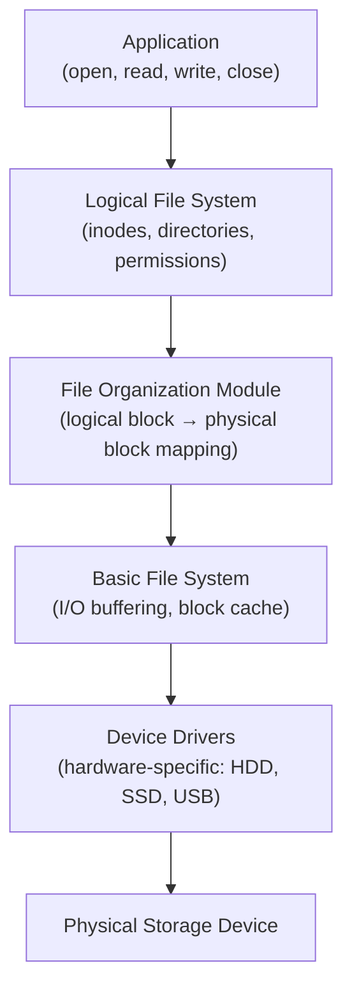

# File System Basics: Concepts and Key Components

> A file system is the set of rules and structures an OS uses to organize, store, and retrieve data on a storage device — it bridges human-readable file names and the raw bytes on disk through a layered architecture of boot blocks, superblocks, inodes, and data blocks.

---

## Table of Contents

1. [What Is a File System?](#1-what-is-a-file-system)
2. [Core Concepts: Files, Directories, Paths](#2-core-concepts-files-directories-paths)
3. [Key File System Components](#3-key-file-system-components)
4. [How File Systems Organize Data](#4-how-file-systems-organize-data)
5. [File System Operations](#5-file-system-operations)
6. [File System Layers](#6-file-system-layers)
7. [File System Mounting](#7-file-system-mounting)
8. [Key Takeaways](#8-key-takeaways)

---

## 1. What Is a File System?

A **file system** is a method an OS uses to store, organize, and retrieve files on storage devices (HDD, SSD, USB).

**Library analogy:**

```
  Raw disk without a file system = a warehouse where books are piled randomly.
  File system = the cataloging system — shelves, call numbers, an index —
                that tells you exactly where each book is.
```

**Why file systems matter:**

- Provide **hierarchical structure** (directories/folders) so millions of files stay organized
- Enable **fast lookup** via indexes and metadata (no need to scan the whole disk)
- Enforce **security** — permissions control who can read, write, or execute each file
- Enable **recovery** — journaling and checksums let the OS fix errors after crashes

---

## 2. Core Concepts: Files, Directories, Paths

### Files

A **file** is a named collection of related data (document, image, executable). Every file has **attributes** (metadata):

```
  Name          report.txt
  Type          text file (.txt)
  Size          42 KB
  Owner         alice
  Permissions   rw-r--r--
  Created       2024-03-01 09:00
  Modified      2024-03-15 14:30
  Location      inode #1234 → data blocks 501, 502, 503
```

### Directories

A **directory** (folder) is a special file containing a table of `{name → inode number}` entries. Directories can contain other directories, forming a **tree**.

```
  /
  ├── home/
  │   └── alice/
  │       ├── report.txt   ← entry: "report.txt → inode 1234"
  │       └── photos/
  └── etc/
```

### Paths

| Type     | Example                  | Meaning                        |
| -------- | ------------------------ | ------------------------------ |
| Absolute | `/home/alice/report.txt` | From root — always unambiguous |
| Relative | `photos/sunset.jpg`      | From current working directory |

---

## 3. Key File System Components

```
  Disk layout of a typical Unix-like file system:

  ┌──────────────────────────────────────────┐
  │  Boot Block   │  Superblock  │ Inode Table│ … Data Blocks …  │
  │  (1 block)    │  (1 block)   │ (N blocks) │                  │
  └──────────────────────────────────────────┘
```

### Boot Block

- Located at the very **beginning** of the disk
- Contains the **bootstrap loader** — first code BIOS/UEFI reads to start the OS
- Reserved even on non-bootable drives (structural consistency)

### Superblock

- Stores **metadata about the entire file system** — type, total size, block size, number of free blocks, pointers to other structures
- So critical that **multiple backup copies** are kept; if the primary is corrupted, recovery tools use a backup

### Inode Table

An **inode** (index node) stores metadata about one file/directory:

```
  Inode #1234:
  ├── type: regular file
  ├── permissions: rw-r--r--
  ├── owner: alice (uid 1001)
  ├── size: 43008 bytes
  ├── timestamps: created / modified / accessed
  └── block pointers:
       direct[0] → block 501
       direct[1] → block 502
       direct[2] → block 503
       indirect → (points to a block of more pointers for large files)
```

**Key insight:** The inode does NOT store the file name. The name lives in the **directory entry**. This is how **hard links** work — two directory entries pointing to the same inode number.

### Data Blocks

- The bulk of the disk — fixed-size chunks (typically 4 KB) holding **actual file content**
- Free blocks are tracked in a **free-block bitmap** (1 bit per block: 0=free, 1=used)
- Small files: a few direct block pointers in the inode suffice
- Large files: indirect → double-indirect → triple-indirect pointer levels

### Directory Entries

- Each entry: `{file name, inode number}`
- Opening `/home/alice/report.txt`:
  1. Look up "home" in root inode → find inode of `home/`
  2. Look up "alice" in `home/` → find inode of `alice/`
  3. Look up "report.txt" in `alice/` → find inode 1234
  4. Read inode 1234 → get block pointers → read data blocks

---

## 4. How File Systems Organize Data

### Logical vs Physical Organization

```
  User sees (logical):              Disk reality (physical):
  /home/alice/
    report.txt (42 KB)     →   Blocks 501, 502, 503 (may be scattered on disk)
    photos/ (500 MB)       →   Blocks 1001-1125 (contiguous or fragmented)
```

### Block Addressing for Large Files

```
  Inode block pointer structure:

  Direct pointers (12):    → blocks 0-11 of file   (12 × 4KB = 48 KB direct)
  Single indirect:         → 1 block of pointers   (1024 × 4KB = 4 MB range)
  Double indirect:         → pointer to pointers   (1024² × 4KB = 4 GB range)
  Triple indirect:         → 3 levels deep         (1024³ × 4KB = 4 TB range)
```

---

## 5. File System Operations

### Creating a File

1. Allocate a free inode from the inode table
2. Initialize inode (permissions, timestamps, owner)
3. If initial content exists, allocate data blocks; store block addresses in inode
4. Add a `{name → inode}` entry to the parent directory

### Reading a File

1. Traverse path from root → find target inode number via directory entries
2. Read inode → get permissions, size, block pointers
3. Read data blocks in order → return file content to caller

### Deleting a File

1. Remove the directory entry (name → inode mapping)
2. Decrement inode link count; if it reaches 0 → free the inode
3. Mark data blocks as free in the free-block bitmap
4. Update superblock (free count increased)
   > Data on disk is NOT zeroed immediately — file recovery tools can recover it until blocks are reused.

---

## 6. File System Layers



| Layer            | Responsibility                                             |
| ---------------- | ---------------------------------------------------------- |
| Application      | Makes system calls with file names and paths               |
| Logical FS       | Manages inodes, directory structures, permissions          |
| File Org. Module | Translates file-offset block numbers to disk block numbers |
| Basic FS         | Issues physical I/O, manages buffer/page cache             |
| Device Driver    | Controls actual hardware at electrical/protocol level      |

---

## 7. File System Mounting

**Mounting** = attaching a file system to the directory tree so it becomes accessible.

```
  Before mount:          After mount /dev/sdb1 at /mnt/usb:

  /                       /
  ├── home/               ├── home/
  └── mnt/                └── mnt/
      └── usb/  (empty)       └── usb/
                                   ├── photo.jpg
                                   └── notes.txt

  OS reads the superblock of /dev/sdb1 to understand its layout,
  then grafts it onto the tree at /mnt/usb.
```

- **Unmounting** flushes all pending writes to disk before detaching — safe removal
- Linux: `mount`, `umount` commands
- Windows: drive letters (C:, D:) are mount points

---

## 8. Key Takeaways

- A **file system** provides the structure (naming, hierarchy, metadata, access control) that turns raw storage into usable space
- **Inode** = file's metadata record (permissions, size, timestamps, block pointers) — does NOT contain the file name
- **Directory entry** = maps a human-readable file name to an inode number
- **Superblock** = the file system's own metadata record — if it's lost, the whole FS is unreadable; that's why multiple backups exist
- **Data blocks** hold actual content; free blocks are tracked by a bitmap
- **Large files** use multi-level indirect pointers to address terabytes of data from a small inode
- File system layers abstract hardware from applications: app uses path strings → OS resolves inodes → driver talks to hardware
- **Mounting** integrates a file system into the directory tree; unmounting safely flushes all pending writes
- Deleting a file removes the directory entry and frees the inode/blocks — actual data persists until blocks are reused (why file recovery works)
