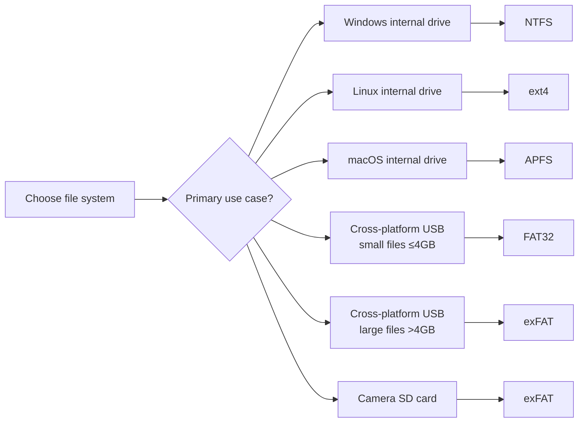

# File Systems Explained: FAT, NTFS, ext4

> FAT, NTFS, ext4, and APFS are different filing cabinet designs for your disk — FAT is the universal but limited old system, NTFS is Windows' full-featured modern system, ext4 is Linux's high-performance default, and APFS is Apple's SSD-optimized modern choice; pick the one that matches your OS and use case.

---

## Table of Contents

1. [FAT — File Allocation Table](#1-fat--file-allocation-table)
2. [NTFS — New Technology File System](#2-ntfs--new-technology-file-system)
3. [ext Family — Linux File Systems](#3-ext-family--linux-file-systems)
4. [APFS — Apple File System](#4-apfs--apple-file-system)
5. [HFS+ — The Previous Apple Standard](#5-hfs--the-previous-apple-standard)
6. [Head-to-Head Comparison](#6-head-to-head-comparison)
7. [Choosing the Right File System](#7-choosing-the-right-file-system)
8. [Key Takeaways](#8-key-takeaways)

---

## 1. FAT — File Allocation Table

**FAT** is one of the oldest file systems still in use. It tracks which disk clusters belong to which files using a single table — like an index card catalog.

**How FAT works:**

```
  File Allocation Table:
  Cluster 5  → 6    (file A continues at cluster 6)
  Cluster 6  → 7
  Cluster 7  → EOF  (end of file A)
  Cluster 8  → FREE
  Cluster 9  → 10   (file B starts here)
  ...

  Each entry says "next cluster" or "EOF" or "FREE".
  The FS chases this linked list to read a file.
```

### FAT Variants

| Version   | Address Bits | Max File Size | Max Partition                  | Notes                                                 |
| --------- | ------------ | ------------- | ------------------------------ | ----------------------------------------------------- |
| **FAT16** | 16-bit       | 2 GB          | 2 GB                           | Very old; rare today except embedded systems          |
| **FAT32** | 32-bit       | **4 GB**      | 2 TB (32 GB in Windows format) | Wide compatibility — USB drives, external HDD         |
| **exFAT** | 32-bit+      | 128 PB        | 128 PB                         | No 4 GB limit; no journaling; modern cameras/SD cards |

> **FAT32's notorious limit:** Cannot store any single file larger than 4 GB — a 4K video file or a large VM disk will fail even if plenty of free space exists.

### FAT Strengths and Weaknesses

| ✅ Good                                                                         | ❌ Bad                                           |
| ------------------------------------------------------------------------------- | ------------------------------------------------ |
| Works on virtually every device (Windows, macOS, Linux, cameras, game consoles) | No security/permissions support                  |
| Simple structure — easy to implement                                            | No journaling → risk of corruption on power loss |
| Great for USB drives that move between systems                                  | Small max file size (FAT32: 4 GB)                |
|                                                                                 | High cluster waste on large partitions           |

---

## 2. NTFS — New Technology File System

**NTFS** is Windows' primary file system since Windows NT (1993). Think of it as a modern library with security cameras, digital catalogs, detailed borrowing logs, and encrypted vaults.

### Architecture

NTFS uses a **Master File Table (MFT)** — every file and directory has a record in the MFT. The MFT is the NTFS equivalent of an inode table.

```
  MFT record for my_file.txt:
  ├── $STANDARD_INFORMATION  (timestamps, flags)
  ├── $FILE_NAME             (name, parent directory)
  ├── $SECURITY_DESCRIPTOR  (ACL — who can read/write/execute)
  ├── $DATA                  (file content, or pointers to data runs)
  └── $OBJECT_ID             (unique file GUID)
```

### Key NTFS Features

| Feature                    | Description                                             |
| -------------------------- | ------------------------------------------------------- |
| **Max file size**          | 16 EB (exabytes) — practically unlimited                |
| **Max volume size**        | 16 EB                                                   |
| **Journaling**             | Records changes before committing — fast crash recovery |
| **Permissions (ACL)**      | Per-file/folder access control for users and groups     |
| **Compression**            | Built-in transparent file compression                   |
| **Encryption (EFS)**       | Encrypt individual files/folders with user keys         |
| **Disk quotas**            | Limit how much space each user can consume              |
| **Hard links & junctions** | Multiple names or paths to the same data                |
| **Sparse files**           | Files with large empty regions stored efficiently       |
| **Alternate Data Streams** | Hidden extra data attached to a file                    |

### NTFS Compatibility

```
  Windows  → Full read/write ✅
  macOS    → Read-only by default (no write without 3rd-party tools) ⚠️
  Linux    → Read/write via ntfs-3g driver ✅ (with slight overhead)
```

---

## 3. ext Family — Linux File Systems

The **ext** (Extended) file system family is native to Linux. Each version adds reliability and performance improvements.

```
  Evolution:
  ext (1992) → ext2 (1993) → ext3 (2001) → ext4 (2008, current default)
```

### ext2

- Simple, no journaling
- Fast for stable systems (no journal write overhead)
- After crash: requires full `fsck` scan (can take hours on large drives)
- Used today only for boot partitions or USB drives where journaling overhead is unwanted

### ext3

- Added **journaling** to ext2 — the major advancement
- Backward compatible with ext2 (can mount ext2 as ext3 and back)
- Still has some performance limits (no extents, limited max file size)

### ext4 — Current Linux Default

```
  ext4 improvements over ext3:
  ├── Extents (contiguous block ranges) instead of block lists → less fragmentation
  ├── Max file size: 16 TB (was 2 TB in ext3)
  ├── Max volume size: 1 EB (was 32 TB)
  ├── Delayed allocation → better disk write batching → faster I/O
  ├── Dir entry htree indexing → faster directory lookups in huge dirs
  └── Online defragmentation support
```

| Feature         | ext2  | ext3  | ext4                    |
| --------------- | ----- | ----- | ----------------------- |
| Journaling      | No    | Yes   | Yes (with better modes) |
| Max file size   | 2 TB  | 2 TB  | **16 TB**               |
| Max volume size | 32 TB | 32 TB | **1 EB**                |
| Extents         | No    | No    | **Yes**                 |
| Performance     | Good  | Good  | **Excellent**           |

### ext Compatibility

```
  Linux    → Full read/write ✅
  macOS    → Read-only with 3rd-party tools ⚠️
  Windows  → Read-only with 3rd-party tools (e.g., Ext2Fsd) ⚠️
```

---

## 4. APFS — Apple File System

**APFS** (2017) is Apple's modern file system, replacing HFS+. Designed from scratch for **flash/SSD storage**.

### APFS Key Features

| Feature               | What it does                                                                                    |
| --------------------- | ----------------------------------------------------------------------------------------------- |
| **Copy-on-write**     | Modifying a file writes new blocks without overwriting old ones — prevents mid-write corruption |
| **Snapshots**         | Instant point-in-time captures of the FS state (used by Time Machine)                           |
| **Clones**            | Duplicate a file instantly using zero extra space (copy-on-write + shared blocks)               |
| **Space sharing**     | Multiple APFS volumes on one partition share a single free space pool                           |
| **Strong encryption** | Per-volume or per-file AES-256 encryption built in                                              |
| **Crash protection**  | Copy-on-write architecture guarantees atomic updates                                            |
| **SSD-optimized**     | Avoids unnecessary writes; spreads wear; native TRIM support                                    |

```
  Copy-on-write example:

  Before modifying block 50:
  inode → [block 50] (original data: "Hello")

  APFS write:
  1. Write new data to free block 51: "World"
  2. Update inode pointer: inode → [block 51]
  3. Mark block 50 as free

  If crash happens between steps 1 and 2: block 50 still intact — no corruption!
```

---

## 5. HFS+ — The Previous Apple Standard

**HFS+** (Hierarchical File System Plus) was Apple's file system from 1998 to 2017.

- Supports journaling (HFS+ Journaled)
- Still found on older Macs and some external drives formatted for macOS
- Replaced by APFS on all modern Apple devices (macOS 10.13+, iOS 10.3+)

---

## 6. Head-to-Head Comparison

| Feature           | FAT32         | exFAT     | NTFS      | ext4    | APFS             |
| ----------------- | ------------- | --------- | --------- | ------- | ---------------- |
| Max file size     | **4 GB**      | 128 PB    | 16 EB     | 16 TB   | 8 EB             |
| Max volume        | 2 TB          | 128 PB    | 16 EB     | 1 EB    | 8 EB             |
| Journaling        | No            | No        | Yes       | Yes     | Yes (CoW)        |
| Permissions / ACL | No            | No        | Yes       | Yes     | Yes              |
| Encryption        | No            | No        | Yes (EFS) | Limited | Yes (native)     |
| Compression       | No            | No        | Yes       | No      | Limited          |
| Snapshots         | No            | No        | Yes (VSS) | No      | **Yes (native)** |
| Cross-platform    | **Excellent** | Very good | Limited   | Limited | Apple only       |
| SSD-optimized     | No            | Partial   | Partial   | Partial | **Yes**          |



---

## 7. Choosing the Right File System

| Use Case                          | Recommended        | Reason                                      |
| --------------------------------- | ------------------ | ------------------------------------------- |
| Windows internal drive            | NTFS               | Best performance + security for Windows     |
| Linux internal drive              | ext4               | Mature, fast, default in all major distros  |
| macOS internal drive              | APFS               | SSD-optimized, snapshots, native encryption |
| USB drive (all OSes, small files) | FAT32              | Maximum compatibility                       |
| USB drive (all OSes, large files) | exFAT              | No 4 GB limit, still very compatible        |
| SD card for camera/drone          | exFAT              | Industry standard for modern cards          |
| Docker/container volume           | ext4 or overlay FS | Linux-native performance                    |

**Conversion warning:** Most FS changes require format (data loss). Always back up first.

- Windows exception: FAT32 → NTFS can be done in-place with `convert` command
- All other conversions: backup → format → restore

---

## 7. Code Examples

> Working code that demonstrates FAT file system internals and fragmentation in practice.

### C++ — Simple Version

Simulate a FAT table — allocate a file across clusters and read the FAT chain.

```cpp
#include <iostream>
#include <vector>
#include <string>
using namespace std;

// FAT values: 0 = free, -1 = end of chain, positive = index of next cluster
const int FREE         =  0;
const int END_OF_CHAIN = -1;
const int NUM_CLUSTERS = 16;

vector<int>    FAT(NUM_CLUSTERS, FREE);   // File Allocation Table
vector<string> disk(NUM_CLUSTERS, "");   // simulated cluster data

// Allocate clusters for a file; each element of 'chunks' goes into one cluster
int allocateFile(const vector<string>& chunks) {
    int startCluster = -1, prevCluster = -1;
    for (const string& chunk : chunks) {
        // find a free cluster
        int c = -1;
        for (int i = 1; i < NUM_CLUSTERS; i++)
            if (FAT[i] == FREE) { c = i; break; }
        if (c == -1) { cout << "Disk full!\n"; return -1; }
        FAT[c]  = END_OF_CHAIN;  // this cluster is last for now
        disk[c] = chunk;
        if (prevCluster != -1) FAT[prevCluster] = c;  // link previous -> current
        else startCluster = c;                         // remember head
        prevCluster = c;
    }
    return startCluster;
}

// Follow the FAT chain from startCluster and print every cluster
void readFile(int startCluster) {
    cout << "FAT chain: ";
    int c = startCluster;
    while (c != END_OF_CHAIN && c != FREE) {
        cout << "[Cluster " << c << ": '" << disk[c] << "'] ";
        c = FAT[c];  // jump to next cluster via FAT
    }
    cout << "\n";
}

void printFAT() {
    cout << "FAT: ";
    for (int i = 0; i < NUM_CLUSTERS; i++)
        if (FAT[i] != FREE) cout << "FAT[" << i << "]=" << FAT[i] << " ";
    cout << "\n";
}

int main() {
    int start = allocateFile({"Hello ", "World ", "from FAT!"});
    cout << "File starts at cluster: " << start << "\n";
    readFile(start);
    printFAT();
    return 0;
}
```

### C++ — Medium / LeetCode Style

Compare FAT (fragmented scatter) vs. ext4 extents (contiguous allocation).

```cpp
#include <iostream>
#include <vector>
using namespace std;

const int TOTAL = 20;

// ---- FAT Disk: allocates to any free cluster (can fragment) ----
struct FATDisk {
    vector<int>  fat;
    vector<bool> used;
    FATDisk() : fat(TOTAL, 0), used(TOTAL, false) {}

    // Punch holes to simulate prior fragmentation
    void fragment(const vector<int>& indices) {
        for (int i : indices) { used[i] = false; fat[i] = 0; }
    }

    // First-fit, non-contiguous (FAT doesn't need contiguity)
    vector<int> allocate(int n) {
        vector<int> clusters;
        int prev = -1;
        for (int i = 0; i < TOTAL && (int)clusters.size() < n; i++) {
            if (!used[i]) {
                used[i] = true;
                fat[i]  = -1;           // end of chain
                if (prev != -1) fat[prev] = i;
                clusters.push_back(i);
                prev = i;
            }
        }
        return clusters;
    }
};

// ---- Ext4-style Extent: must be contiguous blocks ----
struct Ext4Disk {
    vector<bool> used;
    Ext4Disk() : used(TOTAL, false) {}

    // Returns (start, length) or (-1,0) if no contiguous run found
    pair<int,int> allocateExtent(int n) {
        for (int start = 0; start + n <= TOTAL; start++) {
            bool free = true;
            for (int i = start; i < start + n; i++)
                if (used[i]) { free = false; break; }
            if (free) {
                for (int i = start; i < start + n; i++) used[i] = true;
                return {start, n};
            }
        }
        return {-1, 0};
    }
};

int main() {
    // --- FAT with fragmentation ---
    FATDisk fat;
    fat.fragment({2, 5, 8});   // create gaps at clusters 2, 5, 8
    auto fatFile = fat.allocate(4);
    cout << "FAT allocation (fragmented): ";
    for (int c : fatFile) cout << c << " ";
    cout << "\n";

    // --- Ext4 extent ---
    Ext4Disk ext4;
    // Pre-occupy some blocks
    ext4.used[0] = ext4.used[1] = ext4.used[2] = true;
    auto [start, len] = ext4.allocateExtent(4);
    if (start != -1)
        cout << "Ext4 extent: start=" << start
             << " length=" << len << " (contiguous)\n";
    else
        cout << "Ext4: no contiguous space available\n";

    return 0;
}
```

### Python — Simple Version

Simulate a FAT table as a list — allocate a file and follow the chain to read it back.

```python
# Simulate a simple FAT (File Allocation Table) file system

FREE         =  0
END_OF_CHAIN = -1
NUM_CLUSTERS = 12

fat  = [FREE] * NUM_CLUSTERS   # FAT[i] = next cluster, FREE, or END_OF_CHAIN
disk = [""]   * NUM_CLUSTERS   # simulated cluster data

def allocate_file(chunks):
    """Allocate one cluster per chunk; link via FAT. Returns head cluster."""
    start_cluster, prev_cluster = None, None
    for chunk in chunks:
        # find first free cluster (skip cluster 0)
        free = next((i for i in range(1, NUM_CLUSTERS) if fat[i] == FREE), None)
        if free is None:
            print("Disk full!"); return -1
        fat[free]  = END_OF_CHAIN
        disk[free] = chunk
        if prev_cluster is not None:
            fat[prev_cluster] = free   # link previous -> this
        else:
            start_cluster = free       # first cluster of the file
        prev_cluster = free
    return start_cluster

def read_file(start_cluster):
    """Follow FAT chain from start_cluster and concatenate data."""
    content, c = [], start_cluster
    while c != END_OF_CHAIN and c != FREE:
        content.append(disk[c])
        c = fat[c]   # follow the chain
    return "".join(content)

def print_fat():
    active = {i: fat[i] for i in range(NUM_CLUSTERS) if fat[i] != FREE}
    print("FAT (active entries):", active)

# --- Demo ---
start = allocate_file(["Hello, ", "from ", "FAT!"])
print(f"File starts at cluster: {start}")
print(f"Content: {read_file(start)}")
print_fat()
```

### Python — Medium Level

Compare FAT (non-contiguous scatter) with ext4-style extent allocation.

```python
# Simulate fragmentation: FAT (scatter) vs ext4 extents (contiguous)

FREE, END = 0, -1
TOTAL = 20

class FATDisk:
    def __init__(self):
        self.fat  = [FREE] * TOTAL
        self.used = [False] * TOTAL

    def fragment(self, indices):
        """Mark clusters as free to create fragmentation holes."""
        for i in indices:
            self.used[i] = False
            self.fat[i]  = FREE

    def allocate(self, n):
        """Allocate n clusters anywhere on disk (FAT doesn't need contiguity)."""
        clusters, prev = [], None
        for i in range(TOTAL):
            if not self.used[i] and len(clusters) < n:
                self.used[i] = True
                if prev is not None: self.fat[prev] = i
                self.fat[i] = END
                clusters.append(i)
                prev = i
        return clusters

class Ext4Disk:
    def __init__(self):
        self.used = [False] * TOTAL

    def allocate_extent(self, n):
        """Find n CONTIGUOUS free blocks and return (start, length)."""
        for start in range(TOTAL - n + 1):
            if all(not self.used[start + k] for k in range(n)):
                for k in range(n): self.used[start + k] = True
                return (start, n)
        return None  # no contiguous run large enough

# --- Demo ---
fat_disk = FATDisk()
fat_disk.used = [True] * TOTAL   # fill disk
fat_disk.fragment([3, 7, 11, 15]) # punch 4 holes
fat_clusters = fat_disk.allocate(4)
print(f"FAT allocation (fragmented): {fat_clusters}")
print(f"  Contiguous? {fat_clusters == list(range(fat_clusters[0], fat_clusters[0]+4))}")

ext4 = Ext4Disk()
for i in [0, 1, 2]: ext4.used[i] = True   # pre-occupy first 3
extent = ext4.allocate_extent(4)
if extent:
    start, length = extent
    print(f"Ext4 extent (contiguous): start={start}, len={length}, blocks={list(range(start, start+length))}")
else:
    print("Ext4: no contiguous run available")
```

---

## 8. Key Takeaways

- **FAT** (FAT16/FAT32/exFAT) = oldest, simplest, most compatible; FAT32's 4 GB per-file limit is the key constraint; exFAT removes it
- **NTFS** = Windows' full-featured modern FS: journaling, ACL permissions, encryption, compression, large file support — but limited cross-platform write support
- **ext4** = Linux's current standard: journaling, extents, excellent performance, very large file/volume support — minimal cross-platform write support
- **APFS** = Apple's SSD-native FS: copy-on-write architecture, snapshots, clones, space sharing, strong encryption — Apple devices only
- **Journaling** (NTFS, ext3/4, APFS) = records changes before committing them → fast crash recovery without full disk scan
- **Cross-platform universal choice:** FAT32 (≤4 GB files) or exFAT (>4 GB files)
- **Native performance:** always use the OS-native file system for internal drives
- The right FS depends on: which OS(es) you use, file sizes you need to store, security requirements, and whether the drive moves between systems
