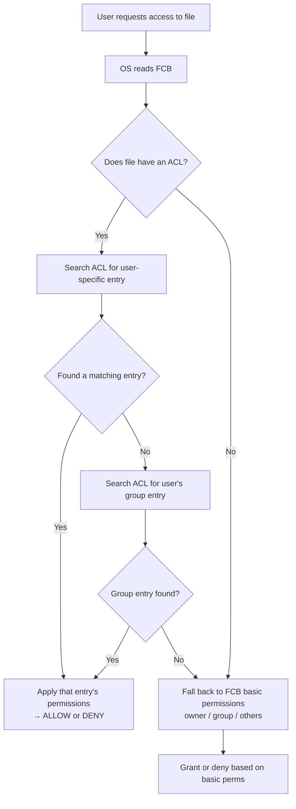

# FCB vs ACL: File Metadata and Permissions

> The File Control Block (FCB) is the OS's per-file information card — it stores metadata like owner, size, timestamps, and basic permissions; the Access Control List (ACL) extends that with per-user/per-group fine-grained rules; together they answer "what is this file?" and "who can do what to it?"

---

## Table of Contents

1. [What Is a File Control Block (FCB)?](#1-what-is-a-file-control-block-fcb)
2. [FCB Components](#2-fcb-components)
3. [FCB vs File Content](#3-fcb-vs-file-content)
4. [What Is an Access Control List (ACL)?](#4-what-is-an-access-control-list-acl)
5. [ACL Structure and Entry Types](#5-acl-structure-and-entry-types)
6. [How FCB and ACL Work Together](#6-how-fcb-and-acl-work-together)
7. [Unix Permissions vs ACL](#7-unix-permissions-vs-acl)
8. [Real-World Example](#8-real-world-example)
9. [Key Takeaways](#9-key-takeaways)

---

## 1. What Is a File Control Block (FCB)?

A **File Control Block (FCB)** is a data structure the OS creates for every file. It acts as a "passport" or "information card" for the file — the OS can look up anything about the file here without opening the file content itself.

**Passport analogy:**

```
  File content = the person
  FCB = the passport

  The passport doesn't contain the person,
  but it has everything you need to identify them:
  name, date of birth, nationality, photo, expiry date.

  Similarly the FCB has: file name, owner, size, permissions, timestamps, location.
```

On Unix/Linux systems, the FCB is implemented as the **inode** (index node). On NTFS, it's the **MFT record** (Master File Table).

---

## 2. FCB Components

```
  File Control Block (FCB) for "report.txt"
  ──────────────────────────────────────────
  File Name:        report.txt
  File Type:        Text (.txt)
  File Size:        2048 bytes
  Disk Location:    Blocks 500-503
  Creation Time:    2024-01-15  09:30:00
  Last Modified:    2024-01-20  14:45:22
  Last Accessed:    2024-01-21  10:15:33
  Owner (UID):      1001 (john_doe)
  Group (GID):      500  (developers)
  Basic Permissions:
      Owner:  Read, Write
      Group:  Read
      Others: No Access
  Attributes:       Normal (not hidden, not system)
  Reference Count:  0 (no process has it open)
  Has ACL:          Yes  →  pointer to ACL structure
  ──────────────────────────────────────────
```

**Key fields explained:**

| Field           | Purpose                                                                       |
| --------------- | ----------------------------------------------------------------------------- |
| Disk Location   | Block pointers — tells OS where actual data lives                             |
| Owner / Group   | Who "owns" this file                                                          |
| Permissions     | Basic read/write/execute per owner/group/others                               |
| Timestamps      | Creation, modification, access — used for backup, audit, `ls -l` display      |
| Reference Count | Number of open handles / hard links — OS won't delete inode until this hits 0 |
| Attributes      | Hidden, read-only, system, archive flags                                      |

---

## 3. FCB vs File Content

The FCB stores **metadata** (data about the file), NOT the file's actual data.

| Aspect          | FCB (Metadata)                            | File Content (Data)               |
| --------------- | ----------------------------------------- | --------------------------------- |
| Purpose         | Describes the file                        | Is the file                       |
| Size            | Fixed, small (hundreds of bytes)          | Variable (0 bytes to terabytes)   |
| Location        | Inode table / MFT                         | Data blocks on disk               |
| When read       | Every file operation (open, stat, chmod…) | Only when reading/writing content |
| Example content | Name, size, permissions, timestamps       | Text, image pixels, video frames  |

When you open a file by name:

```
  OS: "report.txt"
  → Looks in directory → finds inode number 1234
  → Reads inode 1234 (= the FCB) → checks permissions → gets block pointers
  → Reads data blocks → returns content to your program
```

---

## 4. What Is an Access Control List (ACL)?

An **ACL** is an extended permission structure that specifies exactly which users and groups have which rights — beyond the simple owner/group/others model.

**Guest list analogy:**

```
  Basic permissions = "owner gets VIP, developers group gets access, no one else"
  ACL = actual guest list:
        alice: allowed (VIP + backstage)
        bob:   allowed (general admission only)
        carol: allowed (read-only — spectator)
        dave:  DENIED
        temp_contractors: allowed until June 30, read-only
```

**Why ACLs are needed:**

- Traditional Unix: only 3 subjects — owner, group, others
- What if you need: Alice (read+write), Bob (read-only), Carol (no access), external auditor (read until next month)?
- You can't express that with 3 categories → need per-user rules → ACL

---

## 5. ACL Structure and Entry Types

```
  ACL for "project_plan.docx"
  ──────────────────────────────────────
  Entry 1:  User "alice"    → Read, Write   [Allow]
  Entry 2:  User "bob"      → Read          [Allow]
  Entry 3:  Group "managers"→ Read, Write, Delete [Allow]
  Entry 4:  Others          → None          [Deny]
  ──────────────────────────────────────
```

### ACL Entry Types

| Type            | What it does                                                                |
| --------------- | --------------------------------------------------------------------------- |
| **User ACE**    | Permissions for a specific named user                                       |
| **Group ACE**   | Permissions for a specific named group                                      |
| **Default ACE** | Permissions automatically inherited by new files created inside a directory |
| **Mask ACE**    | Cap — limits the maximum permission any group/user ACE can grant            |
| **Others ACE**  | Fallback permissions for anyone not matched by other entries                |

### How evaluation works



---

## 6. How FCB and ACL Work Together

The FCB holds the **core metadata and basic permissions**. The ACL (if present) provides **extended, fine-grained rules**. The FCB contains a pointer/flag indicating whether an ACL exists.

```python
# Pseudocode: OS access check

def check_access(user, file, operation):
    fcb = get_fcb(file)              # always read FCB first

    if fcb.has_acl:
        acl = get_acl(file)
        for entry in acl.entries:
            if entry.subject == user:          # user-specific match
                return ALLOW if operation in entry.permissions else DENY
            if entry.subject == user.group:    # group match
                return ALLOW if operation in entry.permissions else DENY

    # No ACL or no matching ACL entry → use basic FCB permissions
    if user == fcb.owner:
        return check(fcb.owner_permissions, operation)
    elif user.group == fcb.group:
        return check(fcb.group_permissions, operation)
    else:
        return check(fcb.others_permissions, operation)
```

**Priority:** ACL entry > basic FCB permissions (ACL wins when present)

---

## 7. Unix Permissions vs ACL

**Unix basic permissions (stored in FCB/inode):**

```
  -rw-r--r-- 1 alice developers 2048 Jan 20 report.txt

  rw-  = owner (alice) can read and write
  r--  = group (developers) can read only
  r--  = others can read only

  9 bits total: [owner: rwx] [group: rwx] [others: rwx]
```

**Limitation:** Only 3 subjects. You can't give bob (also in developers) less access than the rest of the group without creating a new group just for him.

**POSIX ACL (extended):**

```bash
# View ACL
getfacl report.txt

# Add user-specific rule
setfacl -m u:bob:r report.txt    # Bob: read only
setfacl -m u:carol:rw report.txt # Carol: read+write
setfacl -m u:dave:--- report.txt # Dave: no access

# Windows NTFS via icacls
icacls report.txt /grant alice:(R,W) /grant bob:(R) /deny dave:(F)
```

| Feature            | Unix Basic Perms       | POSIX ACL                 | Windows NTFS ACL                                                  |
| ------------------ | ---------------------- | ------------------------- | ----------------------------------------------------------------- |
| Subjects           | 3 (owner/group/others) | Any number                | Any number                                                        |
| Permission types   | r, w, x                | r, w, x + special         | Read, Write, Execute, Full, Modify, List, Delete, Take Ownership… |
| Inherited defaults | No                     | Yes (default ACL on dirs) | Yes (inheritance flags)                                           |
| Deny rules         | No (absence = deny)    | Limited                   | Yes (explicit deny)                                               |

---

## 8. Real-World Example

**Scenario: Team code repository folder**

```
  FCB for "SourceCode/" directory:
  ──────────────────────────────────
  Owner:        project_lead (UID 2001)
  Group:        developers  (GID 700)
  Basic perms:
    Owner: rwx
    Group: r-x
    Others: ---
  Has ACL: Yes
  ──────────────────────────────────

  ACL:
  ──────────────────────────────────────────────────────
  alice (Senior Dev)   → Read, Write, Execute, Delete  [Allow]
  bob   (Junior Dev)   → Read, Execute                 [Allow]
  carol (Tester)       → Read, Execute                 [Allow]
  qa_team group        → Read                          [Allow]
  david (Contractor)   → Read                          [Allow, expires 2024-06-30]
  ──────────────────────────────────────────────────────
```

Without ACL: bob and alice would get identical permissions since they're both in `developers` — can't differentiate. ACL solves this precisely.

---

## 9. Key Takeaways

- **FCB (File Control Block)** = the OS's per-file metadata record — stores name, type, size, owner, group, timestamps, basic permissions, and pointers to data blocks (implemented as **inode** in Unix, **MFT record** in NTFS)
- FCB stores **metadata**, NOT file content — OS reads FCB before every file operation
- **Basic Unix permissions** stored in FCB: 9 bits (rwx for owner, group, others) — only 3 subjects
- **ACL (Access Control List)** = per-file extended permission list with one entry per user/group, each granting or denying specific operations
- ACL enables **fine-grained control**: different rules for Alice, Bob, a contractor, and a QA team — impossible with basic 3-subject permissions
- **Evaluation order**: ACL entries checked first (user-specific → group) → falls back to basic FCB permissions if no match
- **Reference count** in FCB: file's inode/FCB is deleted only when this count reaches 0 (no more hard links AND no open handles)
- **Deleting** removes the directory entry; inode/FCB is freed when reference count = 0; data blocks persist until overwritten (basis of file recovery tools)
- Both exist together: FCB holds the basic security model; ACL extends it for environments needing precise user-by-user control
- Windows uses **NTFS ACLs** natively; Linux uses **POSIX ACLs** (via `setfacl`/`getfacl`); simpler file systems (FAT, exFAT) support neither
