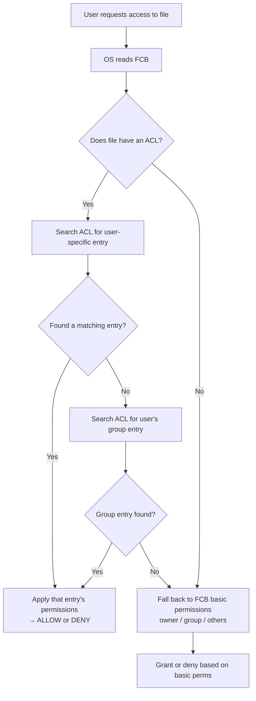

# FCB vs ACL: File Metadata and Permissions

> The File Control Block (FCB) is the OS's per-file information card — it stores metadata like owner, size, timestamps, and basic permissions; the Access Control List (ACL) extends that with per-user/per-group fine-grained rules; together they answer "what is this file?" and "who can do what to it?"

---

## Table of Contents

1. [What Is a File Control Block (FCB)?](#1-what-is-a-file-control-block-fcb)
2. [FCB Components](#2-fcb-components)
3. [FCB vs File Content](#3-fcb-vs-file-content)
4. [What Is an Access Control List (ACL)?](#4-what-is-an-access-control-list-acl)
5. [ACL Structure and Entry Types](#5-acl-structure-and-entry-types)
6. [How FCB and ACL Work Together](#6-how-fcb-and-acl-work-together)
7. [Unix Permissions vs ACL](#7-unix-permissions-vs-acl)
8. [Real-World Example](#8-real-world-example)
9. [Key Takeaways](#9-key-takeaways)

---

## 1. What Is a File Control Block (FCB)?

A **File Control Block (FCB)** is a data structure the OS creates for every file. It acts as a "passport" or "information card" for the file — the OS can look up anything about the file here without opening the file content itself.

**Passport analogy:**

```
  File content = the person
  FCB = the passport

  The passport doesn't contain the person,
  but it has everything you need to identify them:
  name, date of birth, nationality, photo, expiry date.

  Similarly the FCB has: file name, owner, size, permissions, timestamps, location.
```

On Unix/Linux systems, the FCB is implemented as the **inode** (index node). On NTFS, it's the **MFT record** (Master File Table).

---

## 2. FCB Components

```
  File Control Block (FCB) for "report.txt"
  ──────────────────────────────────────────
  File Name:        report.txt
  File Type:        Text (.txt)
  File Size:        2048 bytes
  Disk Location:    Blocks 500-503
  Creation Time:    2024-01-15  09:30:00
  Last Modified:    2024-01-20  14:45:22
  Last Accessed:    2024-01-21  10:15:33
  Owner (UID):      1001 (john_doe)
  Group (GID):      500  (developers)
  Basic Permissions:
      Owner:  Read, Write
      Group:  Read
      Others: No Access
  Attributes:       Normal (not hidden, not system)
  Reference Count:  0 (no process has it open)
  Has ACL:          Yes  →  pointer to ACL structure
  ──────────────────────────────────────────
```

**Key fields explained:**

| Field           | Purpose                                                                       |
| --------------- | ----------------------------------------------------------------------------- |
| Disk Location   | Block pointers — tells OS where actual data lives                             |
| Owner / Group   | Who "owns" this file                                                          |
| Permissions     | Basic read/write/execute per owner/group/others                               |
| Timestamps      | Creation, modification, access — used for backup, audit, `ls -l` display      |
| Reference Count | Number of open handles / hard links — OS won't delete inode until this hits 0 |
| Attributes      | Hidden, read-only, system, archive flags                                      |

---

## 3. FCB vs File Content

The FCB stores **metadata** (data about the file), NOT the file's actual data.

| Aspect          | FCB (Metadata)                            | File Content (Data)               |
| --------------- | ----------------------------------------- | --------------------------------- |
| Purpose         | Describes the file                        | Is the file                       |
| Size            | Fixed, small (hundreds of bytes)          | Variable (0 bytes to terabytes)   |
| Location        | Inode table / MFT                         | Data blocks on disk               |
| When read       | Every file operation (open, stat, chmod…) | Only when reading/writing content |
| Example content | Name, size, permissions, timestamps       | Text, image pixels, video frames  |

When you open a file by name:

```
  OS: "report.txt"
  → Looks in directory → finds inode number 1234
  → Reads inode 1234 (= the FCB) → checks permissions → gets block pointers
  → Reads data blocks → returns content to your program
```

---

## 4. What Is an Access Control List (ACL)?

An **ACL** is an extended permission structure that specifies exactly which users and groups have which rights — beyond the simple owner/group/others model.

**Guest list analogy:**

```
  Basic permissions = "owner gets VIP, developers group gets access, no one else"
  ACL = actual guest list:
        alice: allowed (VIP + backstage)
        bob:   allowed (general admission only)
        carol: allowed (read-only — spectator)
        dave:  DENIED
        temp_contractors: allowed until June 30, read-only
```

**Why ACLs are needed:**

- Traditional Unix: only 3 subjects — owner, group, others
- What if you need: Alice (read+write), Bob (read-only), Carol (no access), external auditor (read until next month)?
- You can't express that with 3 categories → need per-user rules → ACL

---

## 5. ACL Structure and Entry Types

```
  ACL for "project_plan.docx"
  ──────────────────────────────────────
  Entry 1:  User "alice"    → Read, Write   [Allow]
  Entry 2:  User "bob"      → Read          [Allow]
  Entry 3:  Group "managers"→ Read, Write, Delete [Allow]
  Entry 4:  Others          → None          [Deny]
  ──────────────────────────────────────
```

### ACL Entry Types

| Type            | What it does                                                                |
| --------------- | --------------------------------------------------------------------------- |
| **User ACE**    | Permissions for a specific named user                                       |
| **Group ACE**   | Permissions for a specific named group                                      |
| **Default ACE** | Permissions automatically inherited by new files created inside a directory |
| **Mask ACE**    | Cap — limits the maximum permission any group/user ACE can grant            |
| **Others ACE**  | Fallback permissions for anyone not matched by other entries                |

### How evaluation works



---

## 6. How FCB and ACL Work Together

The FCB holds the **core metadata and basic permissions**. The ACL (if present) provides **extended, fine-grained rules**. The FCB contains a pointer/flag indicating whether an ACL exists.

```python
# Pseudocode: OS access check

def check_access(user, file, operation):
    fcb = get_fcb(file)              # always read FCB first

    if fcb.has_acl:
        acl = get_acl(file)
        for entry in acl.entries:
            if entry.subject == user:          # user-specific match
                return ALLOW if operation in entry.permissions else DENY
            if entry.subject == user.group:    # group match
                return ALLOW if operation in entry.permissions else DENY

    # No ACL or no matching ACL entry → use basic FCB permissions
    if user == fcb.owner:
        return check(fcb.owner_permissions, operation)
    elif user.group == fcb.group:
        return check(fcb.group_permissions, operation)
    else:
        return check(fcb.others_permissions, operation)
```

**Priority:** ACL entry > basic FCB permissions (ACL wins when present)

---

## 7. Unix Permissions vs ACL

**Unix basic permissions (stored in FCB/inode):**

```
  -rw-r--r-- 1 alice developers 2048 Jan 20 report.txt

  rw-  = owner (alice) can read and write
  r--  = group (developers) can read only
  r--  = others can read only

  9 bits total: [owner: rwx] [group: rwx] [others: rwx]
```

**Limitation:** Only 3 subjects. You can't give bob (also in developers) less access than the rest of the group without creating a new group just for him.

**POSIX ACL (extended):**

```bash
# View ACL
getfacl report.txt

# Add user-specific rule
setfacl -m u:bob:r report.txt    # Bob: read only
setfacl -m u:carol:rw report.txt # Carol: read+write
setfacl -m u:dave:--- report.txt # Dave: no access

# Windows NTFS via icacls
icacls report.txt /grant alice:(R,W) /grant bob:(R) /deny dave:(F)
```

| Feature            | Unix Basic Perms       | POSIX ACL                 | Windows NTFS ACL                                                  |
| ------------------ | ---------------------- | ------------------------- | ----------------------------------------------------------------- |
| Subjects           | 3 (owner/group/others) | Any number                | Any number                                                        |
| Permission types   | r, w, x                | r, w, x + special         | Read, Write, Execute, Full, Modify, List, Delete, Take Ownership… |
| Inherited defaults | No                     | Yes (default ACL on dirs) | Yes (inheritance flags)                                           |
| Deny rules         | No (absence = deny)    | Limited                   | Yes (explicit deny)                                               |

---

## 8. Real-World Example

**Scenario: Team code repository folder**

```
  FCB for "SourceCode/" directory:
  ──────────────────────────────────
  Owner:        project_lead (UID 2001)
  Group:        developers  (GID 700)
  Basic perms:
    Owner: rwx
    Group: r-x
    Others: ---
  Has ACL: Yes
  ──────────────────────────────────

  ACL:
  ──────────────────────────────────────────────────────
  alice (Senior Dev)   → Read, Write, Execute, Delete  [Allow]
  bob   (Junior Dev)   → Read, Execute                 [Allow]
  carol (Tester)       → Read, Execute                 [Allow]
  qa_team group        → Read                          [Allow]
  david (Contractor)   → Read                          [Allow, expires 2024-06-30]
  ──────────────────────────────────────────────────────
```

Without ACL: bob and alice would get identical permissions since they're both in `developers` — can't differentiate. ACL solves this precisely.

---

## 8. Code Examples

> Working code that demonstrates FCB metadata, Unix permission bits, and ACL-based access control in practice.

### C++ — Simple Version
Simulate a File Control Block (FCB) and check Unix-style permission bits.

```cpp
#include <iostream>
#include <string>
#include <ctime>
using namespace std;

// ======== FCB (File Control Block) ========
// Holds all metadata the OS keeps about a file
struct FCB {
    string name;
    int    size;         // bytes
    string owner;
    string ownerGroup;
    string permissions;  // 9-char Unix string: "rwxrwxrwx"
    time_t created;
    time_t modified;

    void print() const {
        cout << "File: " << name
             << "  Size: " << size << "B"
             << "  Owner: " << owner << ":" << ownerGroup
             << "  Perms: " << permissions << "\n";
    }
};

// ======== Unix Permission Check ========
// permissions layout: positions 0-2 = owner, 3-5 = group, 6-8 = other
// 'r'=offset 0, 'w'=offset 1, 'x'=offset 2 within each triplet
bool checkPermission(const FCB& f, const string& user,
                     const string& group, char action) {
    int base = (user  == f.owner)      ? 0 :
               (group == f.ownerGroup) ? 3 : 6;
    int offset = (action == 'r') ? 0 : (action == 'w') ? 1 : 2;
    return f.permissions[base + offset] != '-';
}

int main() {
    FCB file{"secret.txt", 1024, "alice", "devs",
             "rwxr-x---", time(nullptr), time(nullptr)};
    file.print();

    struct Test { string user, group; char action; };
    Test tests[] = {
        {"alice", "devs",  'r'},  // owner
        {"alice", "devs",  'w'},  // owner
        {"bob",   "devs",  'r'},  // group member
        {"bob",   "devs",  'w'},  // group member — no write for group
        {"eve",   "guest", 'r'},  // other — no access
    };
    cout << "\nAccess decisions:\n";
    for (auto& t : tests) {
        bool ok = checkPermission(file, t.user, t.group, t.action);
        cout << "  " << t.user << " (" << t.group << ") " << t.action
             << ": " << (ok ? "ALLOWED" : "DENIED") << "\n";
    }
    return 0;
}
```

### C++ — Medium / LeetCode Style
Simulate an ACL system where per-user entries override Unix permission bits.

```cpp
#include <iostream>
#include <unordered_map>
#include <set>
#include <vector>
#include <string>
using namespace std;

struct FCB {
    string name, owner, ownerGroup, unixPerms;
};

// ACL entry: username -> set of allowed actions {'r','w','x'}
using ACL = unordered_map<string, set<char>>;

struct FileRecord { FCB fcb; ACL acl; };

class ACLFileSystem {
    unordered_map<string, FileRecord> files;
public:
    void createFile(const string& name, const string& owner,
                    const string& group, const string& perms) {
        files[name] = {FCB{name, owner, group, perms}, {}};
        cout << "Created '" << name << "' (" << owner << ":" << group
             << " " << perms << ")\n";
    }

    void setACL(const string& fname, const string& user, const string& perms) {
        files[fname].acl[user] = set<char>(perms.begin(), perms.end());
        cout << "ACL set: '" << fname << "' -> " << user << "=" << perms << "\n";
    }

    bool checkAccess(const string& fname, const string& user,
                     const string& group, char action) {
        auto it = files.find(fname);
        if (it == files.end()) return false;
        const auto& rec = it->second;
        const FCB&  fcb = rec.fcb;

        // 1. Explicit ACL overrides Unix bits
        auto aclIt = rec.acl.find(user);
        if (aclIt != rec.acl.end())
            return aclIt->second.count(action) > 0;

        // 2. Fall back to Unix permission bits
        int base   = (user  == fcb.owner)      ? 0 :
                     (group == fcb.ownerGroup) ? 3 : 6;
        int offset = (action == 'r') ? 0 : (action == 'w') ? 1 : 2;
        return fcb.unixPerms[base + offset] != '-';
    }
};

int main() {
    ACLFileSystem aclfs;
    aclfs.createFile("report.pdf", "alice", "developers", "rwxr-x---");
    aclfs.setACL("report.pdf", "bob", "r");  // bob: read-only via ACL

    cout << "\nAccess decisions:\n";
    struct T { string user, group; char action; };
    for (auto& t : vector<T>{
            {"alice", "developers", 'w'},  // owner -> unix: ALLOWED
            {"bob",   "developers", 'r'},  // ACL: ALLOWED
            {"bob",   "developers", 'w'},  // ACL: DENIED (no 'w')
            {"carol", "developers", 'r'},  // unix group: ALLOWED
            {"eve",   "guest",      'r'},  // other: DENIED
    }) {
        bool ok = aclfs.checkAccess("report.pdf", t.user, t.group, t.action);
        cout << "  " << t.user << " (" << t.group << ") " << t.action
             << ": " << (ok ? "ALLOWED" : "DENIED") << "\n";
    }
    return 0;
}
```

### Python — Simple Version
FCB dataclass with a Unix permission checker function.

```python
from dataclasses import dataclass, field
from datetime import datetime

@dataclass
class FCB:
    """File Control Block — all metadata the OS keeps about a file."""
    name:        str
    size:        int          # bytes
    owner:       str
    owner_group: str
    permissions: str          # 9-char Unix string, e.g. "rwxr-x---"
    created_at:  str = field(default_factory=lambda: datetime.now().strftime("%Y-%m-%d"))
    modified_at: str = field(default_factory=lambda: datetime.now().strftime("%Y-%m-%d"))

    def display(self):
        print(f"  {self.permissions}  {self.owner}:{self.owner_group}  "
              f"{self.size:6}B  {self.name}  [{self.created_at}]")

def check_permission(fcb: FCB, user: str, group: str, action: str) -> bool:
    """
    Check if user/group can do action ('r','w','x') on file.
    Permissions layout: positions 0-2=owner, 3-5=group, 6-8=other
    """
    offset = {'r': 0, 'w': 1, 'x': 2}[action]
    if   user  == fcb.owner:       base = 0   # owner triplet
    elif group == fcb.owner_group: base = 3   # group triplet
    else:                          base = 6   # other triplet
    return fcb.permissions[base + offset] != '-'

# --- Demo ---
fcb = FCB("secret.txt", 2048, "alice", "dev", "rwxr-x---")
fcb.display()

print("\nAccess checks:")
for user, grp, action in [
    ("alice", "dev",   "r"),  # owner read
    ("alice", "dev",   "w"),  # owner write
    ("bob",   "dev",   "r"),  # group read
    ("bob",   "dev",   "w"),  # group write — denied
    ("eve",   "guest", "r"),  # other — denied
]:
    result = check_permission(fcb, user, grp, action)
    print(f"  {user:6} ({grp:6}) {action}: {'ALLOWED' if result else 'DENIED'}")
```

### Python — Medium Level
ACL system where per-user entries override Unix permission bits, with a full access decision log.

```python
from dataclasses import dataclass, field
from typing import Dict, Set

@dataclass
class FCB:
    name: str; size: int; owner: str; owner_group: str; unix_perms: str

@dataclass
class FileRecord:
    fcb: FCB
    acl: Dict[str, Set[str]] = field(default_factory=dict)  # user -> {r,w,x}

class ACLFileSystem:
    def __init__(self):
        self.files: Dict[str, FileRecord] = {}

    def create(self, name, owner, group, perms="rw-r--r--"):
        self.files[name] = FileRecord(FCB(name, 0, owner, group, perms))
        print(f"Created '{name}'  {owner}:{group}  {perms}")

    def set_acl(self, fname, user, perms: str):
        """Grant user-specific permissions (overrides Unix bits)."""
        if fname in self.files:
            self.files[fname].acl[user] = set(perms)
            print(f"ACL: '{fname}' -> {user} = '{perms}'")

    def check(self, fname, user, group, action: str) -> bool:
        """
        Decision order:
          1. Explicit ACL entry (highest priority)
          2. Unix owner / group / other bits
        """
        if fname not in self.files: return False
        rec, fcb = self.files[fname], self.files[fname].fcb
        offset = {'r': 0, 'w': 1, 'x': 2}[action]

        # 1. ACL check
        if user in rec.acl:
            return action in rec.acl[user]

        # 2. Unix bits fallback
        if user == fcb.owner:            return fcb.unix_perms[offset]     != '-'
        elif group == fcb.owner_group:   return fcb.unix_perms[3 + offset] != '-'
        else:                            return fcb.unix_perms[6 + offset] != '-'

    def audit(self, fname, tests):
        print(f"\nAccess audit for '{fname}':")
        for user, group, action in tests:
            r = self.check(fname, user, group, action)
            src = "ACL" if user in self.files[fname].acl else "Unix"
            print(f"  {user:8} ({group:10}) {action}: {'ALLOWED' if r else 'DENIED':7} [{src}]")

# --- Demo ---
aclfs = ACLFileSystem()
aclfs.create("budget.xlsx", "alice", "finance", "rwxr-x---")
aclfs.set_acl("budget.xlsx", "bob",   "r")    # bob: read-only via ACL
aclfs.set_acl("budget.xlsx", "carol", "rw")   # carol: read+write via ACL

aclfs.audit("budget.xlsx", [
    ("alice", "finance", "w"),   # owner -> unix ALLOWED
    ("bob",   "finance", "r"),   # ACL ALLOWED
    ("bob",   "finance", "w"),   # ACL DENIED
    ("carol", "ops",     "w"),   # ACL ALLOWED (overrides 'ops' not in finance)
    ("dave",  "guest",   "r"),   # unix other DENIED
])
```

---

## 9. Key Takeaways

- **FCB (File Control Block)** = the OS's per-file metadata record — stores name, type, size, owner, group, timestamps, basic permissions, and pointers to data blocks (implemented as **inode** in Unix, **MFT record** in NTFS)
- FCB stores **metadata**, NOT file content — OS reads FCB before every file operation
- **Basic Unix permissions** stored in FCB: 9 bits (rwx for owner, group, others) — only 3 subjects
- **ACL (Access Control List)** = per-file extended permission list with one entry per user/group, each granting or denying specific operations
- ACL enables **fine-grained control**: different rules for Alice, Bob, a contractor, and a QA team — impossible with basic 3-subject permissions
- **Evaluation order**: ACL entries checked first (user-specific → group) → falls back to basic FCB permissions if no match
- **Reference count** in FCB: file's inode/FCB is deleted only when this count reaches 0 (no more hard links AND no open handles)
- **Deleting** removes the directory entry; inode/FCB is freed when reference count = 0; data blocks persist until overwritten (basis of file recovery tools)
- Both exist together: FCB holds the basic security model; ACL extends it for environments needing precise user-by-user control
- Windows uses **NTFS ACLs** natively; Linux uses **POSIX ACLs** (via `setfacl`/`getfacl`); simpler file systems (FAT, exFAT) support neither
