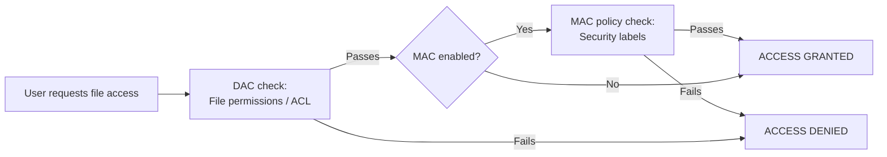

# File System Security: Authentication and Access Control

> File system security is the set of mechanisms that decide who can access what — it combines authentication (proving who you are), user accounts and groups (organizing who belongs where), file permissions (setting what each entity can do), and access control models (DAC vs MAC) to protect the CIA triad: Confidentiality, Integrity, and Availability.

---

## Table of Contents

1. [What Is File System Security?](#1-what-is-file-system-security)
2. [Authentication](#2-authentication)
3. [User Accounts and Groups](#3-user-accounts-and-groups)
4. [File Permissions and Ownership](#4-file-permissions-and-ownership)
5. [Access Control Models: DAC vs MAC](#5-access-control-models-dac-vs-mac)
6. [Password Security](#6-password-security)
7. [Session Management](#7-session-management)
8. [Advanced Security Features](#8-advanced-security-features)
9. [Multi-Factor Authentication (MFA)](#9-multi-factor-authentication-mfa)
10. [Security Best Practices](#10-security-best-practices)
11. [Key Takeaways](#11-key-takeaways)

---

## 1. What Is File System Security?

**File system security** = mechanisms and policies that control access to files and directories. It ensures only the right people can do the right things to the right files.

**Hotel key card analogy:**

```
  Hotel rooms = files
  Key cards = authentication credentials
  Front desk = authentication system
  Room tiers (suite vs standard) = permission levels

  You prove who you are (authentication) → get a key card (session token)
  → key card grants access to certain rooms (permissions) but not others
```

**The CIA Triad of file security:**

| Goal                | What it means                                  | Example                               |
| ------------------- | ---------------------------------------------- | ------------------------------------- |
| **Confidentiality** | Only authorized users can VIEW files           | Private docs visible only to owner    |
| **Integrity**       | Only authorized users can MODIFY files         | System files protected from tampering |
| **Availability**    | Authorized users can ALWAYS access their files | User can always reach their home dir  |

---

## 2. Authentication

**Authentication** = verifying that you are who you claim to be before granting system access.

```
  Without authentication:
  Anyone sitting at a keyboard gets full access to all files — catastrophic!
```

### Authentication Methods

| Method                | Description                         | Example                         |
| --------------------- | ----------------------------------- | ------------------------------- |
| **Password-based**    | User provides a secret string       | Username + password login       |
| **Biometric**         | Physical characteristics            | Fingerprint, face ID, iris scan |
| **Token-based**       | Physical/digital device you possess | Security key, TOTP app          |
| **Certificate-based** | Digital cryptographic certificate   | SSH key authentication          |

### Authentication Flow

```
  1. User enters: username=alice, password=MySecret123
  2. OS looks up alice's record → retrieves stored hash
  3. OS computes: Hash(salt + "MySecret123") → compares with stored hash
  4. Match: create session, assign permissions
     No match: deny access, log the failed attempt

  Key point: OS NEVER stores the actual password — only a one-way hash!
```

---

## 3. User Accounts and Groups

| Account Type             | Privileges                | Typical Use             |
| ------------------------ | ------------------------- | ----------------------- |
| **Root / Administrator** | Unrestricted              | System admin tasks      |
| **Standard User**        | Own files + approved apps | Everyday computing      |
| **Guest**                | Minimal, temporary        | Public/shared terminals |
| **Service Account**      | Specific to one service   | Background daemons      |

**Groups** let admins assign permissions to many users at once:

```
  Group "developers" (GID 700):
    Members: alice, bob
    Permissions: Read, Write, Execute on /projects

  Group "guests" (GID 900):
    Members: charlie
    Permissions: Read only on /public

  Instead of managing alice and bob individually, manage the "developers" group.
```

---

## 4. File Permissions and Ownership

Every file has: **owner** (a user), **group** (a group), and **permissions** for owner / group / others.

### Permission Types

| Permission | Symbol | For Files      | For Directories            |
| ---------- | ------ | -------------- | -------------------------- |
| Read       | `r`    | View content   | List directory             |
| Write      | `w`    | Modify content | Create/delete files in dir |
| Execute    | `x`    | Run as program | Enter/traverse directory   |

### Unix Permission Format

```
  -rwxr-xr--
  │└─┬─┘└─┬─┘└─┬─┘
  │ owner  group  others
  └── file type (- = regular, d = directory, l = symlink)

  Example: -rw-r--r--  report.txt
    Owner (alice): read + write    (rw-)
    Group (devs):  read only       (r--)
    Others:        read only       (r--)

  Numeric (octal): rw-r--r-- = 644
                   rwxr-xr-- = 754
```

---

## 5. Access Control Models: DAC vs MAC

### Discretionary Access Control (DAC)

**File owner decides who gets access** — most common model for personal/enterprise systems.

```
  Alice creates file: confidential.txt → Alice is the owner
  Alice CAN: set permissions, share with bob, revoke access at will

  # Give bob read access
  chmod o+r confidential.txt   (simple)
  setfacl -m u:bob:r confidential.txt  (ACL — per-user)
```

- Flexible; owner has full control
- Risk: a compromised owner account = attacker controls access

### Mandatory Access Control (MAC)

**System-wide security policy enforced by the OS; users cannot override it.**

```
  Security levels: Top Secret > Secret > Confidential > Unclassified

  Bob has "Secret" clearance
  File report.txt is labeled "Top Secret"

  Result: Bob CANNOT access report.txt
  Even if the file owner says "let bob read it" — MAC overrides that.
```

- Used in military/government systems (SELinux, AppArmor on Linux; Windows Mandatory Integrity Control)
- More secure but less flexible



---

## 6. Password Security

Passwords are never stored as plaintext — only as **salted hashes**.

```
  Password storage:
  User creates: "MySecret123"
  System: random_salt = "x9k2p7"
  System stores: { salt: "x9k2p7", hash: Hash("x9k2p7" + "MySecret123") }

  Login verification:
  User enters: "MySecret123"
  System: Hash("x9k2p7" + "MySecret123") == stored_hash?
  Match → authenticate!

  Why salt? Without salt:
  - Attacker precomputes a "rainbow table" of all hashes for common passwords
  - Looks up your hash → finds password in milliseconds
  With salt:
  - Every user has a DIFFERENT hash for the same password
  - Precomputed tables become useless — attacker must recompute for each user
```

**Good password policy (modern):**

- Minimum 12+ characters (length beats complexity)
- Passphrase style: "correct-horse-battery-staple"
- Check against lists of known-compromised passwords
- Only force reset if breach is detected (not arbitrary 90-day rotation)

---

## 7. Session Management

After authentication, the OS creates a **session** so you don't have to re-authenticate for every file operation.

```
  Session lifecycle:
  1. Login → OS creates session ID (e.g., "sess_abc123xyz")
  2. Session stores: user ID, permissions, login time, last-activity time
  3. Every file operation includes implicit session validation
  4. Session ends: explicit logout OR inactivity timeout OR system shutdown

  Session token ≈ wristband at an amusement park:
  Show ticket once (login) → get wristband (session) → use it all day
```

**Security considerations:** Session timeout (auto-lock after idle), screen lock, session tokens must be non-guessable and expire.

---

## 8. Advanced Security Features

### Audit Logging

```
  Sample audit log:
  2024-01-15 09:30:15 | alice  | READ   | /home/alice/report.txt | SUCCESS
  2024-01-15 09:35:10 | charlie| DELETE | /shared/config.ini     | DENIED ← suspicious!
  2024-01-15 10:12:33 | alice  | CHMOD  | /home/alice/script.sh  | SUCCESS
```

Audit logs record: timestamp, user, action type, file path, result (success/denied). Critical for compliance, breach investigation, and detecting unauthorized access.

### File Attributes

| Attribute | Effect                                            | Use Case                             |
| --------- | ------------------------------------------------- | ------------------------------------ |
| Read-only | Prevents modification/deletion                    | Protect docs from accidental changes |
| Hidden    | Not shown in normal listings                      | OS config files                      |
| System    | Marks as critical OS file                         | Boot and kernel files                |
| Immutable | Cannot be modified, deleted, renamed even by root | Audit log protection                 |

---

## 9. Multi-Factor Authentication (MFA)

**MFA** requires proof from two or more independent factor categories:

| Factor Type            | Description                 | Examples                                   |
| ---------------------- | --------------------------- | ------------------------------------------ |
| Something you **know** | Memorized secret            | Password, PIN, security question           |
| Something you **have** | Physical/digital possession | TOTP app, SMS code, security key (YubiKey) |
| Something you **are**  | Biometric                   | Fingerprint, face, iris                    |

```
  MFA login flow:
  1. Enter username + password  ← Factor 1 (know)
  2. System sends code to phone OR asks for fingerprint  ← Factor 2 (have / are)
  3. Both factors verified → session created, access granted

  Attack scenario:
  Attacker steals Alice's password (Factor 1 compromised)
  Still needs Alice's phone or fingerprint (Factor 2) → BLOCKED
```

---

## 10. Security Best Practices

### Principle of Least Privilege

```
  Bad: alice runs daily tasks with Administrator account
  → Malware that infects alice's browser runs with full system access

  Good: alice runs daily tasks as Standard User
  → Needs to confirm (sudo / UAC) for any admin action
  → Malware is contained to user-level permissions only
```

### Regular Audits

| Task                     | Purpose                              | Frequency |
| ------------------------ | ------------------------------------ | --------- |
| Review user accounts     | Remove inactive/unnecessary accounts | Monthly   |
| Check file permissions   | Ensure nothing over-permissioned     | Quarterly |
| Analyze access logs      | Detect suspicious patterns           | Weekly    |
| Review group memberships | Remove stale group assignments       | Quarterly |

### Defense in Depth

```
  Layer 1: Strong authentication (password + MFA)
  Layer 2: File permissions (least privilege)
  Layer 3: ACLs (fine-grained per-user rules)
  Layer 4: Encryption (data at rest protected)
  Layer 5: Audit logging (detect and investigate breaches)
  Layer 6: Backup (recover from ransomware/deletion)

  No single layer is sufficient — all layers together = true security
```

---

## 10. Code Examples

> Working code that demonstrates file system access control in practice.

### C++ — Simple Version
Simulate Unix permission bits check — decode and enforce owner/group/other access.

```cpp
#include <iostream>
#include <vector>
#include <string>
using namespace std;

// File entry with Unix permission string (9 chars: "rwxrwxrwx")
struct FileEntry {
    string name;
    string owner;
    string ownerGroup;
    string permissions;  // layout: [0-2]=owner [3-5]=group [6-8]=other
};

// Decode one permission triplet to human-readable form
string decodeTriplet(const string& p, int base) {
    string s;
    if (p[base+0] != '-') s += "read ";
    if (p[base+1] != '-') s += "write ";
    if (p[base+2] != '-') s += "exec";
    return s.empty() ? "none" : s;
}

void explainPermissions(const FileEntry& f) {
    cout << "Permissions for '" << f.name << "' (" << f.permissions << "):\n";
    cout << "  Owner (" << f.owner       << "): " << decodeTriplet(f.permissions, 0) << "\n";
    cout << "  Group (" << f.ownerGroup  << "): " << decodeTriplet(f.permissions, 3) << "\n";
    cout << "  Other:             " << decodeTriplet(f.permissions, 6) << "\n";
}

// Determine if user/group can perform action ('r','w','x')
bool checkAccess(const FileEntry& f, const string& user,
                 const string& group, char action) {
    int base   = (user  == f.owner)      ? 0 :
                 (group == f.ownerGroup) ? 3 : 6;
    int offset = (action == 'r') ? 0 : (action == 'w') ? 1 : 2;
    return f.permissions[base + offset] != '-';
}

int main() {
    FileEntry f{"payroll.csv", "admin", "hr", "rw-r-----"};
    explainPermissions(f);

    struct Test { string user, group; char action; };
    vector<Test> tests = {
        {"admin",  "hr",    'r'},  // owner read
        {"admin",  "hr",    'w'},  // owner write
        {"hr_bob", "hr",    'r'},  // group read
        {"hr_bob", "hr",    'w'},  // group write — denied
        {"guest",  "guest", 'r'},  // other — denied
    };

    cout << "\nAccess decisions:\n";
    for (auto& t : tests) {
        bool ok = checkAccess(f, t.user, t.group, t.action);
        cout << "  " << t.user << " (" << t.group << ") "
             << t.action << ": " << (ok ? "ALLOWED" : "DENIED") << "\n";
    }
    return 0;
}
```

### C++ — Medium / LeetCode Style
Multi-layer access control: Unix DAC + ACL + mandatory security label (Bell-LaPadula style).

```cpp
#include <iostream>
#include <unordered_map>
#include <set>
#include <vector>
#include <string>
using namespace std;

enum class Label { PUBLIC = 0, INTERNAL = 1, CONFIDENTIAL = 2 };
string labelName(Label l) {
    return l == Label::PUBLIC ? "public" :
           l == Label::INTERNAL ? "internal" : "confidential";
}

struct SecureFile {
    string name, owner, ownerGroup, unixPerms;
    Label  label;
    unordered_map<string, set<char>> acl;  // user -> {r,w,x}
};

struct User { string name, group; Label clearance; };

bool unixCheck(const SecureFile& f, const User& u, char action) {
    int base   = (u.name == f.owner) ? 0 : (u.group == f.ownerGroup) ? 3 : 6;
    int offset = (action == 'r') ? 0 : (action == 'w') ? 1 : 2;
    return f.unixPerms[base + offset] != '-';
}

bool checkAccess(const SecureFile& f, const User& u, char action) {
    // Layer 1: Mandatory label check (Bell-LaPadula "no read up")
    if ((int)u.clearance < (int)f.label) {
        cout << "  [MAC DENY] " << u.name << " clearance=" << labelName(u.clearance)
             << " < file=" << labelName(f.label) << "\n";
        return false;
    }
    // Layer 2: ACL (explicit per-user grant overrides unix bits)
    auto it = f.acl.find(u.name);
    if (it != f.acl.end()) return it->second.count(action) > 0;
    // Layer 3: Unix DAC
    return unixCheck(f, u, action);
}

int main() {
    SecureFile file{"strategy.pdf", "ceo", "exec", "rwx------",
                    Label::CONFIDENTIAL,
                    {{"bob", {'r'}}}};  // bob gets explicit read via ACL

    vector<User> users = {
        {"ceo",    "exec",     Label::CONFIDENTIAL},
        {"bob",    "dev",      Label::CONFIDENTIAL},  // ACL allows read
        {"carol",  "dev",      Label::INTERNAL},      // clearance too low
        {"intern", "external", Label::PUBLIC},
    };

    cout << "Access decisions (read 'r'):\n";
    for (auto& u : users) {
        bool ok = checkAccess(file, u, 'r');
        cout << "  " << u.name << ": " << (ok ? "ALLOWED" : "DENIED") << "\n";
    }
    return 0;
}
```

### Python — Simple Version
Decode and enforce Unix permission bits (owner/group/other rwx).

```python
# Simulate Unix permission bits check for file access control

def check_unix_permission(permissions: str, user: str, group: str,
                           owner: str, owner_group: str, action: str) -> bool:
    """
    permissions: 9-char string "rwxrwxrwx" (owner/group/other)
    action: 'r', 'w', or 'x'
    Decision: owner bits first, then group, then other.
    """
    if   user  == owner:       base = 0  # owner triplet
    elif group == owner_group: base = 3  # group triplet
    else:                      base = 6  # other triplet

    offset = {'r': 0, 'w': 1, 'x': 2}[action]
    return permissions[base + offset] != '-'

def decode_permissions(perm_str: str) -> dict:
    """Return human-readable breakdown of a 9-char permission string."""
    labels = ['owner', 'group', 'other']
    return {
        labels[i]: {
            'read':    perm_str[i*3 + 0] != '-',
            'write':   perm_str[i*3 + 1] != '-',
            'execute': perm_str[i*3 + 2] != '-',
        }
        for i in range(3)
    }

# --- Demo ---
file_info = {
    "name":        "financial_report.pdf",
    "owner":       "cfo",
    "owner_group": "finance",
    "permissions": "rw-r-----",  # owner: rw-, group: r--, other: ---
}

print(f"File: {file_info['name']}  Perms: {file_info['permissions']}")
print("Decoded:", decode_permissions(file_info['permissions']))

print("\nAccess audit:")
for user, group, action in [
    ("cfo",      "finance",  "r"),  # owner read   -> ALLOWED
    ("cfo",      "finance",  "w"),  # owner write  -> ALLOWED
    ("analyst",  "finance",  "r"),  # group read   -> ALLOWED
    ("analyst",  "finance",  "w"),  # group write  -> DENIED
    ("auditor",  "external", "r"),  # other        -> DENIED
]:
    allowed = check_unix_permission(
        file_info["permissions"], user, group,
        file_info["owner"], file_info["owner_group"], action
    )
    print(f"  {user:10} ({group:8}) action={action}: {'ALLOWED' if allowed else 'DENIED'}")
```

### Python — Medium Level
Multi-layer access control: Unix bits + ACL + mandatory security clearance level.

```python
from enum import IntEnum
from dataclasses import dataclass, field
from typing import Dict, Set

class Label(IntEnum):
    PUBLIC       = 0
    INTERNAL     = 1
    CONFIDENTIAL = 2

@dataclass
class SecureFile:
    name:        str
    owner:       str
    owner_group: str
    unix_perms:  str          # "rwxrwxrwx"
    label:       Label = Label.INTERNAL
    acl:         Dict[str, Set[str]] = field(default_factory=dict)

@dataclass
class User:
    name:      str
    group:     str
    clearance: Label

class SecureACLSystem:
    def __init__(self):
        self.files: Dict[str, SecureFile] = {}
        self.users: Dict[str, User]       = {}

    def add_file(self, f: SecureFile): self.files[f.name] = f
    def add_user(self, u: User):       self.users[u.name] = u

    def _unix(self, f: SecureFile, u: User, action: str) -> bool:
        offset = {'r': 0, 'w': 1, 'x': 2}[action]
        if u.name == f.owner:            return f.unix_perms[offset]     != '-'
        elif u.group == f.owner_group:   return f.unix_perms[3 + offset] != '-'
        else:                            return f.unix_perms[6 + offset] != '-'

    def check(self, fname: str, uname: str, action: str) -> bool:
        f = self.files.get(fname); u = self.users.get(uname)
        if not f or not u: return False

        # Layer 1: Mandatory clearance (no-read-up rule)
        if u.clearance < f.label:
            print(f"  {uname:8} DENIED [MAC: {u.clearance.name} < {f.label.name}]")
            return False

        # Layer 2: Explicit ACL
        if uname in f.acl:
            ok = action in f.acl[uname]
            print(f"  {uname:8} {'ALLOWED' if ok else 'DENIED':7} [ACL]")
            return ok

        # Layer 3: Unix DAC
        ok = self._unix(f, u, action)
        print(f"  {uname:8} {'ALLOWED' if ok else 'DENIED':7} [Unix DAC]")
        return ok

# --- Demo ---
sys = SecureACLSystem()
sys.add_file(SecureFile(
    name="strategy.docx", owner="ceo", owner_group="exec",
    unix_perms="rwx------", label=Label.CONFIDENTIAL,
    acl={"bob": {"r"}}   # bob: explicit read-only
))
for u in [
    User("ceo",    "exec",     Label.CONFIDENTIAL),
    User("bob",    "dev",      Label.CONFIDENTIAL),   # ACL read
    User("carol",  "dev",      Label.CONFIDENTIAL),   # unix: other
    User("intern", "external", Label.INTERNAL),       # clearance too low
]:
    sys.add_user(u)

print("=== Read access decisions ===")
for uname in ["ceo", "bob", "carol", "intern"]:
    sys.check("strategy.docx", uname, "r")
```

---

## 11. Key Takeaways

- **File system security** enforces Confidentiality, Integrity, and Availability (CIA triad) for stored data
- **Authentication** verifies identity — passwords are stored as salted hashes, never plaintext
- **Salt** defeats rainbow table attacks — same password produces different hash for each user
- **Unix permissions** = 9 bits (rwx for owner/group/others) — simple but limited to 3 subjects
- **ACLs** extend permissions to any individual user or group — fine-grained access control
- **DAC** (Discretionary): file owner controls access — flexible, used in most personal/enterprise systems
- **MAC** (Mandatory): OS-enforced security labels that owner cannot override — used in high-security environments
- **MFA** requires multiple independent factors — compromising one factor is not enough
- **Audit logs** record all access attempts with timestamps — essential for compliance and breach detection
- **Principle of least privilege**: grant only the minimum permissions needed — limits damage from compromised accounts
- **Session tokens** represent authenticated access; always set timeouts and require re-auth on sensitive operations
