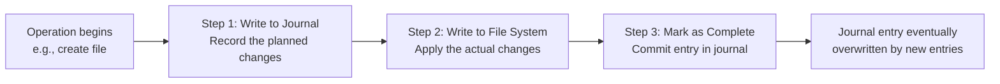

# File System Journaling

> File system journaling keeps a running log (the "journal") of what changes are about to be made before actually making them — if the system crashes mid-operation, the journal lets the OS replay or discard the incomplete work in seconds instead of scanning the entire disk for hours.

---

## Table of Contents

1. [What Is Journaling?](#1-what-is-journaling)
2. [Why Journaling Matters](#2-why-journaling-matters)
3. [How Journaling Works — Three Steps](#3-how-journaling-works--three-steps)
4. [Types of Journaling](#4-types-of-journaling)
5. [Journal Recovery Process](#5-journal-recovery-process)
6. [Benefits of Journaling](#6-benefits-of-journaling)
7. [Limitations](#7-limitations)
8. [Journaling in Common File Systems](#8-journaling-in-common-file-systems)
9. [Journaling vs Backup](#9-journaling-vs-backup)
10. [Key Takeaways](#10-key-takeaways)

---

## 1. What Is Journaling?

**Journaling** is a file system technique where all planned changes are written to a special log area (the **journal**) BEFORE being applied to the actual file system data structures.

**Diary / renovation analogy:**

```
  Before journaling:
  You start renovating a room. Power goes out mid-task.
  Nobody knows what you finished and what's half-done — chaos.

  With journaling:
  You write in your diary:
    "Plan: Move bookshelf → repaint wall → install shelf bracket → hang shelf"
  Now power goes out after "repaint wall".
  You check the diary, see "install shelf bracket" was next, and continue from there.

  The journal is the diary. The file operation is the renovation.
```

The journal is a **circular log** stored on the same disk, typically a small fixed-size area reserved for this purpose.

---

## 2. Why Journaling Matters

Without journaling, a crash mid-operation can leave the file system **inconsistent**:

```
  Example: Creating a new file (3 steps without journaling)
  Step 1: Allocate a free inode from the inode table  ← crash here → inode marked used, no directory entry, data blocks allocated but orphaned
  Step 2: Write data to allocated data blocks
  Step 3: Add directory entry linking name → inode

  The result: a file that "exists" in the inode table but has no name in any directory,
              or a directory entry pointing to an unallocated inode.

  Recovery before journaling: RUN fsck (file system check) — scans EVERY inode,
  EVERY block, EVERY directory entry on the entire disk.
  On a 4 TB drive → fsck can take hours. Server downtime = $$$.
```

With journaling, recovery takes **seconds** because only the journal needs to be replayed.

---

## 3. How Journaling Works — Three Steps



### Step 1: Write to Journal (Log Intent)

Before touching any inode or data block, the OS writes a **transaction** to the journal describing exactly what it intends to do.

```
  Journal transaction for "create report.txt":
  ┌─────────────────────────────────────────────────┐
  │ Transaction #1042  [PENDING]                    │
  │ Operation: CREATE FILE                          │
  │   - Allocate inode #1234                        │
  │   - Set inode fields: owner=alice, perms=644... │
  │   - Allocate data blocks: 501, 502, 503         │
  │   - Add directory entry: "report.txt" → 1234   │
  └─────────────────────────────────────────────────┘
```

This write is confirmed on disk before proceeding.

### Step 2: Write to File System (Apply Changes)

The OS now makes the actual changes: updates inode table, writes data blocks, adds directory entry.

_If a crash happens here, the journal has the complete plan → recovery can finish it._

### Step 3: Mark as Complete (Commit)

Once ALL changes are applied successfully, the journal transaction is marked `COMMITTED`.

```
  Transaction #1042  [COMMITTED] ✓ ← crash-safe now
```

Future journal entries can overwrite this space.

---

## 4. Types of Journaling

Three levels of what gets recorded in the journal:

### Metadata Journaling (Writeback mode)

- **What's logged**: only file system metadata (inodes, directory entries, allocation bitmaps)
- **What's NOT logged**: actual file data content
- **Speed**: fastest (least data written to journal)
- **Risk**: after crash, file system is structurally consistent, BUT a file being written may contain partial/old data

```
  Crash scenario with metadata journaling:
  File "document.txt" was being written with "New paragraph added"

  After recovery:
  - File exists ✓ (inode/directory intact)
  - File size is correct ✓
  - BUT content may have partial write → garbled text ✗

  File system = healthy; file content = possibly corrupt
```

### Data Journaling

- **What's logged**: both metadata AND actual file data
- **Speed**: slowest — every write goes to journal THEN to file system (data written twice)
- **Risk**: minimal — both structure and content protected

### Ordered Journaling (Default in most systems)

- **What's logged**: metadata only (like metadata journaling)
- **Extra rule**: data blocks are written to disk BEFORE the corresponding metadata is journaled
- **Effect**: ensures metadata never points to unwritten/garbage data blocks
- **Speed**: moderate — good balance of performance and protection

```
  Ordered mode guarantee:
  If file write crashes:
  - Worst case: data blocks written but not referenced by metadata
  - These are "orphan blocks" — safe to reclaim; no corruption
  - File system structure = intact; at most, you lose the file that was being written
```

| Mode                      | What's Logged       | Speed        | Protection                                                        |
| ------------------------- | ------------------- | ------------ | ----------------------------------------------------------------- |
| Writeback (metadata only) | Metadata            | Fastest      | FS structure safe; data content may corrupt                       |
| **Ordered** (default)     | Metadata + ordering | **Moderate** | FS structure safe; data loss at most is just the in-progress file |
| Data journaling           | Metadata + data     | Slowest      | Both FS structure and data content fully protected                |

---

## 5. Journal Recovery Process

After a system crash, on the next boot:

```
  1. File system driver reads the journal before mounting the FS
  2. Scans journal entries for their state:
     - PENDING (wrote intent but crashed before applying) → REPLAY
     - IN-PROGRESS (applying, crashed midway) → REPLAY to complete
     - COMMITTED → Done; no action needed
     - INCOMPLETE JOURNAL ENTRY (crash during journal write itself) → DISCARD SAFELY
  3. Replay uncommitted transactions → file system reaches consistent state
  4. Mount file system normally

  Time: seconds to minutes (vs. hours for fsck without journaling)
```

```
  Without journal: "Was block 7234 really supposed to be part of file X?"
  → Must check every block on the entire 4 TB disk to know for sure.

  With journal: "Transaction #1042 was in-progress. Apply these specific 4 changes."
  → Done in milliseconds.
```

---

## 6. Benefits of Journaling

| Benefit                 | Description                                                         |
| ----------------------- | ------------------------------------------------------------------- |
| **Fast recovery**       | Boot in seconds after crash — only journal needs replaying          |
| **Data consistency**    | File system structure stays intact regardless of when crash happens |
| **Atomicity**           | Operations either complete fully or are safely rolled back          |
| **Reduced maintenance** | No need to run hours-long fsck on every unexpected shutdown         |
| **Server uptime**       | Critical for servers where downtime = money                         |

```
  Real difference on a 4 TB server disk:

  Pre-journaling world (ext2):
  Power failure at 2 AM → fsck runs for 4+ hours at next boot → server unavailable

  Post-journaling world (ext3/4, NTFS, APFS):
  Power failure at 2 AM → journal replay takes 30 seconds at next boot → server online
```

---

## 7. Limitations

### Performance Overhead

```
  Every file operation:
  Metadata journaling: 1 extra write (journal) + 1 main write = ~1.1× overhead
  Data journaling:     1 journal write + 1 main write = ~2× overhead (write amplification)

  On SSDs with NVMe: overhead is tiny (I/O is fast)
  On HDDs: overhead more noticeable, but still worthwhile
```

### Journal Size Limits

```
  Journal is a fixed-size circular buffer (typically 128 MB on large volumes).
  If uncommitted entries fill the journal faster than they're committed:
  → File system pauses briefly (journal checkpoint) → commits pending entries → resumes

  Automatic — users don't see this, but it can cause occasional write stalls.
```

### Not a Backup

```
  Journaling protects against:   ✓ Power failures during writes
                                  ✓ OS crashes mid-operation
                                  ✓ Unexpected shutdowns

  Journaling does NOT protect against:
  ✗ Hardware failure (disk physically dies)
  ✗ Accidental deletion (the delete transaction completes perfectly)
  ✗ Ransomware (file encryption transaction completes perfectly)
  ✗ Fire/flood destroying the drive

  You still need backups for those scenarios!
```

---

## 8. Journaling in Common File Systems

| File System | Journaling Mode                               | Notes                                           |
| ----------- | --------------------------------------------- | ----------------------------------------------- |
| **ext2**    | None                                          | Old Linux FS — requires full fsck after crash   |
| **ext3**    | Ordered (default), also metadata / data modes | Added journaling to ext2                        |
| **ext4**    | Ordered (default), also metadata / data modes | Current Linux standard                          |
| **NTFS**    | Metadata journaling (`$LogFile`)              | Windows standard                                |
| **XFS**     | Metadata journaling                           | High-performance; used in RHEL/enterprise Linux |
| **APFS**    | Copy-on-write (crash-safe by design)          | macOS — CoW is a journaling alternative         |
| **Btrfs**   | Copy-on-write + explicit journal              | Advanced Linux FS with snapshots                |

**Copy-on-write (CoW) as an alternative to journaling (APFS, Btrfs):**

```
  Instead of: write to journal → overwrite in-place → commit
  CoW does:   write new data to NEW blocks → atomically update pointer → old blocks freed

  If crash between "write new blocks" and "update pointer": old data is still intact.
  Crash is always safe — pointer update is a single atomic operation.
```

---

## 9. Journaling vs Backup

```
  ┌──────────────────────────────────────────────────────┐
  │                    Comparison                        │
  ├────────────────────┬─────────────────────────────────┤
  │ Journaling         │ Backup                          │
  ├────────────────────┼─────────────────────────────────┤
  │ Short-term safety  │ Long-term safety                │
  │ Protects crashes   │ Protects hardware failure       │
  │ Automatic          │ Requires setup/scheduling       │
  │ On same disk       │ Different disk/location         │
  │ Seconds to recover │ Hours to restore                │
  │ Not for deletions  │ Can restore deleted files       │
  └────────────────────┴─────────────────────────────────┘

  Verdict: You need BOTH.
  Journaling = seatbelt (protects you during the crash)
  Backup = spare car (gets you running again after total loss)
```

---

## 9. Code Examples

> Working code that demonstrates write-ahead journaling and crash recovery in practice.

### C++ — Simple Version

Simulate write-ahead journaling: write to journal first, then to disk. Crash during disk write, then recover by replaying the journal.

```cpp
#include <iostream>
#include <vector>
#include <map>
#include <string>
using namespace std;

// Journal entry states
enum class JState { PENDING, COMMITTED, CHECKPOINTED };

struct JournalEntry {
    int     txId;
    string  filename;
    string  newData;
    JState  state;
};

// Simulated storage
vector<JournalEntry>    journal;  // write-ahead log (WAL)
map<string, string>     disk;     // actual file system data
int nextTxId = 1;

// Step 1: Log the intended write (safe — sequential append)
int writeJournal(const string& filename, const string& data) {
    int txId = nextTxId++;
    journal.push_back({txId, filename, data, JState::PENDING});
    cout << "[Journal] TX " << txId << ": queued write to '" << filename << "'\n";
    return txId;
}

// Step 2: Mark as committed (durable intent recorded)
void commitJournal(int txId) {
    for (auto& e : journal)
        if (e.txId == txId) { e.state = JState::COMMITTED; break; }
    cout << "[Journal] TX " << txId << ": COMMITTED\n";
}

// Step 3: Apply to actual disk (system can crash here)
void applyToDisk(int txId, bool simulateCrash = false) {
    for (auto& e : journal) {
        if (e.txId == txId && e.state == JState::COMMITTED) {
            if (simulateCrash) {
                cout << "[CRASH!] System crashed during disk write TX=" << txId << "\n";
                return;  // disk NOT updated
            }
            disk[e.filename] = e.newData;
            e.state = JState::CHECKPOINTED;
            cout << "[Disk] TX " << txId << ": '" << e.newData
                 << "' -> '" << e.filename << "'\n";
        }
    }
}

// Recovery: replay all COMMITTED entries that were not CHECKPOINTED
void recoverFromJournal() {
    cout << "[Recovery] Replaying journal...\n";
    int count = 0;
    for (auto& e : journal) {
        if (e.state == JState::COMMITTED) {
            disk[e.filename] = e.newData;
            e.state = JState::CHECKPOINTED;
            cout << "  Replayed TX " << e.txId << ": '" << e.newData
                 << "' -> '" << e.filename << "'\n";
            count++;
        }
    }
    cout << "[Recovery] Done. " << count << " transaction(s) replayed.\n";
}

int main() {
    // Normal write
    int tx1 = writeJournal("config.txt", "timeout=30");
    commitJournal(tx1);
    applyToDisk(tx1);
    cout << "config.txt: '" << disk["config.txt"] << "'\n\n";

    // Crash scenario
    int tx2 = writeJournal("data.bin", "important data");
    commitJournal(tx2);
    applyToDisk(tx2, /*simulateCrash=*/true);  // crash!
    cout << "data.bin before recovery: '" <<
         (disk.count("data.bin") ? disk["data.bin"] : "<missing>") << "'\n";

    recoverFromJournal();
    cout << "data.bin after  recovery: '" << disk["data.bin"] << "'\n";
    return 0;
}
```

### C++ — Medium / LeetCode Style

Full journaling simulation with BEGIN/WRITE/COMMIT/CHECKPOINT/ABORT records, undo logging for aborted transactions, and redo-based crash recovery.

```cpp
#include <iostream>
#include <vector>
#include <map>
#include <string>
using namespace std;

enum class RType { BEGIN, WRITE, COMMIT, CHECKPOINT, ABORT };

struct LogRecord {
    int    txId;
    RType  type;
    string target;  // filename (WRITE records)
    string before;  // pre-image for undo
    string after;   // post-image for redo
};

class WALJournal {
    vector<LogRecord>   log;
    map<int, string>    txState;  // txId -> state string
    map<string, string> disk;
    int nextTx = 1;

    void append(LogRecord r) {
        log.push_back(r);
        cout << "  [WAL] " << [](RType t){
            switch(t){
                case RType::BEGIN:      return "BEGIN     ";
                case RType::WRITE:      return "WRITE     ";
                case RType::COMMIT:     return "COMMIT    ";
                case RType::CHECKPOINT: return "CHECKPOINT";
                default:                return "ABORT     ";
            }}(r.type)
             << " tx=" << r.txId;
        if (!r.target.empty()) cout << " file=" << r.target;
        cout << "\n";
    }

public:
    int begin() {
        int id = nextTx++;
        txState[id] = "BEGUN";
        append({id, RType::BEGIN, "", "", ""});
        return id;
    }

    void write(int id, const string& file, const string& data) {
        string before = disk.count(file) ? disk[file] : "";
        append({id, RType::WRITE, file, before, data});
    }

    void commit(int id) {
        append({id, RType::COMMIT, "", "", ""});
        txState[id] = "COMMITTED";
        for (auto& r : log)  // apply writes to disk
            if (r.txId == id && r.type == RType::WRITE)
                disk[r.target] = r.after;
        append({id, RType::CHECKPOINT, "", "", ""});
        txState[id] = "CHECKPOINTED";
    }

    void abort(int id) {
        // Undo writes in reverse order using before-images
        for (auto it = log.rbegin(); it != log.rend(); ++it)
            if (it->txId == id && it->type == RType::WRITE)
                disk[it->target] = it->before;
        append({id, RType::ABORT, "", "", ""});
        txState[id] = "ABORTED";
    }

    // After a crash: redo COMMITTED-but-not-CHECKPOINTED transactions
    void recover() {
        cout << "\n[RECOVERY] Scanning WAL...\n";
        map<int,bool> committed, checkpointed;
        for (auto& r : log) {
            if (r.type == RType::COMMIT)     committed[r.txId]    = true;
            if (r.type == RType::CHECKPOINT) checkpointed[r.txId] = true;
        }
        for (auto& [id, _] : committed) {
            if (!checkpointed[id]) {
                cout << "  REDO tx=" << id << "\n";
                for (auto& r : log)
                    if (r.txId == id && r.type == RType::WRITE)
                        disk[r.target] = r.after;
            }
        }
        cout << "[RECOVERY] Done.\n";
    }

    void printDisk() {
        cout << "Disk: ";
        for (auto& [k,v] : disk) cout << k << "='" << v << "' ";
        cout << "\n";
    }
};

int main() {
    WALJournal j;

    cout << "=== TX1: normal commit ===\n";
    int tx1 = j.begin();
    j.write(tx1, "user.db",    "alice:admin");
    j.write(tx1, "config.ini", "debug=false");
    j.commit(tx1);
    j.printDisk();

    cout << "\n=== TX2: abort (undo) ===\n";
    int tx2 = j.begin();
    j.write(tx2, "user.db", "hacked:root");
    j.abort(tx2);  // rolled back
    j.printDisk();

    cout << "\n=== TX3: crash after COMMIT, before CHECKPOINT ===\n";
    int tx3 = j.begin();
    j.write(tx3, "notes.txt", "crash test");
    // Manually append COMMIT to log without running commit() fully
    j.log.push_back({tx3, RType::COMMIT, "", "", ""});
    cout << "  [CRASH before checkpoint!]\n";
    j.recover();
    j.printDisk();
    return 0;
}
```

### Python — Simple Version

Simulate write-ahead journaling: log, commit, apply, crash, and recover.

```python
# Simulate Write-Ahead Journaling (WAJ) with crash recovery
from enum import Enum, auto

class JState(Enum):
    PENDING      = auto()
    COMMITTED    = auto()
    CHECKPOINTED = auto()

# Simulated storage
journal  = []   # write-ahead log: list of dicts
disk     = {}   # filename -> content (actual file system)
next_tx  = 1

def write_journal(filename, data):
    """Step 1: Append intended write to journal (safe, sequential)."""
    global next_tx
    tx_id = next_tx; next_tx += 1
    journal.append({"tx_id": tx_id, "file": filename,
                    "data": data, "state": JState.PENDING})
    print(f"[Journal] TX {tx_id}: queued '{data}' -> '{filename}'")
    return tx_id

def commit_journal(tx_id):
    """Step 2: Mark entry as COMMITTED (durable intent)."""
    for e in journal:
        if e["tx_id"] == tx_id:
            e["state"] = JState.COMMITTED
            print(f"[Journal] TX {tx_id}: COMMITTED")
            return

def apply_to_disk(tx_id, simulate_crash=False):
    """Step 3: Write COMMITTED data to disk (can crash here)."""
    for e in journal:
        if e["tx_id"] == tx_id and e["state"] == JState.COMMITTED:
            if simulate_crash:
                print(f"[CRASH!] Crashed during disk write TX={tx_id}")
                return  # disk not updated
            disk[e["file"]] = e["data"]
            e["state"] = JState.CHECKPOINTED
            print(f"[Disk] TX {tx_id}: '{e['data']}' -> '{e['file']}'")

def recover():
    """Replay all COMMITTED (not CHECKPOINTED) entries to fix disk."""
    print("\n[Recovery] Replaying journal...")
    count = 0
    for e in journal:
        if e["state"] == JState.COMMITTED:
            disk[e["file"]] = e["data"]
            e["state"] = JState.CHECKPOINTED
            print(f"  Recovered TX {e['tx_id']}: '{e['data']}' -> '{e['file']}'")
            count += 1
    print(f"[Recovery] Done. {count} transaction(s) replayed.")

# --- Demo ---
tx1 = write_journal("settings.cfg", "theme=dark")
commit_journal(tx1)
apply_to_disk(tx1)
print(f"Disk: {disk}\n")

tx2 = write_journal("data.json", '{"key": "value"}')
commit_journal(tx2)
apply_to_disk(tx2, simulate_crash=True)   # crash!
print(f"Disk after crash:     {disk}")    # data.json missing
recover()
print(f"Disk after recovery:  {disk}")    # data.json back
```

### Python — Medium Level

Full WAL journal with BEGIN/WRITE/COMMIT/CHECKPOINT/ABORT records and redo-based crash recovery.

```python
from enum import Enum, auto
from dataclasses import dataclass, field
from typing import List, Dict

class RType(Enum):
    BEGIN = auto(); WRITE = auto(); COMMIT = auto()
    CHECKPOINT = auto(); ABORT = auto()

@dataclass
class LogRecord:
    tx_id:  int
    rtype:  RType
    target: str = ""  # filename (WRITE)
    before: str = ""  # pre-image for undo
    after:  str = ""  # post-image for redo

class WALJournal:
    def __init__(self):
        self.log:      List[LogRecord]  = []
        self.tx_state: Dict[int, str]   = {}
        self.disk:     Dict[str, str]   = {}
        self._next     = 1

    def _append(self, r: LogRecord):
        self.log.append(r)
        print(f"  [WAL] {r.rtype.name:10} tx={r.tx_id}"
              + (f" file={r.target}" if r.target else ""))

    def begin(self) -> int:
        tid = self._next; self._next += 1
        self.tx_state[tid] = "BEGUN"
        self._append(LogRecord(tid, RType.BEGIN))
        return tid

    def write(self, tid: int, filename: str, data: str):
        before = self.disk.get(filename, "")
        self._append(LogRecord(tid, RType.WRITE, filename, before, data))

    def commit(self, tid: int):
        self._append(LogRecord(tid, RType.COMMIT))
        self.tx_state[tid] = "COMMITTED"
        for r in self.log:        # flush writes to disk
            if r.tx_id == tid and r.rtype == RType.WRITE:
                self.disk[r.target] = r.after
        self._append(LogRecord(tid, RType.CHECKPOINT))
        self.tx_state[tid] = "CHECKPOINTED"

    def abort(self, tid: int):
        """Undo writes in reverse order (before-image undo logging)."""
        for r in reversed(self.log):
            if r.tx_id == tid and r.rtype == RType.WRITE:
                self.disk[r.target] = r.before
        self._append(LogRecord(tid, RType.ABORT))
        self.tx_state[tid] = "ABORTED"

    def crash_and_recover(self):
        """Redo all COMMITTED-but-not-CHECKPOINTED transactions."""
        print("\n[CRASH & RECOVERY] Scanning WAL...")
        committed    = {r.tx_id for r in self.log if r.rtype == RType.COMMIT}
        checkpointed = {r.tx_id for r in self.log if r.rtype == RType.CHECKPOINT}
        to_redo      = committed - checkpointed
        for tid in to_redo:
            print(f"  REDO tx={tid}")
            for r in self.log:
                if r.tx_id == tid and r.rtype == RType.WRITE:
                    self.disk[r.target] = r.after
        print(f"[RECOVERY] Done. {len(to_redo)} transaction(s) redone.")

    def print_disk(self):
        print("  Disk:", dict(self.disk))

# --- Demo ---
wal = WALJournal()
print("=== TX1: normal commit ===")
tx1 = wal.begin()
wal.write(tx1, "accounts.db", "alice=1000")
wal.write(tx1, "log.txt",     "tx1 committed")
wal.commit(tx1)
wal.print_disk()

print("\n=== TX2: abort (undo) ===")
tx2 = wal.begin()
wal.write(tx2, "accounts.db", "corrupted")
wal.abort(tx2)
wal.print_disk()

print("\n=== TX3: crash before checkpoint ===")
tx3 = wal.begin()
wal.write(tx3, "notes.txt", "important note")
# Manually add COMMIT record but skip CHECKPOINT (simulates crash)
wal.log.append(LogRecord(tx3, RType.COMMIT))
wal.tx_state[tx3] = "COMMITTED"
print("  [CRASH before checkpoint!]")
wal.crash_and_recover()
wal.print_disk()
```

---

## 10. Key Takeaways

- **Journaling** = write a log of planned changes BEFORE applying them; if crash happens, replay the log to reach consistent state
- **Without journaling**: crash → full disk scan (fsck) → hours of downtime
- **With journaling**: crash → journal replay → seconds to consistent state
- **Three-step process**: (1) write transaction to journal → (2) apply changes to FS → (3) mark transaction committed
- **Three journaling levels**: metadata-only (fastest, file data may corrupt), ordered (default — good balance), data journaling (safest, slowest — writes data twice)
- **Ordered journaling** (ext3/4 default): forces data to disk before journaling metadata → guarantees FS structure integrity; file content loss at worst
- **Recovery**: on next boot, OS replays or discards uncommitted journal transactions → FS is consistent in seconds
- **Journal = circular buffer** — transactions are overwritten once committed
- **Copy-on-write (CoW)** in APFS/Btrfs achieves the same crash-safety guarantees as journaling through a different mechanism
- **Journaling ≠ backup**: protects against crashes and power failure, NOT against hardware failure, accidental deletion, or ransomware
- Modern file systems that don't journal (ext2) are essentially obsolete for general-purpose use; all modern general-purpose file systems journal by default
