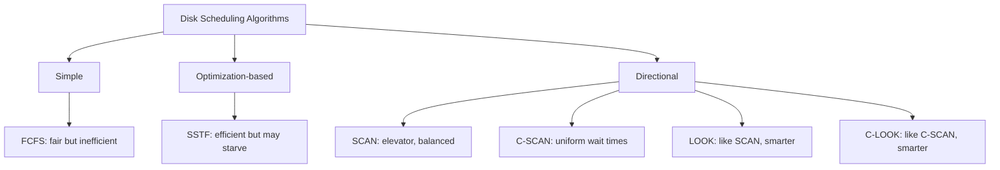

# Disk Scheduling and Structure

> A hard disk drive is a mechanical device with spinning platters and a moving read/write head — disk scheduling decides the ORDER to service I/O requests so the head moves as little as possible, dramatically reducing the biggest bottleneck: seek time.

---

## Table of Contents

1. [Hard Disk Structure](#1-hard-disk-structure)
2. [Disk Access Time Components](#2-disk-access-time-components)
3. [What Is Disk Scheduling?](#3-what-is-disk-scheduling)
4. [Disk Request Queue Example](#4-disk-request-queue-example)
5. [Goals of Disk Scheduling](#5-goals-of-disk-scheduling)
6. [Scheduling Algorithms Overview](#6-scheduling-algorithms-overview)
7. [Disk Scheduling in Modern Systems](#7-disk-scheduling-in-modern-systems)
8. [Key Takeaways](#8-key-takeaways)

---

## 1. Hard Disk Structure

A **Hard Disk Drive (HDD)** is a mechanical storage device — think of it as a high-tech vinyl record player.

```
  HDD cross-section view:

         ┌─────────────────────────────────────┐
         │          Platter (top view)         │
         │     ─────────────────────────────   │
         │   ╱         Track                  ╲│
         │  │  ◉ ──── Sectors ────────────────  │
         │   ╲                                ╱│
         │     ─────────────────────────────   │
         │         ↑ Read/Write Head          │
         │         │ Actuator Arm             │
         └─────────────────────────────────────┘
```

### Physical Components

| Component           | Description                                       | Analogy                             |
| ------------------- | ------------------------------------------------- | ----------------------------------- |
| **Platter**         | Circular magnetic disk (usually multiple stacked) | Vinyl record                        |
| **Track**           | Concentric circle on a platter surface            | Groove on a record                  |
| **Sector**          | Smallest addressable unit on a track              | A few notes of music in a groove    |
| **Cylinder**        | Set of same-numbered tracks across ALL platters   | Vertical stack of identical grooves |
| **Read/Write Head** | Moves over platter surface to read/write data     | Record player needle                |
| **Actuator Arm**    | Mechanical arm that positions the head            | Tone arm on a record player         |
| **Spindle**         | Motor that spins the platters                     | Turntable motor                     |

**Typical HDD specs:**

```
  Platters: 2–5
  Surfaces per platter: 2 (top and bottom)
  Tracks per surface: 100,000+ (varies)
  Sectors per track: ~63 (older) to thousands (modern)
  Sector size: 512 bytes (legacy) or 4096 bytes (modern / 4K sector)
  RPM: 5400 (laptop) or 7200 (desktop) — enterprise: 10,000–15,000
```

### Logical Organization

From the OS's view, the disk is just a **long array of logical blocks** numbered from 0 to N-1. The OS doesn't care about physical platters — it works with block addresses. The disk controller handles translating logical addresses to physical cylinder/track/sector.

```
  Logical view (what OS sees):
  [Block 0][Block 1][Block 2]...[Block N-1]

  Physical reality:
  Block 0 → Platter 0, Surface 0, Cylinder 0, Track 0, Sector 0
  Block N → Platter 2, Surface 1, Cylinder 483, Track 483, Sector 17
```

---

## 2. Disk Access Time Components

Every time the OS reads or writes a disk block, it takes:

$$T_{access} = T_{seek} + T_{rotational} + T_{transfer}$$

### Seek Time

**Time to move the read/write head to the correct track (cylinder).**

- Largest component of disk access time
- Proportional to distance the head must move
- **Average seek time**: 3–12 ms for modern HDDs

```
  Head at track 50, need track 130:
  Head must physically move 80 tracks outward → takes time proportional to 80 tracks

  Head at track 50, need track 52:
  Only 2 tracks → much faster!

  This is WHY disk scheduling exists: minimize total head movement.
```

### Rotational Latency

**Time waiting for the disk to rotate the target sector under the head.**

- Once the head is on the right track, we wait for the disk to spin
- Average = time for half a rotation (could be zero if lucky, full rotation if very unlucky)

$$T_{rotational\_avg} = \frac{60 \text{ seconds}}{2 \times RPM}$$

For 7200 RPM:

$$T_{rotational\_avg} = \frac{60}{2 \times 7200} = 4.17 \text{ ms}$$

### Transfer Time

**Time to actually read/write the data** once head is in position. Usually negligible (< 1 ms for small transfers).

### Full Example

```
  Request to read 1 sector on a 7200 RPM disk:

  Seek time (head moves 30 tracks avg): ~5 ms
  Rotational latency (avg half rotation): 4.17 ms
  Transfer time (1 sector, ~0.1 ms):     0.1 ms
  ──────────────────────────────────────────────
  Total access time:                     ~9.3 ms

  Compare to RAM access: ~70 nanoseconds
  Disk is ~130,000× SLOWER than RAM!

  This is why minimizing seek time matters enormously.
```

| Component          | Typical Range               | Notes                                      |
| ------------------ | --------------------------- | ------------------------------------------ |
| Seek time          | 3–12 ms                     | **Largest; most important to minimize**    |
| Rotational latency | 2–8 ms (avg 4ms at 7200rpm) | Fixed by RPM; can't change with scheduling |
| Transfer time      | 0.1–1 ms                    | Usually negligible for small reads         |

---

## 3. What Is Disk Scheduling?

When **multiple processes** request disk I/O simultaneously, the OS has a **queue of pending requests**. Disk scheduling decides the ORDER in which to serve them.

**Delivery driver analogy:**

```
  You're a delivery driver with 10 packages to deliver across a city.

  FCFS (First-Come-First-Served):
  Deliver in the order orders came in → might drive back and forth across town.

  Smart routing:
  Plan an efficient route → fewer miles, faster deliveries.

  Disk scheduling = smart routing for the disk head.
```

**Why order matters:**

```
  Requests waiting: [98, 183, 37, 122, 14, 124, 65, 67]
  Current head:     50

  FCFS order (50→98→183→37→122→14→124→65→67):
  Head movement: 48+85+146+85+108+110+59+2 = 643 tracks total

  Smart order (50→37→14→65→67→98→122→124→183):
  Head movement: 13+23+51+2+31+24+2+59 = 205 tracks total

  Smart scheduling = 3× less head movement = 3× faster!
```

---

## 4. Disk Request Queue Example

Standard example used throughout disk scheduling discussions:

```
  Disk size:          0 to 199 tracks (200 tracks total)
  Current head:       50
  Previous position:  35  (for algorithms that need direction)

  Pending request queue: 98, 183, 37, 122, 14, 124, 65, 67
```

This queue will be used to demonstrate each algorithm (covered in the next topic: Disk Scheduling Algorithms).

---

## 5. Goals of Disk Scheduling

| Goal                     | Description                    | Trade-off                     |
| ------------------------ | ------------------------------ | ----------------------------- |
| **Minimize seek time**   | Reduce total head movement     | May delay distant requests    |
| **Maximize throughput**  | More requests per second       | May reduce fairness           |
| **Ensure fairness**      | All requests eventually served | May increase average wait     |
| **Avoid starvation**     | No request waits forever       | May reduce optimization       |
| **Predictable response** | Consistent wait times          | May sacrifice peak throughput |

No single algorithm satisfies ALL goals — each makes trade-offs.

---

## 6. Scheduling Algorithms Overview

(Detailed examples with calculations are in the next topic)

### FCFS — First-Come, First-Served

- Process requests in arrival order
- Fair, simple, no starvation
- Head moves back and forth: poor total seek distance

### SSTF — Shortest Seek Time First

- Always pick the request closest to current head position
- Best throughput (greedy optimization)
- Risk: **starvation** — requests far from head may wait forever

### SCAN (Elevator Algorithm)

- Head moves in one direction, serves all requests on the way
- Reaches end of disk, reverses direction, serves requests on the way back
- Like an elevator — goes up serving floors, hits top, comes back down

### C-SCAN (Circular SCAN)

- Head moves in one direction, serves requests
- At the end, **jumps back to the beginning** (no service on the return)
- More uniform wait times than SCAN (requests near one end don't have shorter waits)

### LOOK

- Like SCAN but head only goes as far as the last request in each direction
- Doesn't waste time traveling to the physical end of the disk

### C-LOOK

- Like C-SCAN but only jumps back to the lowest-numbered pending request
- Best balance of performance and fairness in practice



---

## 7. Disk Scheduling in Modern Systems

### SSDs Don't Have Seek Time

```
  SSD = solid-state memory (like RAM chips)
  No spinning platters → no seek time → no rotational latency
  Random access ≈ Sequential access (both very fast: ~0.1 ms)

  Traditional HDD scheduling algorithms: not beneficial for SSDs

  What SSDs do care about:
  - Write amplification (SSD writes in blocks, not bytes)
  - Wear leveling (distribute writes to avoid burning out cells)
  - Write coalescing (batch small writes to reduce write amplification)

  Linux I/O scheduler for SSDs: "none" or "mq-deadline" (minimizes latency)
  Linux I/O scheduler for HDDs: "bfq" or "kyber" (minimizes seek distance)
```

### Modern Multi-Level I/O Scheduling

```
  Layer 1: OS I/O scheduler (block device layer)
           - Merges nearby requests
           - Reorders for efficiency

  Layer 2: Disk controller (hardware)
           - Has its own internal queue
           - Modern disks do their own Native Command Queuing (NCQ)
           - Firmware reorders commands for optimal platter access

  Together: software + hardware optimization for maximum throughput
```

### HDD vs SSD Decision Guide

| Factor           | HDD                     | SSD                              |
| ---------------- | ----------------------- | -------------------------------- |
| Cost per GB      | **Much cheaper**        | More expensive                   |
| Sequential speed | ~100–250 MB/s           | 500 MB/s – 7000 MB/s (NVMe)      |
| Random I/O       | **Slow** (seek-limited) | **Very fast**                    |
| Seek time        | 3–12 ms                 | ~0.1 ms (no seek)                |
| Noise/heat       | Yes (mechanical)        | None (no moving parts)           |
| Best use case    | Bulk storage, archival  | OS, apps, databases, boot drives |

---

## 8. Key Takeaways

- **HDD physical structure**: platters (magnetic disks) spin, read/write heads move on actuator arms; tracks → cylinders → sectors
- **Disk access time** = seek time + rotational latency + transfer time; seek time (moving head) dominates — typically 3–12 ms
- **Cylinder** = all tracks at the same radius across all platters; heads always move together, so same-cylinder access = no extra seek
- **Disk scheduling** = deciding the ORDER to serve queued I/O requests to minimize total head movement
- **FCFS**: simple and fair but head bounces everywhere — poor performance
- **SSTF**: always goes to nearest request — best throughput but can starve distant requests
- **SCAN/LOOK**: head sweeps in one direction serving requests, then reverses (elevator) — balanced
- **C-SCAN/C-LOOK**: head only sweeps one way then jumps back to start — more uniform wait times
- **SSDs have no seek time** — traditional disk scheduling for seek minimization is irrelevant; SSD scheduling focuses on write amplification and wear leveling
- **NCQ (Native Command Queuing)** in modern disk controllers: hardware does its own request reordering below the OS scheduler
- Sequential access on HDDs is dramatically faster than random access — file layout on disk (fragmentation) directly impacts HDD performance (not SSD)
- On HDD-based systems: **defragmentation** helps by making files contiguous → fewer seeks; **never defrag SSDs** (no benefit, reduces lifespan)
