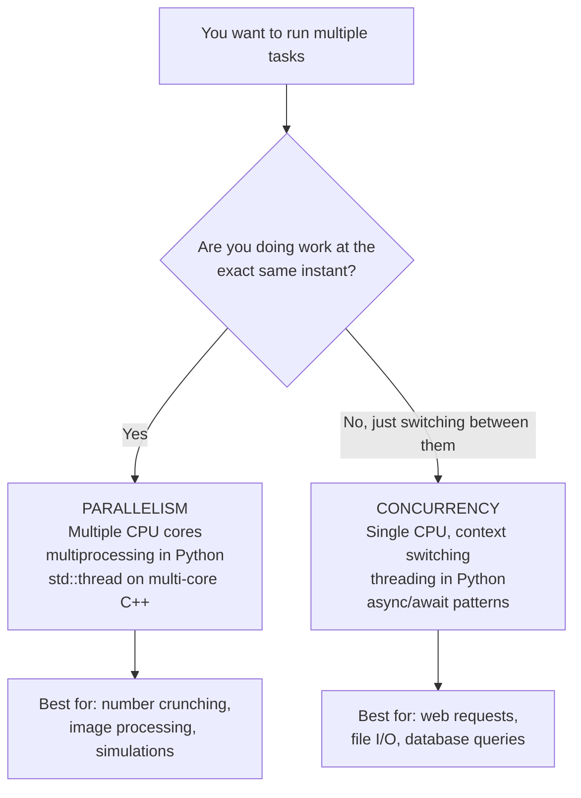

# Concurrency and Parallelism — Core Concepts

> Concurrency means multiple tasks are **in progress** at the same time (possibly taking turns); parallelism means multiple tasks are **literally executing** at the same instant on different CPU cores — they are related but not the same thing.

---

## Table of Contents

1. [Concurrency vs Parallelism](#1-concurrency-vs-parallelism)
2. [Thread vs Process](#2-thread-vs-process)
3. [Thread Lifecycle](#3-thread-lifecycle)
4. [Threading Models](#4-threading-models)
5. [The Global Interpreter Lock (GIL) in Python](#5-the-global-interpreter-lock-gil-in-python)
6. [Race Conditions and Synchronization Recap](#6-race-conditions-and-synchronization-recap)
7. [Code Examples](#7-code-examples)
8. [Key Takeaways](#8-key-takeaways)

---

## 1. Concurrency vs Parallelism

### Concurrency — one worker, many tasks

```
  TIME ──────────────────────────────────────────────►

  1 CPU Core:
  ┌────────┬────────┬────────┬────────┬────────┐
  │Task A  │Task B  │Task A  │Task C  │Task B  │
  └────────┴────────┴────────┴────────┴────────┘
           ▲
           Context switch — CPU jumps between tasks

  Tasks are interleaved. Only one runs at any moment.
  But from the outside, they all appear to be progressing.
```

### Parallelism — many workers, many tasks at the same time

```
  TIME ──────────────────────────────────────────────►

  Core 0:  ┌──────────────────────────────────────┐
            │Task A  (running the whole time)      │
            └──────────────────────────────────────┘
  Core 1:  ┌──────────────────────────────────────┐
            │Task B  (running the whole time)      │
            └──────────────────────────────────────┘
  Core 2:  ┌──────────────────────────────────────┐
            │Task C  (running the whole time)      │
            └──────────────────────────────────────┘

  Tasks run simultaneously on separate physical cores.
```

### Summary

| Property        | Concurrency                                     | Parallelism                             |
| --------------- | ----------------------------------------------- | --------------------------------------- |
| Definition      | Tasks make progress in overlapping time periods | Tasks execute at the exact same instant |
| Hardware needed | Single core is enough                           | Requires multiple cores/CPUs            |
| How it works    | Context switching (rapid task switching)        | True simultaneous execution             |
| Best for        | I/O-bound tasks (waiting for disk, network)     | CPU-bound tasks (heavy computation)     |
| Python example  | `threading` module                              | `multiprocessing` module                |
| C++ example     | `std::thread` on 1 core                         | `std::thread` on multiple cores         |



---

## 2. Thread vs Process

### Process

- A **running program** with its own isolated memory space
- Has its own: code, data, heap, stack, file handles, registers
- Heavy to create (OS allocates full memory space)
- Communicating between processes requires IPC (pipes, sockets, shared memory)
- One process crashing does NOT affect another

### Thread

- A **lightweight unit of execution** that lives inside a process
- Shares the parent process's memory (heap, code, file handles)
- Has its own: stack and registers only
- Cheap to create (just a new stack + PC)
- All threads in a process can read/write the same variables → need synchronization

```
  PROCESS P1
  ┌──────────────────────────────────────────────────┐
  │  Code (shared)    Heap (shared)   Files (shared) │
  │                                                  │
  │  Thread 1         Thread 2         Thread 3      │
  │  ┌──────────┐    ┌──────────┐    ┌──────────┐   │
  │  │Stack     │    │Stack     │    │Stack     │   │
  │  │Registers │    │Registers │    │Registers │   │
  │  └──────────┘    └──────────┘    └──────────┘   │
  └──────────────────────────────────────────────────┘

  PROCESS P2  (separate memory — can't touch P1's memory)
  ┌──────────────────────────────────────────────────┐
  │  Code    Heap    Files                            │
  │  Thread 1   Thread 2                             │
  └──────────────────────────────────────────────────┘
```

### Comparison Table

| Feature         | Thread                          | Process                       |
| --------------- | ------------------------------- | ----------------------------- |
| Memory          | Shared with other threads       | Isolated from other processes |
| Creation cost   | Low (microseconds)              | High (milliseconds)           |
| Communication   | Direct (shared memory)          | IPC required (pipes, sockets) |
| Crash isolation | One bad thread can kill process | Crash is isolated             |
| Synchronization | Required (race conditions)      | Not needed (separate memory)  |
| Context switch  | Fast                            | Slower                        |

---

## 3. Thread Lifecycle

```
                      thread.start()
  ┌──────────┐      ┌─────────────┐      ┌─────────────┐
  │  NEW     │ ───► │   RUNNABLE  │ ───► │   RUNNING   │
  │(created) │      │(ready queue)│      │(on CPU)     │
  └──────────┘      └─────────────┘      └──────┬──────┘
                           ▲                     │
                           │  scheduler picks    │ I/O wait / sleep /
                           │  this thread again  │ waiting for lock
                           │                     ▼
                           │             ┌─────────────┐
                           └─────────────│   BLOCKED / │
                                         │   WAITING   │
                                         └─────────────┘

  When run() method finishes:
  RUNNING ──────────────────────────────► TERMINATED
```

### Thread States Explained

| State      | What it means                                                |
| ---------- | ------------------------------------------------------------ |
| New        | Thread object created, `start()` not yet called              |
| Runnable   | Ready to run, waiting for CPU scheduler to pick it           |
| Running    | Actually executing on a CPU core                             |
| Blocked    | Waiting for a lock (mutex) that another thread holds         |
| Waiting    | Waiting indefinitely (e.g., `join()`, `wait()` on condition) |
| Timed Wait | Sleeping for a set time (`sleep(n)`)                         |
| Terminated | `run()` finished or exception occurred                       |

---

## 4. Threading Models

How user-level threads map to kernel-level threads:

### Many-to-One

```
  User Threads:    T1  T2  T3  T4
                    \   |  /  /
                     \  | /  /
  Kernel Thread:       KT1

  Only one thread runs at a time (even on multi-core).
  Used in: early Java Green Threads
```

### One-to-One

```
  User Threads:    T1    T2    T3    T4
                   |     |     |     |
  Kernel Threads:  KT1   KT2   KT3   KT4

  True parallelism possible. Each user thread = one kernel thread.
  Used in: Linux pthreads, Windows threads, Java (modern), C++ std::thread
```

### Many-to-Many

```
  User Threads:    T1  T2  T3  T4  T5  T6
                    \   \   |   /  /
  Kernel Threads:    KT1   KT2   KT3

  OS manages a pool of kernel threads. Flexible.
  Used in: Go (goroutines), some RTOS implementations
```

Python's `threading` module uses **One-to-One** (each Python thread = one OS thread), but the **GIL** limits parallelism (see section 5).

---

## 5. The Global Interpreter Lock (GIL) in Python

The **GIL** is a mutex inside CPython (the standard Python interpreter) that allows **only one thread to execute Python bytecode at a time**, even on a multi-core CPU.

```
  Without GIL (ideal):
  Core 0:  [Thread 1 running Python code ──────────────►]
  Core 1:  [Thread 2 running Python code ──────────────►]

  With GIL (CPython reality):
  Core 0:  [T1 runs][ waiting ][T1 runs][ waiting ][T1 runs]
  Core 1:  [ waiting][T2 runs ][ waiting][T2 runs ][ waiting]
                    ▲
                    GIL allows only one to run at a time
```

### Why does the GIL exist?

CPython's memory management (reference counting) is **not thread-safe**. The GIL protects the interpreter's internal state from corruption.

### What this means for you:

| Task Type | `threading` module                              | `multiprocessing` module    |
| --------- | ----------------------------------------------- | --------------------------- |
| I/O-bound | ✅ Works great — threads release GIL during I/O | Overkill                    |
| CPU-bound | ❌ GIL prevents true parallelism                | ✅ Each process has own GIL |

**I/O-bound example:** Fetching 10 web pages simultaneously → `threading` is perfect, threads release the GIL while waiting for network.

**CPU-bound example:** Processing 10 large images → `multiprocessing` needed, each process runs Python independently.

> Python 3.13+ introduces an **experimental "no-GIL" mode** (PEP 703) that may eventually remove this limitation.

---

## 6. Race Conditions and Synchronization Recap

When multiple threads share data, you need synchronization. The key tools:

| Tool               | C++                       | Python                                   |
| ------------------ | ------------------------- | ---------------------------------------- |
| Mutex (lock)       | `std::mutex`              | `threading.Lock()`                       |
| Recursive mutex    | `std::recursive_mutex`    | `threading.RLock()`                      |
| Condition variable | `std::condition_variable` | `threading.Condition()`                  |
| Semaphore          | `std::counting_semaphore` | `threading.Semaphore(n)`                 |
| Atomic variable    | `std::atomic<T>`          | No direct equivalent (use Lock)          |
| Read-write lock    | `std::shared_mutex`       | `threading.Lock()` (no built-in RW lock) |

**Classic race condition:**

```python
# Shared variable
counter = 0

def increment():
    global counter
    for _ in range(100000):
        counter += 1  # Read → compute → write: NOT atomic!

# If two threads run increment() simultaneously:
# Expected: 200000
# Actual:   ~150000 (some increments lost)
```

Fix with a lock → see the Python and C++ files for full examples.

---

## 7. Code Examples

> Working code that demonstrates concurrency vs parallelism in practice.

### C++ — Simple Version
Simulate concurrency (one thread interleaves tasks) vs parallelism (multiple threads run simultaneously on separate cores).

```cpp
#include <iostream>
#include <thread>
#include <string>

// ─── CONCURRENCY: one thread, tasks interleaved ───────────────────────
void show_concurrency() {
    std::cout << "=== CONCURRENCY (single thread, interleaved) ===\n";
    // One "cook" alternates between tasks — only one runs at any instant
    auto chop  = [](int r){ std::cout << "  [Cook] Round " << r << ": chopping\n"; };
    auto stir  = [](int r){ std::cout << "  [Cook] Round " << r << ": stirring\n"; };
    auto check = [](int r){ std::cout << "  [Cook] Round " << r << ": checking oven\n"; };

    for (int r = 1; r <= 3; r++) {   // 3 rounds of interleaving
        chop(r); stir(r); check(r);
    }
    std::cout << "  -> Single thread: tasks interleaved, never truly simultaneous\n\n";
}

// ─── PARALLELISM: multiple threads running simultaneously ─────────────
void show_parallelism() {
    std::cout << "=== PARALLELISM (multiple threads, simultaneous) ===\n";

    auto cook = [](const std::string& name, int rounds) {
        for (int r = 1; r <= rounds; r++)
            std::cout << "  [" << name << "] round " << r << "\n";
    };

    // Three threads run at the same time on separate cores
    std::thread cookA(cook, "Cook-A", 3);
    std::thread cookB(cook, "Cook-B", 3);
    std::thread cookC(cook, "Cook-C", 3);

    cookA.join(); cookB.join(); cookC.join();
    std::cout << "  -> Output is non-deterministic — threads ran truly in parallel\n";
}

int main() {
    show_concurrency();
    show_parallelism();
    return 0;
}
// Compile: g++ -std=c++17 -pthread concurrency_demo.cpp -o concurrency_demo
```

### C++ — Medium / LeetCode Style
Benchmark sequential (one thread) vs parallel (four threads) on a CPU-bound task; measure wall-clock speedup — C++ has no GIL so threads always scale.

```cpp
#include <iostream>
#include <thread>
#include <vector>
#include <numeric>
#include <chrono>

using Clock = std::chrono::steady_clock;
using Ms    = std::chrono::milliseconds;

long long cpu_work(long long start, long long end) {
    long long s = 0;
    for (long long i = start; i < end; i++) s += i * i;
    return s;
}

template<typename Fn>
void timed(const std::string& label, Fn fn) {
    auto t0 = Clock::now();
    fn();
    auto ms = std::chrono::duration_cast<Ms>(Clock::now() - t0).count();
    std::cout << "  " << label << ": " << ms << "ms\n";
}

int main() {
    const long long N = 50'000'000LL;
    const int T = 4;

    std::cout << "CPU-Bound benchmark: sum of squares 0.." << N << "\n\n";

    // ── 1. Sequential (single thread does all work) ───────────────────
    timed("1. Sequential (1 thread)  ", [&]{ cpu_work(0, N); });

    // ── 2. Parallel (T threads — C++ has NO GIL, runs truly parallel) ─
    timed("2. Parallel   (" + std::to_string(T) + " threads)", [&] {
        long long chunk = N / T;
        std::vector<std::thread> threads;
        std::vector<long long>   results(T, 0);
        for (int i = 0; i < T; i++) {
            long long from = i * chunk, to = (i + 1 == T) ? N : from + chunk;
            threads.emplace_back([&results, i, from, to]{
                results[i] = cpu_work(from, to);
            });
        }
        for (auto& t : threads) t.join();
        std::accumulate(results.begin(), results.end(), 0LL);
    });

    std::cout << "\nC++ has no GIL → threads run truly in parallel.\n";
    std::cout << "Expected: ~" << T << "x speedup on a " << T << "-core machine.\n";
    return 0;
}
// Compile: g++ -std=c++17 -pthread -O2 cpp_parallel.cpp -o cpp_parallel
```

### Python — Simple Version
Show concurrency (threading, I/O-bound: fast) vs parallelism (multiprocessing, CPU-bound: bypasses GIL) with real timing output.

```python
import time
import threading
import multiprocessing

def io_task(task_id):
    """I/O-bound: sleep releases the GIL so other threads can run."""
    time.sleep(0.5)

def cpu_task(n):
    """CPU-bound: pure computation — GIL is held the entire time."""
    return sum(i * i for i in range(n))

N = 4   # Number of tasks to run

# ── Concurrency: threads excel at I/O-bound work ─────────────────────
print("=== I/O-Bound: Threading (CONCURRENCY) ===")
start = time.time()
threads = [threading.Thread(target=io_task, args=(i,)) for i in range(N)]
for t in threads: t.start()
for t in threads: t.join()
print(f"  {N} threads × 0.5s → {time.time() - start:.2f}s  (expected ~0.5s, not 2.0s!)\n")

# ── Parallelism: multiprocessing bypasses GIL for CPU work ───────────
if __name__ == "__main__":
    print("=== CPU-Bound: Multiprocessing (PARALLELISM) ===")
    WORK = 5_000_000

    start = time.time()
    [cpu_task(WORK) for _ in range(N)]        # Sequential baseline
    seq = time.time() - start
    print(f"  Sequential:      {seq:.2f}s")

    start = time.time()
    with multiprocessing.Pool(N) as pool:
        pool.map(cpu_task, [WORK] * N)         # True parallelism, each process has own GIL
    par = time.time() - start
    print(f"  multiprocessing: {par:.2f}s  (~{seq/par:.1f}x speedup on {N} cores)")
```

### Python — Medium Level
Benchmark `ThreadPoolExecutor` (GIL-limited) vs `ProcessPoolExecutor` (no GIL) for CPU-bound, and threading for I/O-bound — all side by side.

```python
import time
from concurrent.futures import ThreadPoolExecutor, ProcessPoolExecutor

def cpu_work(n):
    """CPU-bound: GIL blocks threads, but not processes."""
    return sum(i * i for i in range(n))

def io_work(delay):
    """I/O-bound: GIL released during sleep — threads work well here."""
    import time; time.sleep(delay); return delay

TASKS = 4
N = 3_000_000

def bench(label, fn):
    start = time.time()
    fn()
    print(f"  {label:<52} {time.time() - start:.2f}s")

if __name__ == "__main__":
    work = [N] * TASKS

    print("CPU-BOUND (sum of squares)")
    print("-" * 60)
    bench("Sequential (baseline):",
          lambda: [cpu_work(n) for n in work])
    with ThreadPoolExecutor(TASKS) as ex:
        bench("ThreadPoolExecutor (GIL blocked — no speedup):",
              lambda: list(ex.map(cpu_work, work)))
    with ProcessPoolExecutor(TASKS) as ex:
        bench("ProcessPoolExecutor (no GIL — true parallel):",
              lambda: list(ex.map(cpu_work, work)))

    print("\nI/O-BOUND (0.5s sleep × 4 tasks)")
    print("-" * 60)
    delays = [0.5] * TASKS
    bench("Sequential (baseline):",
          lambda: [io_work(d) for d in delays])
    with ThreadPoolExecutor(TASKS) as ex:
        bench("ThreadPoolExecutor (concurrent — great speedup):",
              lambda: list(ex.map(io_work, delays)))

    print("\nConclusion:")
    print("  CPU-bound → ProcessPoolExecutor  (bypass the GIL)")
    print("  I/O-bound → ThreadPoolExecutor   (GIL released during I/O)")
```

---

## 8. Key Takeaways

- **Concurrency** = tasks overlap in time (interleaving); **Parallelism** = tasks run at the exact same instant
- A **thread** lives inside a process, shares its memory, and is cheap to create
- A **process** has isolated memory, is expensive to create, but provides crash isolation
- Thread lifecycle: New → Runnable → Running → Blocked/Waiting → Terminated
- **One-to-One model** (Linux/Windows/C++) maps each user thread to a kernel thread → enables true parallelism
- Python's **GIL** limits CPU-bound threading — use `multiprocessing` for CPU work, `threading` for I/O work
- All shared data between threads needs synchronization — mutex, semaphore, condition variable, or atomic ops
