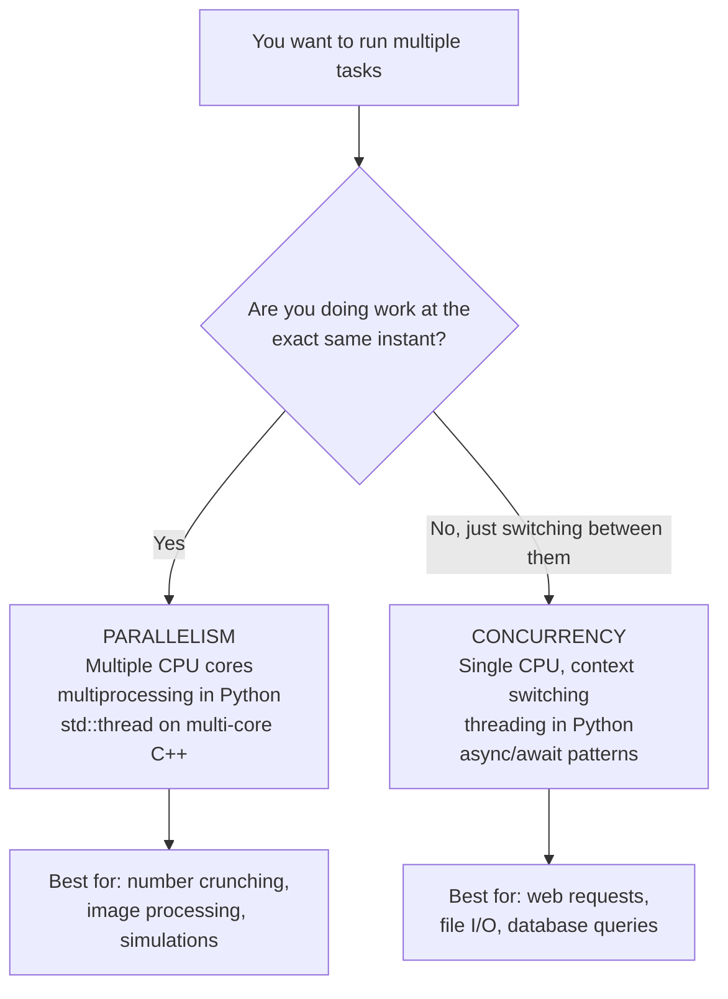

# Concurrency and Parallelism — Core Concepts

> Concurrency means multiple tasks are **in progress** at the same time (possibly taking turns); parallelism means multiple tasks are **literally executing** at the same instant on different CPU cores — they are related but not the same thing.

---

## Table of Contents

1. [Concurrency vs Parallelism](#1-concurrency-vs-parallelism)
2. [Thread vs Process](#2-thread-vs-process)
3. [Thread Lifecycle](#3-thread-lifecycle)
4. [Threading Models](#4-threading-models)
5. [The Global Interpreter Lock (GIL) in Python](#5-the-global-interpreter-lock-gil-in-python)
6. [Race Conditions and Synchronization Recap](#6-race-conditions-and-synchronization-recap)
7. [Key Takeaways](#7-key-takeaways)

---

## 1. Concurrency vs Parallelism

### Concurrency — one worker, many tasks

```
  TIME ──────────────────────────────────────────────►

  1 CPU Core:
  ┌────────┬────────┬────────┬────────┬────────┐
  │Task A  │Task B  │Task A  │Task C  │Task B  │
  └────────┴────────┴────────┴────────┴────────┘
           ▲
           Context switch — CPU jumps between tasks

  Tasks are interleaved. Only one runs at any moment.
  But from the outside, they all appear to be progressing.
```

### Parallelism — many workers, many tasks at the same time

```
  TIME ──────────────────────────────────────────────►

  Core 0:  ┌──────────────────────────────────────┐
            │Task A  (running the whole time)      │
            └──────────────────────────────────────┘
  Core 1:  ┌──────────────────────────────────────┐
            │Task B  (running the whole time)      │
            └──────────────────────────────────────┘
  Core 2:  ┌──────────────────────────────────────┐
            │Task C  (running the whole time)      │
            └──────────────────────────────────────┘

  Tasks run simultaneously on separate physical cores.
```

### Summary

| Property        | Concurrency                                     | Parallelism                             |
| --------------- | ----------------------------------------------- | --------------------------------------- |
| Definition      | Tasks make progress in overlapping time periods | Tasks execute at the exact same instant |
| Hardware needed | Single core is enough                           | Requires multiple cores/CPUs            |
| How it works    | Context switching (rapid task switching)        | True simultaneous execution             |
| Best for        | I/O-bound tasks (waiting for disk, network)     | CPU-bound tasks (heavy computation)     |
| Python example  | `threading` module                              | `multiprocessing` module                |
| C++ example     | `std::thread` on 1 core                         | `std::thread` on multiple cores         |



---

## 2. Thread vs Process

### Process

- A **running program** with its own isolated memory space
- Has its own: code, data, heap, stack, file handles, registers
- Heavy to create (OS allocates full memory space)
- Communicating between processes requires IPC (pipes, sockets, shared memory)
- One process crashing does NOT affect another

### Thread

- A **lightweight unit of execution** that lives inside a process
- Shares the parent process's memory (heap, code, file handles)
- Has its own: stack and registers only
- Cheap to create (just a new stack + PC)
- All threads in a process can read/write the same variables → need synchronization

```
  PROCESS P1
  ┌──────────────────────────────────────────────────┐
  │  Code (shared)    Heap (shared)   Files (shared) │
  │                                                  │
  │  Thread 1         Thread 2         Thread 3      │
  │  ┌──────────┐    ┌──────────┐    ┌──────────┐   │
  │  │Stack     │    │Stack     │    │Stack     │   │
  │  │Registers │    │Registers │    │Registers │   │
  │  └──────────┘    └──────────┘    └──────────┘   │
  └──────────────────────────────────────────────────┘

  PROCESS P2  (separate memory — can't touch P1's memory)
  ┌──────────────────────────────────────────────────┐
  │  Code    Heap    Files                            │
  │  Thread 1   Thread 2                             │
  └──────────────────────────────────────────────────┘
```

### Comparison Table

| Feature         | Thread                          | Process                       |
| --------------- | ------------------------------- | ----------------------------- |
| Memory          | Shared with other threads       | Isolated from other processes |
| Creation cost   | Low (microseconds)              | High (milliseconds)           |
| Communication   | Direct (shared memory)          | IPC required (pipes, sockets) |
| Crash isolation | One bad thread can kill process | Crash is isolated             |
| Synchronization | Required (race conditions)      | Not needed (separate memory)  |
| Context switch  | Fast                            | Slower                        |

---

## 3. Thread Lifecycle

```
                      thread.start()
  ┌──────────┐      ┌─────────────┐      ┌─────────────┐
  │  NEW     │ ───► │   RUNNABLE  │ ───► │   RUNNING   │
  │(created) │      │(ready queue)│      │(on CPU)     │
  └──────────┘      └─────────────┘      └──────┬──────┘
                           ▲                     │
                           │  scheduler picks    │ I/O wait / sleep /
                           │  this thread again  │ waiting for lock
                           │                     ▼
                           │             ┌─────────────┐
                           └─────────────│   BLOCKED / │
                                         │   WAITING   │
                                         └─────────────┘

  When run() method finishes:
  RUNNING ──────────────────────────────► TERMINATED
```

### Thread States Explained

| State      | What it means                                                |
| ---------- | ------------------------------------------------------------ |
| New        | Thread object created, `start()` not yet called              |
| Runnable   | Ready to run, waiting for CPU scheduler to pick it           |
| Running    | Actually executing on a CPU core                             |
| Blocked    | Waiting for a lock (mutex) that another thread holds         |
| Waiting    | Waiting indefinitely (e.g., `join()`, `wait()` on condition) |
| Timed Wait | Sleeping for a set time (`sleep(n)`)                         |
| Terminated | `run()` finished or exception occurred                       |

---

## 4. Threading Models

How user-level threads map to kernel-level threads:

### Many-to-One

```
  User Threads:    T1  T2  T3  T4
                    \   |  /  /
                     \  | /  /
  Kernel Thread:       KT1

  Only one thread runs at a time (even on multi-core).
  Used in: early Java Green Threads
```

### One-to-One

```
  User Threads:    T1    T2    T3    T4
                   |     |     |     |
  Kernel Threads:  KT1   KT2   KT3   KT4

  True parallelism possible. Each user thread = one kernel thread.
  Used in: Linux pthreads, Windows threads, Java (modern), C++ std::thread
```

### Many-to-Many

```
  User Threads:    T1  T2  T3  T4  T5  T6
                    \   \   |   /  /
  Kernel Threads:    KT1   KT2   KT3

  OS manages a pool of kernel threads. Flexible.
  Used in: Go (goroutines), some RTOS implementations
```

Python's `threading` module uses **One-to-One** (each Python thread = one OS thread), but the **GIL** limits parallelism (see section 5).

---

## 5. The Global Interpreter Lock (GIL) in Python

The **GIL** is a mutex inside CPython (the standard Python interpreter) that allows **only one thread to execute Python bytecode at a time**, even on a multi-core CPU.

```
  Without GIL (ideal):
  Core 0:  [Thread 1 running Python code ──────────────►]
  Core 1:  [Thread 2 running Python code ──────────────►]

  With GIL (CPython reality):
  Core 0:  [T1 runs][ waiting ][T1 runs][ waiting ][T1 runs]
  Core 1:  [ waiting][T2 runs ][ waiting][T2 runs ][ waiting]
                    ▲
                    GIL allows only one to run at a time
```

### Why does the GIL exist?

CPython's memory management (reference counting) is **not thread-safe**. The GIL protects the interpreter's internal state from corruption.

### What this means for you:

| Task Type | `threading` module                              | `multiprocessing` module    |
| --------- | ----------------------------------------------- | --------------------------- |
| I/O-bound | ✅ Works great — threads release GIL during I/O | Overkill                    |
| CPU-bound | ❌ GIL prevents true parallelism                | ✅ Each process has own GIL |

**I/O-bound example:** Fetching 10 web pages simultaneously → `threading` is perfect, threads release the GIL while waiting for network.

**CPU-bound example:** Processing 10 large images → `multiprocessing` needed, each process runs Python independently.

> Python 3.13+ introduces an **experimental "no-GIL" mode** (PEP 703) that may eventually remove this limitation.

---

## 6. Race Conditions and Synchronization Recap

When multiple threads share data, you need synchronization. The key tools:

| Tool               | C++                       | Python                                   |
| ------------------ | ------------------------- | ---------------------------------------- |
| Mutex (lock)       | `std::mutex`              | `threading.Lock()`                       |
| Recursive mutex    | `std::recursive_mutex`    | `threading.RLock()`                      |
| Condition variable | `std::condition_variable` | `threading.Condition()`                  |
| Semaphore          | `std::counting_semaphore` | `threading.Semaphore(n)`                 |
| Atomic variable    | `std::atomic<T>`          | No direct equivalent (use Lock)          |
| Read-write lock    | `std::shared_mutex`       | `threading.Lock()` (no built-in RW lock) |

**Classic race condition:**

```python
# Shared variable
counter = 0

def increment():
    global counter
    for _ in range(100000):
        counter += 1  # Read → compute → write: NOT atomic!

# If two threads run increment() simultaneously:
# Expected: 200000
# Actual:   ~150000 (some increments lost)
```

Fix with a lock → see the Python and C++ files for full examples.

---

## 7. Key Takeaways

- **Concurrency** = tasks overlap in time (interleaving); **Parallelism** = tasks run at the exact same instant
- A **thread** lives inside a process, shares its memory, and is cheap to create
- A **process** has isolated memory, is expensive to create, but provides crash isolation
- Thread lifecycle: New → Runnable → Running → Blocked/Waiting → Terminated
- **One-to-One model** (Linux/Windows/C++) maps each user thread to a kernel thread → enables true parallelism
- Python's **GIL** limits CPU-bound threading — use `multiprocessing` for CPU work, `threading` for I/O work
- All shared data between threads needs synchronization — mutex, semaphore, condition variable, or atomic ops
