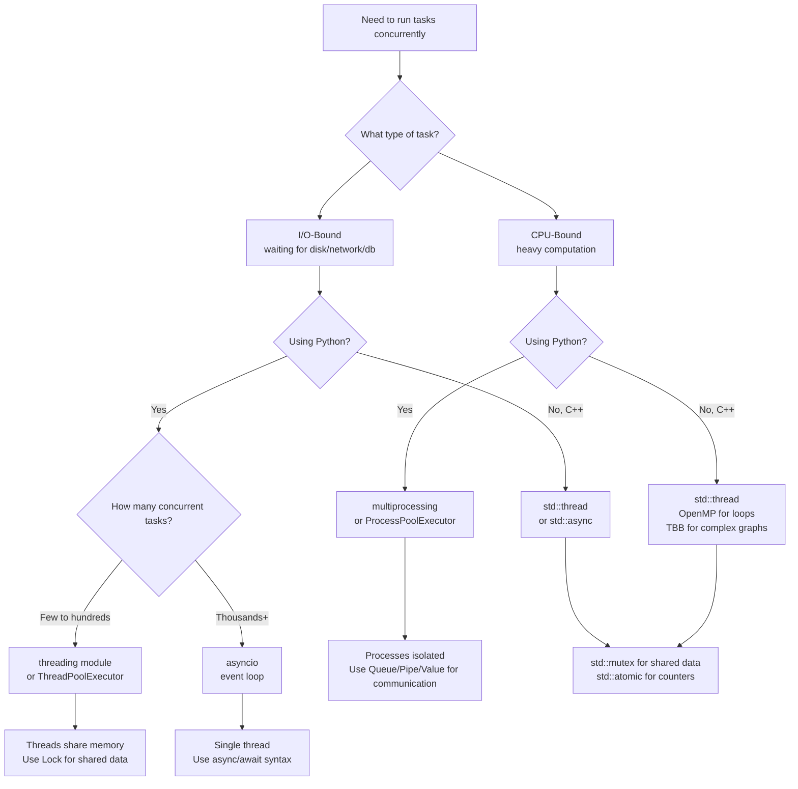

# Parallel Processing vs Threads — When to Use What

> Threads share memory within one process (cheap but need synchronization); processes have isolated memory (safe but expensive to create and communicate); the right choice depends entirely on whether your task is **I/O-bound** or **CPU-bound**.

---

## Table of Contents

1. [The Core Distinction: I/O-Bound vs CPU-Bound](#1-the-core-distinction-io-bound-vs-cpu-bound)
2. [Threads vs Processes — Full Comparison](#2-threads-vs-processes--full-comparison)
3. [Decision Flowchart](#3-decision-flowchart)
4. [Performance Benchmarks — What to Expect](#4-performance-benchmarks--what-to-expect)
5. [Communication Patterns](#5-communication-patterns)
6. [Amdahl's Law — Limits of Parallelism](#6-amdahls-law--limits-of-parallelism)
7. [Common Parallel Patterns](#7-common-parallel-patterns)
8. [Real-World Architecture Examples](#8-real-world-architecture-examples)
9. [Language Quick Reference](#9-language-quick-reference)
10. [Key Takeaways](#10-key-takeaways)

---

## 1. The Core Distinction: I/O-Bound vs CPU-Bound

### I/O-Bound Task

A task that spends most of its time **waiting** — for disk, network, database, or user input.
The CPU is mostly idle during this work.

```
  I/O-Bound Timeline:
  ────────────────────────────────────────────────────────
  CPU:   [work][ waiting... ][ work ][ waiting... ][ work ]
                     ▲                    ▲
                  Disk read            Network response

  CPU is idle most of the time → can run other tasks during waits!

  Examples:
  - Reading/writing files
  - HTTP requests
  - Database queries
  - User input handling
  - Streaming data
```

### CPU-Bound Task

A task that keeps the CPU at **100% utilization** — pure computation with no waiting.

```
  CPU-Bound Timeline:
  ────────────────────────────────────────────────────────
  CPU:   [computing][computing][computing][computing][...]

  CPU is always busy → adding more threads on same core won't help!
  Need more CORES to speed up.

  Examples:
  - Image/video processing
  - Machine learning training
  - Cryptography
  - Data compression
  - Scientific simulations
```

### Which tool for which task?

```
  Task Type    Python tool          C++ tool
  ─────────────────────────────────────────────────────────
  I/O-Bound    threading            std::thread
               asyncio              asio (async I/O library)

  CPU-Bound    multiprocessing      std::thread (no GIL!)
               ProcessPoolExecutor  OpenMP, TBB
```

> **C++ has no GIL** — `std::thread` works for both I/O-bound and CPU-bound tasks.
> **Python has GIL** — `threading` is limited to I/O-bound; use `multiprocessing` for CPU-bound.

---

## 2. Threads vs Processes — Full Comparison

```
  ┌─────────────────────────────────────────────────────────────────┐
  │                         PROCESS                                  │
  │  ┌─────────────────────┐    ┌─────────────────────┐            │
  │  │  Virtual Memory     │    │  Virtual Memory      │            │
  │  │  Code  Heap  Stack  │    │  Code  Heap  Stack   │            │
  │  │  File Handles       │    │  File Handles        │            │
  │  │  Thread 1           │    │  Thread 1  Thread 2  │            │
  │  │   (main thread)     │    │   (shared heap/code) │            │
  │  └─────────────────────┘    └─────────────────────┘            │
  │       Process A                   Process B                     │
  │                                                                  │
  │  Processes CANNOT directly read each other's memory             │
  │  Must use IPC: pipes, sockets, shared memory, queues            │
  └─────────────────────────────────────────────────────────────────┘
```

| Feature                | Threads                             | Processes                             |
| ---------------------- | ----------------------------------- | ------------------------------------- |
| Memory                 | Shared (same heap)                  | Isolated (separate address space)     |
| Creation overhead      | Low (~microseconds)                 | High (~milliseconds)                  |
| Memory overhead        | Low (only new stack)                | High (full copy of memory)            |
| Communication          | Direct (shared variables)           | IPC required (pipes, queues, sockets) |
| Synchronization needed | Yes — race conditions possible      | No (separate memory)                  |
| Crash isolation        | No — one bad thread kills process   | Yes — isolated crash                  |
| Python GIL effect      | One runs at a time (CPU-bound)      | Each has own GIL — true parallelism   |
| C++ parallelism        | True parallel on multi-core         | True parallel on multi-core           |
| Debugging difficulty   | Hard (race conditions, deadlocks)   | Easier (no shared state)              |
| Scalability            | Limited by shared memory contention | Scales across machines (distributed)  |

---

## 3. Decision Flowchart



---

## 4. Performance Benchmarks — What to Expect

### I/O-Bound: Threading helps

```
  Task: Fetch 100 URLs (each takes 0.5s)
  ──────────────────────────────────────────────────────────────
  Sequential:          100 × 0.5s  = 50 seconds
  10 threads:          10 batches  = ~5 seconds   (10× speedup)
  100 threads:         1 batch     = ~0.5 seconds (100× speedup)
  asyncio (100 tasks): 1 event loop= ~0.5 seconds (100× speedup)

  Why threading works here: threads release GIL while waiting for network!
```

### CPU-Bound: Threading doesn't help in Python

```
  Task: Compute sum of squares for 50M numbers
  ──────────────────────────────────────────────────────────────
  Language    | Single-threaded | 2 threads | 4 processes
  ────────────┼─────────────────┼───────────┼────────────
  Python      |    5.0s         |  ~5.5s    |  ~2.7s
  (GIL effect)|                 | (SLOWER!) | (2× faster)
  ────────────┼─────────────────┼───────────┼────────────
  C++         |    0.3s         |   0.15s   |  0.08s
              |                 | (2× faster)| (4× faster)

  Python threading for CPU work: may be SLOWER than single-threaded (GIL contention)
  Python multiprocessing for CPU work: scales with cores
  C++ std::thread for CPU work: scales with cores
```

### Threading overhead chart

```
  TASK DURATION vs BENEFIT OF THREADING

  Benefit
  High │                    ╭──────────────────────────
       │               ╭───╯  I/O-Bound tasks
       │          ╭───╯       (waiting on external resources)
       │     ╭───╯
  Low  │────╯___________________________________________________
       │    CPU-Bound (Python threading — GIL makes this flat)
       └──────────────────────────────────────────────────────►
              Short          Medium           Long task duration
```

---

## 5. Communication Patterns

### Between threads (shared memory)

```python
# Python — shared variable with lock
import threading

data = {}
lock = threading.Lock()

def writer():
    with lock:
        data["key"] = "value"   # Write

def reader():
    with lock:
        val = data.get("key")   # Read
```

```cpp
// C++ — shared variable with mutex
std::map<std::string, std::string> data;
std::mutex mtx;

void writer() {
    std::lock_guard<std::mutex> guard(mtx);
    data["key"] = "value";
}

void reader() {
    std::lock_guard<std::mutex> guard(mtx);
    auto it = data.find("key");
}
```

### Between processes (message passing)

```python
# Python — multiprocessing.Queue
from multiprocessing import Process, Queue

def producer(q):
    for i in range(5):
        q.put(i)              # Serialize and send to other process
    q.put(None)               # Sentinel to signal done

def consumer(q):
    while True:
        item = q.get()        # Deserialize received data
        if item is None:
            break
        print(f"Received: {item}")

if __name__ == "__main__":
    q = Queue()
    p = Process(target=producer, args=(q,))
    c = Process(target=consumer, args=(q,))
    p.start(); c.start()
    p.join(); c.join()
```

### IPC Communication Methods

```
  ┌─────────────────────────────────────────────────────────────┐
  │  INTER-PROCESS COMMUNICATION (IPC)                          │
  │                                                             │
  │  Pipes          ──────────────►  Simple unidirectional      │
  │  Named Pipes    ──────────────►  Between unrelated processes │
  │  Queue          ──────────────►  Thread/process-safe FIFO   │
  │  Shared Memory  ──────────────►  Fastest (but need sync)    │
  │  Socket         ──────────────►  Works across machines      │
  │  Memory-mapped  ──────────────►  File-backed shared memory  │
  └─────────────────────────────────────────────────────────────┘
```

---

## 6. Amdahl's Law — Limits of Parallelism

Not all of a program can be parallelized. **Amdahl's Law** defines the theoretical maximum speedup:

$$S = \frac{1}{(1 - P) + \frac{P}{N}}$$

Where:

- $S$ = speedup (how many times faster)
- $P$ = fraction of code that CAN be parallelized (0 to 1)
- $N$ = number of processors/cores

### Example: 80% of your program can be parallelized (P = 0.8)

| Cores (N) | Speedup S | Actual time (if 100s single-threaded) |
| --------- | --------- | ------------------------------------- |
| 1         | 1.0×      | 100s                                  |
| 2         | 1.67×     | 60s                                   |
| 4         | 2.5×      | 40s                                   |
| 8         | 3.08×     | 32.5s                                 |
| 16        | 3.48×     | 28.7s                                 |
| ∞         | 5.0×      | 20s (the serial 20% is the limit!)    |

```
  Speedup
  5× │─────────────────────────────────────── (P=0.8 limit = 5×)
     │                                  ╭──────────────────────
  4× │                            ╭─────╯
     │                     ╭──────╯
  3× │              ╭───────╯
     │       ╭───────╯
  2× │ ╭──────╯
     │─╯
  1× └─────────────────────────────────────────────────────────►
     1   2   4   8   16   32   64   128   ∞      Number of cores

  Point: Adding more cores gives diminishing returns.
  The serial portion of code becomes the bottleneck.
```

**Practical takeaway:** Before parallelizing, profile your code and identify what percentage is actually parallelizable. Optimizing the serial bottleneck often gives more benefit than adding more threads.

---

## 7. Common Parallel Patterns

### Fork-Join

```
  Main thread
       │
       ├──────────────────────────────── Fork (split work)
       │          │          │
    Worker 1   Worker 2   Worker 3
    [chunk 1]  [chunk 2]  [chunk 3]
       │          │          │
       └──────────┴──────────┘──────── Join (wait + combine)
                  │
               Result
```

```python
from concurrent.futures import ProcessPoolExecutor

def process_chunk(chunk):
    return sum(x * x for x in chunk)

data = list(range(1_000_000))
chunks = [data[i::4] for i in range(4)]   # Split into 4 chunks

with ProcessPoolExecutor(max_workers=4) as ex:
    results = list(ex.map(process_chunk, chunks))

total = sum(results)
```

### Pipeline

```
  Stage 1 (read)  →  Stage 2 (process)  →  Stage 3 (write)
  [Producer]         [Transformer]          [Consumer]
     │                    │                     │
     └──── Queue ─────────└──── Queue ──────────┘

  Each stage runs in its own thread/process
  Data flows through like an assembly line
```

```python
import threading
from queue import Queue

raw_queue = Queue()
processed_queue = Queue()

def stage1_reader():
    for item in data_source:
        raw_queue.put(item)
    raw_queue.put(None)  # Sentinel

def stage2_processor():
    while True:
        item = raw_queue.get()
        if item is None:
            processed_queue.put(None)
            break
        processed_queue.put(transform(item))

def stage3_writer():
    while True:
        item = processed_queue.get()
        if item is None: break
        write_to_output(item)
```

### Map-Reduce

```
  Input data: [1, 2, 3, 4, 5, 6, 7, 8]

  MAP phase (parallel — each worker processes a chunk):
  Worker 1: [1,2]  →  map_fn  →  [1, 4]
  Worker 2: [3,4]  →  map_fn  →  [9, 16]
  Worker 3: [5,6]  →  map_fn  →  [25, 36]
  Worker 4: [7,8]  →  map_fn  →  [49, 64]

  REDUCE phase (combine results):
  [1+4+9+16+25+36+49+64] = 204
```

```python
from multiprocessing import Pool

def map_fn(x): return x * x
def reduce_fn(a, b): return a + b

with Pool(4) as p:
    mapped = p.map(map_fn, range(1, 9))

from functools import reduce
result = reduce(reduce_fn, mapped)   # 204
```

---

## 8. Real-World Architecture Examples

### Web Server (I/O-Bound)

```
  Incoming HTTP Requests
         │
         ▼
  ┌──────────────────────────────────────────────────┐
  │              Thread Pool (e.g. 100 threads)       │
  │  T1: serving request A  (waiting for DB query)    │
  │  T2: serving request B  (waiting for file read)   │
  │  T3: serving request C  (computing response)      │
  │  ...                                              │
  └──────────────────────────────────────────────────┘

  Threading makes sense here — threads wait on I/O, releasing CPU
  for other threads. 100 threads serve 100 concurrent users.
```

### Image Processing (CPU-Bound)

```
  1000 images to resize
         │
         ▼
  ┌──────────────────────────────────────────────────┐
  │           Process Pool (4 worker processes)       │
  │  P1: resizing images 001–250   (Core 0)           │
  │  P2: resizing images 251–500   (Core 1)           │
  │  P3: resizing images 501–750   (Core 2)           │
  │  P4: resizing images 751–1000  (Core 3)           │
  └──────────────────────────────────────────────────┘

  Each process runs independently on its own core.
  4× faster than sequential on a 4-core machine.
```

### Chat Application (Mixed)

```
  ┌────────────────────────────────────────────────────────┐
  │  Main Process                                           │
  │                                                        │
  │  asyncio event loop                                    │
  │  ├── Handle 10,000 connections (I/O — asyncio)        │
  │  ├── Read/write messages (I/O — asyncio)              │
  │  └── Offload heavy tasks (e.g., spam detection)        │
  │       └──► ProcessPoolExecutor (CPU — separate process)│
  └────────────────────────────────────────────────────────┘

  Best of both worlds:
  - asyncio handles massive I/O concurrency efficiently
  - ProcessPool handles any CPU-intensive work in parallel
```

---

## 9. Language Quick Reference

### Python

```python
# I/O-bound — threading
from concurrent.futures import ThreadPoolExecutor
with ThreadPoolExecutor(max_workers=10) as ex:
    results = list(ex.map(io_task, items))

# CPU-bound — multiprocessing
from concurrent.futures import ProcessPoolExecutor
if __name__ == "__main__":
    with ProcessPoolExecutor(max_workers=4) as ex:
        results = list(ex.map(cpu_task, items))

# Massive I/O — asyncio
import asyncio
async def main():
    results = await asyncio.gather(*[async_io_task(item) for item in items])
asyncio.run(main())
```

### C++

```cpp
// Spawn threads manually
#include <thread>
#include <vector>

std::vector<std::thread> threads;
for (int i = 0; i < 4; i++) {
    threads.emplace_back([i]() { do_work(i); });
}
for (auto& t : threads) t.join();

// Parallel tasks with futures
#include <future>
auto f1 = std::async(std::launch::async, task1);
auto f2 = std::async(std::launch::async, task2);
auto r1 = f1.get();
auto r2 = f2.get();

// OpenMP — easiest parallel loops
#include <omp.h>
#pragma omp parallel for num_threads(4)
for (int i = 0; i < N; i++) {
    result[i] = heavy_compute(data[i]);
}
// Compile: g++ -fopenmp your_file.cpp
```

---

## 10. Key Takeaways

- **I/O-bound** = task spends time waiting → threads/async help (CPU is free to run other tasks during waits)
- **CPU-bound** = task keeps CPU at 100% → need more cores (Python: `multiprocessing`; C++: `std::thread`)
- In Python, `threading` is blocked by the **GIL** for CPU work — it can even be slower than single-threaded
- In C++, there is **no GIL** — `std::thread` scales with cores for both I/O and CPU tasks
- Threads share memory → fast communication, but race conditions require synchronization
- Processes have isolated memory → safe by default, but IPC (Queue, Pipe) is slower than shared memory
- **Amdahl's Law**: if 20% of your code is serial, you can never get more than 5× speedup regardless of how many cores you add
- Common patterns: Fork-Join (split + merge), Pipeline (stages with queues), Map-Reduce (parallel map + combine)
- `concurrent.futures` gives a unified API — swap `ThreadPoolExecutor` for `ProcessPoolExecutor` to switch modes
- Profile first: identify whether your bottleneck is CPU, I/O, or serial code before choosing a concurrency model
